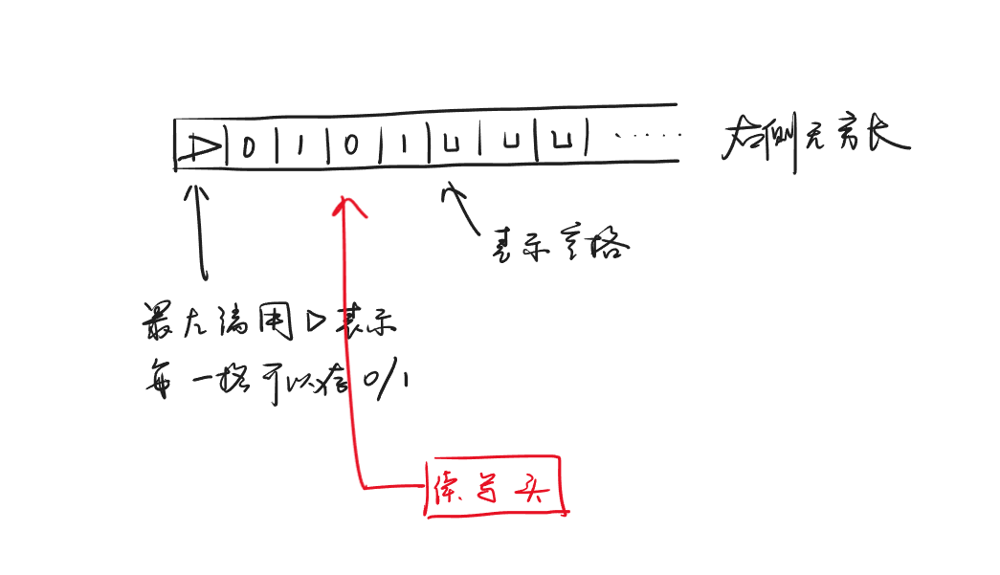
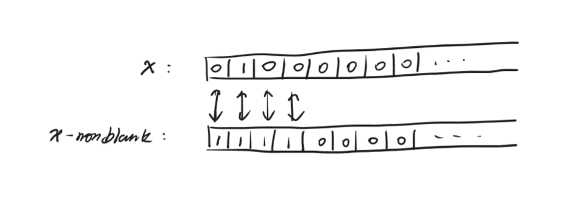
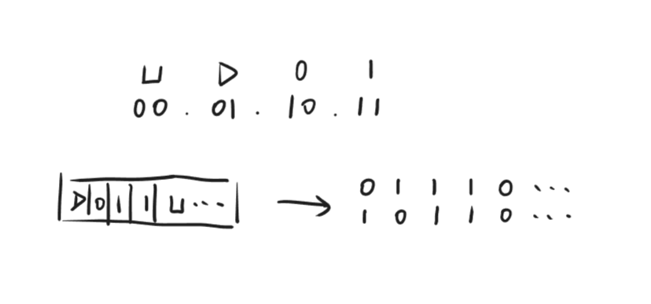

<span style="font-family: 'Times New Roman';">

# Lec8

***

## 图灵机



**Definition:**

$$M=(K,s,\Sigma,\delta)$$

* $K$：有限状态集合
* $s$：初始状态
* $\Sigma$：有限符号集合，即纸带的内容可以是什么，这里是 $\\{0,1,\sqcup,\rhd\\}$
* $\delta$ ：转移函数：

$$K\times\Sigma\rightarrow K\times\Sigma\times\\{L,R,S,H\\}$$

根据当前的状态以及所在位置的符号，决定下一个状态、更新当前位置的符号以及读写头的移动方向：

* $L$：左移
* $R$：右移
* $S$：不动
* $H$：停机

**Progress:**

```py linenums="1"
# (s', a, D) <- delta(s, T[i])
# 输入：x=x0x1...xn-1，长度为 n
# T: 纸带，T[0]=rhd, T[1]=x0, T[2]=x1, ..., T[n]=xn-1, T[n+1]=sqcup, T[n+2]=sqcup,...
# i=0, s=state0
T[i] = a
s = s'
if D == L:
    i = max{i-1, 0}
if D == R:
    i = i + 1
if D == S:
    i = i
if D == H:
    halt
# 不断重复，直到停机
```

注意点1：

转移函数要保证：

$$a=\rhd\text{ iff. }T[i]=\rhd$$

即最左端的 $\rhd$ 唯一且不可覆盖。

注意点2：

每个循环结尾，若停机，则输出 $\rhd$ 和第一个空格之间（开区间）的内容；若不停机，则没有输出。

本次 Lec 中，我们要证明的是：**图灵机和 python 等价**。

***

## NAND-TM

直接证明图灵机和 python 等价比较复杂，我们先引入一个简单的编程语言 NAND-TM。

**Definition:**

NAND-TM 是 NAND-CIRC 的强化版本，即 NAND-CIRC + 数组 + 真循环。

!!! Success "Definition"
    **真循环：** 循环次数与输入有关  
    **假循环：** 循环次数与输入无关

性质1：

有两类数值，一类是整数，只用作数组下标；另一类是布尔值。

性质2：

有两类变量，一类是布尔变量；另一类是数组变量，数组变量的每个元素都是布尔值。

其中，数组可以无限长，但共用一个下标 $i$，即如果 $i$ 不变，则数组 $A$ 和数组 $B$ 只能同时访问 $A[i]$ 和 $B[i]$，不能一个访问 $A[i]$，另一个访问 $B[i+1]$。

性质3：

输入 $x$ 和输出 $y$ 也是数组。

性质4：

程序的最后一行是特殊函数 $\text{MODANDJUMP}(a,b)$，有两个作用：

* 作用1：跳回程序开头，实现循环
* 作用2：更新 $i$
    * $a=1,b=1$：$i=i+1$ 
    * $a=0,b=1$：$i=i-1$
    * $a=1,b=0$：$i=i$
    * $a=0,b=0$：停机

性质5：

所有变量的初始值都为 $0$，除了输入。

这里有一个问题：怎么判断输入 $x$ 中的 $0$ 是输入值还是填充值？

解决方法：使用对应的指示数组，例如输入为 $0100$，则指示数组的前四位为 $1$，表示有效输入；后面的位均为 $0$，表示填充值。



**Progress:**

```py linenums="1"
# ? 可以是单个布尔变量，也可以是数组第 i 个元素
? = NAND(?, ?)
? = NAND(?, ?)
...
? = NAND(?, ?)
MODANDJUMP(?, ?)
```

!!! Example
    **函数 INC：若输入为 $x_0x_1\dots x_{n-1}$（对应正整数 $\sum\limits_{i=0}^{n-1}x_i\cdot2^i$），返回这个数加一的结果 $y_0y_1\dots y_n$ （对应正整数 $\sum\limits_{i=0}^ny_i\cdot2^i=\sum\limits_{i=0}^{n-1}x_i\cdot2^i+1$）。**

    ```py linenums="1"
    # carry 表示是否进位
    # started 初始为 0 ，之后变为 1，表示已经开始逐位处理有效输入
    carry = IF(started, carry, 1) # 如果是初始状态，由于要返回 +1 的结果，因此进位直接为 1；否则，保持不变
    started = 1
    Y[i] = XOR(X[i], carry)
    carry = AND(X[i], carry)
    Y_nonblank[i] = 1
    MODANDJUMP(X_nonblank[i], X_nonblank[i]) # 若当前位是有效输入，则 i++ 继续处理下一位；否则停机
    ```

    !!! Note
        IF、XOR、AND 都可以用 NAND 实现。

***

## 图灵机与 NAND-TM 的等价性

我们已经能直观地感受出一些二者的对应关系：

* TM 的状态 $\Longleftrightarrow$ NAND-TM 的布尔变量（组合在一起）
* TM 的纸带 $\Longleftrightarrow$ NAND-TM 的数组变量
* TM 的读写头位置 $\Longleftrightarrow$ NAND-TM 的下标 $i$
* TM 的读写头移动 $\Longleftrightarrow$ NAND-TM 的 MODANDJUMP 更新 $i$

**TM 用 NAND-TM 实现：**

假设 TM 有 $k$ 个状态，那么在 NAND-TM 中可以用 $\lceil\log k\rceil$ 个布尔变量来表示当前状态。

假设 TM 的符号集合为 $\Sigma$，元素个数为 $|\Sigma|$，那么在 NAND-TM 中可以用 $\lceil\log |\Sigma|\rceil$ 个数组来表示纸带。

例如：



对于 TM 的四种移动操作 $\\{L,R,S,H\\}$，可以分别编码成 $\\{01,11,10,00\\}$，也只要两个布尔变量作为 MODANDJUMP 的输入即可。

相对麻烦的是转移函数 $\delta$：

$$K\times\Sigma\rightarrow K\times\Sigma\times\\{L,R,S,H\\}$$

实际上是一个输入和输出长度固定的有限函数：

$$\\{0,1\\}^{\lceil\log k\rceil+\lceil\log\Sigma\rceil}\rightarrow\\{0,1\\}^{\lceil\log k\rceil+\lceil\log\Sigma\rceil+2}$$

我们知道有限函数可以用 NAND-CIRC 实现，即一系列 NAND 门。因此，最终这台 TM 可以被等价地实现为一段 NAND-TM 程序：

```py linenums="1"
NAND-CIRC implementation of delta
MODANDJUMP(dir0, dir1) # dir0, dir1 根据 delta 的输出的最后两位决定
```

**NAND-TM 用 TM 实现：**

其实就是倒过来的过程。

如果 NAND-TM 中有 $k$ 个布尔变量，则对应到 TM 中有 $2^k$ 个状态。如果 NAND-TM 中有 $l$ 个数组变量，则对应到 TM 中有 $2^l$ 个符号。

对于 NAND-TM 除去最后一行 MODANDJUMP 的其他行（都是 NAND 门），涉及 $k+l$ 个变量，也就是说，这些行实现了一个有限函数：

$$\\{0,1\\}^{k+l}\rightarrow\\{0,1\\}^{k+l}$$

那么，只要再加上最后一行 MODANDJUMP 告诉我们的两个参数的取值，就可以确定下来读写头的动作，从而完整地定义出 TM 的转移函数 $\delta$。

***

## NAND-TM 与 Python 的等价性

接下来，我们要想办法强化 NAND-TM 到 Python，通过二者的等价性，最终证明图灵机和 Python 的等价性。

**`goto`:**

对于一个固定行数的 NAND-TM：

```py linenums="1"
?1 = NAND(?1, ?1)
?2 = NAND(?2, ?2)
...
?t = NAND(?t, ?t)
MODANDJUMP(?t+1, ?t+1)
```

其可以写成如下的等价形式：

```py linenums="1"
if line == 1:
    ?1 = NAND(?1, ?1)
    line = 2
if line == 2:
    ?2 = NAND(?2, ?2)
    line = 3
...
if line == t:
    ?t = NAND(?t, ?t)
    line = t+1
MODANDJUMP(?t+1, ?t+1)
```

!!! Note
    由于行数固定，因此 `line` 可以用固定长度的布尔变量表示；`if` 条件判断也可以用 NAND-CIRC 实现。

因此，只需要改变 `line=...` 的内容，就可以实现 `goto`。

**`while`:**

实现了 `goto` 之后，就可以实现 `while` 循环：

```py linenums="1"
while foo:
    do bar
do blah
```

记 `do bar` 的第一行标签为 `"loop"`，`do blah` 的第一行标签为 `"not"`，则上面的 `while` 等价于下面的 `goto` 形式：

```py linenums="1"
"loop":
    if foo:
        do bar
        goto "loop"
"not":
    do blah
```

!!! Note
    如果以汇编的视角观察 python，那么上述程序已经和 python 很接近了。

**多个 index:**

!!! Warning
    略

**多维数组：**

!!! Warning
    略

**NAND-RAM:**

NAND-RAM 有以下特性：

* 内存：每一格存一个 word，支持随机访问
* 寄存器：可以与内存交换数据
* 变量从布尔变量变成整数变量
* 寄存器支持算术运算

NAND-TM 和 NAND-RAM 等价，证明略。