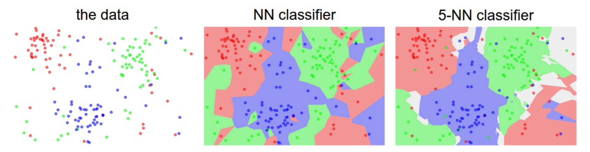
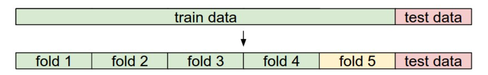

# Part1 Image Classification

***

## L1 and L2 Distance

How to measure the similarity between images?

**L1 Distance**: Two images are subtracted elementwise and then all differences are added up to a single number.

$$d_1(I_1,I_2)=\sum\limits_p|I_1^p-I_2^p|$$

**L2 Distance**: Two images are subtracted elementwise, squared, and then all differences are added up to a single number, which is then square-rooted.

$$d_2(I_1,I_2)=\sqrt{\sum\limits_p|I_1^p-I_2^p|^2}$$

***

## Nearest Neighbor Classifier

The nearest neighbor classifier will take a test image, compare it to every single one of the training images, and predict the label of the closest training image.

***

## K-Nearest Neighbors Classifier

Instead of finding the single closest image in the training set, we will find the top k closest images, and have them vote on the label of the test image.

***

## Classifier Structure

How to determine the best $k$ and distance metric?

* **Training Set**: train the model
* **Validation Set**: tune hyperparameters (e.g. $k$, distance metric)
* **Test Set**: evaluate performance

***

## Cross Validation

In cases where the size of your training data (and therefore also the validation data) might be small, you can get a better and less noisy estimate of how well a certain value of $k$ works by iterating over different validation sets and averaging the performance across these.

The training set is split into folds. The folds 1-4 become the training set. One fold (e.g. fold 5 here in yellow) is denoted as the validation fold and is used to tune the hyperparameters. Cross-validation goes a step further and iterates over the choice of which fold is the validation fold, separately from 1-5.