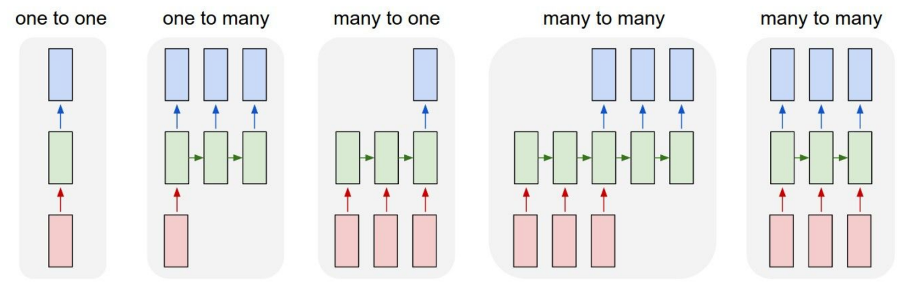
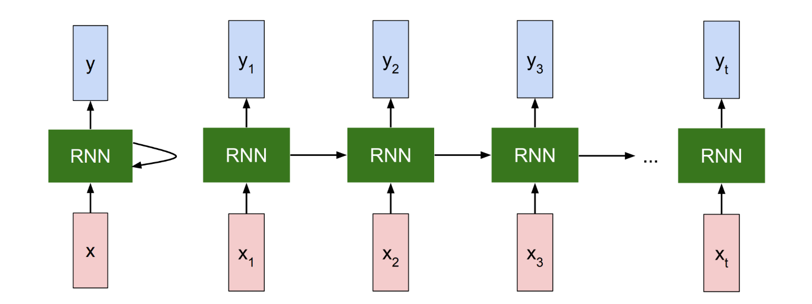
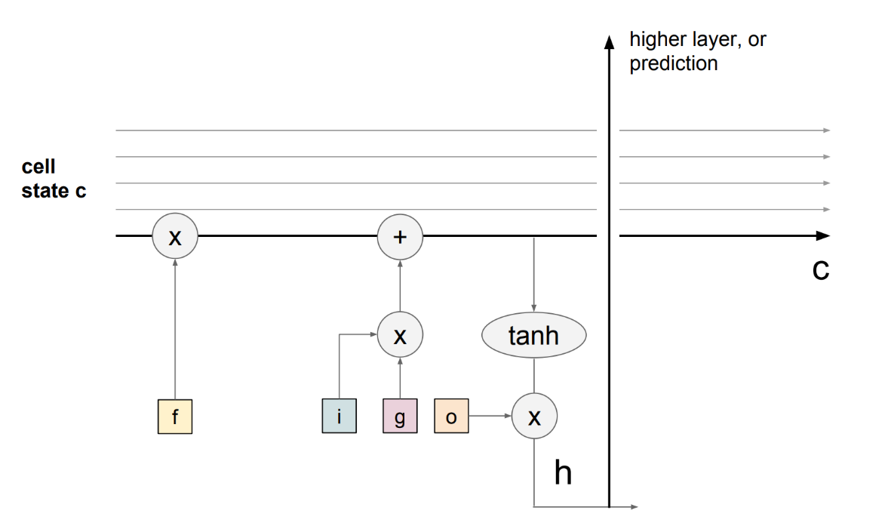

# Part10 Recurrent Neural Networks

***

## Models

**one-to-one:**

image classification

**one-to-many:**

image captioning: Given a fixed sized image, produce a sequence of words that describe the content.

**many-to-one:**

sentiment classification: Given a sequence of words, classify the sentiment (positive/negative).

action prediction: Given a sequence of video frames, predict the action.

**many-to-many:**

machine translation: Given a sequence of words in one language, produce a sequence of words in another language.

video captioning: Given a sequence of video frames, produce a sequence of words that describe the content.

***

## Vanilla RNN Structure

RNN is basically a blackbox which has a hidden state $h_t$. $h_t$ changes according to the input $x_t$ and the previous hidden state $h_{t-1}$. And it produces an output $y_t$:

$$f_W(h_{t-1},x_t)=h_t\rightarrow y_t$$

To be specific, we often have:

$$h_t=\tanh (W_{hh}h_{t-1}+W_{xh}x_t)$$

$$y_t=W_{hy}h_t$$

**Gradient Flow and Vanishing Gradient:**

$$\frac{\partial h_t}{\partial h_{t-1}}=\tanh'(W_{hh}h_{t-1}+W_{xh}x_t)\cdot W_{hh}$$

$$\frac{\partial L_t}{\partial W_{hh}}=\frac{\partial L_t}{\partial h_t}\frac{\partial h_t}{\partial h}$$

$$=\frac{\partial L_t}{\partial h_t}[\prod\limits_{t=2}^T\tanh'(W_{hh}h_{t-1}+W_{xh}x_t)\cdot W_{hh}^{T-1}]\frac{\partial h_1}{\partial W_{hh}}$$

We can see that $\tanh'(W_{hh}h_{t-1}+W_{xh}x_t)$ will almost always be less than $1$, which will lead to vanishing gradient problem.

***

## Long Short-Term Memory (LSTM)

One distinction of LSTM from vanilla RNN is that LSTM has an additional **cell state** $c_t$. Intuitively it can be thought to store long-term information. LSTM can read, erase, and write information to and from $c_t$. The way LSTM alters $c_t$ is through three special gates: $i$, $f$, $o$ which correspond to **input**, **forget**, and **output** gates.

$$f_t=\sigma(W_{hf}h_{t-1}+W_{xf}x_t)$$

$$i_t=\sigma(W_{hi}h_{t-1}+W_{xi}x_t)$$

$$o_t=\sigma(W_{ho}h_{t-1}+W_{xo}x_t)$$

$$g_t=\tanh(W_{hg}h_{t-1}+W_{xg}x_t)$$

$$c_t=f_t\odot c_{t-1}+i_t\odot g_t$$

$$h_t=o_t\odot \tanh(c_t)$$

* Forget gate $f_t$ controls how much information needs to be removed from the previous cell state $c_{t-1}$.
* Input gate $i_t$ controls how much information needs to be added to the next cell state $c_t$ from previous hidden state $h_{t-1}$ and input $x_t$.
* Output gate $o_t$ controls how much information needs to be shown as output in the current hidden state $h_t$.

