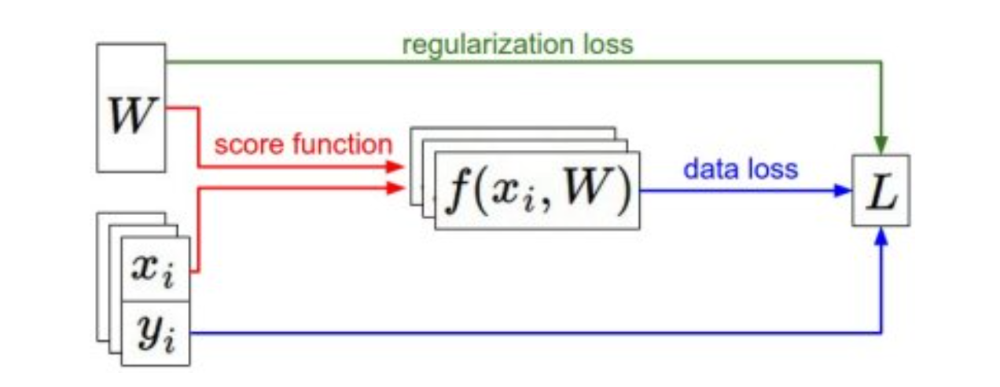
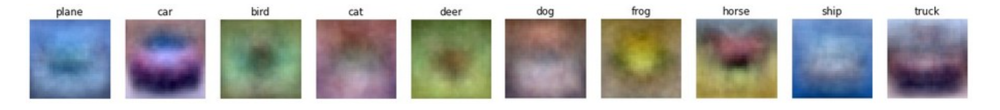
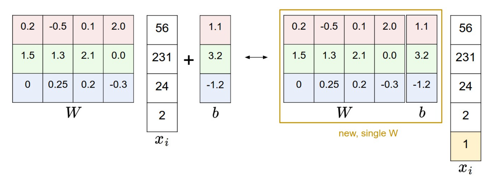
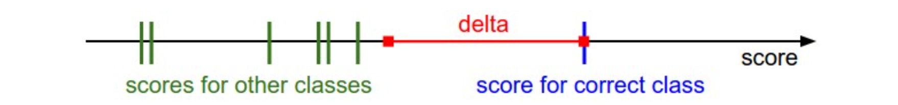
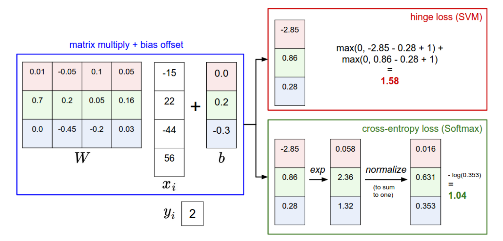

# Part2 Linear Classification

***

## Score Function

Score function maps the raw data to class scores. Here we learn the **linear classifier** with the simplest score function.

* $N$: number of training examples
* $D$: dimension of each training example
* $K$: number of classes
* $x_i$: the $i$th training example of shape $(D, 1)$
* $y_i$: the ground truth label for $x_i$
* $W$: weight matrix of shape $(K, D)$
* $b$: bias vector of shape $(K, 1)$

$$f(x_i,W,b)=Wx_i+b$$

The result is of shape $(K, 1)$, which represents the class scores for the input $x_i$.

!!! Note
    **Template Matching:**

    Each row of $W$ corresponds to a template for one of the classes. The score of each class for an image is then obtained by comparing each template with the image using dot product one by one to find the one that “fits” best. 

    

!!! Note
    **Bias Trick:**

    We can combine the weight matrix $W$ and the bias vector $b$ into a single matrix by extending the vector $x_i$ with one additional dimension that always holds the constant $1$.

    

***

## Loss Function

Loss function tells us how well the model is performing by quantifying the agreement between the predicted scores and the ground truth labels. This function helps us to optimize the model parameters during training.

$$L=\frac{1}{N}\sum_i L_i+\lambda\,R(W)$$

### Regularization

The most common form is **L2 penalty**:

$$R(W)=\sum_{i,j} W_{ij}^2$$

**Motivation 1:**

Since $W$ is not unique when we get the minimum loss, we wish to encode some preference for a certain $W$ over others to remove ambiguity.

**Motivation 2:**

We want to prevent overfitting by discouraging overly complex models. Regularization helps to keep the model simple and generalizable.

!!! Example
    Suppose that we have some input vector 
    
    $$x=[1,1,1,1]$$
    
    and two weight vectors 
    
    $$w_1=[1,0,0,0],~~w_2=[0.25,0.25,0.25,0.25]$$
    
    Both weight vectors lead to the same dot product, but the L2 penalty of $w_1$ is 1.0 while the L2 penalty of $w_2$ is only 0.25. Therefore, according to the L2 penalty the weight vector $w_2$ would be preferred since it achieves a lower regularization loss. 
    
    Intuitively, this is because the weights in $w_2$ are smaller and more diffuse. Since the L2 penalty prefers smaller and more diffuse weight vectors, the final classifier is encouraged to take into account all input dimensions to small amounts rather than a few input dimensions and very strongly.This effect can improve the generalization performance of the classifiers on test images and lead to less overfitting.

### SVM Classifier

SVM classifier has a loss function called **hinge loss**:

* $s_j$: the score for class $j$ for the $i$th training example
* $\Delta$: margin

$$L_i=\sum\limits_{j\neq y_i} \max(0, s_j-s_{y_i}+\Delta)$$

SVM Classifier wants the score of the correct class to be higher than all other scores by at least a margin of $\Delta$. If any class has a score inside the red region (or higher), then there will be accumulated loss. Otherwise the loss will be zero.

### Softmax Classifier

Softmax classifier has a loss function called **cross-entropy loss**:

$$L_i=-\log\left(\frac{e^{s_{y_i}}}{\sum_j e^{s_j}}\right)$$

Softmax classifier provides “probabilities” for each class.

$$p_{y_i}=\frac{e^{s_{y_i}}}{\sum_j e^{s_j}}$$

!!! Example
    