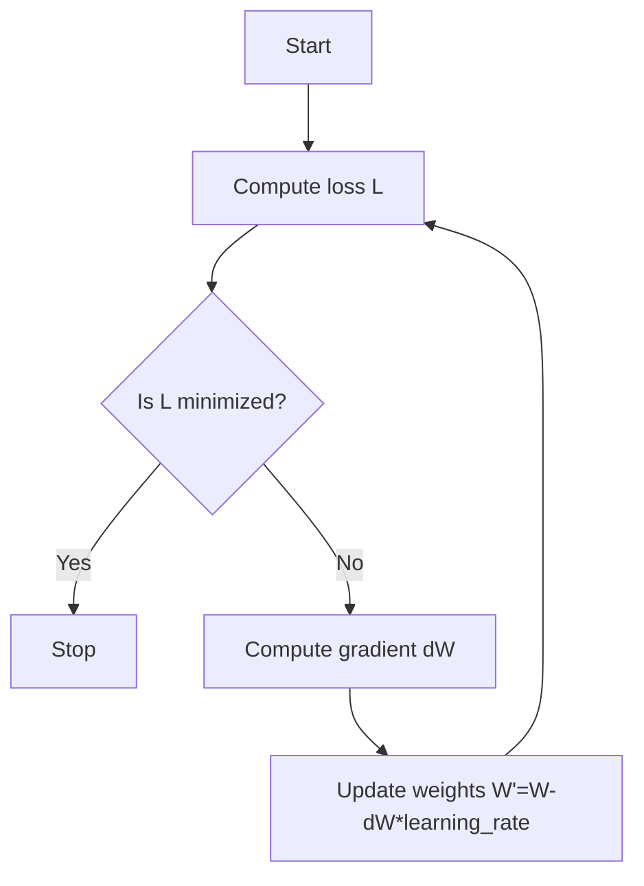

# Part3 Optimization

Optimization is the process of finding $W$ that minimize the loss function.

***

## Gradient Descent

Imagine we are on a hill. We want to find our way to the bottom. The **gradient** is the direction of steepest ascent (derivative), so we need to go in the opposite direction to reach the bottom.

!!! question "Definition"
    **Learning Rate:**

    A hyperparameter that controls how much to change the model in response to the estimated error each time the model weights are updated.

    If learning rate is too small, training will be slow. If learning rate is too large, training will "overstep".

***

## SGD

If our training data is too large, it will take too much time to compute the loss $L$. Therefore, we only need to compute the gradient over batches of the training data. This is called **mini-batch gradient descent**.

**SGD (stochastic gradient descent)** is the extreme case when the batch size is $1$.