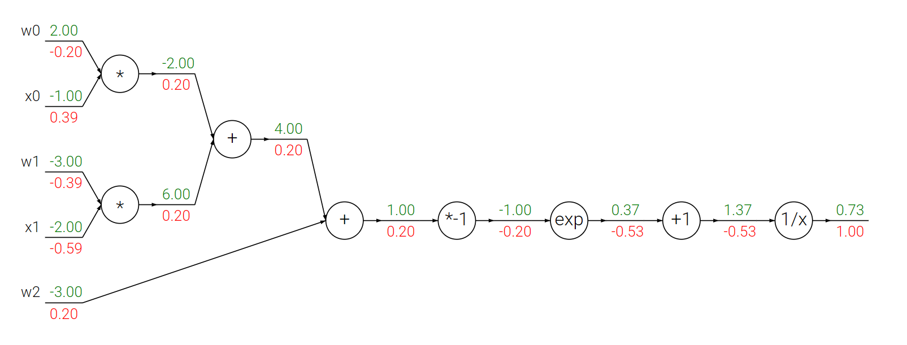

<span style="font-family: 'Times New Roman';">

# Part4 Backpropagation

A way of computing gradients of expressions through recursive application of **chain rule** in the **computational graph**.



***

## Practice: Staged Computation

$$f(x,y)=\frac{x+\sigma(y)}{\sigma(x)+(x+y)^2}$$

$$\sigma(x)=\frac{1}{1+e^{-x}}$$

Stage1: Forward Pass

```py linenums="1"
sigy = 1.0 / (1 + math.exp(-y)) # sigmoid in numerator   #(1)
num = x + sigy # numerator                               #(2)
sigx = 1.0 / (1 + math.exp(-x)) # sigmoid in denominator #(3)
xpy = x + y                                              #(4)
xpysqr = xpy**2                                          #(5)
den = sigx + xpysqr # denominator                        #(6)
invden = 1.0 / den                                       #(7)
f = num * invden # done!                                 #(8)
```

Stage2: Backward Pass

```py linenums="1"
dnum = invden # gradient on numerator                             #(8)
dinvden = num                                                     #(8)
# backprop invden = 1.0 / den 
dden = (-1.0 / (den**2)) * dinvden                                #(7)
# backprop den = sigx + xpysqr
dsigx = (1) * dden                                                #(6)
dxpysqr = (1) * dden                                              #(6)
# backprop xpysqr = xpy**2
dxpy = (2 * xpy) * dxpysqr                                        #(5)
# backprop xpy = x + y
dx = (1) * dxpy                                                   #(4)
dy = (1) * dxpy                                                   #(4)
# backprop sigx = 1.0 / (1 + math.exp(-x))
dx += ((1 - sigx) * sigx) * dsigx # Notice += !! See notes below  #(3)
# backprop num = x + sigy
dx += (1) * dnum                                                  #(2)
dsigy = (1) * dnum                                                #(2)
# backprop sigy = 1.0 / (1 + math.exp(-y))
dy += ((1 - sigy) * sigy) * dsigy                                 #(1)
```

!!! Note
    **Gradients add up at forks:**

    If a variable branches out to different parts of the circuit, then the gradients that flow back to it will add.

***

## Gradients for Vectorized Operations

For matrix $W$, $X$, $D$, if

$$D=WX$$

then

$$dW=dD\cdot X^T$$

$$dX=W^T\cdot dD$$