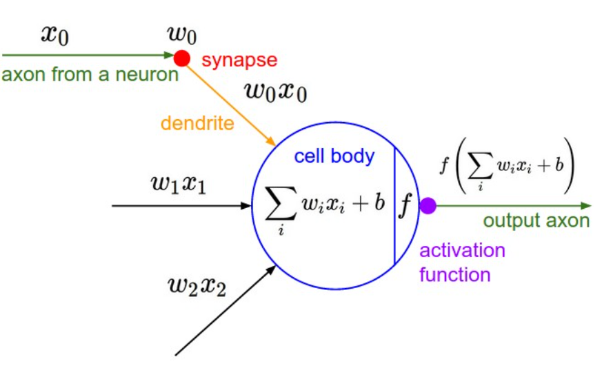
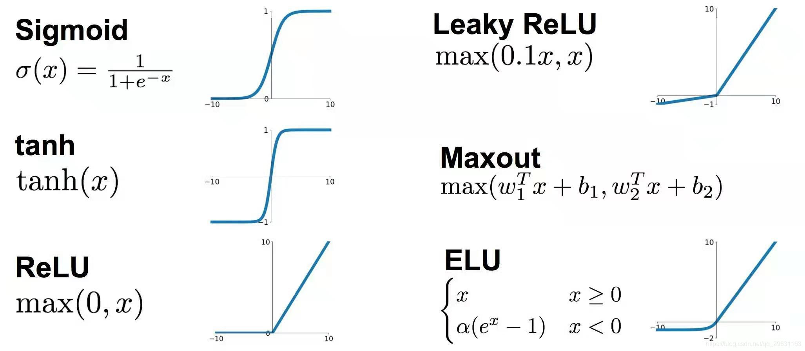
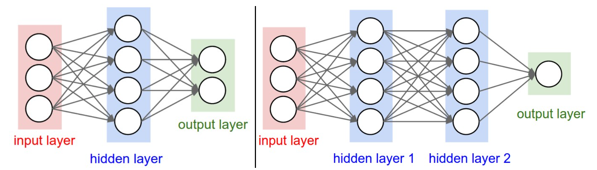

<span style="font-family: 'Times New Roman';">

# Part5 Neural Networks Ⅰ

***

## Coarse Neuron Model



***

## Activation Function



**Sigmoid** has two major drawbacks:

* Saturates: When activation saturates at either tail of 0 or 1, the gradient is almost zero. It will kill the gradient and the network will barely learn.
* Not zero-centered: The output is always positive. If the gradient is concerning the output, each element of weight will descend in the same direction due to the same sign of the gradient, introducing undesirable zig-zagging dynamics.

**ReLU** has one major drawback:

* Dying ReLU: A large gradient flowing through a ReLU neuron could cause the weights to update in such a way that the neuron will never activate on any datapoint again. If this happens, then the gradient flowing through the unit will forever be zero from that point on. That is, the ReLU units can irreversibly die during training since they can get knocked off the data manifold.

!!! Note
    **What activation function should I use?**

    Always prefer ReLU;  
    Give Leaky ReLU, Maxout or Tanh a try;  
    Never use Sigmoid.

***

## Layer-wise Organization



The most common layer type is the **fully-connected layer** in which neurons between two adjacent layers are fully pairwise connected, but neurons within a single layer share no connections. It is actually a combination of $f=Wx+b$ and an activation function. (Notice that the output layer has no activation function.)

!!! Note
    **Naming Conventions:**

    When we say $N$-layer neural network, we do not count the input layer. Therefore, a single-layer neural network describes a network with no hidden layers.

```py linenums="1"
# forward-pass of a 3-layer neural network:
f = lambda x: 1.0/(1.0 + np.exp(-x)) # activation function (use sigmoid)
x = np.random.randn(3, 1) # random input vector of three numbers (3x1)
h1 = f(np.dot(W1, x) + b1) # calculate first hidden layer activations (4x1)
h2 = f(np.dot(W2, h1) + b2) # calculate second hidden layer activations (4x1)
out = np.dot(W3, h2) + b3 # output neuron (1x1)
```