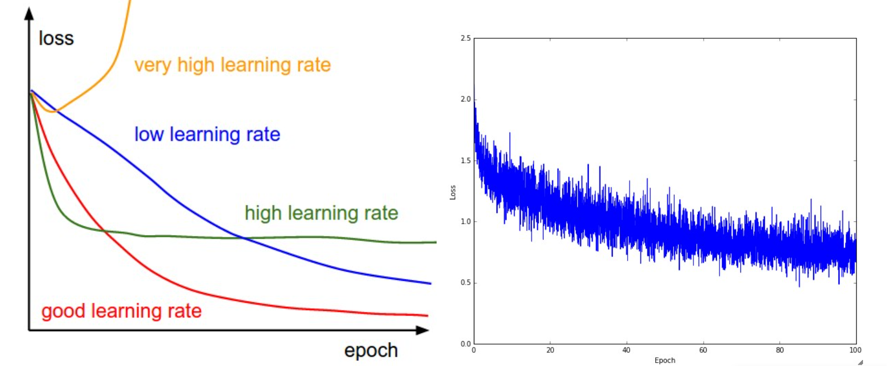
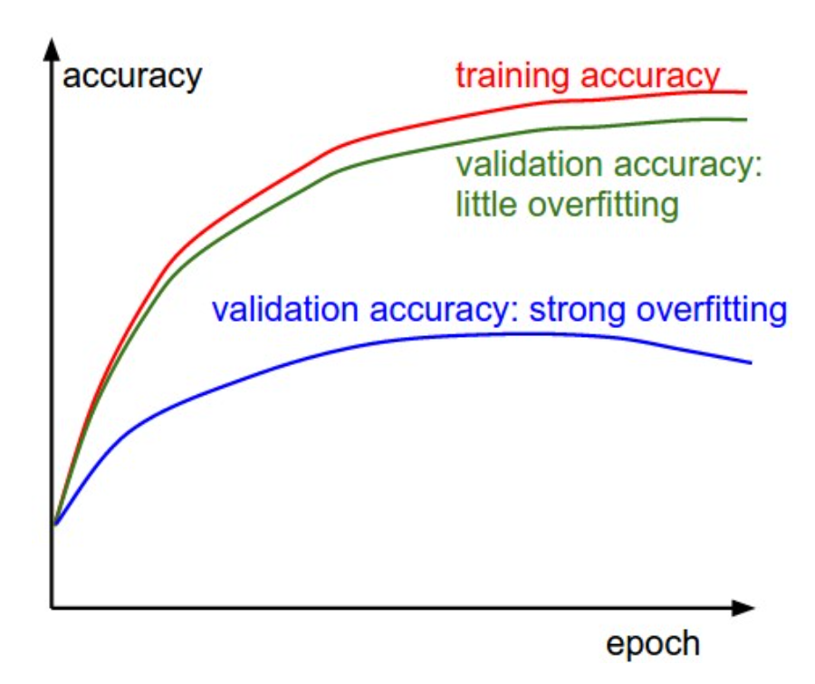
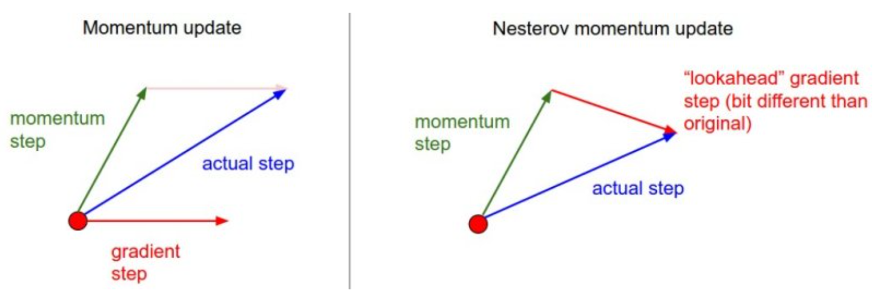

<span style="font-family: 'Times New Roman';">

# Part7 Neural Networks Ⅲ

***

## Gradient Check

Compare the **analytic gradient** to the **numerical gradient**.

### Tip1

How to compute the analytic gradient?

**Centered Difference Formula:**

$$\frac{df(x)}{dx}=\frac{f(x+h)-f(x-h)}{2h}$$

### Tip2

How do we know if the numerical gradient $f_n'$ and analytic gradient $f_a'$ are compatible?

**Relative Error:**

$$\frac{|f_a'-f_n'|}{\max(|f_a'|, |f_n'|)}$$

### Tip3

Use double precision.

### Tip4

Stick around active range of floating point.

### Tip5

Be aware of kinks which refer to non-differentiable parts introduced by ReLU, SVM loss, Maxout neurons, etc.

!!! Example
    Consider gradient checking the ReLU function at $x=−1e6$. Since $x<0$, the analytic gradient at this point is exactly $0$. However, the numerical gradient would suddenly compute a non-zero gradient because $f(x+h)$ might cross over the kink (e.g. if $h>1e−6$) and introduce a non-zero contribution.

One fix to the above problem of kinks is to use fewer datapoints.

### Tip6

Be careful with the step size $h$.

### Tip7

Use a short **burn-in** time during which the network is allowed to learn and perform the gradient check after the loss starts to go down.

### Tip8

Don’t let the regularization overwhelm the data. It is recommended to turn off regularization and check the data loss alone first, and then the regularization term second and independently.

### Tip9

Remember to turn off dropout or augmentations when performing gradient check.

### Tip10

Check only few dimensions and check that all parameters receive the correct gradients.

***

## Sanity Check

### Tip1

Look for correct loss at chance performance.

!!! Example
    For CIFAR-10 with a Softmax classifier we would expect the initial loss to be $2.302$, because we expect a diffuse probability of $0.1$ for each class (since there are $10$ classes), and Softmax loss is the negative log probability of the correct class so: $-\ln(0.1) = 2.302$.

    For the Weston Watkins SVM, we expect all desired margins to be violated (since all scores are approximately zero), and hence expect a loss of $9$ (since margin is $1$ for each wrong class).

### Tip2

Before training on the full dataset, try to train on a tiny portion make sure you can achieve zero cost. (with no regularization)

***

## Babysitting the Learning Process

What quantities should we monitor during training of a neural network?

!!! Note
    We often use "epoch" instead of "iteration" as x-axis of the plots. Each epoch is an iteration over the entire training data, while each iteration is a batch of it.

### Loss Function



**Left:**

Lower learning rates will make the improvements linear. (blue line)

Higher learning rates will decay the loss faster, but they get stuck at worse values of loss, which is because the parameters are bouncing around chaotically and unable to settle in a nice spot in the optimization landscape. (green line)

**Right:**

The amount of “wiggle” in the loss is related to the batch size.

### Training and Validation Accuracy



The gap between the training and validation accuracy indicates the amount of overfitting.

***

## Parameter Update

### SGD and Bells and Whistles

**Simplest Form:**

```
x += - learning_rate * dx
```

**Momentum Update:**

```
v = mu * v - learning_rate * dx
x += v
```

`mu` is consistent with the coefficient of friction.

**Nesterov Momentum:**

```
x_ahead = x + mu * v
v = mu * v - learning_rate * dx_ahead
x += v
```

Instead of evaluating gradient at the current position (red circle), we know that our momentum is about to carry us to the tip of the green arrow. With Nesterov momentum we therefore instead evaluate the gradient at this "looked-ahead" position.



If we still want to take the derivative with respect to `x` instead of `x_ahead`, we can modify the code as follows:

```
v_prev = v
v = mu * v - learning_rate * dx
x += -mu * v_prev + (1 + mu) * v
```

### Second Order Methods

!!! Success "Definition"
    **Newton's Method:**

    Suppose we want to solve the equation $f(x)=0$, starting from an initial guess $x_0$, The iterative formula is:

    $$x_{n+1}=x_n-\frac{f(x_n)}{f'(x_n)}$$

    At each step, the next approximation is taken as the x-intercept of the tangent line to the function at the current point.

Now we want to apply Newton's method to our optimization problem. We want to find the minimum of the loss function $L(x)$, where $L'(x)=0$. Therefore, we have the iterative formula:

$$x_{n+1}=x_n-[HL(x_n)]^{-1}\nabla L(x_n)$$

Where $\nabla L(x_n)$ is the gradient (first derivative) and $HL(x_n)$ is the Hessian matrix (second derivative).

Note, crucially, the absence of any learning rate hyperparameters in the update formula.

### Per-Parameter Adaptive Learning Rate Methods

Can we adapt the learning rate for each parameter individually?

**Adagrad:**

```
cache += dx**2
x += - learning_rate * dx / (np.sqrt(cache) + eps)
```

The weights that receive high gradients will have their effective learning rate reduced, while weights that receive small or infrequent updates will have their effective learning rate increased.

The smoothing term `eps` avoids division by zero.

**RMSprop:**

We have found that no matter what the gradient is, the learning rate in Adagrad algorithm will end up being very small. RMSprop adjusts it and fixes the problem.

```
cache = decay_rate * cache + (1 - decay_rate) * dx**2
x += - learning_rate * dx / (np.sqrt(cache) + eps)
```

`decay_rate` is a hyperparameter and typical values are [0.9, 0.99, 0.999], which made `cache` leaky.

**Adam:**

Adam algorithm is a combination of momentum update and RMSprop.

```
m = beta1*m + (1-beta1)*dx
v = beta2*v + (1-beta2)*(dx**2)
x += - learning_rate * m / (np.sqrt(v) + eps)
```

Things are perfect except that at first few steps, `m` and `v` are quite small that the update will be slow. Therefore, we introduce bias correction terms to counteract this effect.

```
m = beta1*m + (1-beta1)*dx
mt = m / (1-beta1**t)
v = beta2*v + (1-beta2)*(dx**2)
vt = v / (1-beta2**t)
x += - learning_rate * mt / (np.sqrt(vt) + eps)
```

`t` is the iteration counter going from 1 to infinity.