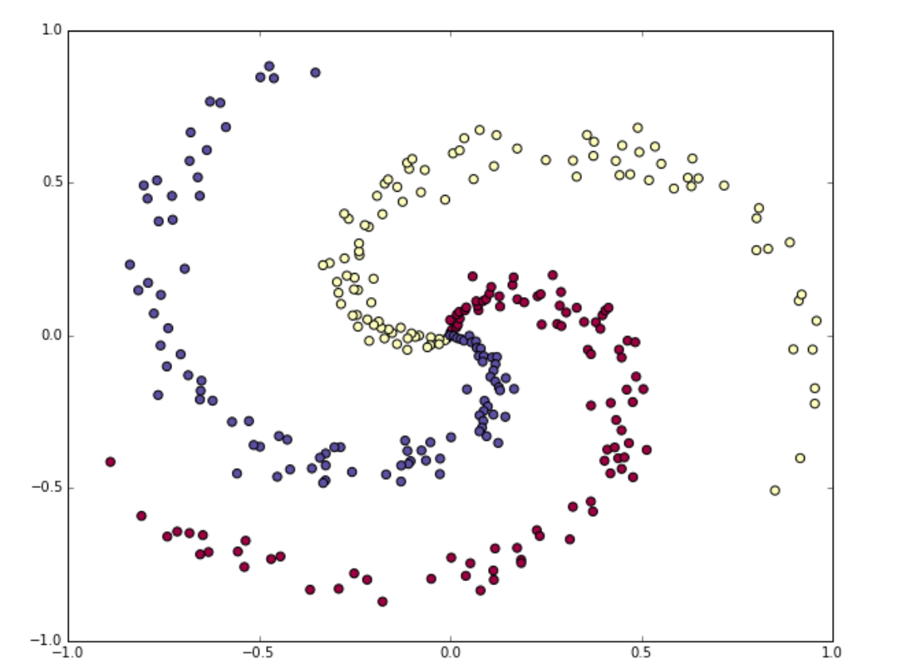
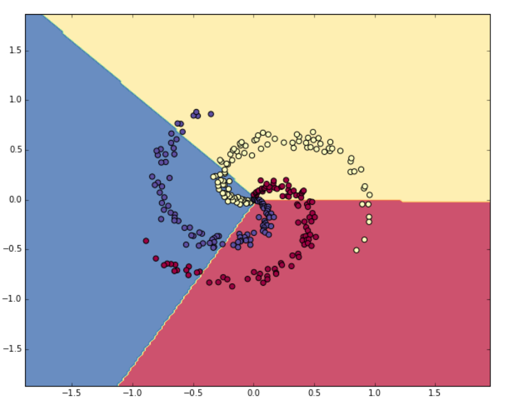
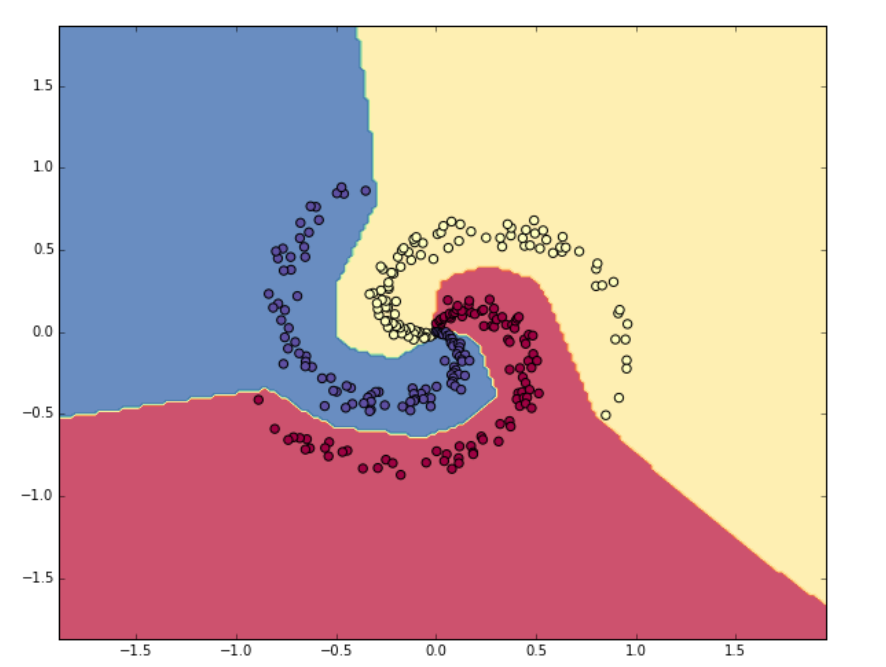

<span style="font-family: 'Times New Roman';">

# Part8 Minimal Neural Network Case Study

***

## Step1: Generating Some Data

```py linenums="1"
N = 100                             # number of points per class
D = 2                               # dimensionality
K = 3                               # number of classes
X = np.zeros((N*K,D))               # data matrix (300*2)
y = np.zeros(N*K, dtype='uint8')    # class labels 
# generate spiral data:
for j in range(K):
  ix = range(N*j,N*(j+1))           # index
  r = np.linspace(0.0,1,N)          # radius
  t = np.linspace(j*4,(j+1)*4,N) + np.random.randn(N)*0.2 # angle
  X[ix] = np.c_[r*np.sin(t), r*np.cos(t)]
  y[ix] = j
# visualize the data:
plt.scatter(X[:, 0], X[:, 1], c=y, s=40, cmap=plt.cm.Spectral)
plt.show()
```



All data has been generated in a nice range $[-1,1]$, so preprocessing steps like zero mean or unit standard deviation are skipped.

***

## Step2: Training a Softmax Linear Classifier

### Initialize the Parameters

```py linenums="1"
W = 0.01 * np.random.randn(D,K)     # 2*3
b = np.zeros((1,K))                 # 1*3
```

### Compute the Class Scores

```py linenums="1"
scores = np.dot(X, W) + b           # 300*3 (b is broadcast)
```

### Compute the Loss

We use cross-entropy loss and L2 regularization:

$$p_k = \frac{e^{f_k}}{\sum\limits_j e^{f_j}}$$

$$L_i=-\log(p_{y_i})$$

$$L=\frac{1}{N}\sum_i L_i+\frac{1}{2}\lambda\sum\limits_k\sum\limits_lW_{k,l}^2$$

First, obtain the probabilities:

```py linenums="1"
num_example = X.shape[0]    # 300
exp_scores = np.exp(scores) # unnormalized probabilities (300*3)
probs = exp_scores / np.sum(exp_scores, axis=1, keepdims=True)  # normalize them for each examples (300*3)
```

Next, query for the log probabilities assigned to the correct classes in each example, which is exactly $L_i$:

```py linenums="1"
correct_logprobs = -np.log(probs[range(num_examples), y])   # 300*1
```

Finally, compute the full loss:

```py linenums="1"
data_loss = np.sum(correct_logprobs) / num_examples
reg_loss = 0.5*reg*np.sum(W*W)
loss = data_loss + reg_loss
```

### Compute the Analytic Gradient with Backpropagation

From the three formulas above we can derive:

$$\frac{\partial L_i}{\partial f_k}=\begin{cases}
    p_k,y_i\neq k\\\
    p_k-1,y_i=k
\end{cases}$$

```py linenums="1"
dscores = probs
dscores[range(num_examples), y] -= 1
dscores /= num_examples     # remember we will back to L instead of Li
```

Now we can backpropagate into $W$ and $b$:

```py linenums="1"
dW = np.dot(X.T, dscores)                       # 2*3
db = np.sum(dscores, axis=0, keepdims=True)     # 1*3
dW += reg * W                                   # regularization gradient
```

### Perform a Parameter Update

```py linenums="1"
W += -step_size * dW
b += -step_size * db
```

### Evaluate the Training Set Accuracy

```py linenums="1"
predicted_class = np.argmax(scores, axis=1)
accuracy= np.mean(predicted_class == y)
```

### Result



***

## Step3: Training a Neural Network

Clearly, a linear classifier (one-layer network) is inadequate for this dataset, and we would like to update it to a two-layer network. Therefore, we need two sets of weights and biases:

```py linenums="1"
h = 100 # size of hidden layer
W = 0.01 * np.random.randn(D,h)     # 2*100
b = np.zeros((1,h))                 # 1*100
W2 = 0.01 * np.random.randn(h,K)    # 100*3
b2 = np.zeros((1,K))                # 1*3
```

The forward pass to compute scores now changes form:

```py linenums="1"
hidden_layer = np.maximum(0, np.dot(X, W) + b) # ReLU activation (300*100)
scores = np.dot(hidden_layer, W2) + b2  # 300*3
```

The computation of the loss based on the scores is exactly as before. However, the way we backpropagate that gradient into the model parameters now changes form. The second layer gradients are similar:

```py linenums="1"
dW2 = n.dot(hidden_layer.T, dscores)
db2 = np.sum(dscores, axis=0, keepdims=True)
dhidden = np.dot(dscores, W2.T)
```

Now we have the gradient on the outputs of the hidden layer. Next, we have to backpropagate the ReLU non-linearity. It lets the gradient pass through unchanged if its input was greater than 0, but kills it if its input was less than zero during the forward pass:

```py linenums="1"
dhidden[hidden_layer <= 0] = 0
```

Finally, we continue to the first layer parameters:

```py linenums="1"
dW = np.dot(X.T, dhidden)
db = np.sum(dhidden, axis=0, keepdims=True)
```

### Result



