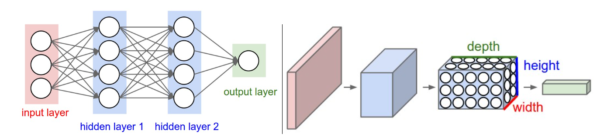

<span style="font-family: 'Times New Roman';">

# Part9 Convolutional Neural Networks



***

We use three main types of layers to build CNN architectures: **Convolutional Layer**, **Pooling Layer**, and **Fully-Connected Layer**.

The simplest CNN for CIFAR-10 classification has the architecture **[INPUT - CONV - RELU - POOL - FC]**.

***

## Convolutional Layer

The CONV layer's parameters consist of a set of learnable **filters**. Every filter is small spatially but extends through the full depth of the input volume.

During the forward pass, each filter is slid across the input volume and we computes dot products between the entries of the filter and the input at any position, which produces a 2-dimensional activation map for each filter. All filters' results are stacked.

Three hyperparameters control the size of the output volume: the **depth**, **stride**, and **zero-padding**.

* **Depth**: the number of filters
* **Stride**: the number of pixels by which we slide the filter
* **Zero-Padding**: the number of pixels added to the border of the input volume

To summarize, the CONV layer:

* Accepts a volume of size $W_1\times H_1\times D_1$
* Requires four hyperparameters:  
  
    * Number of filters $K$
    * Spatial extent $F$
    * Stride $S$
    * Zero-padding $P$
  
* Produces a volume of size $W_2\times H_2\times D_2$ where  
  
    * $W_2=(W_1-F+2P)/S+1$
    * $H_2=(H_1-F+2P)/S+1$
    * $D_2=K$
  
* With parameter sharing, it introduces $F\cdot F\cdot D_1$ weights per filter, for a total of $(F\cdot F\cdot D_1)\cdot K$ weights and $K$ biases.

**Implementation as Matrix Multiplication:**

!!! Success "Definition"
    **im2col:**

    im2col means stretching out the local regions in the input image into columns.

For example, if the input is $[227\times227\times3]$ and it is to be convolved with $11\times11\times3$ filters at stride $4$, then we would take $[11\times11\times3]$ blocks of pixels in the input and stretch each block into a column vector of size $11\times11\times3 = 363$. Iterating this process in the input at stride of $4$ gives $(227-11)/4+1 = 55$ locations along both width and height, leading to an output matrix `X_col` of size $[363\times3025]$.

The weights of the CONV layer are similarly stretched out into rows. For example, if there are $96$ filters of size $[11\times11\times3]$, this would give a matrix `W_row` of size $[96\times363]$.

The result of a convolution is now equivalent to performing one large matrix multiply `np.dot(W_row, X_col)`. In our example, the output of this operation would be $[96\times3025]$, which will be reshaped back to $[55\times55\times96]$.

***

## Pooling Layer

The function of pooling layer is to progressively reduce the spatial size of the representation to reduce the amount of parameters and computation in the network, and hence to also control overfitting.

The most common type is the **MAX pooling**, which similarly slides a window across the input and takes the maximum value within that window.

To summarize, the POOL layer:

* Accepts a volume of size $W_1\times H_1\times D_1$
* Requires two hyperparameters:  
  
    * Pooling region size $F$
    * Stride $S$
  
* Produces a volume of size $W_2\times H_2\times D_2$ where  
  
    * $W_2=(W_1-F+2P)/S+1$
    * $H_2=(H_1-F+2P)/S+1$
    * $D_2=D_1$

!!! Note
    For pooling layers, it is not common to use zero-padding.

***

## CNN Architectures

**Layer Patterns:**

The most common CNN architecture follows the pattern:

<center>INPUT -> [[CONV -> RELU]*N -> POOL?]*M -> [FC -> RELU]*K -> FC</center>

where the `*` indicates repetition, and the `POOL?` indicates an optional pooling layer.

**Layer Sizing Patterns:**

The input layer should be divisible by $2$ many times.

The conv layers should be using small filters with $F=3$, $S=1$ and $P=1$.

The pool layers should be using max-pooling with $F=2$ and $S=2$.

**VGGNet:**

``` linenums="1"
INPUT:      [224x224x3]     memory:  224*224*3=150K     weights: 0
CONV3-64:   [224x224x64]    memory:  224*224*64=3.2M    weights: (3*3*3)*64 = 1,728
CONV3-64:   [224x224x64]    memory:  224*224*64=3.2M    weights: (3*3*64)*64 = 36,864
POOL2:      [112x112x64]    memory:  112*112*64=800K    weights: 0
CONV3-128:  [112x112x128]   memory:  112*112*128=1.6M   weights: (3*3*64)*128 = 73,728
CONV3-128:  [112x112x128]   memory:  112*112*128=1.6M   weights: (3*3*128)*128 = 147,456
POOL2:      [56x56x128]     memory:  56*56*128=400K     weights: 0
CONV3-256:  [56x56x256]     memory:  56*56*256=800K     weights: (3*3*128)*256 = 294,912
CONV3-256:  [56x56x256]     memory:  56*56*256=800K     weights: (3*3*256)*256 = 589,824
CONV3-256:  [56x56x256]     memory:  56*56*256=800K     weights: (3*3*256)*256 = 589,824
POOL2:      [28x28x256]     memory:  28*28*256=200K     weights: 0
CONV3-512:  [28x28x512]     memory:  28*28*512=400K     weights: (3*3*256)*512 = 1,179,648
CONV3-512:  [28x28x512]     memory:  28*28*512=400K     weights: (3*3*512)*512 = 2,359,296
CONV3-512:  [28x28x512]     memory:  28*28*512=400K     weights: (3*3*512)*512 = 2,359,296
POOL2:      [14x14x512]     memory:  14*14*512=100K     weights: 0
CONV3-512:  [14x14x512]     memory:  14*14*512=100K     weights: (3*3*512)*512 = 2,359,296
CONV3-512:  [14x14x512]     memory:  14*14*512=100K     weights: (3*3*512)*512 = 2,359,296
CONV3-512:  [14x14x512]     memory:  14*14*512=100K     weights: (3*3*512)*512 = 2,359,296
POOL2:      [7x7x512]       memory:  7*7*512=25K        weights: 0
FC:         [1x1x4096]      memory:  4096               weights: 7*7*512*4096 = 102,760,448
FC:         [1x1x4096]      memory:  4096               weights: 4096*4096 = 16,777,216
FC:         [1x1x1000]      memory:  1000               weights: 4096*1000 = 4,096,000
```