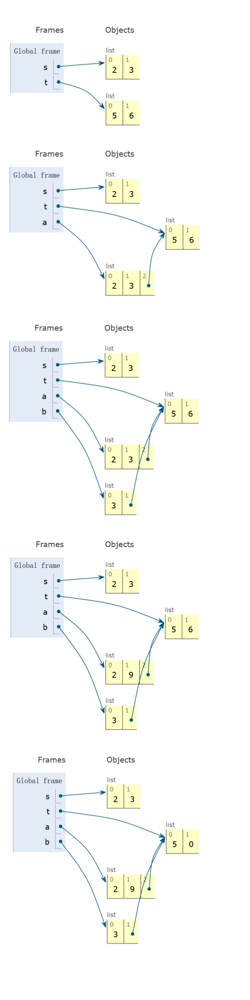
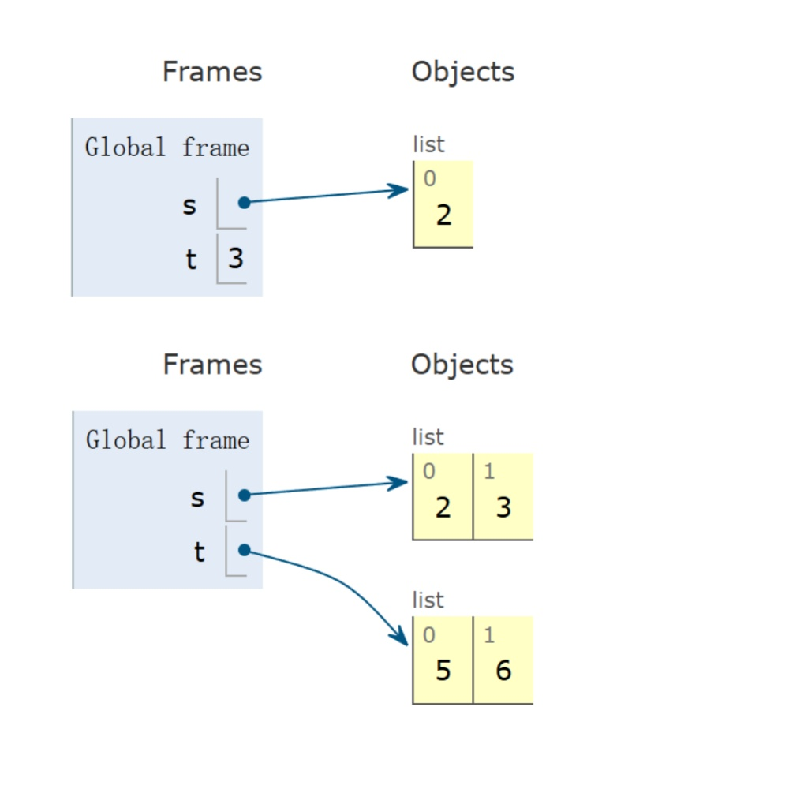
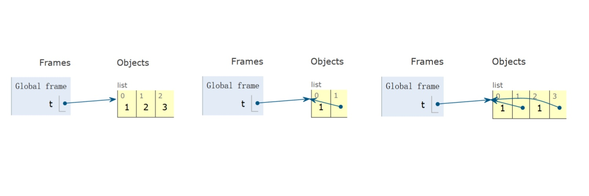

<span style="font-family: 'Times New Roman';">

# Part2 Containers and Related Properties

***

## 2.1 Containers

在Python中，container是一种能够存储其他数据的对象，包括list，dictionary，tuple，range，string等。

**List:**

list与C语言中的数组使用方法类似。list的下标从0开始，如果索引为负数，则表示从后往前数，此时下标从-1开始：

```py linenums="1"
>>> list=[1,2,3,4,5]
>>> list[0]
1
>>> list[2]
3
>>> list[-1]
5
>>> list[-3]
3
```

使用`len`返回list的元素个数：

```py linenums="1"
>>> len(list)
5
```

使用`getitem`的效果和直接获得对应下标的元素一样，第一个参数为list，第二个参数为下标：

```py linenums="1"
>>> from operator import getitem
>>> getitem(list,0)
1
```

对list进行乘法操作，会重复list中的元素：

```py linenums="1"
>>> list*3
[1,2,3,4,5,1,2,3,4,5,1,2,3,4,5]
```

对list进行加法操作，会进行拼接：

```py linenums="1"
>>> [0]+list+[6,7,8]
[0,1,2,3,4,5,6,7,8]
```

list中的元素也可以是list，且长度可以不同：

```py linenums="1"
>>> pairs=[[10,20],[30,40,50]]
>>> pairs[1]
[30,40,50]
>>> pairs[1][0]
30
```

使用`for`遍历list中的元素：

```py linenums="1"
list=[1,2,3,4,5]
total=0
for element in list:
    if element%2==0:
        total+=1
```

如果list中的元素是序偶，可以使用`for`语句进行拆解：

```py linenums="1"
pairs=[[1,2],[2,2],[3,2],[4,4]]
same_count=0
for x,y in pairs:
    if x==y:
    same_count=same_count+1
```

可以通过表达式和判断语句生成更复杂的list：

```py linenums="1"
>>> odds=[1,3,5,7,9]
>>> [x+1 for x in odds]
[2,4,6,8,10]
>>> [x for x in odds if 25%x==0]
[1,5]
```

list可以切片，`[a:b]`表示获得下标从a到b-1的sublist，`[a:]`表示获得下标从a到最后的sublist，`[:b]`表示获得下标从0到b-1的sublist，`[:]`表示获得整个list：

```py linenums="1"
>>> list=[1,2,3,4,5]
>>> list[1:3]
[2, 3]
>>> list[1:]
[2, 3, 4, 5]
>>> list[:3]
[1, 2, 3]
>>> list[:]
[1, 2, 3, 4, 5]
```

使用`sum`返回list中元素的和：

```py linenums="1"
>>> sum([2,3,4])
9
```

`sum`还可以接受一个start value作为求和的第一个元素，其还能指定求和元素的类型：

```py linenums="1"
>>> sum([2,3,4],5)
14
>>> sum([[2,3],[4]],[]) # 在start value处放空list，指定求和元素的类型为list，如果不放空list则会报错
[2,3,4]
```

使用`max`返回list中元素的最大值：

```py linenums="1"
>>> max(0,1,2,3,4)
4
```

`max`还可以接受一个key参数，key为一个函数，原本的元素通过函数映射后再比较大小，返回的是原本元素：

```py linenums="1"
>>> max(range(10),key=lambda x:7-(x-4)*(x-2))
3
```

使用`all`检查list中是否有false value：

```py linenums="1"
>>> all([x<5 for x in range(5)])
True
```

使用`in`和`not in`判断list中是否包含对应元素：

```py linenums="1"
>>> digits=[1,8,2,8]
>>> 1 in digits
True
>>> '1' in digits
False
```

!!! Note
    `in`和`not in`只能寻找单独的元素，不能同时寻找多个元素。

**Range:**

range也是一种container，`range(a,b)`表示从a开始到b-1结束的整数序列，即a，a+1，……，b-2，b-1；`range(n)`表示从0开始到n-1结束的整数序列，即0，1，……，n-2，n-1。

使用`list`将range转化为list：

```py linenums="1"
>>> list(range(-2,2))
[-2,-1,0,1]
>>> list(range(4))
[0,1,2,3]
```

使用`for`遍历range中的元素：

```py linenums="1"
total=0
for i in range(n):
    total+=i
```

**String:**

string也是一种container：

```py linenums="1"
>>> 'I am string!'
'I am string!'
```

使用双引号和单引号效果相同：

```py linenums="1"
>>> "I've got an apostrophe"
"I've got an apostrophe"
```

使用三引号表示多行字符串，输出为完整一行，显示换行符`\n`：

```py linenums="1"
>>> """The Zen of Python
... claims, Readability counts.
... Read more: import this."""
'The Zen of Python\nclaims, Readability counts.\nRead more: import this.'
```

使用`len`返回string的长度（与C语言不同的是不含终止符）：

```py linenums="1"
>>> city='Berkeley'
>>> len(city)
8
```

使用下标访问string中的元素：

```py linenums="1"
>>> city[3]
'k'
```

使用`in`判断string中是否包含对应子字符串：

```py linenums="1"
>>> 'here' in "Where's Waldo?"
True
```

使用`upper`将字符串全部转换为大写，`lower`将字符串全部转换为小写，`swapcase`将字符串大小写翻转：

```py linenums="1"
>>> s='Hello'
>>> s.upper()
'HELLO'
>>> s.lower()
'hello'
>>> s.swapcase()
'hELLO'
```

**Dictionary:**

dictionary是一种container，其元素为key-value对。

查找dictionary中的元素时，索引只能为key：

```py linenums="1"
>>> numerals={'I':1,'V':5,'X':10}
>>> numerals['X']
10
```

使用`list`将dictionary转化为list，list的元素为原本dictionary的keys：

```py linenums="1"
>>> list(numerals)
['I','V','X']
```

`dictionary.values()`和`dictionary.keys()`分别为`dict_values`和`dict_keys`类型，这两种类型都属于container，可以使用`sum`，`list`，`len`等：

```py linenums="1"
>>> numerals.values()
dict_values([1,5,10]) 
>>> sum(numerals.values())
16
>>> list(numerals.values())
[1,5,10]
```

dictionary的key和value可以有各种组合，但key必须各不相同，且不能为list或dictionary：

```py linenums="1"
>>> d={1:['first','second'],3:'third'}
>>> d[1]
['first', 'second']
>>> d[3]
'third'
```

可以通过表达式和判断语句生成更复杂的dictionary，语法为`{<key exp>: <value exp> for <name> in <iter exp> if <filter exp>}`：

```py linenums="1"
>>> {x*x:x for x in [1,2,3,4,5] if x>2}
{9: 3, 16: 4, 25: 5}
```

!!! Example
    **给定一串`keys`，一串`values`，和一个二元函数`match`，返回一个dictionary，其中key为`keys`，value为`values`中满足`match(k,v)`的元素。**

    ```py linenums="1"
    def index(keys,values,match):
      """
      >>> index([7,9,11],range(30,50),lambda k,v:v%k==0)
      {7:[35,42,49],9:[36,45],11:[33,44]}
      """
      return {k:[v for v in values if match(k,v)] for k in keys}
    ```

**Tuple:**

tuple是一种与list极其相似的container，用( )表示，其特殊之处在于不可变（2.3会涉及）。

没有( )的输入会默认形成tuple：

```py linenums="1"
>>> 3,4,5,6
(3, 4, 5, 6)
```

使用`tuple`将list转化为tuple：

```py linenums="1"
>>> tuple([3,4,5])
(3, 4, 5)
```

若tuple只有一个元素，则该元素之后要加逗号，否则不会被解释为tuple：

```py linenums="1"
>>> 2,
(2,)
>>> (2,)
(2,)
```

对tuple进行加法操作，会进行拼接：

```py linenums="1"
>>> (3,4)+(5,6)
(3, 4, 5, 6)
```


***

## 2.2 Trees

**Implementing the Tree Abstraction:**

假设有一棵如下图所示的树：

<center>

</center>

我们尝试在Python中表示出这棵树：

```py linenums="1"
>>> tree(3,[tree(1),
...         tree(2,[tree(1),
...                 tree(1)])])
```

为此，需要给出如下定义：

```py linenums="1"
# 树的定义
def tree(label,branches=[]):
    for branch in branches:
        assert is_tree(branch)
    return [label]+list(branches)

# 节点的标签
def label(tree):
    return tree[0]

# 节点的分支
def branches(tree):
    return tree[1:]

# 判断是否为树
def is_tree(tree):
    if type(tree)!=list or len(tree)<1:
        return False
    for branch in branches(tree):
        if not is_tree(branch):
            return False
    return True

# 判断是否为叶子节点
def is_leaf(tree):
    return not branches(tree)
```

以下是一些简单操作：

```py linenums="1"
>>> tree(1)
[1]
>>> is_leaf(tree(1))
True
>>> t=tree(1,[tree(5,[tree(7)]),tree(6)])
>>> t
[1,[5,[7]],[6]]
>>> label(t)
1
>>> branches(t)
[[5,[7]],[6]]
>>> branches(t)[0]
[5,[7]]
>>> is_tree(branches(t)[0])
True
>>> label(branches(t)[0])
5
```

**Examples:**

!!! Example
    **斐波那契树：**

    ```py linenums="1"
    def fib_tree(n):
        if n<=1:
            return tree(n)
        else:
            left,right=fib_tree(n-2),fib_tree(n-1)
            return tree(label(left)+label(right),[left,right])
    ```

    ```py linenums="1"
    >>> fib_tree(1)
    [1]
    >>> fib_tree(0)
    [0]
    >>> fib_tree(2)
    [1, [0], [1]]
    >>> fib_tree(4)
    [3, [1, [0], [1]], [2, [1], [1, [0], [1]]]]
    >>> label(fib_tree(4))
    3
    ```

!!! Example
    **计算叶子节点的总数：**

    ```py linenums="1"
    def count_leaves(t):
        """Count the leaves of a tree."""
        if is_leaf(t):
            return 1
        else:
            branch_counts=[count_leaves(b) for b in branches(t)]
            return sum(branch_counts)
    ```

!!! Example
    **获得所有叶子节点的标签：**

    ```py linenums="1"
    def leaves(tree):
        """Return a list containing the leaf labels of tree.

        >>> leaves(fib_tree(5))
        [1,0,0,1,1,0,1]
        """
        if is_leaf(tree):
            return [label(tree)]
        else:
            return sum([leaves(b) for b in branches(tree)],[])
    ```

!!! Example
    **将所有叶子节点的标签+1：**

    ```py linenums="1"
    def increment_leaves(t):
        """Return a tree like t but with leaf labels incremented."""
        if is_leaf(t):
        return tree(label(t)+1)
        else:
        bs=[increment_leaves(b) for b in branches(t)]
        return tree(label(t),bs)
    ```

!!! Example
    **将所有节点的标签+1：**

    ```py linenums="1"
    def increment(t):
        """Return a tree like t but with all labels incremented."""
        return tree(label(t)+1,[incremented(b) for b in branches(t)])
    ```

!!! Example
    **打印一棵树：**

    ```py linenums="1"
    def print_tree(t,indent=0):
        print(' '*indent+str(label(t)))
        for b in branches(t):
            print_tree(b,indent+1)
    ```

    ```py linenums="1"
    >>> print_tree(fib_tree(5))
    5
     2
      1
      1
       0
       1
     3
      1
       0
       1
      2
       1
       1
        0
        1
    ```

!!! Example
    **打印每条路径的标签之和：**

    ```py linenums="1"
    def print_sums(t,so_far):
        so_far=so_far+label(t)
        if is_leaf(t):
            print(so_far)
        else:
            for b in branches(t):
                print_sums(b,so_far)
    ```

!!! Example
    **寻找路径标签之和为total的路径数量：**

    ```py linenums="1"
    def count_paths(t,total):
        """Return the number of paths from the root to any node in tree t for which the labels along the path sum to total.

        >>> t=tree(3,[tree(-1),tree(1,[tree(2,[tree(1)]),tree(3)]),tree(1,[tree(-1)])])
        >>> count_paths(t,3)
        2
        >>> count_paths(t,4)
        2
        >>> count_paths(t,5)
        0
        >>> count_paths(t,6)
        1
        >>> count_paths(t,7)
        2
        """
        if label(t)==total:
            found=1
        else:
            found=0
        return found+sum([count_paths(b,total-label(t)) for b in branches(t)])
    ```

***

## 2.3 Mutability

**Mutable Object & Immutable Object:**

可变性关乎到对象在创建后是否可以被修改，根据这一特性可以将对象分为两类：

* 可变对象：list，dictionary等
  `a=b`，`b`的变化会影响`a`，本质是一个object的两个名字。
* 不可变对象：int，float，bool，string，tuple等
  `a=b`，`b`的变化不影响`a`，本质是创建一个新的object

!!! Example
    ```py linenums="1"
    >>> suits=['coin','string','myriad']
    >>> original_suits=suits
    >>> original_suits      
    ['coin', 'string', 'myriad']
    >>> suits.pop() # pop删除list中指定位置的元素（默认为最后一个元素），并返回被删除的元素
    'myriad'
    >>> suits.remove('string') # remove删除list中第一个匹配的元素
    >>> suits
    ['coin']
    >>> suits.append('cup') # append在list末尾添加一个元素
    >>> suits.extend(['sword','club']) # extend扩展list
    >>> suits
    ['coin', 'cup', 'sword', 'club']
    >>> suits[2]='spade'
    >>> suits[0:2]=['heart','diamond']
    >>> suits
    ['heart', 'diamond', 'spade', 'club']
    >>> original_suits
    ['heart', 'diamond', 'spade', 'club']
    ```

    以上这些改变表面上都是关于`suits`的，但实际上`original_suits`也发生了相应的改变。

如果不可变的container包含可变的元素，则其仍然可能发生变化。

!!! Example
    ```py linenums="1"
    >>> s=([1,2],3) 
    >>> s[0]=4 # tuple的元素不能直接更改
    Traceback (most recent call last):
    File "<stdin>", line 1, in <module>
    TypeError: 'tuple' object does not support item assignment
    >>> s[0][0]=4
    >>> s
    ([4, 2], 3)
    ```

**Mutation within Function Call:**

若函数的参数是可变对象，则该函数可以直接修改该对象的内容，因为函数接收的是对象的引用，而不是对象的副本。

!!! Example
    ```py linenums="1"
    def mystery(s):
        s.pop()
        s.pop()

    >>> four=[1,2,3,4]
    >>> mystery(four)
    >>> four
    [1,2]
    ```

    ```py linenums="1"
    def another_mystery(s):
        four.pop()
        four.pop()

    >>> four=[1,2,3,4]
    >>> another_mystery()
    >>> four
    [1,2]
    ```

**`is`:**

`is`用于判断左右两边是否指向同一个object。

```py linenums="1"
<exp0> is <exp1>
```

!!! Example
    ```py linenums="1"
    >>> a=[10]
    >>> b=[10]
    >>> a==b 
    True
    >>> a is b
    False
    ```

**Mutable Default Arguments:**

在定义函数时，默认参数值是该函数值的一部分，而不是每次调用函数时都生成的。因此，如果默认参数可变，则变化会保留。

!!! Example
    ```py linenums="1"
    >>> def f(s=[]):
    ...     s.append(5)
    ...     return len(s)
    ... 
    >>> f()
    1
    >>> f()
    2
    >>> f()
    3
    ```

**Mutable Function:**

可变函数不是纯函数，因为每次调用都会产生副作用。

!!! Example
    ```py linenums="1"
    def make_withdraw_list(balance):
        b=[balance]
        def withdraw(amount):
            if amount>b[0]:
                return 'Insufficient funds'
            b[0]=b[0]-amount
            return b[0]
        return withdraw

    >>> withdraw=make_withdraw_list(100)
    >>> withdraw(25)
    75
    >>> withdraw(25)
    50
    >>> withdraw(25)
    25
    >>> withdraw(25)
    0
    >>> withdraw(25)
    'Insufficient funds'
    ```

***

## 2.4 Iterators

**Iterator Concept:**

iterator是一种可变的container，一步一步从另一个container中取出元素。

使用`iter`为另一个container（如list，dictionary等）创建一个iterator：

```py linenums="1"
>>> s=[3,4,5]
>>> t=iter(s)
>>> t
<list_iterator object at 0x000001B133BB9930>
```

使用`next`从iterator中取出下一个元素：

```py linenums="1"
>>> next(t)
3
>>> next(t)
4
>>> next(t)
5
>>> next(t)
Traceback (most recent call last):
  File "<stdin>", line 1, in <module>
StopIteration
```

使用`list`将iterator转化为list，此时list中只包含iterator中剩余的元素，且原本的iterator被清空：

```py linenums="1"
>>> s=[[1,2],3,4,5]
>>> t=iter(s)       
>>> next(t)
[1, 2]
>>> next(t)
3
>>> list(t)
[4, 5]
>>> next(t)
Traceback (most recent call last):
  File "<stdin>", line 1, in <module>
StopIteration
```

使用`for`遍历iterator中的元素，`for`语句会在iterator中移动标记，将其推到末尾，因此遍历完后iterator为空：

```py linenums="1"
>>> r=range(3,6)
>>> ri=iter(r)   
>>> for i in ri:
...     print(i)
...
3
4   
5
>>> for i in ri:
...     print(i)
...
```

**Dictionary Iteration:**

对于一个dictionary，它的key，它的value，它的item，都能构造iterator（都是iterable object）。

使用`iter`和`dict.keys()`创建关于key的iterator：

```py linenums="1"
>>> d={'one':1,'two':2,'three':3}
>>> k=iter(d.keys())  # or iter(d)
>>> next(k)
'one'
>>> next(k)
'two'
>>> next(k)
'three'
```

使用`iter`和`dict.values()`创建关于value的iterator：

```py linenums="1"
>>> v=iter(d.values())
>>> next(v)
1
>>> next(v)
2
>>> next(v)
3
```

使用`iter`和`dict.items()`创建关于item的iterator：

```py linenums="1"
>>> i=iter(d.items())
>>> next(i)          
('one', 1)
>>> next(i)
('two', 2)
>>> next(i)
('three', 3)
```

当一个iterator绑定了一个dictionary，这个dictionary中途改变了大小或结构，则iterator无效：

```py linenums="1"
>>> d={'one':1,'two':2}
>>> k=iter(d)
>>> next(k)
'one'
>>> d['zero']=0
>>> next(k)
Traceback (most recent call last):
  File "<stdin>", line 1, in <module>
RuntimeError: dictionary changed size during iteration
```

若dictionary改变的是某个值（key或value），则没有影响：

```py linenums="1"
>>> d
{'one': 1, 'two': 2, 'zero': 0}
>>> k=iter(d)
>>> next(k)
'one'
>>> next(k)
'two'
>>> d['zero']=5
>>> next(k)     
'zero'
```

**Build-In Iterator Functions:**

```py linenums="1"
map(func,iterable)
```

返回一个iterator，其元素为`func(x)`，其中`x`为`iterable`中的元素。

```py linenums="1"
filter(func,iterable)
```

返回一个iterator，其元素为`x`，其中`x`为`iterable`中的元素，且`func(x)`为`True`。

```py linenums="1"
zip(first_iter,second_iter)
```

返回一个iterator，其元素为`(x,y)`，其中`x`为`first_iter`中的元素，`y`为`second_iter`中的元素。

```py linenums="1"
reversed(sequence)
```

返回一个iterator，其元素为`x`，其中`x`为`sequence`中的元素，且顺序为逆序。

```py linenums="1"
sorted(iterable)
```

返回一个list，其元素为`x`，其中`x`为`iterable`中的元素，且按照从小到大的顺序排列（可以指定key）。

***

## 2.5 Generators

generator是通过一种特殊的函数（generator function）实现的iterator，这种特殊的函数不使用`return`，而是使用`yield`，这个函数返回的iterator就是generator，每次使用`next`时，其对应的特殊函数就会生成下一个`yield`对应的值。

!!! Example
    ```py linenums="1"
    >>> def evens(start,end):
    ...     even=start+(start%2)
    ...     while even<end:
    ...         yield even
    ...         even+=2
    ... 
    >>> t=evens(2,10)
    >>> t
    <generator object evens at 0x0000020836A251C0>
    >>> next(t)
    2
    >>> next(t)
    4
    >>> next(t)
    6
    >>> next(t)
    8
    ```

当调用`next`时，generator function才会执行到下一个`yield`，然后暂停，但记住函数执行的所有环境。

**`yield from`:**

使用`yield from`可以从iterator或iterable中产生所有值。

!!! Example
    **使用`yield from`和递归的组合：**

    ```py linenums="1"
    >>> def countdown(k):
    ...     if k>0:
    ...         yield k
    ...         yield from countdown(k-1)
    ...     else:
    ...         yield 'Blast off'
    ... 
    >>> for k in countdown(3):
    ...     print(k)
    ... 
    3
    2
    1
    Blast off
    ```

!!! Example
    **拼写单词：**

    ```py linenums="1"
    >>> def prefixes(s):
    ...     if s:
    ...         yield from prefixes(s[:-1])
    ...         yield s
    ... 
    >>> list(prefixes('both'))
    ['b', 'bo', 'bot', 'both']
    ```

!!! Example
    **数字分割：**

    版本一：

    ```py linenums="1"
    def list_partitions(n,m):
        """List partitions."""
        if n<0 or m==0:
            return []
        else:
            exact_match=[]
            if n==m:
                exact_match=[[m]]
            with_m=[p+[m] for p in list_partitions(n-m,m)]
            without_m=list_partitions(n,m-1)
            return exact_match+with_m+without_m

    >>> for p in list_partitions(6,4):
    ...     print(p)
    ... 
    [2, 4]
    [1, 1, 4]
    [3, 3]
    [1, 2, 3]
    [1, 1, 1, 3]
    [2, 2, 2]
    [1, 1, 2, 2]
    [1, 1, 1, 1, 2]
    [1, 1, 1, 1, 1, 1]
    ```

    版本二：

    ```py linenums="1"
    def list_partitions2(n,m):
        """List partitions."""
        if n<0 or m==0:
            return []
        else:
            exact_match=[]
            if n==m:
                exact_match=[str(m)]
            with_m=[p+'+'+str(m) for p in list_partitions2(n-m,m)]
            without_m=list_partitions2(n,m-1)
            return exact_match+with_m+without_m

    >>> for p in list_partitions2(6,4):
    ...     print(p)
    ... 
    2+4
    1+1+4
    3+3
    1+2+3
    1+1+1+3
    2+2+2
    1+1+2+2
    1+1+1+1+2
    1+1+1+1+1+1
    ```

    版本三：

    ```py linenums="1"
    def list_partitions3(n,m):
        """List partitions."""
        if n>0 and m>0:
            if n==m:
                yield str(m)
            for p in list_partitions3(n-m,m):
                yield p+'+'+str(m)
            yield from list_partitions3(n,m-1)
    ```

    如果程序有很多可能性，但只想要其中一些，则使用generator function会更加容易读写，运行速度也更快。

***

## 2.6 Advanced List Operations

**Build-In Functions:**

假设：`s=[2,3]`，`t=[5,6]`

Operation|Example|Result|Demo
---|---|---|---
`append` adds one element to a list|`s.append(t)`<br>`t=0`|`s->[2,3,[5,6]]`<br>`t->0`|
`extend` adds all elements in one list to another list|`s.extend(t)`<br>`t[1]=0`|`s->[2,3,5,6]`<br>`t->[5,0]`|
`addition`&`slicing` create new lists containing existing elements|`a=s+[t]`<br>`b=a[1:]`<br>`a[1]=9`<br>`b[1][1]=0`|`s->[2,3]`<br>`t->[5,0]`<br>`a->[2,9,[5,0]]`<br>`b->[3,[5,0]]`|
`list` function also creates a new list containing existing elements|`t=list(s)`<br>`s[1]=0`|`s->[2,0]`<br>`t->[2,3]`|
`slice assignment` replaces a slice with new values|`s[0:0]=t`<br>`s[3:]=t`<br>`t[1]=0`|`s->[5,6,2,5,6]`<br>`t->[5,0]`|
`pop` removes and returns the last element|`t=s.pop()`|`s->[2]`<br>`t->3`|
`remove` removes the first element equal to the element|`t.extend(t)`<br>`t.remove(5)`|`s->[2,3]`<br>`t->[6,5,6]`|
`slice assignment` can remove elements by assigning `[]` to a slice|`s[:1]=[]`<br>`t[0:2]=[]`|`s->[3]`<br>`t->[]`|

**Self-Call:**

```py linenums="1"
>>> t=[1,2,3]
>>> t[1:3]=[t]
>>> t.extend(t)
>>> t
[1, [...], 1, [...]]
```



```py linenums="1"
>>> t=[[1,2],[3,4]]
>>> t[0].append(t[1:2])
>>> t
[[1, 2, [[3, 4]]], [3, 4]]
```


**Exercises:**

!!! Example
    **找出所有绝对值最小的值对应的下标。**

    ```py linenums="1"
        def min_abs_indices(s):
            min_abs=min(map(abs,s))
            return [i for i in range(len(s)) if abs(s[i])==min_abs]
    ```

!!! Example
    **求相邻元素之和的最大值。**

    ```py linenums="1"
        def largest_adj_sum(s):
            return max([a+b for a,b in zip(s[:-1],s[1:])])
    ```

!!! Example
    **创建字典，0-9作为key，对应的value为列表中以对应数字收尾的数。**

    ```py linenums="1"
    def digit_dict(s):
        return {d:[x for x in s if x%10==d] for d in range(10) if any([x%10==d for x in s])}
    ```

!!! Example
    **检查列表中是否每个元素都有重复。**

    ```py linenums="1"
    def all_have_an _equal(s):
        return all([s[i] in s[:i]+s[i+1:] for i in range(len(s))])
    ```

!!! Example
    **判断列表元素是否升序。**

    ```py linenums="1"
    def ordered(s):
        if s is Link.empty or s.rest is Link.empty:
            return True
        elif s.first>s.rest.first:
            return False
        else:
            return ordered(s.rest)
    ```


!!! Example
    **判断列表元素是否按照绝对值（或其他指定函数）升序。**

    ```py linenums="1"
    def ordered(s,key=lambda x:x):
        if s is Link.empty or s.rest is Link.empty:
            return True
        elif key(s.first)>key(s.rest.first):
            return False
        else:
            return ordered(s.rest)
    ```

!!! Example
    **拼接两个有序列表，形成新的有序列表，允许调用`Link`。**

    ```py linenums="1"
    def merge(s,t):
        if s is Link.empty:
            return t
        elif t is Link.empty:
            return s
        elif s.first<=t.first:
            return Link(s.first,merge(s.rest,t))
        else:
            return Link(t.first,merge(s,t.rest))
    ```

!!! Example
    **拼接两个有序列表，形成新的有序列表，禁止调用`Link`。**

    ```py linenums="1"
    def merge_in_place(s,t):
        if s is Link.empty:
            return t
        elif t is Link.empty:
            return s
        elif s.first<=t.first:
            s.rest=merge_in_place(s.rest,t)
            return s
        else:
            t.rest=merge_in_place(s,t.rest)
            return t
    ```