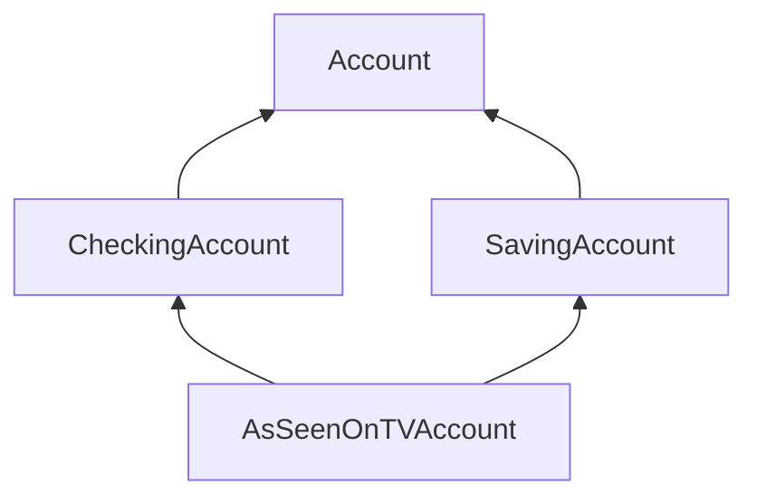
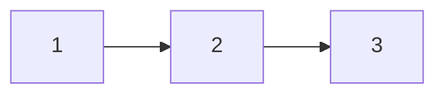

<span style="font-family: 'Times New Roman';">

# Part3 Object-Oriented Programming

***

## 3.1 Terminology

**object:**

class的实例化结果，可以理解成一个具体的事物，其封装了自身的信息）。

**class:**

object的模板，定义了特定类型的object的行为。多个object可能是同一class的实例，不同的class之间也可能存在关联。

**attribute:**

用来表示object状态或特征的数据，具体还可分为class attribute和instance attribute等。

**method:**

与object交互的方式，是一种作用于特定类型的object的函数。

!!! Example
    list实际上是一个内置的class。

    ```py linenums="1"
    >>> s=list(range(3))
    >>> s
    [0, 1, 2]
    >>> type(s)
    <class 'list'> 
    ```

    list相关的method有：`append`, `extend`, `insert`, `pop`, `remove`等。

***

## 3.2 Operation on an Example

**Class Statement:**

在创建class时，往往不能忽略的是`__init__`。这是一个特殊的被自动调用的method，用于初始化object。`self`代指class的实例。

例如，下面给出一个描述银行账户的class`Account`：

```py linenums="1"
class Account:

    def __init__(self,account_holder):
        self.balance=0                      # attribute1: 余额
        self.holder=account_holder          # attribute2: 持有者

    def deposit(self,amount):               # method1: 存款
        self.balance=self.balance+amount
        return self.balance

    def withdraw(self,amount):              # method2: 取款
        if amount>self.balance:
            return 'Insufficient funds'
        self.balance=self.balance-amount
        return self.balance
```

**Creating Instance:**

使用`classname()`创建一个新的object，参数即为`__init__`对应的参数。

```py linenums="1"
>>> a=Account('Alan')
```

创建新的object之后，attribute默认可以改变，可以随时添加新的attribute，另一个object也可以作为attribute：

```py linenums="1"
>>> a.balance
0
>>> a.balance=12
>>> a.balance
12
>>> b=Account('Ada')
>>> b.balance=20
>>> a.backup=b
>>> a.backup.balance
20
```

**Object Identity:**

使用`is` 和 `is not` 来区分区分两个object是否指向同一个：

```py linenums="1"
>>> a=Account('John')
>>> b=Account('Jack')
>>> a is b
False
>>> c=a
>>> a is c
True
```

**Class Attributes:**

```py linenums="1"
class Account:
    
    interest=0.02 # A class attribute

    def __init__(self,account_holder):
        self.balance=0
        self.holder=account_holder
```

这里使用了class attribute来表示`interest`，而不是instance attribute。因此我们不必在每个创建的实例中存储该值，而只需要在class中存储一次。

创建两个实例后，任意一个都可以访问`interest`：

```py linenums="1"
>>> tom_account=Account('Tom')
>>> jim_account=Account('Jim')
>>> tom_account.interest
0.02
>>> jim_account.interest
0.02
```

在寻找attribute的时候，先在instance attribute中寻找，再在class attribute中寻找。

使用`getattr`查询attribute对应的值，使用 `hasattr`查询是否有对应的attribute：

```py linenums="1"
>>> getattr(tom_account,'balance')
10
>>> hasattr(tom_account,'deposit')性
True
```

**Attribute Assignment:**

在object中可以创建一个和class attribute同名的instance attribute（原本的class attribute不变），修改class attribute，如果object自身没有同名的instance attribute，则查询时都会改变；否则不变：

```py linenums="1"
>>> jim_account=Account('Jim')
>>> tom_account=Account('Tom')
>>> jim_account.interest        # 一开始两个实例的interest都是class的
0.02
>>> tom_account.interest
0.02
>>> Account.interest=0.04       # 改变class的interest，由于两个实例都没有各自的interest，因此都会改变
>>> jim_account.interest
0.04
>>> tom_account.interest
0.04
>>> jim_account.interest=0.08   # 为jim_account创建一个新的instance attribute
>>> jim_account.interest        # 优先访问instance attribute
0.08 
>>> tom_account.interest        # 没有instance attribute，访问class attribute
0.04 
>>> Account.interest=0.05       # 改变class attribute
>>> jim_account.interest        # 访问instance attribute，不受影响
0.08
>>> tom_account.interest        # 访问class attribute，改变
0.05
```

**Method calls:**

method可以绑定到另一个名称上：

```py linenums="1"
>>> a=Account('Alan')
>>> a.deposit(5)
5
>>> a.deposit(5)
10
>>> a.deposit
<bound method Account.deposit of <__main__.Account object at 0x7f8b1c3b3b50>>
>>> f=a.deposit
>>> f(10)
20
>>> f(10)
30
```

将method绑定到iterator上，当使用`next`进行迭代时，method也会对object产生效果：

```py linenums="1"
>>> m=map(a.deposit,range(10,20))
>>> a.balance
30
>>> next(m)
40
>>> a.balance
40
```

**Inheritance:**

inheritance是一种将多个相似但在专业化程度上有所不同的class关联在一起的方法。

subclass可能具有与base class相同的所有attribute，也可能有一些额外的attribute。编写subclass时，我们只需考虑其与base class不同的部分。

```py linenums="1"
class <name>(<base class>):
    <suite>
```

定义更低利率和收取手续费的subclass`CheckingAccount`：

```py linenums="1"
class CheckingAccount(Account):
    """A bank account that charges for withdrawals."""
    withdraw_fee=1
    interest=0.01
    def withdraw(self, amount):
        return Account.withdraw(self,amount+self.withdraw_fee) # 注意这里的用法
```

**Looking up Attribute Names on Classes:**

base class的attribute不会被复制到subclass中，相反，这是按名称查找attribute的过程的一部分。

顺序：subclass→base class→base class of base class→...

**Object-Oriented Design:**

* Inheritance: 表示的是一个is-a关系
* Composition: 表示的是一个has-a关系

```py linenums="1"
class Bank:
    """A bank has accounts.

    >>> bank=Bank()
    >>> john=bank.open_account('John',10)
    >>> jack=bank.open_account('Jack',5,CheckingAccount)
    >>> john.interst
    0.02
    >>> jack.interst
    0.01
    >>> bank.pay_interest()
    >>> john.balance
    10.2
    >>> bank.too_big_to_fail()
    True
    """
    def __init__(self):
        self.accounts=[] # 该银行持有的账户列表

    def open_account(self, holder, amount, kind=Account):
        account=kind(holder)
        account.deposit(amount)
        self.accounts.append(account)
        return account

    def pay_interest(self):
        for a in self.accounts:
            a.deposit(a.balance*a.interest)

    def too_big_to_fail(self):
        return len(self.accounts)>1
```

**Multiple Inheritance:**

multiple inheritance是指一个subclass有多个base class。

```py linenums="1"
class SavingAccount(Account):
    deposit_fee=2
    def deposit(self,amount):
        return Account.deposit(self,amount-self.deposit_fee)
```

假设有一种新的账户：

* 1%的利率
* $1的取款费
* $2的存款费
* 开户赠送$1

```py linenums="1"
class AsSeenOnTVAccount(CheckingAccount,SavingAccount):
    def __init__(self,account_holder):
        self.holder=account_holder
        self.balance=1
```

<center>

</center>

***

## 3.3 Representations

**`repr`&`str`:**

大多数object有两种字符串的表达方式：

`repr`|`str`
---|---
对Python interpreter可读|对人类可读
交互式对话中回车打印出来的结果（字符串形式）|使用`print`打印出来的结果（）

大多数情况下，`str`和`repr`是一样的：

```py linenums="1"
>>> 12e12
12000000000000.0
>>> repr(12e12)
'12000000000000.0'
>>> print(12e12)
12000000000000.0
>>> str(12e12)
'12000000000000.0'
```

不一样的情况：

```py linenums="1"
>>> from fractions import Fraction
>>> Fraction(1,2)  
Fraction(1, 2)
>>> repr(Fraction(1,2))
'Fraction(1, 2)'
>>> print(Fraction(1,2))
1/2
>>> str(Fraction(1,2))
'1/2'
```

使用`eval`函数执行一个字符串表达式，并返回表达式的值：

```py linenums="1"
>>> half=Fraction(1,2)
>>> eval(repr(half))
Fraction(1, 2)
>>> eval(str(half))
0.5
```

部分object并没有简单对应的表达式，例如函数、类等，尖括号< >表示这不是一个Python表达式：

```py linenums="1"
>>> repr(min)
'<built-in function min>'
```

!!! Example
    ```py linenums="1"
    >>> s="Hello,World"

    >>> s
    'Hello,World'
    >>> print(s)
    Hello,World
    >>> eval(s)
    Traceback (most recent call last):
      File "<stdin>", line 1, in <module>
      File "<string>", line 1, in <module>
    NameError: name 'Hello' is not defined

    >>> repr(s)
    "'Hello,World'"
    >>> print(repr(s))
    'Hello,World'
    >>> eval(repr(s))
    'Hello,World'

    >>> str(s)
    'Hello,World'
    >>> print(str(s))
    Hello,World
    >>> eval(str(s))
    Traceback (most recent call last):
      File "<stdin>", line 1, in <module>
      File "<string>", line 1, in <module>
    NameError: name 'Hello' is not defined
    ```

**F-Strings and String Interpolation:**

字符串插值使用F-string，评估字符串字面量，将其中的表达式（{ }中的）替换为其值。

```py linenums="1"
>>> from math import pi

# 不使用F-Strings
>>> 'pi starts with '+str(pi)+'...'
'pi starts with 3.141592653589793...'

# 使用F-Strings
>>> f'pi starts with {pi}...'
'pi starts with 3.141592653589793...'
```

评估子表达式可能有副作用：

```py linenums="1"
>>> s=[9,8,7]
>>> f'because {s.pop()} {s.pop()} {s}.'
'because 7 8 [9].'
```

**Polymorphic Functions:**

多态函数是一种能处理不同数据类型的函数，`str`和`repr`就是典型的多态函数。

!!! note
    `repr`实际上对参数调用了method`__repr__`。
    ```py linenums="1"
    >>> half.__repr__()
    'Fraction(1, 2)'
    ```

    `str`实际上对参数调用了method`__str__`。
    ```py linenums="1"
    >>> half.__str__()
    '1/2'
    ```

**Special Method Names:**

当一个method名字两边有下划线时，它是一个特殊的method，例如`__init__`，`__repr__`，`__str__`，`__add__`，`__radd__`，`__bool__`，`__float__`。

```py linenums="1"
# 使用内置语法和内置函数
>>> zero,one,two=0,1,2
>>> one+two
3
>>> bool(zero),bool(one)
(False, True)

# 使用特殊的methods
>>> zero,one,two=0,1,2
>>> one.__add__(two)
3
>>> zero.__bool__(),one.__bool__()
(False, True)
```

!!! Note
    `__add__`和`__radd__`的区别在于相加的两个数顺序相反。

!!! Example
    ```py linenums="1"
    class Ratio:
        def __init__(self,n,d):
            self.numer=n
            self.denom=d

        def __repr__(self):
            return 'Ratio({0},{1})'.format(self.numer,self.denom)

        def __str__(self):
            return '{0}/{1}'.format(self.numer,self.denom)

        def __add__(self,other):
            if isinstance(other,int): # 右侧为整数的情况
                n=self.numer+self.denom*other
                d=self.denom
            elif isinstance(other,Ratio):
                n=self.numer*other.denom+self.denom*other.numer
                d=self.denom*other.denom
            elif isinstance(other,float): # 左侧或右侧为浮点数的情况
                return float(self)+other
            g=gcd(n,d)
            return Ratio(n//g,d//g)

        __radd__=__add__ # 左侧为整数的情况，转换为右侧为整数的情况

        def __float__(self):
            return self.numer/self.denom

    def gcd(n,d):
        while n!=d:
            n,d=min(n,d),abs(n-d)
        return n
    ```

***

## 3.4 Linked Lists

**Linked Lists:**

<center>

</center>

我们尝试在Python中进行表示：

`Link(3,Link(4,Link(5,Link.empty)))`

```py linenums="1"
class Link:

    empty=()
    
    def __init__(self,first,rest=empty):
        assert rest is Link.empty or isinstance(rest,Link)
        self.first=first
        self.rest=rest
```

**Range, Map, and Filter for Linked Lists:**

以下是一个常见的操作，通过`filter`获得`range(1,6)`中的奇数，再用`square`对其依次平方得到iterator，最后用`list`获得结果的列表：

```py linenums="1"
square,odd=lambda x:x*x,lambda x:x%2==1
list(map(square,filter(odd,range(1,6)))) # [1,9,25]
```


现在，我们想对链表也进行类似的操作：

```py linenums="1"
map_link(square,filter_link(odd,range_link(1,6))) # Link(1,Link(9,Link(25)))
```

因此可以给出以下函数定义：

```py linenums="1"
def range_link(start,end):
    """Return a Link containing consecutive intergers from start to end.
    
    >>> range_link(3,6)
    Link(3,Link(4,Link(5)))
    """
    if start>end:
        return Link.empty
    else:
        return Link(start,range_link(start+1,end))

def map_link(f,s):
    """Return a Link that contains f(x) for each x in Link s.

    >>> map_link(square,range_link(3,6))
    Link(9,Link(16,Link(25)))
    """
    if s is Link.empty:
        return s
    else:
        return Link(f(s.first),map_link(f,s.rest))

def filter_link(f,s):
    """Return a Link that contains only the elements x of Link s for which f(x) is a true value.

    >>> filter_link(odd,range_link(3,6))
    Link(3,Link(5))
    """
    if s is Link.empty:
        return s
    filtered_rest=filter_link(f,s.rest)
    if f(s.first):
        return Link(s.first,filtered_rest)
    else:
        return filtered_rest
```

!!! Example
    **向有序链表中插入元素。**

    ```py linenums="1"
    def add(s,v):
        """Add v to s, returning modified s.

        >>> s=Link(1,Link(3,Link(5)))
        >>> add(s,0)
        Link(0,Link(1,Link(3,Link(5)))
        >>> add(s,3)
        Link(0,Link(1,Link(3,Link(5))))
        >>> add(s,4)
        Link(0,Link(1,Link(3,Link(4,Link(5)))))
        >>> add(s,6)
        Link(0,Link(1,Link(3,Link(4,Link(5,Link(6))))))
        """
        assert s is not List.empty
        if s.first>v:
            s.first,s.rest=v,Link(s.first,s.rest)
        elif s.first<v and empty(s.rest):
            s.rest=Link(v)
        elif s.first<v:
            add(s.rest,v)
        return s
    ```