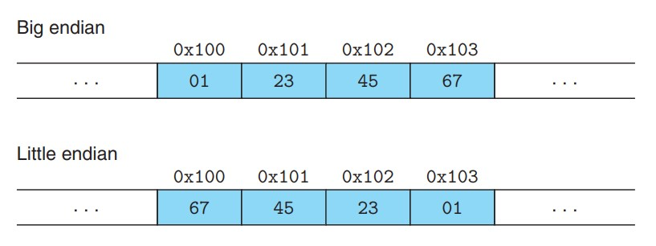
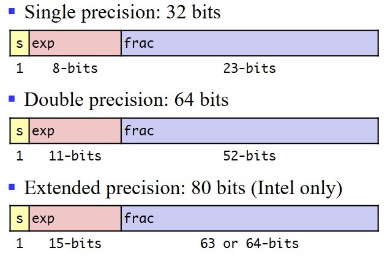

# Ⅱ 信息的表示和处理   Representing and Manipulating Information

***

## 2.1 信息存储 Information Storage

### 字节顺序

* **小端法**：最低有效字节在最前面。
* **大端法**：最高有效字节在最前面。

例如：假设变量 x 的类型为 int，位于地址 0x100 处，十六进制表示为 0x01234567，其两种字节顺序如下：

大多数 Intel 兼容机都只使用小端模式。

***

## 2.2 整数表示  Integer Representations

### 编码

对于向量 $\vec{x}=[x_{w-1},x_{w-2},···,x_0]$：

* $B2U_w(\vec{x})\doteq\sum\limits_{i=0}^{w-1}x_i2^i$
* $B2T_w(\vec{x})\doteq -x_{w-1}2^{w-1}+\sum\limits_{i=0}^{w-2}x_i2^i$

### 转换

* 补码转换为无符号数：$T2U_w(x)=\begin{cases}
    x+2^w,~~x<0\\\
    x,~~~~~~~~~~~x\geqslant 0
\end{cases}$
* 无符号数转换为补码：$U2T_w(u)=\begin{cases}
    u,~~~~~~~~~~~u\leqslant TMax_w\\\
    u-2^w,~~u>TMax_w
\end{cases}$

***

## 2.3 整数运算  Integer Arithmetic

### 补码加法

对满足 $-2^{w-1}\leqslant x,y\leqslant 2^{w-1}-1$ 的整数 $x$ 和 $y$，有：
$x+_w^ty=\begin{cases}
    x+y-2^w,~~~~2^{w-1}\leqslant x+y\\\
    x+y,~~~~~~~~~~~~-2^{w-1}\leqslant x+y\leqslant 2^{w-1}\\\
    x+y+2^w,~~~~x+y<-2^{w-1}
\end{cases}$

### 除以 2 的幂的补码除法

C 变量 x 和 k 分别有补码值 $x$ 和无符号数值 $k$，且 $0\leqslant k<w$，则当执行算数移位时：  

* `x>>k`产生数值$\lfloor\frac{x}{2^k}\rfloor$
* `(x+(1<<k)-1)>>k`产生数值$\lceil\frac{x}{2^k}\rceil$

***

## 2.4 浮点数  Floating Point

### IEEE 浮点表示

* s 编码符号位
* exp 编码指数，但不等于指数
* frac 编码尾数，但不等于尾数

**规格化**

对于 exp：  
首要条件：exp≠000···000 或 111···111  
指数的实际大小：exp 得到的无符号数-偏移量，其中偏移量为 $2^{k-1}-1$，$k$ 为 exp 的位数。例如：单精度的偏移量为 127，双精度的偏移量为 1023。

对于 frac：  
由于尾数的范围为 $[1,2)$，因此整数位必为 1，小数位后的数字编码到 frac 中.。因此，frac 最小表示为 000···000，此时尾数为 1。

**非规格化**

exp=000···000 的情况：  
此时指数应该被编码为 1-偏移量（不是 0-偏移量）  
此时尾数小数点前的正数默认为 0（不是 1）

例如：  

* exp=000···000，frac=000···000
  表示 0
* exp=000···000，frac≠000···000
  表示十分接近 0 的数字

**特殊值**

exp=111···111 的情况：  

* 如果 frac=000···000，则表示无穷
* 如果 frac≠000···000，则表示非数字（NaN）

### 舍入

方式|1.4|1.6|1.5|2.5|-1.5
---|---|---|---|---|---
向零舍入|1|1|1|2|-1
向下舍入|1|1|1|2|-2
向上舍入|2|2|2|3|-1
向偶数舍入|1|2|2|2|-2

其中，向偶数舍入是 IEEE 默认的舍入模式，它和四舍五入只有一点不同，在 .5 的舍入上，采用取偶数的方式。

