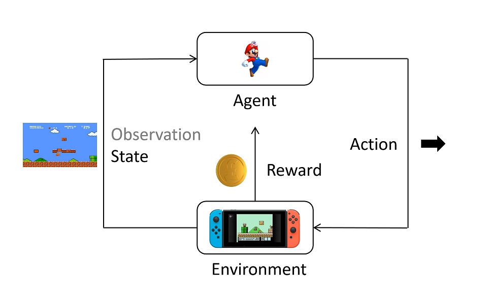

# PPO

***

## Policy 训练初步

**强化学习基础：**

* environment
* agent
* state
* action
* reward
* action space：可选择的 action 集合
* policy：策略函数，用 $\pi$ 表示，输入为 state，输出为 action 的概率分布，
* trajectory：轨迹，一连串 state 和 action 的序列，用 $\tau$ 表示
* return：累积奖励，即 trajectory 中所有 reward 的和，用 $R$ 表示

强化学习的最终目标是：用神经网络模拟一个 policy $\pi$，使得 return 期望最大。

!!! Note
    训练和推理时根据概率分布采样 action，而不是直接选择概率最大的 action。

**统计学基础：**

期望：

$$E(x)\_{x\sim p(x)}=\sum\limits\_{x}x\cdot p(x)\approx\frac{1}{n}\sum\limits\_{i=1}^nx\_i,x\_i\sim p(x)$$

**数学描述——梯度法：**

设 trajectory $\tau$ 服从分布 $P\_{\theta}(\tau)$，其中 $\theta$ 为 policy 的参数，trajectory 由 policy 决定，上述目标中提到的期望表示为：

$$E[R(\tau)]\_{\tau\sim P\_{\theta}(\tau)}=\sum\limits\_{\tau}R(\tau)P\_{\theta}(\tau)$$

如何让上述期望最大化？我们只需要让其沿梯度的方向上升即可。因此，需要对 $\theta$ 求梯度：

$$
\begin{align}
\nabla E[R(\tau)]\_{\tau\sim P\_{\theta}(\tau)} &= \nabla\sum\limits\_{\tau}R(\tau)P\_{\theta}(\tau) \\\
&= \sum\limits\_{\tau}R(\tau)\nabla P\_{\theta}(\tau) \\\
&= \sum\limits\_{\tau}P\_{\theta}(\tau)R(\tau)\frac{\nabla P\_{\theta}(\tau)}{P\_{\theta}(\tau)} \\\
&\approx \frac{1}{N}\sum\limits\_{n=1}^NR(\tau^n)\frac{\nabla P\_{\theta}(\tau^n)}{P\_{\theta}(\tau^n)} \\\
&= \frac{1}{N}\sum\limits\_{n=1}^NR(\tau^n)\nabla[\log(P\_{\theta}(\tau^n))], \tau\sim P\_{\theta}(\tau)
\end{align}
$$

!!! Note
    $\approx$ 的部分基于蒙特卡洛采样。

对于一条确定的 trajectory 的概率分布，有：

$$P\_{\theta}(\tau)=P(s\_1)P\_{\theta}(a\_1|s\_1)P(s\_2|s\_1,a\_1)P\_{\theta}(a\_2|s\_2)P(s\_3|s\_2,a\_2)\dots=P(s\_1)\prod\limits\_{t=1}^TP\_{\theta}(a\_t|s\_t)P(s\_{t+1}|s\_t,a\_t)$$

!!! Note
    这里不带下标的 $P$ 由 environment 决定。

    这里 $s$ 和 $a$ 的下标并不是确定的第几号 state/action，而是表示在这个 trajectory 中的第几个 state/action。

因此，上式可以继续变形。取对数后变成加法，如果求导只关注和 $\theta$ 有关的部分：

$$
\begin{align}
\nabla E(R(\tau))\_{\tau\sim P\_{\theta}(\tau)} &= \frac{1}{N}\sum\limits\_{n=1}^NR(\tau^n)\sum\limits\_{t=1}^{T\_n}R(\tau\_n)\nabla[\log(P\_{\theta}(a\_t^n|s\_t^n))] \\\
&= \frac{1}{N}\sum\limits\_{n=1}^N\sum\limits\_{t=1}^{T\_n}R(\tau^n)\nabla[\log(P\_{\theta}(a\_t^n|s\_t^n))]
\end{align}
$$

如果我们去掉 $\nabla$，那么 $\frac{1}{N}\sum\limits\_{n=1}^N\sum\limits\_{t=1}^{T\_n}R(\tau^n)\log(P\_{\theta}(a\_t^n|s\_t^n))$ 和最开始的原函数 $E[R(\tau)]\_{\tau\sim P\_{\theta}(\tau)}$ 虽然不完全等价，但是它们的梯度是相等的，更新方向一致，因此我们可以直接用前者来研究优化问题，将其视为简化的目标函数。

我们来看一下这个目标函数的形式：

$$\frac{1}{N}\sum\limits\_{n=1}^N\sum\limits\_{t=1}^{T\_n}R(\tau^n)\log(P\_{\theta}(a\_t^n|s\_t^n))$$

它由两部分组成。第一部分是对应 trajectory 的 return，第二部分是某个 state 下选择某个 action 的概率（取对数）。

我们要让这个目标函数最大化是什么意思？就是当 return 为正时，我们希望让对应的 action 被选中的概率更大一些；当 return 为负时，我们希望让对应的 action 被选中的概率更小一些。

**policy 训练：**

为了贴合一般形式的梯度下降，对上述目标函数稍加变换：

$$\text{Loss} = -\frac{1}{N}\sum\limits\_{n=1}^N\sum\limits\_{t=1}^{T\_n}R(\tau^n)\log(P\_{\theta}(a\_t^n|s\_t^n))$$

使用 policy 跑 $N$场游戏，得到 $N$ 条 trajectory，每条 trajectory 有 $T\_n$ 个 state-action 对，以及对应的 return $R(\tau^n)$。

因此，损失函数所有组成成分已知，可以进行反向传播求得梯度，更新神经网络参数 $\theta$。

***

## Policy 训练改进

**return 改进：**

问题1：

对于某个 state 下采取某个 action，其对应的 reward 并不应该是整个 trajectory 的 return，而是看采取了这个 action 之后的影响，因为其只会对后续的 reward 产生影响。此外，后面越远的 reward 影响越小：

$$R(\tau^n)\rightarrow R\_t^n=\sum\limits\_{t'=t}^{T\_n}\gamma^{t'-t}r\_{t'}^n$$

问题2：

假设无论采取什么 action，环境都会给出一个正的 reward，那么算法就会增加所有 action 的概率，对应 reward 更大的 action，概率增加得更大，但是这样会让训练很慢。最好能让相对好的 action 概率增加，相对不好的 action 概率减少。因此，对 return 引入 baseline：

$$R\_t^n\rightarrow R\_t^n - B(s\_t^n)$$

综上，梯度修改为：

$$\frac{1}{N}\sum\limits\_{n=1}^N\sum\limits\_{t=1}^{T\_n}[R\_t^n-B(s\_t^n)]\nabla[\log(P\_{\theta}(a\_t^n|s\_t^n))]$$

**新概念引入：**

* **action-value function**：记为$Q\_{\theta}(s,a)$，表示在 state $s$ 下采取 action $a$，期望的 return 是多少
* **state-value function**：记为$V\_{\theta}(s)$，表示在 state $s$ 下，无论采取任何 action，期望的 return 是多少
* **advantage function**：记为$A\_{\theta}(s,a)=Q\_{\theta}(s,a)-V\_{\theta}(s)$，表示在 state $s$ 下采取 action $a$，相对于平均水平的优势是多少

因此，advantage function 实际上表示的就是上面的$R\_t^n-B(s\_t^n)$：

$$\frac{1}{N}\sum\limits\_{n=1}^N\sum\limits\_{t=1}^{T\_n}A\_{\theta}(s\_t^n,a\_t^n)\nabla[\log(P\_{\theta}(a\_t^n|s\_t^n))]$$

**Generalized Advantage Estimation (GAE):**

对 advantage function 进行研究：

$$A\_{\theta}(s,a)=Q\_{\theta}(s,a)-V\_{\theta}(s)$$

设当前一步得到的 reward 为 $r\_t$，则有

$$Q\_{\theta}(s\_t,a)=r\_t+\gamma*V\_{\theta}(s\_{t+1})$$

代回 advantage function：

$$A\_{\theta}(s\_t,a)=r\_t+\gamma*V\_{\theta}(s\_{t+1})-V\_{\theta}(s\_t)$$

此时的 advantage function 只和 state-value function 有关。

因此，原本我们需要两个神经网络，分别拟合 $Q\_{\theta}(s,a)$ 和 $V\_{\theta}(s)$，现在只需要一个神经网络拟合 $V\_{\theta}(s)$，然后计算 $A\_{\theta}(s\_t,a)$。

此外

$$V\_{\theta}(s\_{t+1})\approx r\_{t+1}+\gamma*V\_{\theta}(s\_{t+2})$$

!!! Note
    这里的约等于是因为$r\_{t+1}$是不确定的。

因此，advantage function 可以多步采样：

$$A\_{\theta}^1(s\_t,a)=r\_t+\gamma*V\_{\theta}(s\_{t+1})-V\_{\theta}(s\_t)$$

$$A\_{\theta}^2(s\_t,a)=r\_t+\gamma\*r\_{t+1}+\gamma^2\*V\_{\theta}(s\_{t+2})-V\_{\theta}(s\_t)$$

$$A\_{\theta}^3(s\_t,a)=r\_t+\gamma\*r\_{t+1}+\gamma^2\*r\_{t+2}+\gamma^3\*V\_{\theta}(s\_{t+3})-V\_{\theta}(s\_t)$$

$$\dots$$

$$A\_{\theta}^T(s\_t,a)=r\_t+\gamma\*r\_{t+1}+\gamma^2\*r\_{t+2}+\gamma^3\*r\_{t+3}+\dots+\gamma^{T-1}\*r\_{t+T-1}-V\_{\theta}(s\_t)$$

我们使用以下符号进行简记：

$$\delta\_t^V=r\_t+\gamma*V\_{\theta}(s\_{t+1})-V\_{\theta}(s\_t)$$

因此，advantage function 可以表示为：

$$A\_{\theta}^1(s\_t,a)=\delta\_t^V$$

$$A\_{\theta}^2(s\_t,a)=\delta\_t^V+\gamma*\delta\_{t+1}^V$$

$$A\_{\theta}^3(s\_t,a)=\delta\_t^V+\gamma\*\delta\_{t+1}^V+\gamma^2\*\delta\_{t+2}^V$$

$$\dots$$

$$A\_{\theta}^T(s\_t,a)=\delta\_t^V+\gamma\*\delta\_{t+1}^V+\gamma^2\*\delta\_{t+2}^V+\dots+\gamma^{T-1}\*\delta\_{t+T-1}^V$$

如果所有的采样次数都考虑，但是给更远的采样更小的权重：

$$
\begin{align}
A\_{\theta}^{GAE}(s\_t,a) &= (1-\lambda)(A\_{\theta}^1+\lambda\*A\_{\theta}^2+\lambda^2\*A\_{\theta}^3+\dots) \\\
&= (1-\lambda)(\delta\_t^V + \lambda\*(\delta\_t^V+\gamma\*\delta\_{t+1}^V)+ \lambda^2\*(\delta\_t^V+\gamma\*\delta\_{t+1}^V+\gamma^2\*\delta\_{t+2}^V)+\dots) \\\
&= (1-\lambda)(\delta\_t^V(1+\lambda+\lambda^2+\dots)+\gamma\delta\_{t+1}^V\*(\lambda+\lambda^2+\dots)+\dots) \\\
&= (1-\lambda)(\delta\_t^V\frac{1}{1-\lambda}+\gamma\*\delta\_{t+1}^V\frac{\lambda}{1-\lambda}+\gamma^2\*\delta\_{t+2}^V\frac{\lambda^2}{1-\lambda}+\dots) \\\
&= \sum\limits\_{b=0}^{\infty}(\gamma\lambda)^b\delta\_{t+b}^V
\end{align}
$$

**改进后的算法：**

$$\delta\_t^V=r\_t+\gamma*V\_{\theta}(s\_{t+1})-V\_{\theta}(s\_t)$$

$$A\_{\theta}^{GAE}(s\_t,a) = \sum\limits\_{b=0}^{\infty}(\gamma\lambda)^b\delta\_{t+b}^V$$

$$\text{gradient}=\frac{1}{N}\sum\limits\_{n=1}^N\sum\limits\_{t=1}^{T\_n}A\_{\theta}^{GAE}(s\_t^n,a\_t^n)\nabla[\log(P\_{\theta}(a\_t^n|s\_t^n))]$$

其中，$V\_{\theta}$ 和 $P\_{\theta}$ 都是用神经网络来拟合的，一般可共用参数，在最后一层不同。

***

## PPO

全称： Proximal Policy Optimization，邻近策略优化

**重要性采样：**

策略分为 on-policy 和 off-policy 两种。on-policy 采集数据所用模型和要训练的模型是同一个；而 off-policy 不然。例如，老师根据一名同学的行为进行奖励或惩罚，这名同学自己调整行为则为 on-policy；而其他同学根据这名同学的奖惩情况调整自己的行为则为 off-policy。

原本我们的 policy 训练是 on-policy 的，现在，PPO 想要利用 off-policy 的数据来训练 policy。

如果我们想要求$f(x)$的期望：

$$
\begin{align}
E[f(x)]\_{x\sim p(x)} &= \sum\limits\_xf(x)p(x)  \\\
&= \sum\limits\_xf(x)\cdot\frac{p(x)}{q(x)}\cdot q(x)  \\\
&= E[f(x)\frac{p(x)}{q(x)}]\_{x\sim q(x)} \\\
&\approx \frac{1}{N}\sum\limits\_{n=1}^N[f(x)\frac{p(x)}{q(x)}], x\sim q(x)
\end{align}$$

实质上，是更换了原本的采样分布。因此，原本的目标函数的梯度公式也可以用重要性采样来改写：

$$
\begin{align}
\text{gradient} &= \frac{1}{N}\sum\limits\_{n=1}^N\sum\limits\_{t=1}^{T\_n}A\_{\theta}^{GAE}(s\_t^n,a\_t^n)\nabla[\log(P\_{\theta}(a\_t^n|s\_t^n))]   \\\
&\rightarrow \frac{1}{N}\sum\limits\_{n=1}^N\sum\limits\_{t=1}^{T\_n}A\_{\theta'}^{GAE}(s\_t^n,a\_t^n)\frac{P\_{\theta}(a\_t^n|s\_t^n)}{P\_{\theta'}(a\_t^n|s\_t^n)}\nabla[\log(P\_{\theta}(a\_t^n|s\_t^n))] 
\end{align}
$$

其中，$A\_{\theta'}^{GAE}(s\_t^n,a\_t^n)$ 是观测到其他 policy 的数据后计算得到的 advantage function，用 $\nabla[\log(P\_{\theta}(a\_t^n|s\_t^n))]$ 来更新当前 policy，引入 $\frac{P\_{\theta}(a\_t^n|s\_t^n)}{P\_{\theta'}(a\_t^n|s\_t^n)}$ 来修正分布差异带来的影响。

我们可以对 $\nabla[\log(P\_{\theta}(a\_t^n|s\_t^n))]$ 进行还原：

$$
\begin{align}
\text{gradient} &= \frac{1}{N}\sum\limits\_{n=1}^N\sum\limits\_{t=1}^{T\_n}A\_{\theta'}^{GAE}(s\_t^n,a\_t^n)\frac{P\_{\theta}(a\_t^n|s\_t^n)}{P\_{\theta'}(a\_t^n|s\_t^n)}\frac{\nabla [P\_{\theta}(a\_t^n|s\_t^n)]}{P\_{\theta}(a\_t^n|s\_t^n)} \\\
&= \frac{1}{N}\sum\limits\_{n=1}^N\sum\limits\_{t=1}^{T\_n}A\_{\theta'}^{GAE}(s\_t^n,a\_t^n)\frac{\nabla [P\_{\theta}(a\_t^n|s\_t^n)]}{P\_{\theta'}(a\_t^n|s\_t^n)}
\end{align}
$$

类似地，还原出简化的目标函数：

$$\text{Loss} = -\frac{1}{N}\sum\limits\_{n=1}^N\sum\limits\_{t=1}^{T\_n}A\_{\theta'}^{GAE}(s\_t^n,a\_t^n)\frac{P\_{\theta}(a\_t^n|s\_t^n)}{P\_{\theta'}(a\_t^n|s\_t^n)}$$

这样，我们就把 on-policy 的目标函数变成了 off-policy 的目标函数，这个时候其他策略采集得到的数据就可以多次利用了。

**进一步约束：**

观测的 policy 和自身的 policy 给出的各种 action 概率分布差别不能太大，不然训练效果不好。例如，老师批评坏学生考试交白卷，但如果是好学生观测并学习，这是没有意义的，因为好学生出现交白卷的 action 的概率几乎为 0。

添加的约束就是 **KL 散度**，是描述两个概率分布相似程度的量化指标。分布完全一致则为 0，差别越大则 KL 散度越大。

$$\text{Loss} = -\frac{1}{N}\sum\limits\_{n=1}^N\sum\limits\_{t=1}^{T\_n}A\_{\theta'}^{GAE}(s\_t^n,a\_t^n)\frac{P\_{\theta}(a\_t^n|s\_t^n)}{P\_{\theta'}(a\_t^n|s\_t^n)} + \beta KL(P\_{\theta},P\_{\theta'})$$

还有一种使用 **clip截断函数**的形式。$clip(a,b,c)$ 表示：当 $a<b$ 时，输出 $b$；当 $a\>c$ 时，输出 $c$；否则输出 $a$。

$$\text{Loss}= -\frac{1}{N}\sum\limits\_{n=1}^N\sum\limits\_{t=1}^{T\_n}\min\\{A\_{\theta'}^{GAE}(s\_t^n,a\_t^n)\frac{P\_{\theta}(a\_t^n|s\_t^n)}{P\_{\theta'}(a\_t^n|s\_t^n)},A\_{\theta'}^{GAE}(s\_t^n,a\_t^n)clip\left(\frac{P\_{\theta}(a\_t^n|s\_t^n)}{P\_{\theta'}(a\_t^n|s\_t^n)},1-\epsilon,1+\epsilon\right)\\}$$