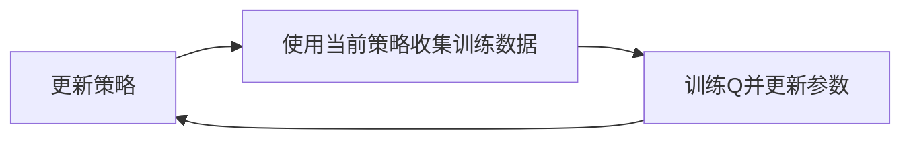
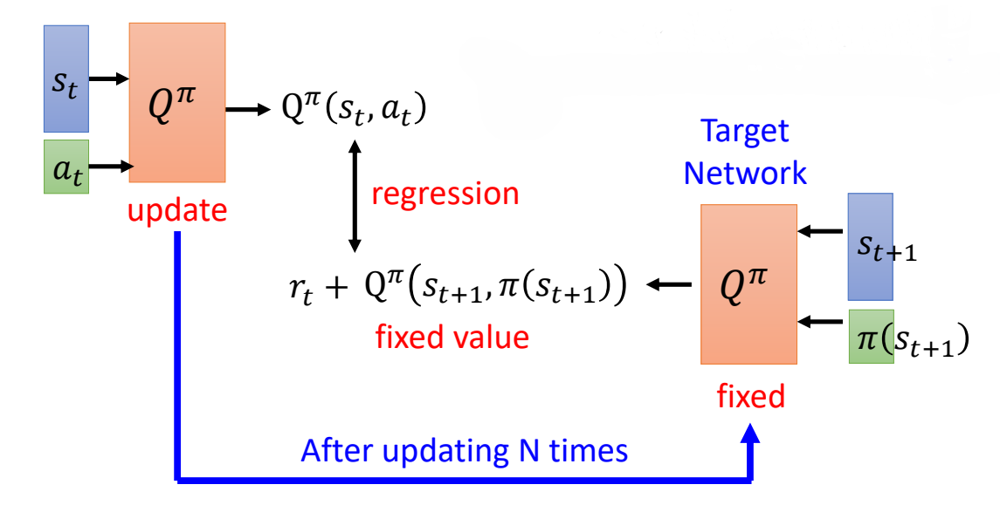
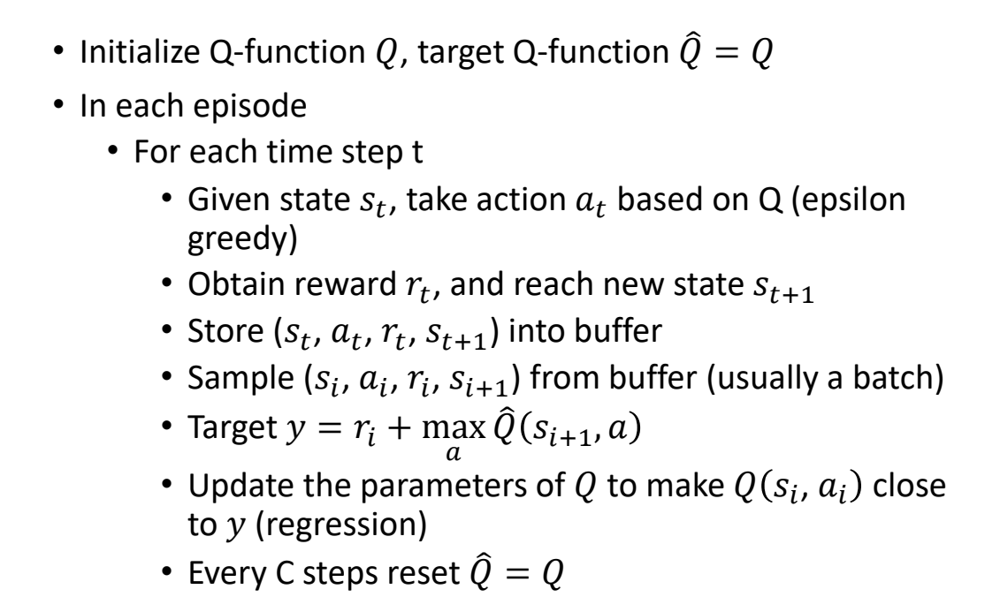

# Q-Learning

***

假设你在一个迷宫中，每一步都可以选择一个方向，目标是找到出口。

如果你脑中有一张地图，告诉你在每个位置该往哪个方向走，也就是说，直接学习一个 policy，在每个 state 都有对应的 action 概率分布，那么这就是 **policy-based** 的方法，比如 **PPO**。

如果你脑中有一个热力图，告诉你在每个位置往哪个方向走能获得最大的 return，也就是说不专门去学习 policy，而是学习一个 value function (critic)，基于这个 critic
进行决策，那么这就是 **value-based** 的方法，比如 **Q-Learning**。

***

## 算法基础

对于 value-based 的方法，最重要的就是确定 **critic**。

常见的 critic 有两种：

* $V^{\pi}(s)$：在 state s 下，按照 policy $\pi$ 行动后，获得 return 的期望
* $Q^{\pi}(s,a)$：在 state s 下，采取 action a，之后按照 policy $\pi$ 行动，获得 return 的期望

critic 在 DRL 中用神经网络进行拟合，常见的 critic 训练方法也有两种，这里用 $V^{\pi}(s)$ 为例进行说明。

### 1. Monte Carlo (MC)

让 actor 按照 policy $\pi$ 与环境进行互动，这样，一个 state $s$ 就会对应一个真实的 return $R$，这样就是一组训练数据。

因此，训练过程实际就是一个回归过程，要调整参数，使得 $V^{\pi}(s)$ 尽可能接近 $R$。

### 2. Temporal Difference (TD)

MC 方法需要走完一条完整的轨迹，这样的时间开销太大。 TD 方法只需要在当前的 state $s_t$ 下，按照 policy $\pi$ 选择 action $a_t$，然后得到下一个 state $s_{t+1}$ 以及 reward $r_t$，就获得了一组训练数据。

这个时候，神经网络的优化目标是：

$$V^{\pi}(s_t)=V^{\pi}(s_{t+1})+r_t$$

即调整参数，使得 $V^{\pi}(s_t)-V^{\pi}(s_{t+1})$ 尽可能接近 $r_t$。

接下来的算法介绍中，统一使用 $Q^{\pi}(s,a)$ 作为 critic，统一使用 TD 方法进行网络训练。

***

## 算法流程

假设当前 policy 为 $\pi$，依照 $\pi$ 训练并更新好对应的 critic $Q^{\pi}(s,a)$ 后，要基于这个 critic 来改进 policy $\pi$，改进后的 policy $\pi'$ 为：

$$\pi'(s)=\operatorname*{arg\,max}_{a}Q^{\pi}(s,a)$$

事实上，这个 policy 的定义是无关紧要的（policy 完全依赖于 critic，这里使用 policy 只是方便说明）。当我更新好 $Q^{\pi}(s,a)$ 后，下一步与环境的互动中，每次只要按照上式选择 action 就行了。

***

## 算法改进

### 1. Target Network

由于我们使用 TD 方法训练 critic，因此训练目标是：

$$Q^{\pi}(s_t,a_t)=r_t+Q^{\pi}(s_{t+1},\pi(s_{t+1}))$$

通常情况下，这个网络不是很好学习，因为左式和右式都会改变。

一般会把右边的 $Q$ 固定住，称为 **target network**，我们只去更新左边的 $Q$ 的参数，从而转变为更简单的回归问题。

左边的 $Q$ 更新多次后，再更新右边的 $Q$，如此反复。

### 2. Exploration

我们发现，更新后的 policy 在每个状态下采取的 action 都是固定的，即 $\operatorname*{arg\,max}_aQ^{\pi}(s,a)$。

例如，在 state $s$ 下有三个可选的 action $a_1$、$a_2$、$a_3$，肯定是采取过某个 action 后才能估计出对应的 $Q$ 值。如果每次都采取 $\operatorname*{arg\,max}$ 的 action，那么其他 action 就没有机会被尝试。

对比之下，之前诸如 PPO 之类的 policy-based 方法，采取的 action 是有概率分布的，这样可以增加探索性，从而获得更好的效果。

**解决方法一：epsilon-greedy**

$$a=\begin{cases}
    \operatorname*{arg\,max}_aQ(s,a) & 1-\epsilon\\\
    random & \epsilon
\end{cases}$$

**解决方法二：Boltzmann Exploration**

$$P(a|s)=\frac{e^{Q(s,a)}}{\sum_{a'}e^{Q(s,a')}}$$

### 3. Replay Buffer

当前策略与环境互动后，获得的每一组训练数据形式为 $(s_t,a_t,r_t,s_{t+1})$，这些数据全部存储在 replay buffer 中。

在每一次迭代中，我们都能获得训练数据，但这些训练数据来自于不同的 $\pi$。但是，这些数据依然可以重复使用，因此，使用 replay buffer 是 off-policy 的一种体现。

***

## 算法伪代码

