

# Lec1 Transformation 变换

将一个空间的点转换为另一个空间的点

***

## 2D Transformation

### Linear Transformation

**缩放（Scale）：**

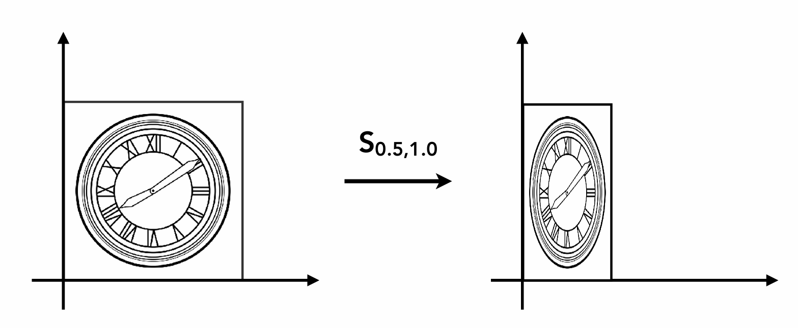

$$\begin{pmatrix}
    x'\\\
    y'
\end{pmatrix}=\begin{pmatrix}
    s_x & 0\\\
    0 & s_y
\end{pmatrix}\begin{pmatrix}
    x\\\
    y
\end{pmatrix}$$

**翻转（Reflection）：**

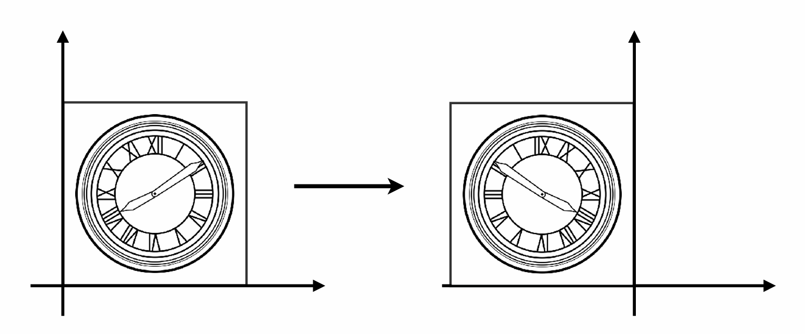

$$\begin{pmatrix}
    x'\\\
    y'
\end{pmatrix}=\begin{pmatrix}
    -1 & 0\\\
    0 & 1
\end{pmatrix}\begin{pmatrix}
    x\\\
    y
\end{pmatrix}$$

**切变（Shear）：**

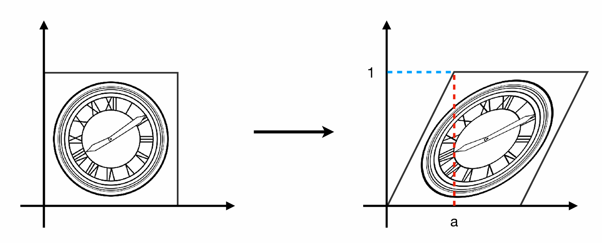

$$\begin{pmatrix}
    x'\\\
    y'
\end{pmatrix}=\begin{pmatrix}
    1 & a\\\
    0 & 1
\end{pmatrix}\begin{pmatrix}
    x\\\
    y
\end{pmatrix}$$

**旋转（Rotation）：**

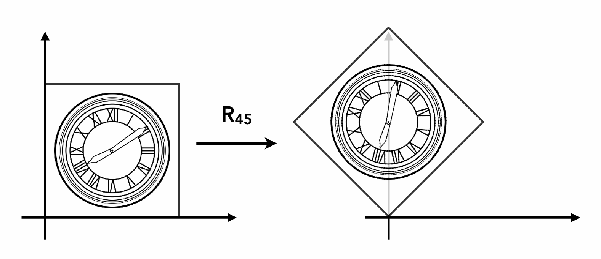

$$\begin{pmatrix}
    x'\\\
    y'
\end{pmatrix}=\begin{pmatrix}
    \cos\theta & -\sin\theta\\\
    \sin\theta & \cos\theta
\end{pmatrix}\begin{pmatrix}
    x\\\
    y
\end{pmatrix}$$

以上变换称为**线性变换（Linear Transformation）**，可以概括成如下的形式：

$$\begin{pmatrix}
    x'\\\
    y'
\end{pmatrix}=\begin{pmatrix}
    a & b\\\
    c & d
\end{pmatrix}\begin{pmatrix}
    x\\\
    y
\end{pmatrix}$$

### Affine Transformation

仿射变换可以看作是线性变换加上平移变换。其数学表达式为：

$$\begin{pmatrix}
    x'\\\
    y'
\end{pmatrix}=\begin{pmatrix}
    a &b\\\
    c&d
\end{pmatrix}\begin{pmatrix}
    x\\\
    y
\end{pmatrix}+\begin{pmatrix}
    t_x\\\
    t_y
\end{pmatrix}$$

**平移（Translation）：**

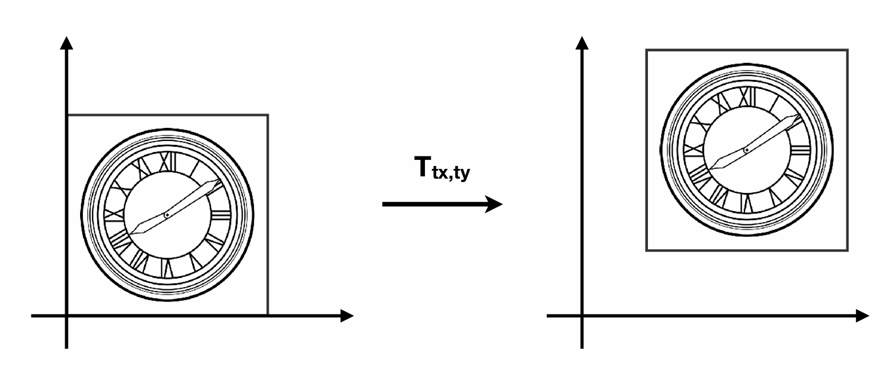

$$\begin{pmatrix}
    x'\\\
    y'
\end{pmatrix}=\begin{pmatrix}
    1 & 0\\\
    0 & 1
\end{pmatrix}\begin{pmatrix}
    x\\\
    y
\end{pmatrix}+\begin{pmatrix}
    t_x\\\
    t_y
\end{pmatrix}$$

**齐次坐标（Homogeneous Coordinates）：**

我们仍然希望将平移变换等仿射变换写成线性变换的形式，即只使用矩阵乘法。这个时候就需要引入齐次坐标。

* 对于二维的点，加入第三个维度：$(x,y,1)^T$
* 对于二维的向量，加入第三个维度：$(x,y,0)^T$

这个时候，仿射变换就可以写成：

$$\begin{pmatrix}
    x'\\\
    y'\\\
    1
\end{pmatrix}=\begin{pmatrix}
    a & b & t_x\\\
    c & d & t_y\\\
    0 & 0 & 1
\end{pmatrix}\begin{pmatrix}
    x\\\
    y\\\
    1
\end{pmatrix}$$

对于缩放变换：

$$S(s_x,s_y)=\begin{pmatrix}
    s_x & 0 & 0\\\
    0 & s_y & 0\\\
    0 & 0 & 1
\end{pmatrix}$$

!!! Note
    齐次坐标$(x,y,1)^T$实际表示二维坐标$(\frac{x}{z},\frac{y}{z})^T$。

对于旋转变换：

$$R(\theta)=\begin{pmatrix}
    \cos\theta & -\sin\theta & 0\\\
    \sin\theta & \cos\theta & 0\\\
    0 & 0 & 1
\end{pmatrix}$$

对于平移变换：

$$T(t_x,t_y)=\begin{pmatrix}
    1 & 0 & t_x\\\
    0 & 1 & t_y\\\
    0 & 0 & 1
\end{pmatrix}$$

***

## 3D Transformation

$$\begin{pmatrix}
    x'\\\
    y'\\\
    z'\\\
    1
\end{pmatrix}=\begin{pmatrix}
    a & b & c & t_x\\\
    d & e & f & t_y\\\
    g & h & i & t_z\\\
    0 & 0 & 0 & 1
\end{pmatrix}\begin{pmatrix}
    x\\\
    y\\\
    z\\\
    1
\end{pmatrix}$$

先进行线性变换，再进行平移变换。

**旋转（Rotation）：**

绕$x$轴旋转：

$$R_x(\theta)=\begin{pmatrix}
    1 & 0 & 0 & 0\\\
    0 & \cos\theta & -\sin\theta & 0\\\
    0 & \sin\theta & \cos\theta & 0\\\
    0 & 0 & 0 & 1
\end{pmatrix}$$

绕$y$轴旋转：

$$R_y(\theta)=\begin{pmatrix}
    \cos\theta & 0 & \sin\theta & 0\\\
    0 & 1 & 0 & 0\\\
    -\sin\theta & 0 & \cos\theta & 0\\\
    0 & 0 & 0 & 1
\end{pmatrix}$$

绕$z$轴旋转：

$$R_z(\theta)=\begin{pmatrix}
    \cos\theta & -\sin\theta & 0 & 0\\\
    \sin\theta & \cos\theta & 0 & 0\\\
    0 & 0 & 1 & 0\\\
    0 & 0 & 0 & 1
\end{pmatrix}$$

任意一种形态的旋转都可以分解成绕$x,y,z$轴的旋转：

$$R_{xyz}(\alpha,\beta,\gamma)=R_x(\alpha)R_y(\beta)R_z(\gamma)$$

这三个角称为**欧拉角（Euler angles）**，绕$x,y,z$轴的旋转分别称为**Roll**，**Pitch**，**Yaw**。

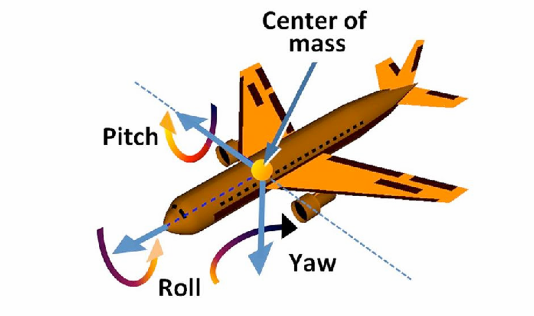

**Rodrigues' Rotation Formula:**

绕$n$轴（默认起点为原点的单位向量$n=(n_x,n_y,n_z)^T$）旋转$\alpha$角度：

$$R(n,\alpha)=\cos(\alpha)I+(1-\cos(\alpha))n n^T+\sin(\alpha)\begin{pmatrix}
    0 & -n_z & n_y\\\
    n_z & 0 & -n_x\\\
    -n_y & n_x & 0
\end{pmatrix}$$

***

## Camera Transformation

想象用相机拍一张照片：

* 第一步：找到一个好的位置并搭好场景，这就是**model transformation**，也就是将物体从局部坐标系变换到世界坐标系。
* 第二步：调整相机的位置和方向，这就是**view transformation**，也就是将物体从世界坐标系变换到相机坐标系。
* 第三步：拍照，这就是**projection transformation**，也就是将物体从相机坐标系变换到裁剪坐标系。

三步合称**MVP变换**。第一步的变换在前面已经介绍过了，下面介绍第二步和第三步。

### View Transformation

形式化定义：

* 相机的位置：$\vec{e}$
* 相机的朝向：$\vec{g}$
* 相机的上方向：$\vec{t}$

已知：如果相机和物体一起移动，二者相对静止，那么拍到的照片不会变。

既然这样，我们将相机位置移到原点，看向$-z$轴方向，向上方向为$y$轴方向。物体也进行相应的变换，相机和物体的变换矩阵是一致的。

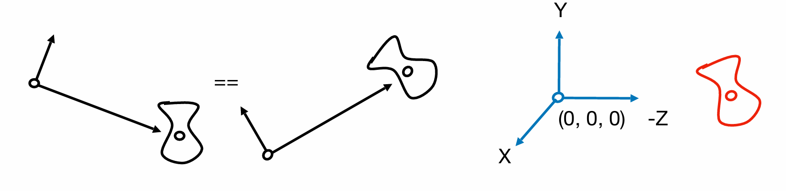

设变换矩阵为

$$M_{view}=R_{view}T_{view}$$

首先是平移，有

$$T_{view}=\begin{pmatrix}
    1 & 0 & 0 & -x_e\\\
    0 & 1 & 0 & -y_e\\\
    0 & 0 & 1 & -z_e\\\
    0 & 0 & 0 & 1
\end{pmatrix}$$

接着是旋转，我们考虑反向的过程，即把$x$轴旋转到$\vec{g}\times\vec{t}$，把$y$轴旋转到$\vec{t}$，把$z$轴旋转到$-\vec{g}$：

$$R_{view}^{-1}=\begin{pmatrix}
x_{\vec{g}\times\vec{t}} & x_t & x_{-g} & 0\\\
y_{\vec{g}\times\vec{t}} & y_t & y_{-g} & 0\\\
z_{\vec{g}\times\vec{t}} & z_t & z_{-g} & 0\\\
0 & 0 & 0 & 1
\end{pmatrix}$$

我们有结论：旋转矩阵的逆等于它的转置。因此：

$$R_{view}=\begin{pmatrix}
x_{\vec{g}\times\vec{t}} & y_{\vec{g}\times\vec{t}} & z_{\vec{g}\times\vec{t}} & 0\\\
x_t & y_t & z_t & 0\\\
x_{-g} & y_{-g} & z_{-g} & 0\\\
0 & 0 & 0 & 1
\end{pmatrix}$$

### Projection Transformation

投影变换分为两种：**正交投影（Orthographic Projection）**和**透视投影（Perspective Projection）**。

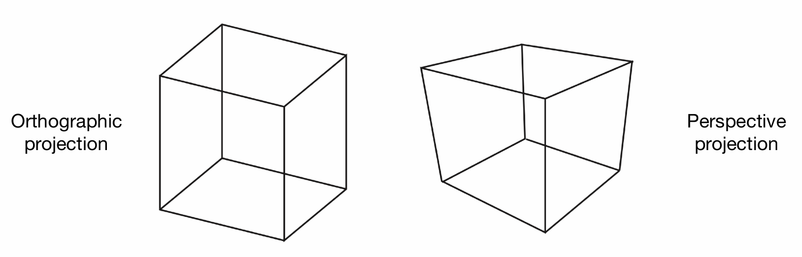

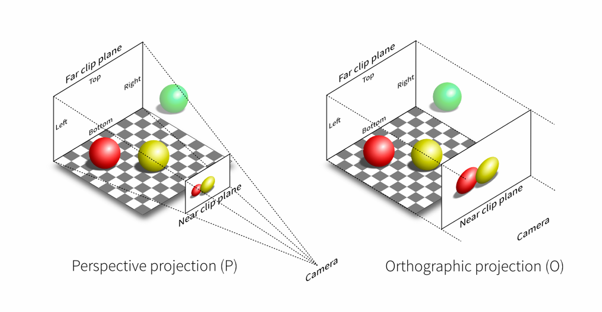

**正交投影（Orthographic Projection）：**

对于空间中的长方体$[l,r]\times[b,t]\times[f,n]$，我们要把它压到立方体$[-1,1]\times[-1,1]\times[-1,1]$中。

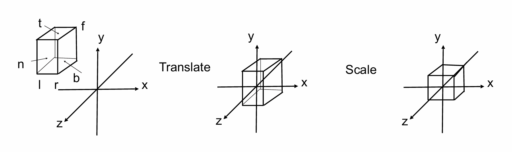

实际上就是一个先平移再缩放的过程：

$$M_{ortho}=\begin{pmatrix}
    \frac{2}{r-l} & 0 & 0 & 0\\\
    0 & \frac{2}{t-b} & 0 & 0\\\
    0 & 0 & \frac{2}{n-f} & 0\\\
    0 & 0 & 0 & 1
\end{pmatrix}\begin{pmatrix}
    1 & 0 & 0 & -\frac{r+l}{2}\\\
    0 & 1 & 0 & -\frac{t+b}{2}\\\
    0 & 0 & 1 & -\frac{n+f}{2}\\\
    0 & 0 & 0 & 1
\end{pmatrix}$$

**透视投影（Perspective Projection）：**

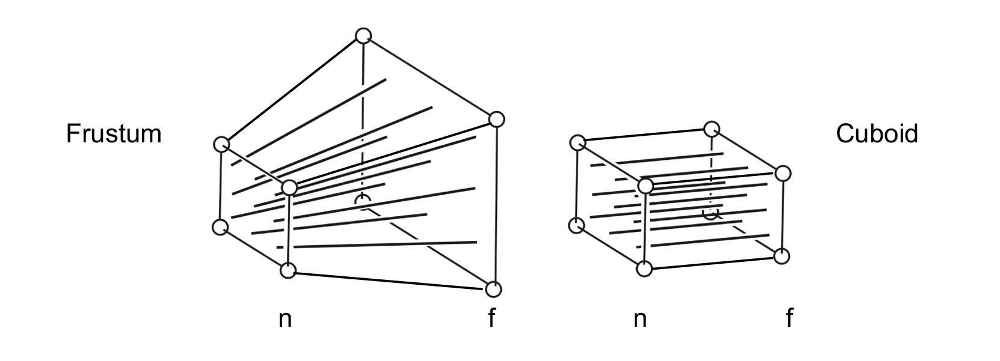

对于透视投影，我们的输入应该是如左图所示的一个视锥，由近平面和远平面组成。我们也希望能将其压到一个立方体中。

!!! Note
    视锥常常用以下定义描述范围：

    * **视野（Field-of-View）**：$\tan\frac{fovY}{2}=\frac{t}{|n|}$
    * **宽高比（Aspect Ratio）**：$aspect=\frac{r}{t}$

    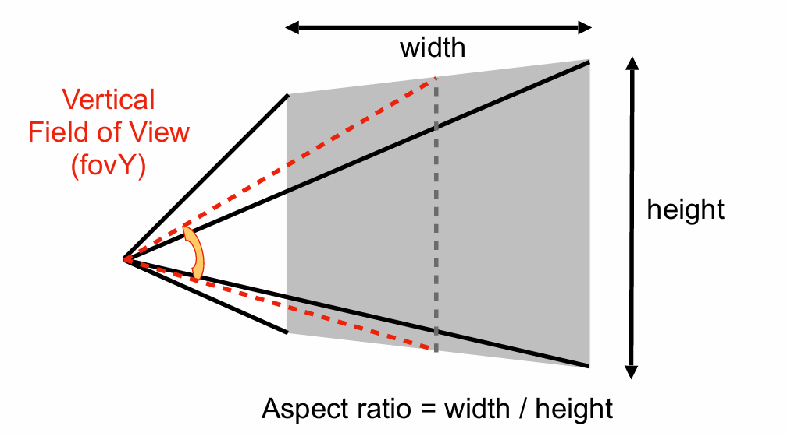

那么，我们可以分成两步。第一步是把棱台压到长方体中，第二步是进行正交投影。我们先来考虑较为复杂的第一步。

对于第一步的变换，我们的假设是：近平面上的点位置都不变，远平面上的点$z$值不变，$x$值和$y$值收缩。（注意，我们并没有规定近平面和远平面中间的点$z$值不变）

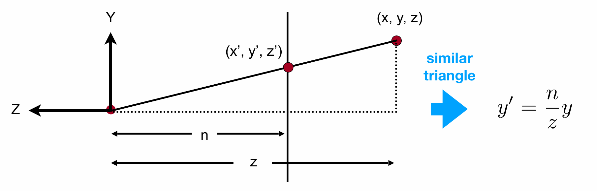

如上图所示，我们从侧面看过去。假设近平面上的点的$z$值是$n$，远平面上的点的$z$值是$f$。对于近平面和远平面之间的任意一点$(x,y,z)$，为了变换成立方体，其变换后的点$(x',y',z')$需要满足：

$$x'=\frac{n}{z}x$$

$$y'=\frac{n}{z}y$$

变换如下：

$$\begin{pmatrix}
x\\\
y\\\
z\\\
1
\end{pmatrix}\to\begin{pmatrix}
\frac{n}{z}x\\\
\frac{n}{z}y\\\
\text{unknown}\\\
1
\end{pmatrix}$$

这里变换后的$z'$值是未知的。我们想用一个矩阵的乘法来达到上述变换效果，但$\frac{1}{z}$无法表示。因此，我们可以在变换后的坐标上同乘$z$，这样并不会改变实际的含义：

$$\begin{pmatrix}
x\\\
y\\\
z\\\
1
\end{pmatrix}\to\begin{pmatrix}
\frac{n}{z}x\\\\
\frac{n}{z}y\\
\text{unknown}\\\
1
\end{pmatrix}==\begin{pmatrix}
nx\\\
ny\\\
\text{still unknown}\\\
z
\end{pmatrix}$$

也就是说，目前我们的目标是求出变换矩阵$M_{persp->ortho}$：

$$\begin{pmatrix}
nx\\\
ny\\\
\text{still unknown}\\\
z
\end{pmatrix}=M_{persp->ortho}\begin{pmatrix}
    x\\\
    y\\\
    z\\\
    1
\end{pmatrix}$$

依据上面的形式，我们目前可以给$M_{persp->ortho}$填上部分值：

$$M_{persp->ortho}=\begin{pmatrix}
n & 0 & 0 & 0\\\
0 & n & 0 & 0\\\
? & ? & ? & ?\\\
0 & 0 & 1 & 0
\end{pmatrix}$$

如何确定第三行？我们有两个条件可以使用：1.任意一个$(x,y,n,1)$（近平面上的点），经过变换后位置不变。 2.任意一个$(x,y,f,1)$（远平面上的点），经过变换后$z$值不变。

根据第一点，用$n$替换$z$，则有：

$$\begin{pmatrix}
nx\\\
ny\\\
n^2\\\
n
\end{pmatrix}=\begin{pmatrix}
n & 0 & 0 & 0\\\
0 & n & 0 & 0\\\
? & ? & ? & ?\\\
0 & 0 & 1 & 0
\end{pmatrix}
\begin{pmatrix}
    x\\\
    y\\\
    n\\\
    1
\end{pmatrix}$$

我们得知$M_{persp->ortho}$的第三行和$x$，$y$都没有关系，因此可以写成$\begin{pmatrix}
    0 & 0 & A & B
\end{pmatrix}$的形式，且有：

$$An+B=n^2$$

根据第二点，用$f$替换$z$，则有：

$$\begin{pmatrix}
fx\\\
fy\\\
f^2\\\
f
\end{pmatrix}=\begin{pmatrix}
n & 0 & 0 & 0\\\
0 & n & 0 & 0\\\
0 & 0 & A & B\\\
0 & 0 & 1 & 0
\end{pmatrix}
\begin{pmatrix}
    x\\\
    y\\\
    f\\\
    1
\end{pmatrix}$$

有：

$$Af+B=f^2$$

两式联立解得：

$$A=n+f$$

$$B=-nf$$

综上：

$$M_{persp->ortho}=\begin{pmatrix}
n & 0 & 0 & 0\\\
0 & n & 0 & 0\\\
0 & 0 & n+f & -nf\\\
0 & 0 & 1 & 0
\end{pmatrix}$$

然后第二步是正交投影，对应矩阵已经给出。