<span style="font-family: 'Times New Roman';">

# Lec2 Rasterization 光栅化

将一个空间的三角形转换为屏幕空间的像素

***

## Rasterization

**屏幕（Screen）：**

屏幕是一个二维数组，数组中的每一个元素是一个**像素（Pixel）**。

我们约定：屏幕左下角是原点，像素的坐标（index）写成$(x,y)$形式，其中$x$和$y$都是整数。例如，下图中蓝色像素的坐标是$(2,1)$。

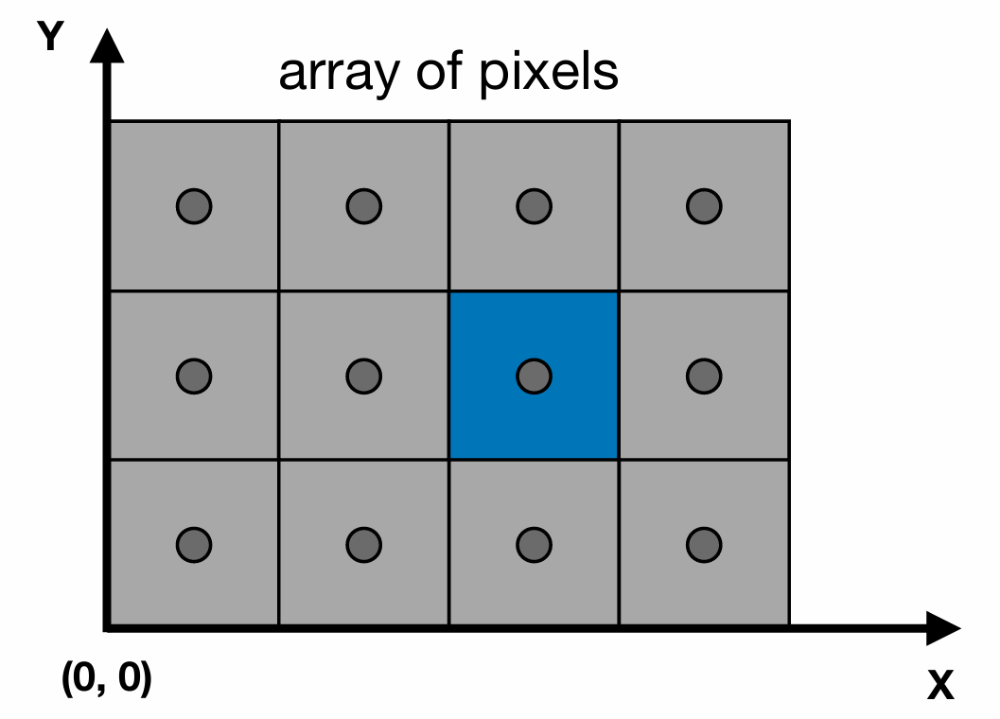

虽然用整数坐标来描述像素，但像素$(x,y)$的实际的中心点坐标是$(x+0.5,y+0.5)$。

屏幕覆盖的范围是从$(0,0)$到$(width,height)$。

我们暂时先不考虑原本标准立方体的$z$轴变换（$z$轴的信息作为深度信息，之后会用到）。因此，我们首先要做的空间变换是从$[-1,1]\times[-1,1]\times[-1,1]$到$[0,width]\times[0,height]\times[-1,1]$，这个变换称为**视口变换（Viewport Transformation）**：

$$M_{viewport}=\begin{pmatrix}
    \frac{width}{2} & 0 & 0 & \frac{width}{2} \\\
    0 & \frac{height}{2} & 0 & \frac{height}{2} \\\
    0 & 0 & 1 & 0 \\\
    0 & 0 & 0 & 1
\end{pmatrix}$$

**采样（Sampling）：**

广泛应用的几何形状是三角形，因此空间中的点云实际上就是由三角形网格构成。现在我们暂时抛弃了$z$轴的信息。那么我们要考虑的是：一个连续的二维空间的三角形，如何映射到离散的屏幕空间？

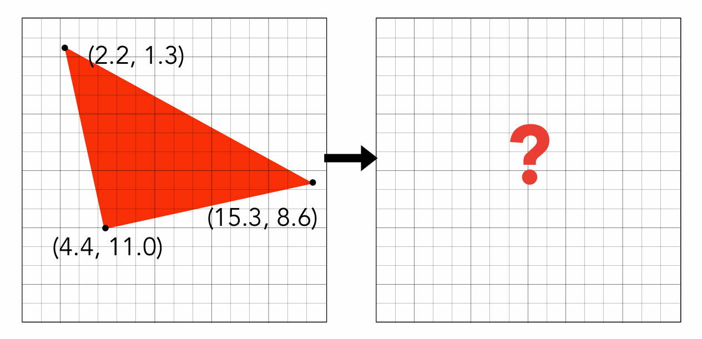

一个简单的方法就是采样，采样的本质是把函数离散化。

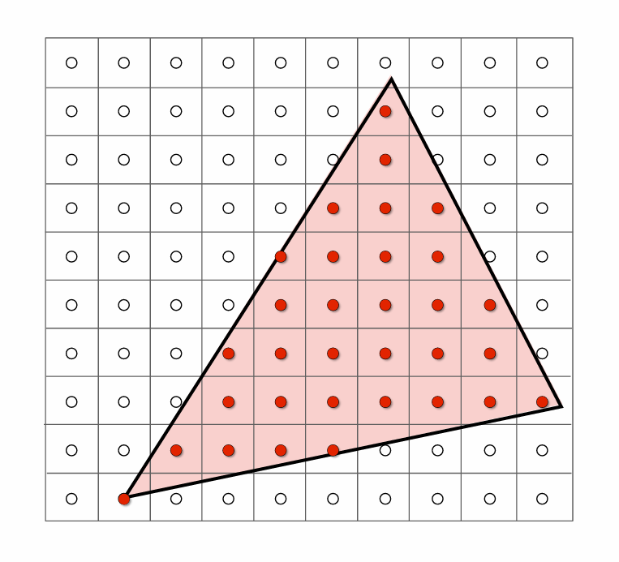

定义$inside$函数：

$$inside(t,x,y)=\begin{cases}
    1 & \text{if point (x,y) is inside the triangle t}\\\
    0 & \text{otherwise}
\end{cases}$$

因此，对于屏幕空间的每个像素，我们只需要判断该像素的中心点是否在三角形内（可以用叉乘实现）。

可以进一步优化：我们没有必要检查屏幕的所有像素，只需要检查三角形的**边界框（Bounding Box）** 内的像素。

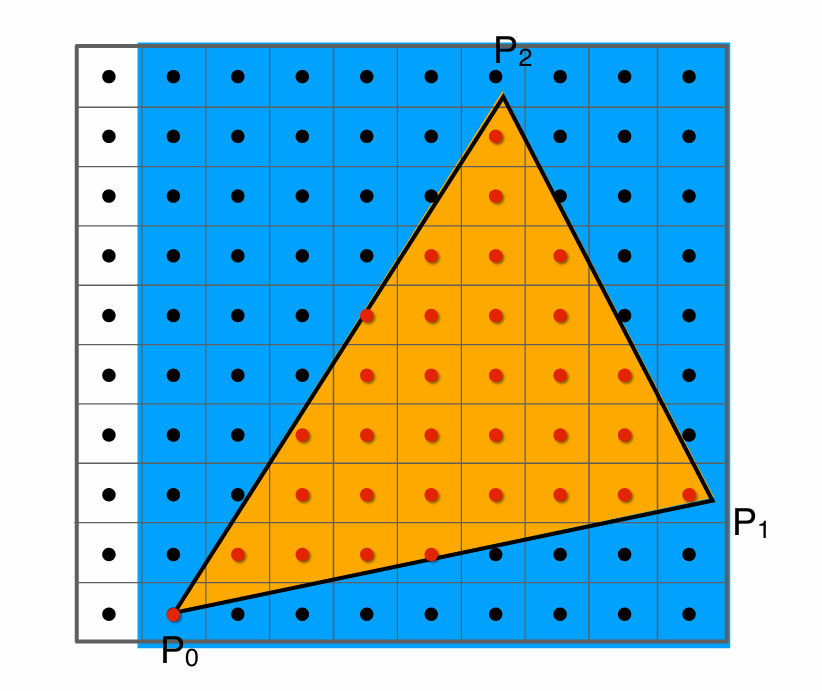

bounding box的求法也很简单，找到三角形三个顶点的$x$和$y$的最值即可。

***

## Antialiasing

**采样瑕疵（Sampling Artifacts）：**


第一个问题是锯齿（jaggies）。

第二个问题是摩尔纹（moire），例如去掉奇数行和奇数列，会出现一些奇怪的条纹。

第三个问题是车轮效应（wagon wheel effect），当车轮转动时，车轮的辐条会出现向前或者向后转动的错觉。

根本原因是：信号变换过快，但采样过慢，速度跟不上。

**傅里叶变换（Fourier Transform）：**

对于时域函数$f(x)$和频域函数$F(w)$，它们可以相互转换。

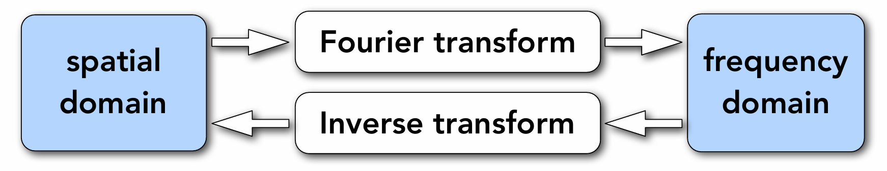

我们可以把图像看成是二维的时域函数，图像的频域函数也是一张图像，包含着原本图像的频率信息，描述了原本图像中变化的快慢。

**滤波（Filtering）：**

Filtering = Convolution = Averaging

滤波的主要作用就是去掉图像中的高频信息，保留低频信息。

频域函数的图像中，靠近中心的部分是低频信息，远离中心的部分是高频信息，越亮说明该频率成分越多。大多数图像的低频成分较多。

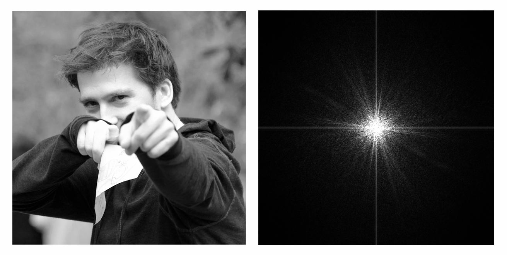

使用高通滤波（high-pass filter）可以保留图像的高频信息，去掉低频信息。如下图所示，高频信息保留了图像的边缘信息。

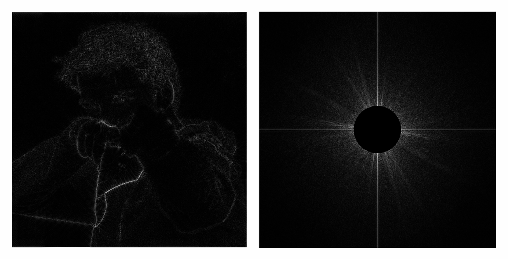

使用低通滤波（low-pass filter）可以保留图像的低频信息，去掉高频信息。如下图所示，低频信息保留了图像的整体信息，比较模糊。

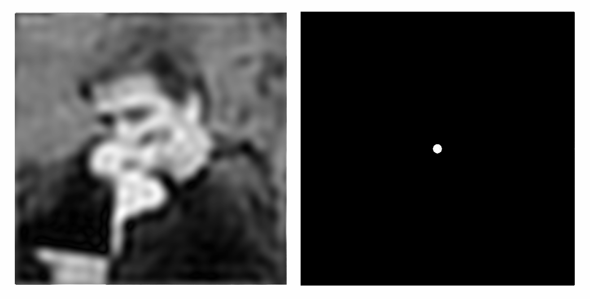

**Convolution Theorem:**

在时域上的卷积等价于在频域上的乘法，在频域上的卷积等价于在时域上的乘法。

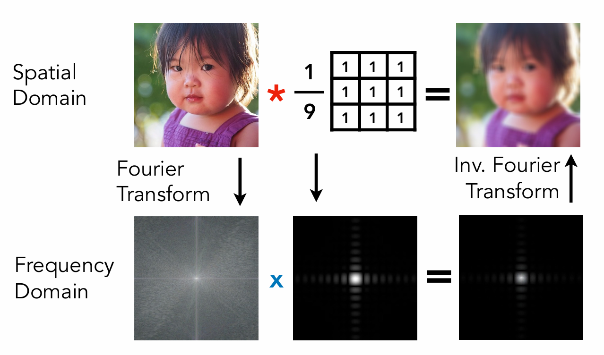

**Antialiasing by Computing Average Pixel Value:**

反走样的本质是对图像进行低通滤波，去掉图像中的高频信息，这样就不会出现采样速度跟不上信号变化速度的问题。

反映在光栅化中，就是先对三角形进行模糊处理，然后再进行采样。

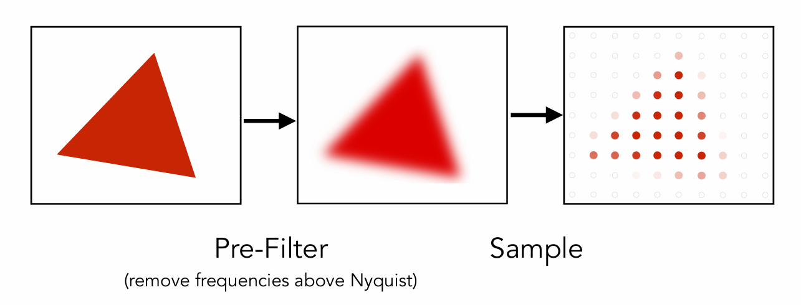

那么实际上是怎么变模糊的？

以单个像素为单位，这个像素被三角形覆盖得越多，则这个像素的颜色越接近三角形的颜色。

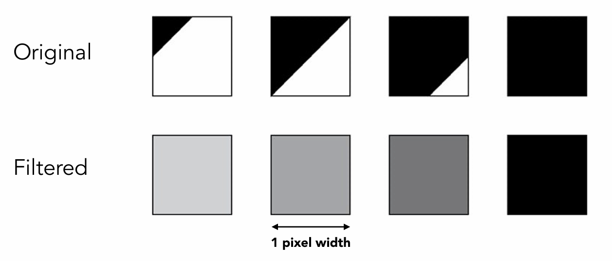

那么覆盖的区域怎么计算呢？

**Antialiasing by Supersampling (MSAA):**

我们给出一种近似方法，认为一个像素内部还有多个采样点，每个采样点还能判断是否在三角形内，采样点在三角形内的比例就可以估计为覆盖的比例。

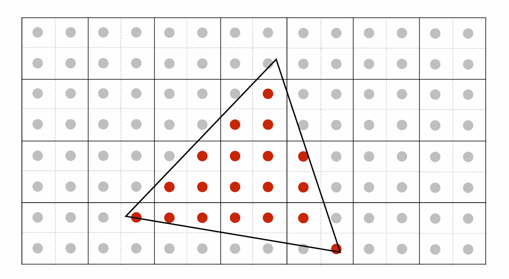

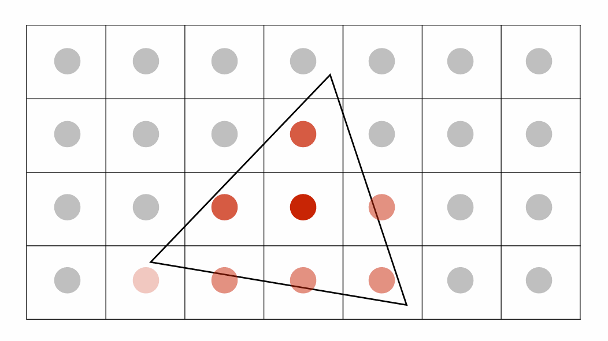

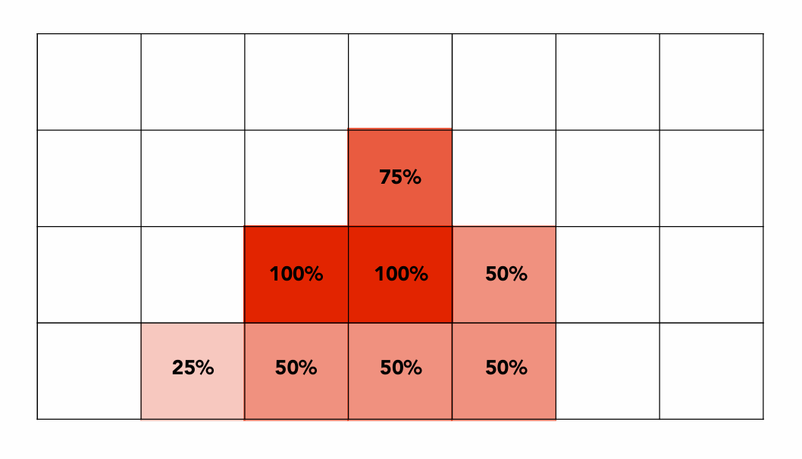

***

## Z-Buffering

目前我们解决的是将一个三角形光栅化的问题，但多个三角形的遮挡应该如何解决，每个像素的值依据的是哪个三角形？

**Painter's Algorithm:**

按照三角形的深度从远到近进行排序，然后依次光栅化，近的三角形会覆盖远的三角形。

问题：如何定义一个三角形的深度？有时候根本无法排序，例如下图：

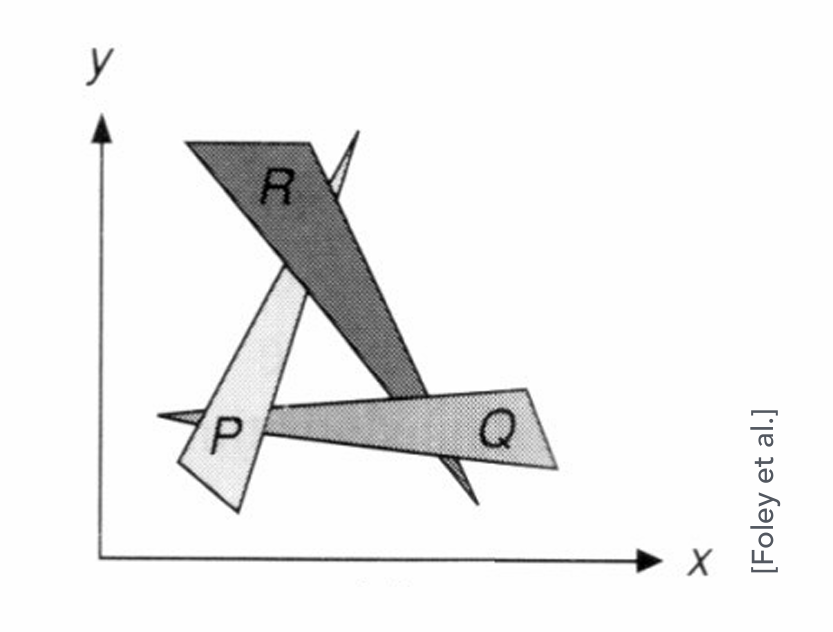

**Z-Buffering Algorithm:**

虽然空间中的三角形无法根据深度排序，但每个像素的深度是可以排序的。

**depth buffer (z-buffer)** 的图像体现的是每一个像素的深度，深度越浅，值越小，越黑。

!!! Note
    我们之前让相机朝向$z$轴负方向，但这里为了简单，让$z$值恒正。

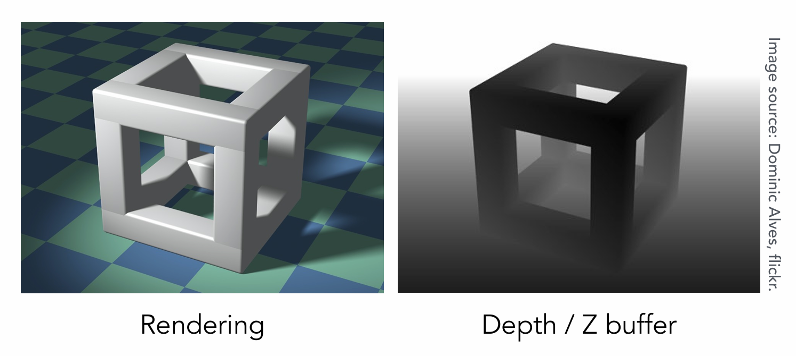

在光栅化确定每个像素对应哪个三角形的时候，具体操作为：

一开始设置所有像素的深度都是无穷大。然后，每个三角形都光栅化变成一组像素，如果这个像素的深度小于depth buffer中存的值，就更新frame buffer（存屏幕每个像素的颜色）和depth buffer（存屏幕每个像素的深度）。

```linenums="1"
for (each triangle T)
    for (each sample (x,y,z) in T)
        if (z < zbuffer[x,y])           // closest sample so far
            framebuffer[x,y] = rgb      // update color
            zbuffer[x,y] = z            // update depth
        else                            // do nothing, this sample is occluded
```

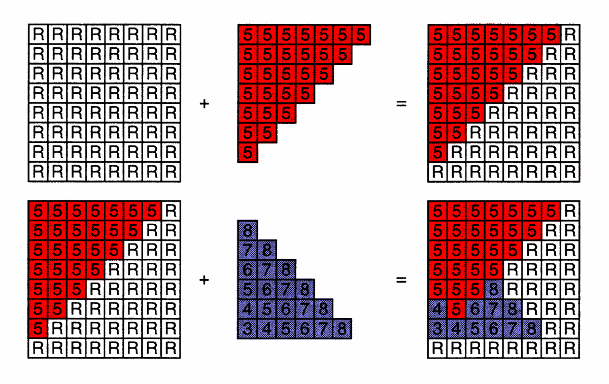