

# Lec3 Shading 着色

现在我们已经知道了屏幕上每个像素与三维空间的三角形的对应关系，那么每个像素的值（明暗&颜色）应该如何计算？

***

## Blinn-Phong Reflectance Model

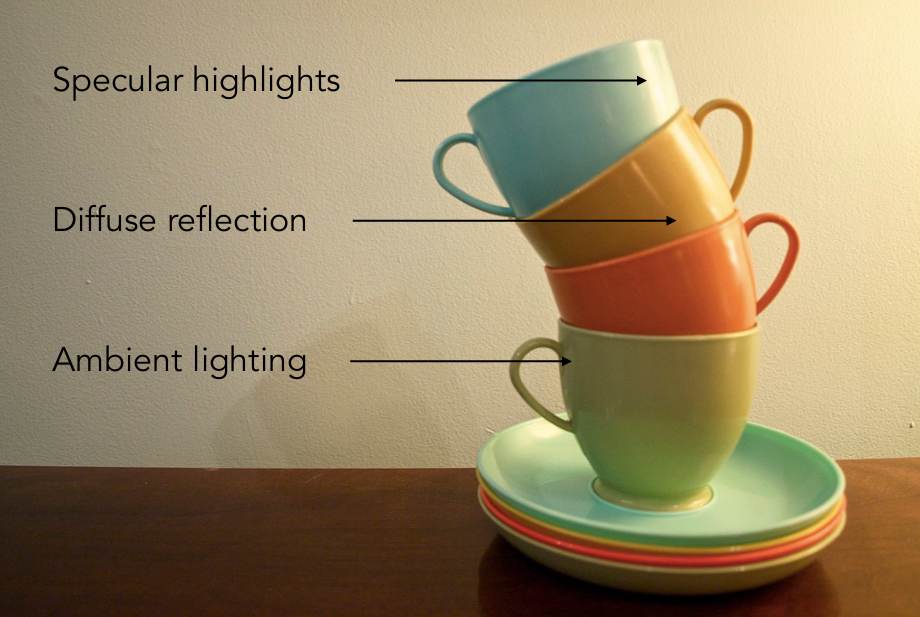

光照分为三部分：高光、漫反射、环境光。

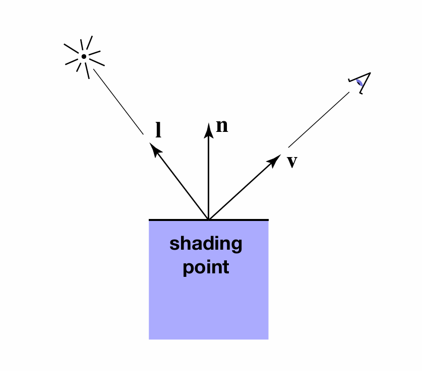

对于三维物体表面的一个shading point，在很小的一个范围内可近似看作一个平面，因此可以定义法线方向\vec{n}$。

从shading point指向光源的向量为光源方向$\vec{l}$，指向视点（相机）的向量为观察方向$\vec{v}$。

!!! Note
    由于我们只关注方向，不关注大小，因此三个向量都是单位向量。

### Diffuse Reflection

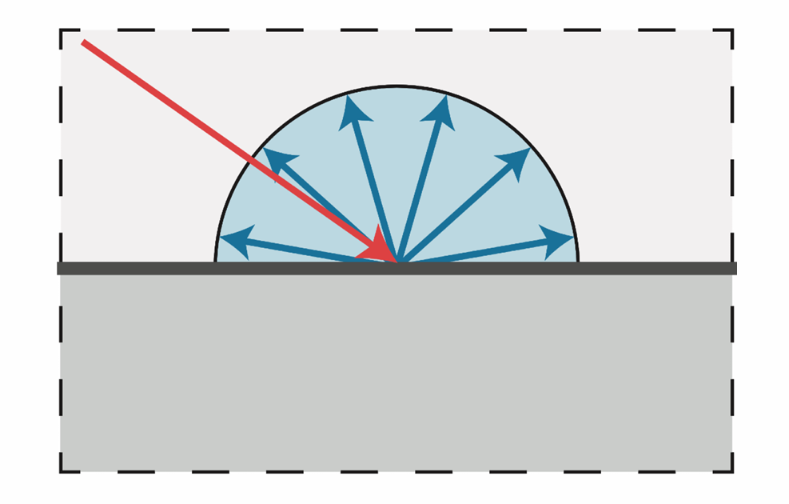

漫反射中，光线被均匀地反射到各个方向，意味着光的强弱与观察方向无关。

**Lambert's Cosine Law:**

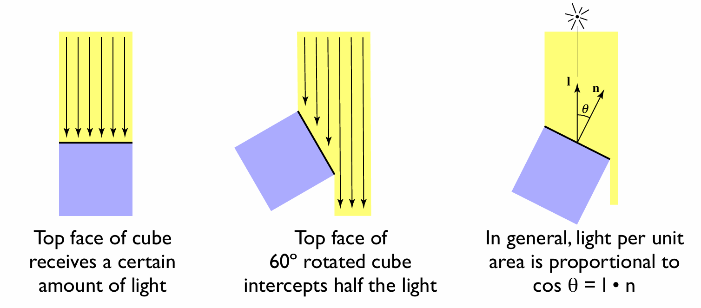

如果我们将光线离散化，我们会发现旋转不同角度的物体接收的光强不同。

因此，shading point接受的光强与$\vec{l}$和$\vec{n}$的夹角有关。

**Light Falloff:**

我们认为某一时刻的光的能量集中在一个球壳上，光传播的距离越远，球壳面积越大，单位面积上的能量就越少。

因此，shading point接受的光强还与光源到shading point的距离有关。设光源强度为$I$，光源到shading point的距离为$r$，则到达shading point的光强为$\frac{I}{r^2}$。

综上，漫反射的光强为：

$$L_d=k_d(\frac{I}{r^2})\max\{0,\vec{n}\cdot\vec{l}\}$$

其中，$k_d$是系数，为1则表示shading point完全不吸收能量（白色），为0则表示shading point完全吸收能量（黑色）。$k_d$也可以是三维向量，表示不同颜色的吸收系数，这样得到的$L_d$也是三维向量。$k_d$是由三维空间的点的材质决定的。

### Specular Highlight

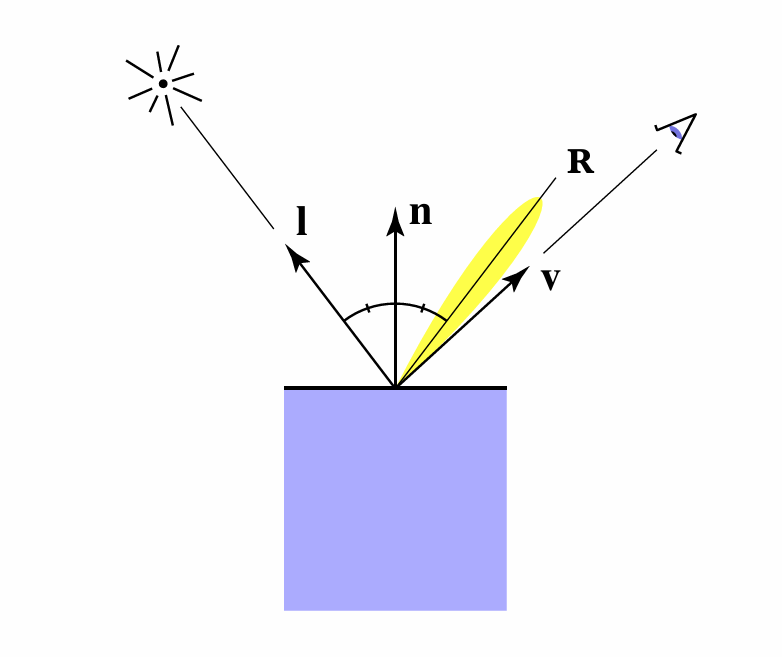

当观察方向与镜面反射方向接近时能看到高光。

由于镜面反射方向向量计算相对复杂，因此在Blinn-Phong模型中，我们引入半程向量的概念，也就是光线方向和观察方向的中间方向：

$$\vec{h}=\frac{\vec{l}+\vec{v}}{|\vec{l}+\vec{v}|}$$

因此，观察方向与镜面反射方向接近，等价于法线方向与半程向量方向接近。

高光的光强为：

$$L_s=k_s(\frac{I}{r^2})\max\{0,\vec{n}\cdot\vec{h}\}^p$$

!!! Note
    简单起见，这里不考虑Lambert's Cosine Law。

其中，$k_s$与$k_d$类似，但这里主要考虑白色，因为高光一般是白色的。

指数$p$是为了降低容忍度，只有方向足够刁钻才有足够高光，$p$通常取100~200。

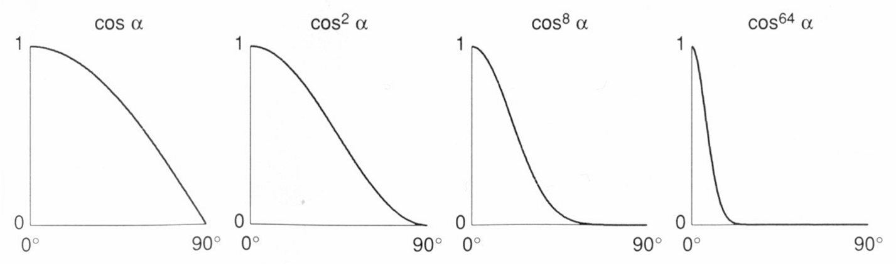

### Ambient Lighting

环境光来源于简介光照，例如光源的光经过多个物体的反射，使得即使完全背光的shading point也能接受到一些光。

在Blinn-Phong模型中，任何一处位置的环境光都是相同的，环境光被简化为一个常数：

$$L_a=k_aI_a$$

综上：物体表面任意一个shading point的光强为：

$$L=L_a+L_d+L_s=k_aI_a+k_d(\frac{I}{r^2})\max\{0,\vec{n}\cdot\vec{l}\}+k_s(\frac{I}{r^2})\max\{0,\vec{n}\cdot\vec{h}\}^p$$

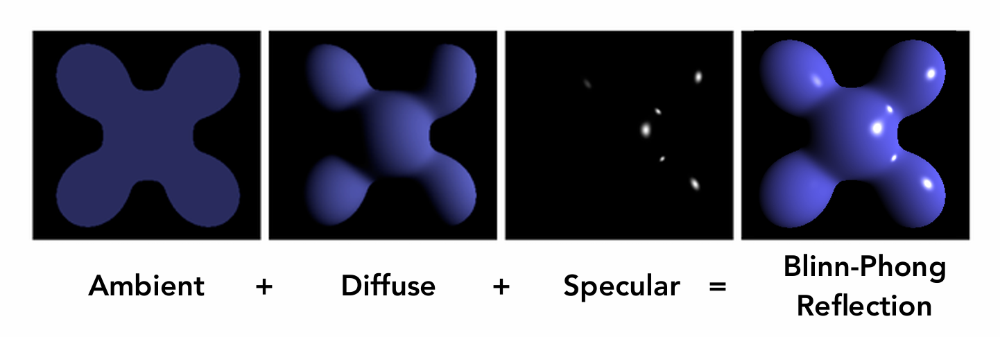

***

## Shading Frequency

我们刚刚一直在讨论物体的每个点的光强，但实际上我们如果要进行着色，还是要在面上进行。

**Flat Shading:**

通过MSAA得到一个像素中每个采样点对应哪个三角形  
↓   
三维空间中每个三角形带有法线和颜色等信息，可以在三维空间中计算出每个三角形的颜色  
↓  
像素的颜色由像素内采样点颜色平均得到

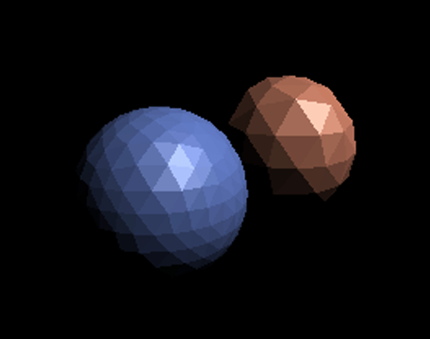

**Gouraud Shading:**

通过MSAA得到一个像素中每个采样点对应哪个三角形，通过重心坐标得到每个采样点在三角形中的位置  
↓  
三维空间中每个三角形的顶点带有法线和颜色等信息，可以在三维空间中计算出每个顶点的颜色  
↓  
每个采样点的颜色根据重心坐标在三维空间中插值得到  
↓  
像素的颜色由像素内采样点颜色平均得到  

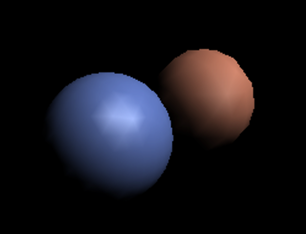

**Phong Shading:**

通过MSAA得到一个像素中每个采样点对应哪个三角形，通过重心坐标得到每个采样点在三角形中的位置  
↓  
三维空间中每个三角形的顶点带有法线和颜色等信息  
↓  
每个采样点根据重心坐标插值三角形顶点的法线、材质属性等信息  
↓  
每个采样点使用插值后的法线和材质信息，在三维空间中重新计算光照，得到自己的颜色  
↓  
像素的颜色由像素内所有采样点的颜色平均得到  

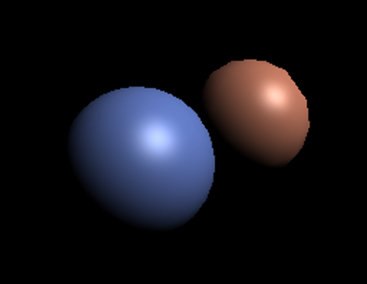

!!! Note
    如何计算顶点的法线？

    任何一个顶点都和一系列三角形连接，顶点的法线可以定义为这些三角形法线的（加权）平均。

***

## Texture Mapping

我们已经知道每个顶点或三角形的光照信息如何计算，但是每个顶点或三角形的颜色信息从哪里来？

**Surface are 2D:**

任何一个三维物体的表面都是二维的，纹理就是一张二维的图，用来蒙在物体表面。

我们在纹理空间定义$uv$坐标系，三维空间中的三角形的每一个顶点在纹理空间都有对应的$uv$坐标（假设已经给定）。

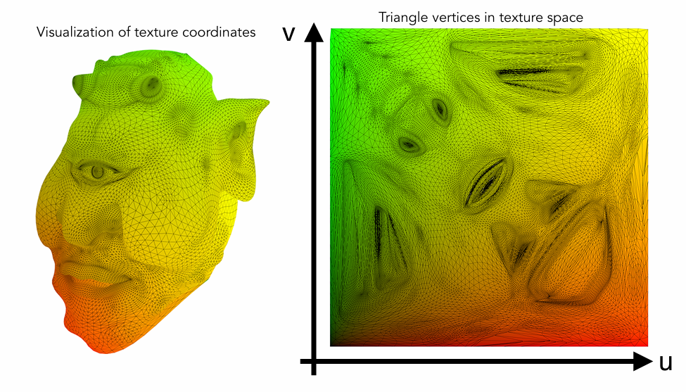

但是，三角形内部的点对应的$uv$坐标如何计算呢？

**Barycentric Coordinates 重心坐标：**

三角形顶点有很多不同的属性可以进行插值，例如前面提到过的颜色、法线、映射到纹理空间的$uv$坐标等。

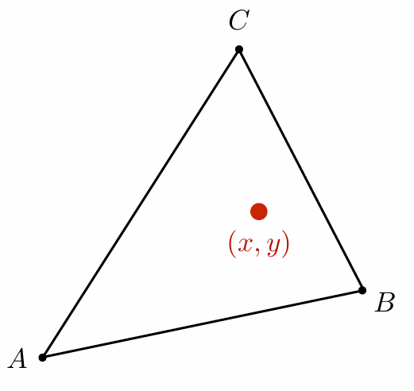

在三角形所在平面内的任意一点$(x,y)$，都可以表示成：

$$(x,y)=\alpha A+\beta B+\gamma C$$

其中，$A,B,C$分别是三角形的三个顶点坐标，$\alpha,\beta,\gamma$是重心坐标，满足$\alpha+\beta+\gamma=1$。

!!! Note
    如果点在三角形内部，$\alpha, \beta, \gamma$都大于0。

$(\alpha, \beta, \gamma)$就是点$(x,y)$在三角形$ABC$中的重心坐标。

重心坐标的求法如下（面积法）：

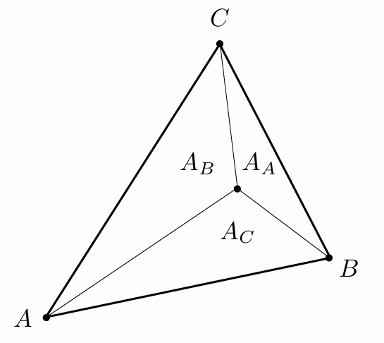

$$\alpha=\frac{A_A}{A_A+A_B+A_C}$$

$$\beta=\frac{A_B}{A_A+A_B+A_C}$$

$$\gamma=\frac{A_C}{A_A+A_B+A_C}$$

!!! Note
    注意：在投影中，重心坐标可能改变。因此，插值三维属性就要在三维空间中计算重心坐标，插值二维属性就要在二维空间中计算重心坐标。与这一点有关的就是深度，深度要在三维空间中插值。

**双线性插值（Bilinear Interpolation）：**

双线性插值解决的是纹理空间太小的问题。

对于三维空间上的点，每一个都有对应的$uv$坐标，但要注意的是，$uv$坐标是连续的，而纹理图是离散的。因此，纹理图实际是由离散的像素（texel）组成的，而不同的$uv$坐标如果接近的话，可能对应同一个texel。

因此，当纹理空间太小的时候，大量临近的点对应到同一个texel，导致最终呈现在屏幕上的图像模糊。

因此，对于一个$uv$坐标，我们可以找到它周围的四个texel，然后根据距离进行插值，得到一个更精确的颜色。

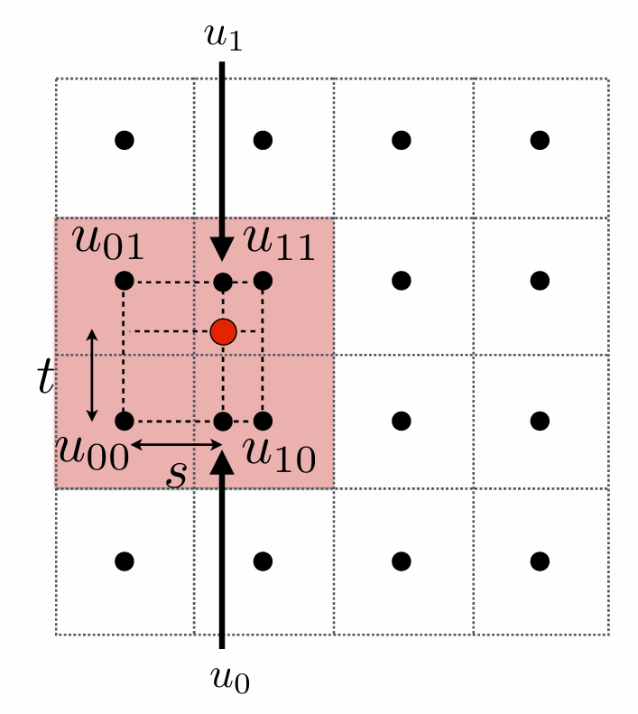

先进行水平方向上的一维线性插值：

$$u_0=lerp(s,u_{00},u_{10})$$

$$u_1=lerp(s,u_{01},u_{11})$$

再进行竖直方向上的一维线性插值：

$$f(x,y)=lerp(t,u_0,u_1)$$

也就是说，这个时候十分接近但不同的$uv$坐标获得周围texel的颜色权重不同，最终得到的颜色也不同。

**Mipmap:**

Mipmap解决的是纹理空间太大的问题。

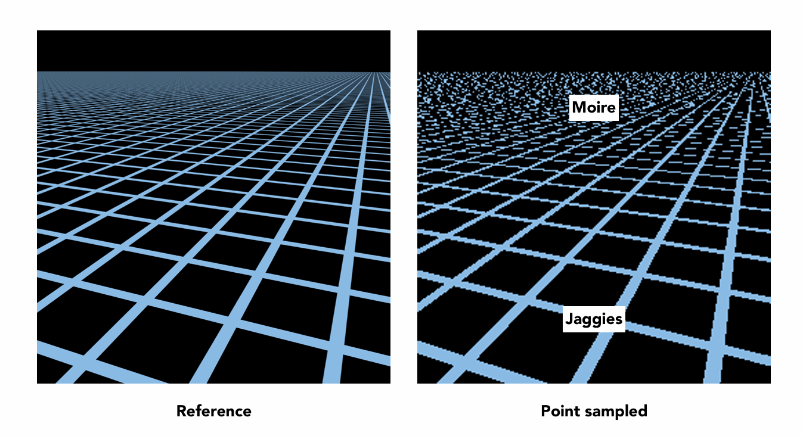

三维空间的点只要稍微移动一点，$uv$坐标就会有很大的变化。也就是说，一个像素会对应很大一块纹理区域。

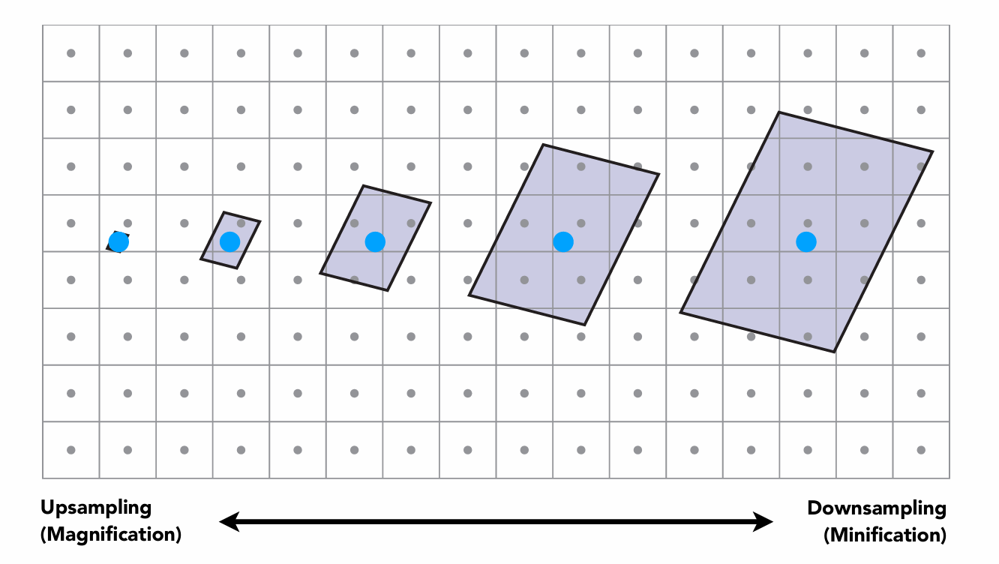

Mipmap首先对纹理图进行多次降采样，得到一系列不同分辨率的纹理图：

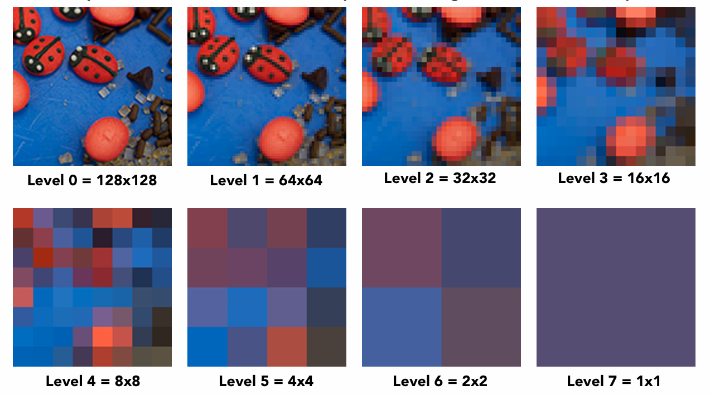

那么，每个像素需要查询纹理图时，我们需要根据像素对应的纹理区域大小，选择合适分辨率的纹理图进行查询。

例如我想知道左下角的像素对应的纹理面积有多大，我可以将其周围三个像素的$uv$坐标也找出来。

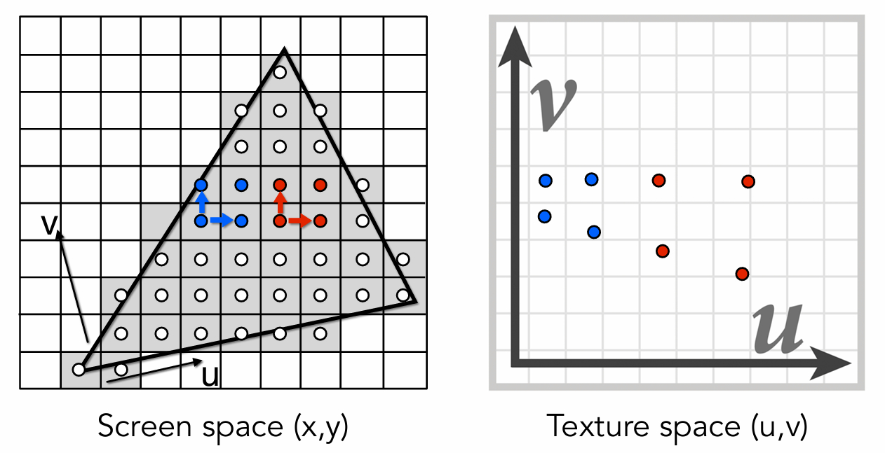

然后，我们就可以在相邻两个像素的$uv$坐标差值中，找到最大的差值，作为$L$，然后用一个边长为$L$的正方形去近似这个纹理面积：

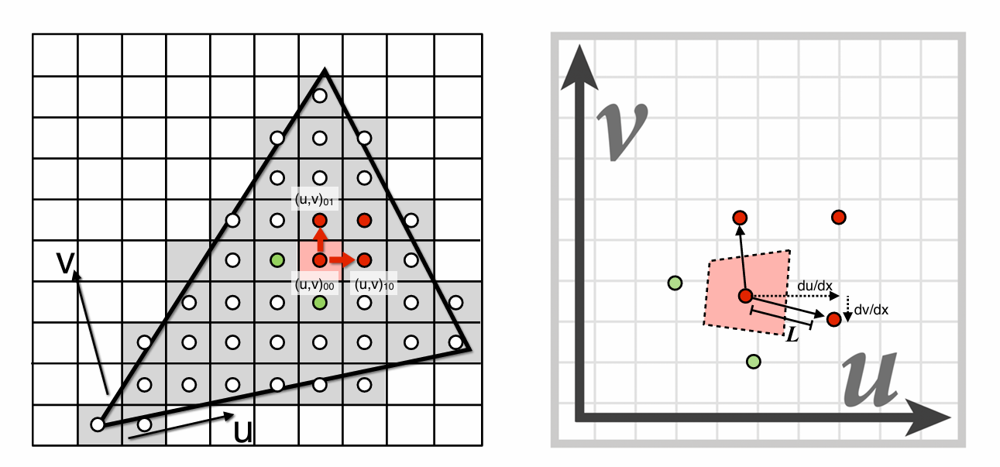

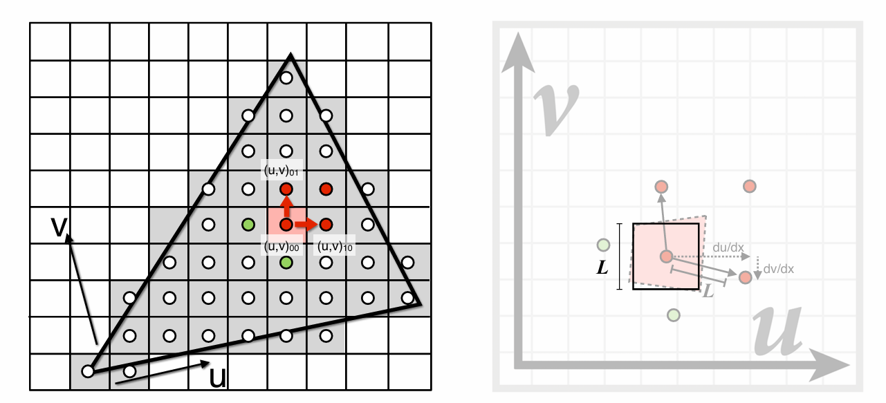

$$L=\max\{\sqrt{(\frac{du}{dx})^2+(\frac{dv}{dx})^2},\sqrt{(\frac{du}{dy})^2+(\frac{dv}{dy})^2}\}$$

选择的Level为：

$$D=\log_2L$$

由于Level要为整数，因此可以考虑就近取整或者在mipmap两层之间插值。

***

## Shadow Mapping

我们之前研究的着色是一种局部的操作，完全不需要考虑shading point以外的其他物体。

但阴影是全局的操作，取决于光源和场景中所有物体。

key idea：点不在阴影里意味着，相机可以看到这个点，光源也可以看到这个点。

经典的shadow mapping只能处理点光源，得到的是硬阴影（非1即0）。

**Pass1: Render from Light**

第一步：从光源看向场景，记录每一条光线（每一个位置）的深度信息（最远看到哪里）。

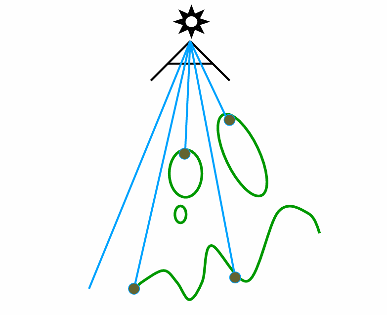

**Pass2: Render from Camera**

第二步：从相机看向场景，看到的点投影回光源，来看应该出现在深度图的哪个像素上，如果深度一致，说明光源可以看到这个点，不在阴影里。

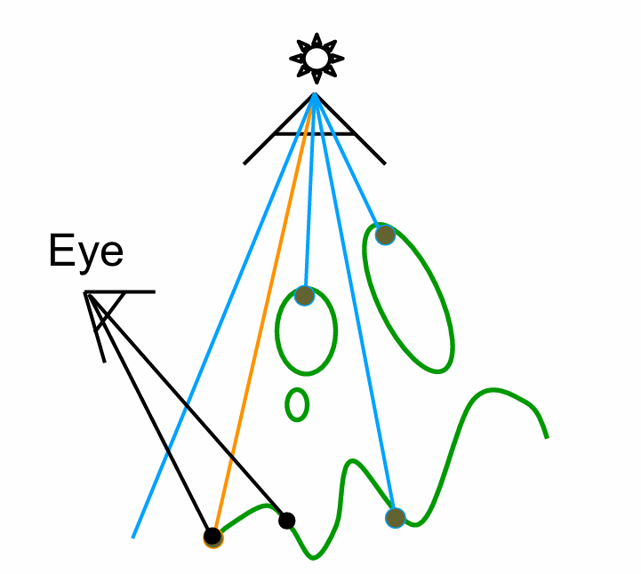

但如下图所示，实际深度和之前记录的深度不一致，说明光源看不到这个点，在阴影里。

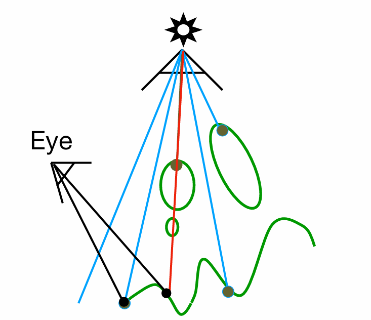