

# Lec4 Geometry 几何

***

## Representations of Geometry

### Implicit Geometry

隐式几何不会告诉你每个点的具体位置，而是告诉你每个点需要满足的条件。

例如：球体的隐式表示为 $x^2 + y^2 + z^2 = r^2$。

更泛化地说，隐式几何可以表示为一个函数 $f(x, y, z) = 0$。

* 好处：对于一个点，很容易判断其在物体的内部、外部还是表面。
* 坏处：很难直观看出物体的形状。例如：$f(x,y,z)=(2-\sqrt{x^2+y^2})^2+x^2-1$很难看出实际是甜甜圈的形状。

**Constructive Solid Geometry (CSG):**

利用基本几何的布尔运算重新定义新的复杂几何。

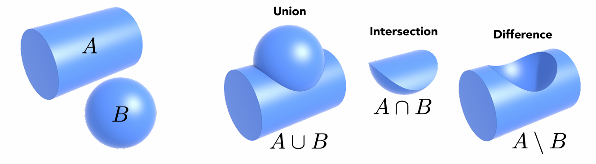

**距离函数（Distance Function）：**

对于任意一个几何，我们可以定义一个函数，输入一个点，输出这个点到几何表面的最短距离。点在几何外部则为正，点在几何内部则为负。

距离函数对于混合几何形状非常有用。如下图所示混合移动边界：如果直接在图像上求混合求平均，无法表示出中间的过渡；但如果用距离函数混合求平均，就可以表示出中间的过渡。

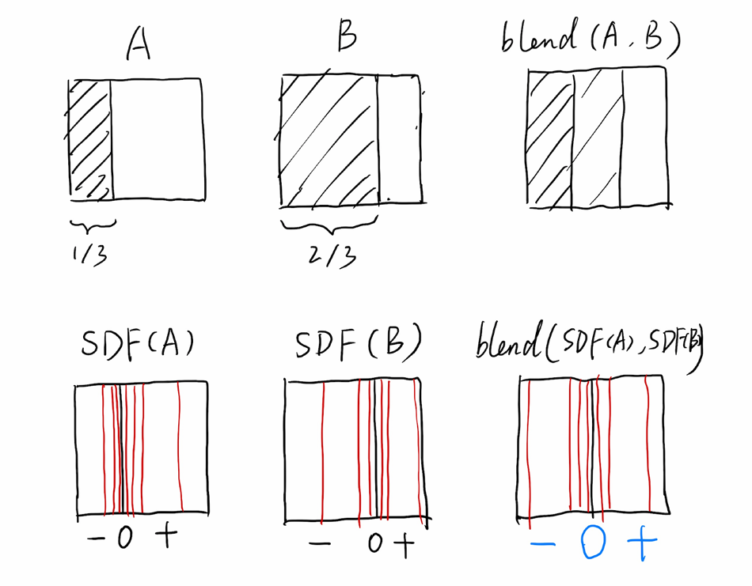

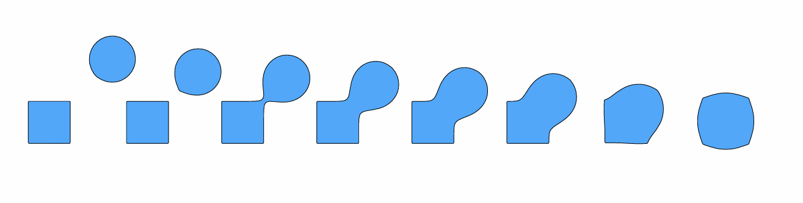

只要有距离函数，把所有值为0的点找出来就可以恢复表面。

**水平集（Level Set Methods）：**

与距离函数类似，只是以格子为单位存储距离，然后通过插值计算出距离函数。

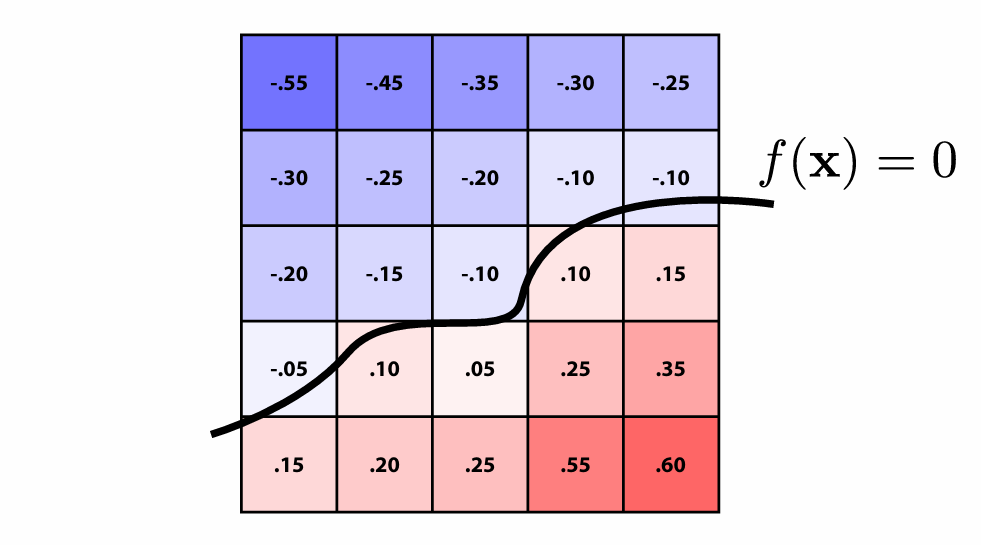

### Explicit Geometry

显式几何直接告诉你每个点的具体位置，或者通过参数映射定义表面。

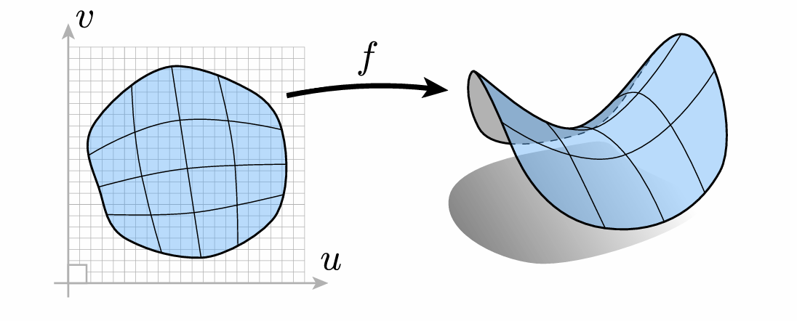

例如：$f(u,v)=((2+\cos u)\cos v,(2+\cos u)\sin v,\sin u)$ 同样是甜甜圈。

显式几何的好处和坏处与隐式几何相反。

**点云（Point Cloud）：**

最简单的表示形式：一组点的集合。

点云理论上可以表示任意形状的物体，只要点足够多。

点云经常会被转换成多边形面。

**多边形网格（Polygon Mesh）：**

使用最为广泛的表示形式。

***

## Curves

### Bézier Curve

用一系列控制点来定义曲线。

**De Casteljau Algorithm:**

先考虑三个控制点$b_0$，$b_1$，$b_2$的情况：

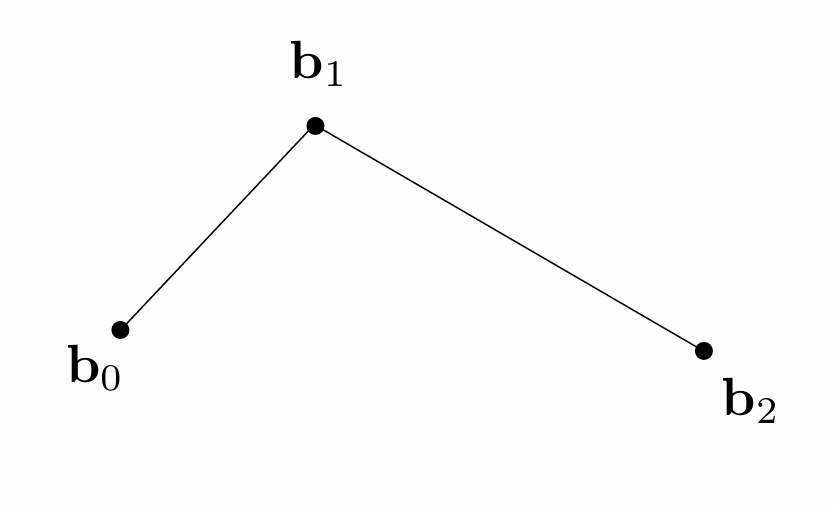

假设起点在$b_0$，时间为$0$；终点在$b_2$，时间为$1$。我们的目标是看任意一个时间$t$，曲线在什么位置。

对于给定的时间$t$，在$b_0$和$b_1$之间做线性插值，得到$b_0^1$；在$b_1$和$b_2$之间做线性插值，得到$b_1^1$：

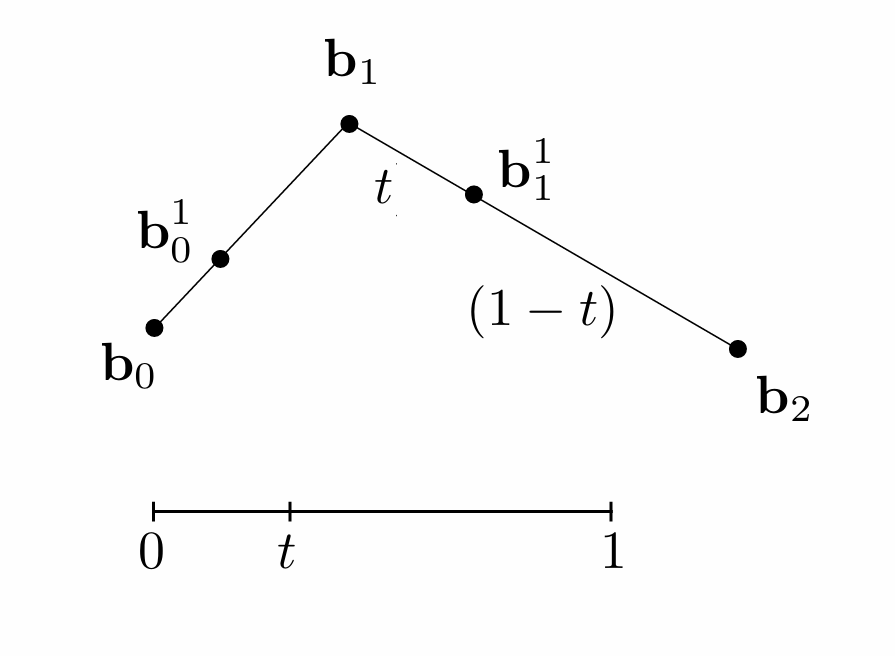

然后继续迭代，在$b_0^1$和$b_1^1$之间做线性插值，得到$b_0^2$。由于无法继续迭代下去了，因此这个点就是曲线在时间$t$的位置：

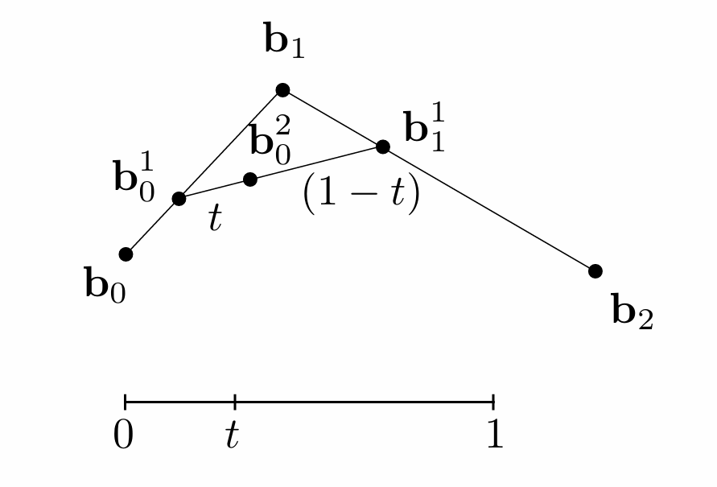

遍历所有$t\in[0,1]$，就可以得到整条曲线：

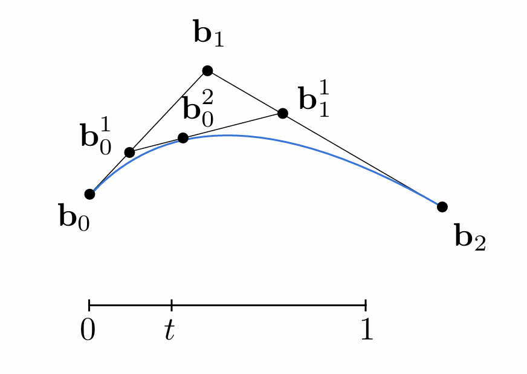

**Evaluating Bézier Curves Algebraic Formula:**

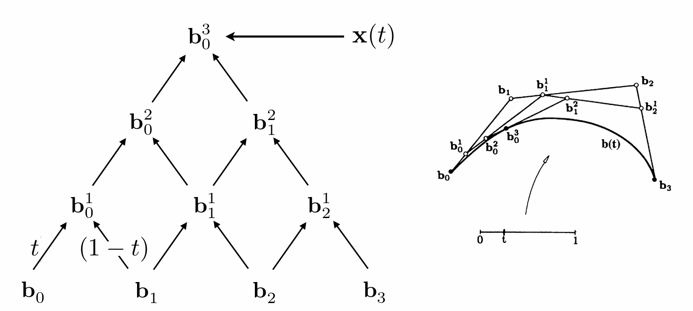

$b_0^1(t)=(1-t)b_0+t b_1$

$b_1^1(t)=(1-t)b_1+t b_2$

$b_0^2(t)=(1-t)b_0^1+t b_1^1=(1-t)^2b_0+2t(1-t)b_1+t^2b_2$

这很明显类似于二项式展开。因此，给定$n+1$个控制点$b_0,b_1,...,b_n$：

$$b^n(t)=b_0^n(t)=\sum\limits_{j=0}^nb_jB_j^n(t)$$

其中，$B_j^n(t)=\binom{n}{j}t^j(1-t)^{n-j}$为Bernstein polynomials。

对三维空间坐标依然适用。

**Properties of Bézier Curves:**

* 贝塞尔曲线的起点和终点分别是第一个和最后一个控制点。
* 贝塞尔曲线在起点处的切线方向与第一个控制点和第二个控制点的连线方向相同；在终点处的切线方向与最后一个控制点和倒数第二个控制点的连线方向相同。
* 先对控制点做仿射变换，再画贝塞尔曲线，和先画贝塞尔曲线，再对曲线做仿射变换，结果是一样的。（但投影变换不然）
* 贝塞尔曲线一定在控制点形成的凸包（convex hull）内。

**Piecewise Bézier Curves:**

当曲线比较复杂时，可以用多段贝塞尔曲线来表示。一般每四个控制点定义一段曲线。

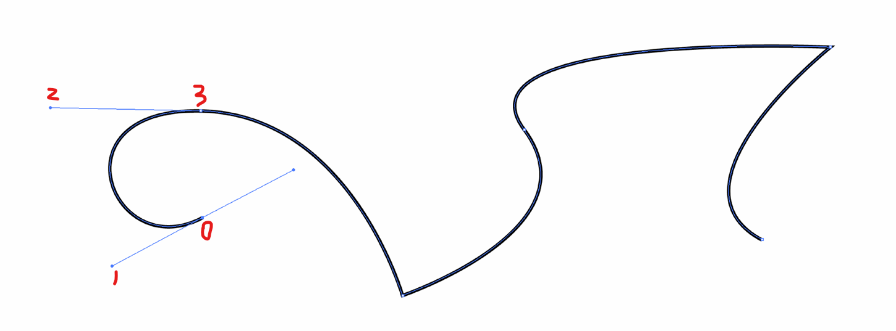

如何保证多段贝塞尔曲线的连接处光滑？

* C0连续：连接处的两个控制点重合即可：$a_n=b_0$
* C1连续：连接处的两个控制点重合，并且连接处的切线长度和方向均相同：$a_n=b_0=\frac{1}{2}(a_{n-1}+b_1)$

逐段贝塞尔曲线一般要求C1连续：

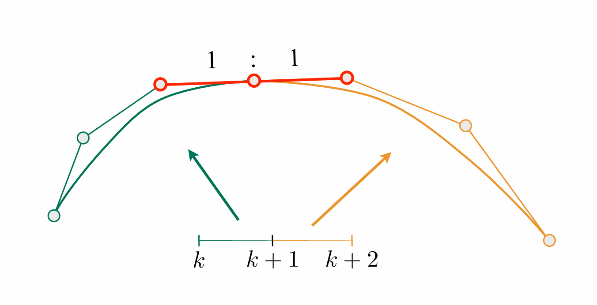

### Bézier Surface

使用双线性插值的思想，在两个方向上分别应用贝塞尔曲线。

例如，考虑4×4的控制点，有4行，每一行的4个控制点定义一条贝塞尔曲线：

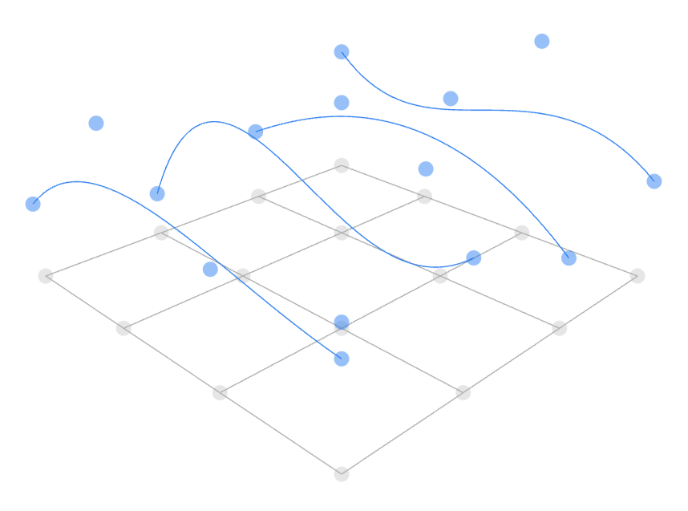

然后在每个$t$处，四条曲线各自有一个对应的点，对这4个点再做一条贝塞尔曲线：

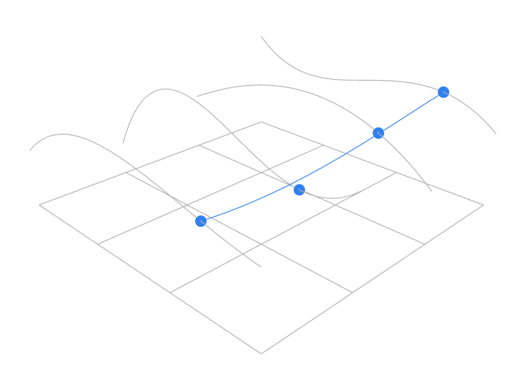

***

## Mesh Operations

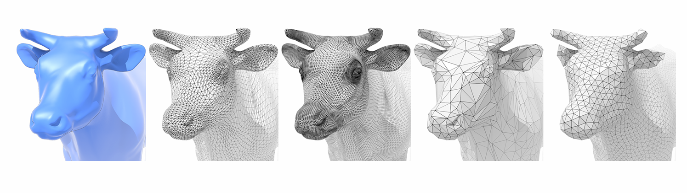

### Mesh Subdivision

**Loop Subdivision:**

第一步：增加三角形数量。对于一个三角形，三条边各加一个点，连起来形成四个小三角形。

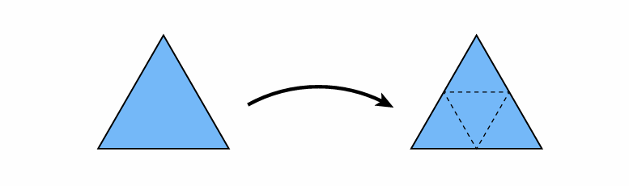

第二步：调整顶点位置。顶点分为新的顶点和旧的顶点，各自有不同的调整方式。

对于新的顶点，点在边上，这条边被两个大三角形共享，顶点的位置更新为如下四个点的加权平均：

$$\frac{3}{8}(A+B)+\frac{1}{8}(C+D)$$

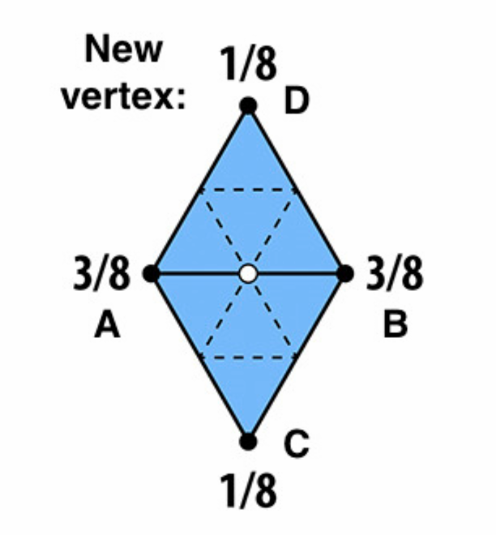

对于旧的顶点，假设它有$n$个邻居（度），它的位置权重一部分来自于它自己，一部分来自于它的邻居。

引入辅助参数$u$。若$n=3$，则$u=\frac{3}{16}$，否则$u=\frac{3}{8n}$。

顶点的位置为：

$$(1-n\*u)\*\text{original\_position}+u\*\text{neighbor\_position\_sum}$$

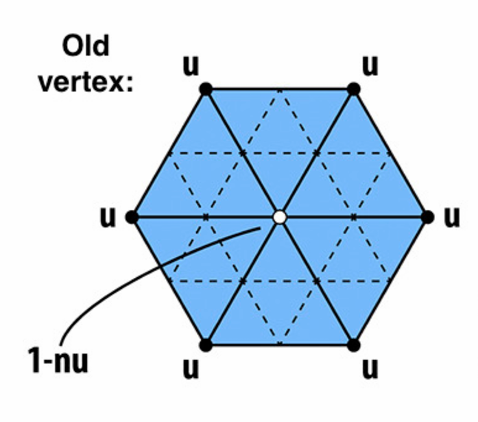

**Catmull-Clark Subdivision:**

之前的方法只适用于三角形网格的细分，而Catmull-Clark细分适用于三角形和四边形网格混合的细分。

定义奇异点（extraordinary point）：度不为4的点。

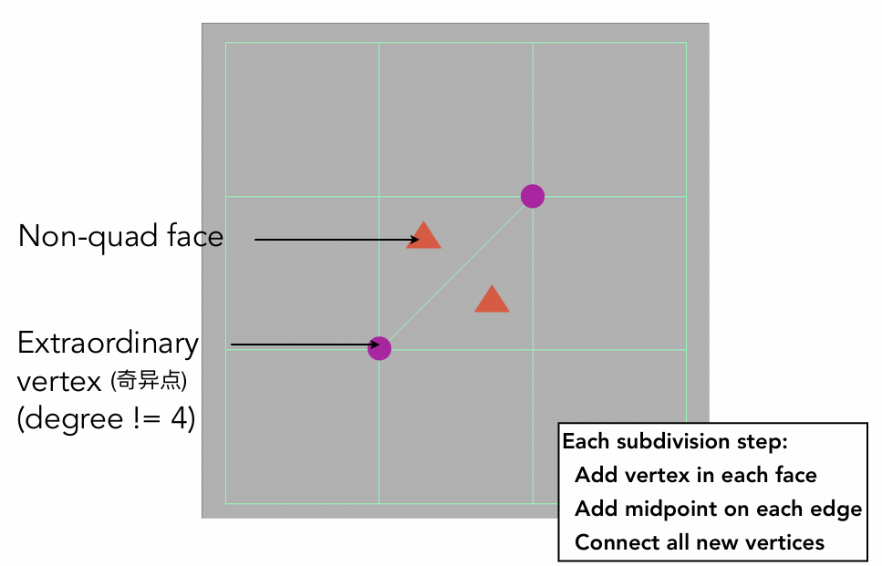

每条边和每个面都取中点，面的中点连到周围边的中点。

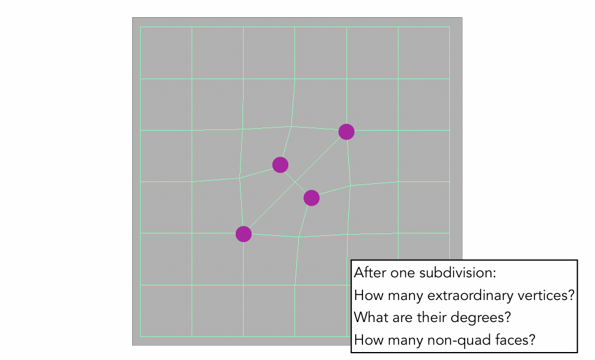

经过一次细分之后：

* 奇异点：数量为原本的奇异点数（度数不变）+原本的非四边形面的数。
* 非四边形面：没了。

也就是说一次细分之后，所有非四边形面都变成一个奇异点，之后奇异点数不再改变。

位置更新的公式过于复杂，不在这里赘述。

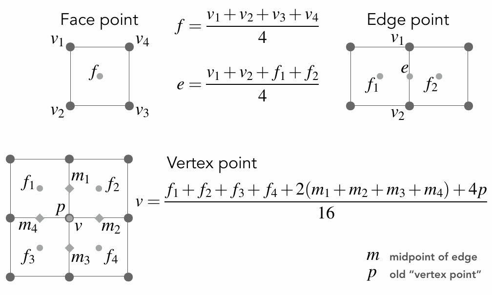

### Mesh Simplification

**Edge Collapsing:**

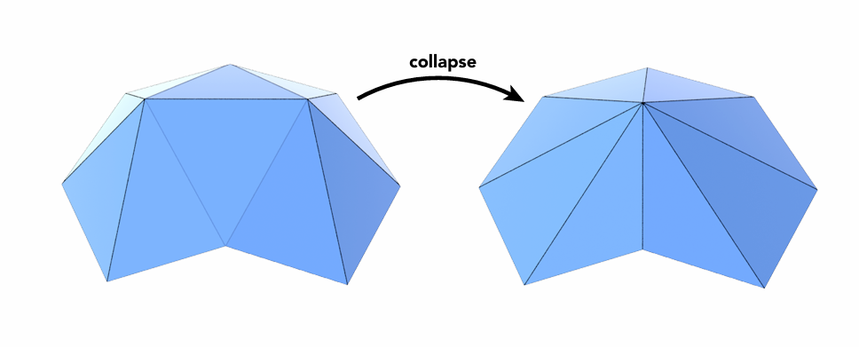

**二次误差度量（Quadric Error Metrics）：**

用来决定坍缩哪条边。

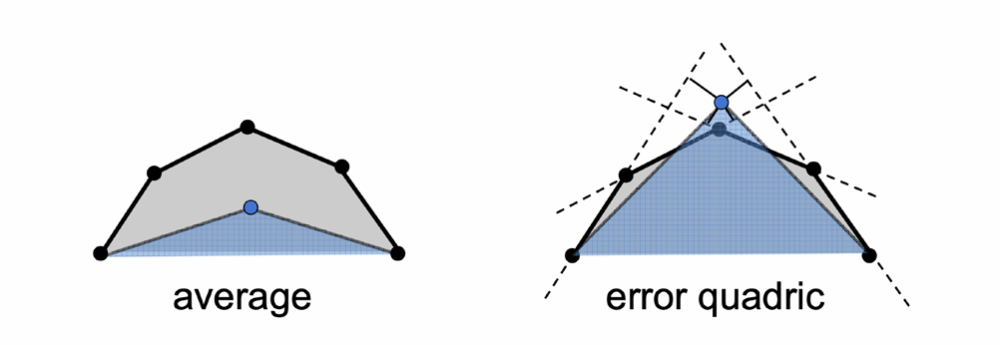

对于每一条边，都可以计算中点的二次误差，即到相关联的面的距离平方和。

这样子，每一条边（中点）的二次误差都可以计算出来，选择二次误差最小的边进行坍缩。

但问题是：坍缩一次之后，有的边会发生变化，因此需要重新计算相关边的二次误差并排序。

因此，非常符合要求的数据结构是优先队列（堆）。