

# Lec5 Ray Tracing 光线追踪

光栅化和光线追踪是两种不同的成像方法。光栅化虽然速度很快，但质量不高；而光线追踪与之相反。

***

## Whitted-Style Ray Tracing

### Whitted-Style Ray Tracing

**Ray Casting:**

假设：相机是点，光源也是点。

从相机开始，假设面前有像素组成的屏幕，相机先和每个像素连线，一个像素得到一条光线，延伸出去，和场景中最近的物体相交（已经解决了深度测试的问题），说明看到了这个物体。

然后物体上的这个点再和光源连线，看看能不能连通，如果能连通，说明这个点被光源照亮了，形成有效光路；否则就是阴影点。

这个时候，观察方向，光源方向和法线方向都有了，就可以着色了。

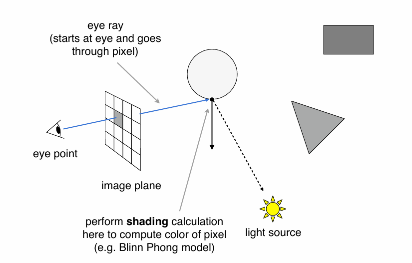

**Recursive Ray Tracing:**

上述只是光线弹射一次的情况，Whitted-Style Ray Tracing允许光线递归地多次投射。

还是和刚刚的例子一样，但我们假设球体是玻璃材质，那么一部分光线会被反射，到达三角形；另一部分光线会折射，穿过球体，到达长方形：

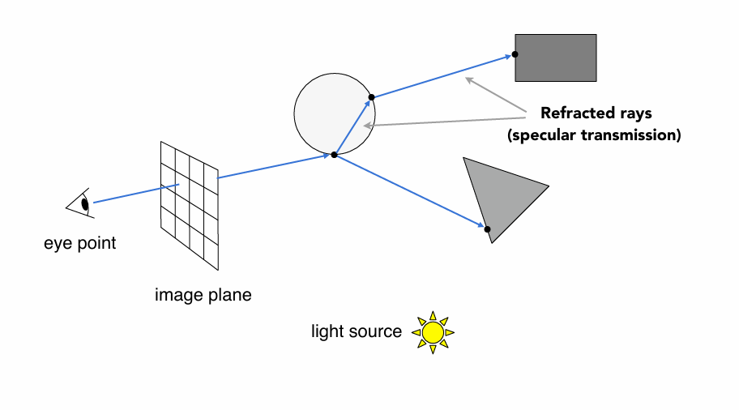

着色也会发生变化。每个弹射的点都要和光源连线，因为光源会打到每个点上，从而汇聚光线：

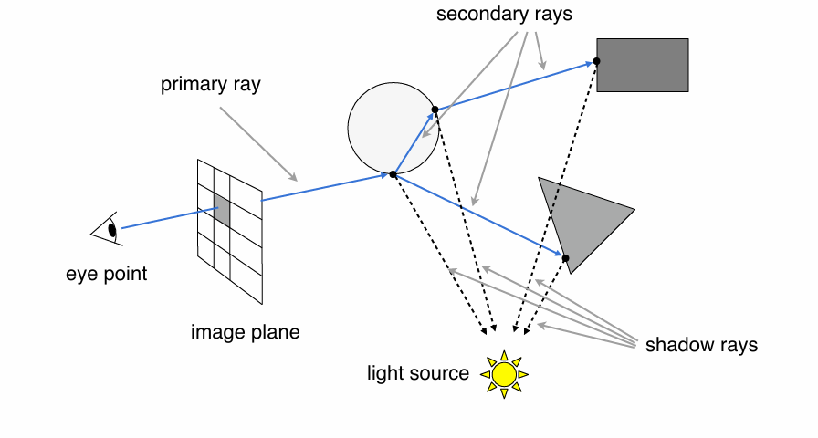

### Ray-Surface Intersection

需要解决的第一个技术问题是：光线和物体的相交问题。

光线的数学定义：起点$o$ + 方向$d$ + 参数$t$，即：

$$r(t)=o+td$$

**Ray Intersection with Sphere:**

光线和球体的交点怎么求？

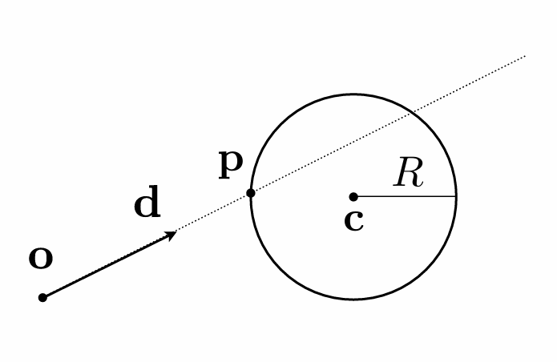

球体的定义：

$$(p-c)^2-R^2=0$$

交点就是同时满足两个式子的点，因此将光线方程代入球体方程：

$$(o+td-c)^2-R^2=0$$

解得：

$$t=\frac{-b\pm\sqrt{b^2-4ac}}{2a}$$

其中$a=d\cdot d$，$b=2(o-c)\cdot d$，$c=(o-c)\cdot (o-c)-R^2$。保留正实根。

同样可以推广到所有隐式表面。

**Ray Intersection with Triangle:**

对于显式几何，常常使用三角形网格来表示。在这种情况下，最简单的方法是对每个三角形求交，如果有交点就取最近的那个。

对于单一的三角形，其肯定在一个平面内，我们可以考虑光线先与平面求交，然后判断交点是否在三角形内。

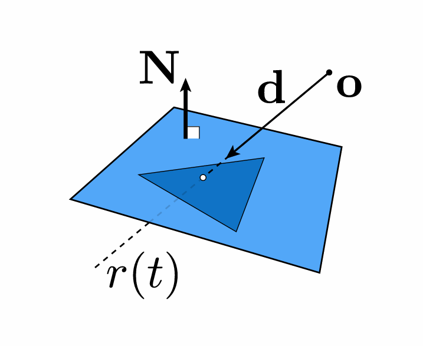

平面可以用一个法向量$N$和一个点$p'$定义。只要点$p$满足：

$$p:(p-p')\cdot N=0$$

那么$p$就在该平面上，上述即为平面方程。

$p$用$o+td$代入：

$$t=\frac{(p'-o)\cdot N}{d\cdot N}$$

然后再判断在不在三角形内就行（叉乘的方法、重心坐标的方法……）。

**Möller Trumbore Algorithm:**

Möller Trumbore Algorithm是一种更高效的求交方法，直接和三角形求交。

考虑重心坐标：

$$\vec{O}+t\vec{D}=(1-b_1-b_2)\vec{P_0}+b_1\vec{P_1}+b_2\vec{P_2}$$

有三个变量要解。使用Cramer法则求解线性方程组：

$$\begin{pmatrix}
    t\\
    b_1\\
    b_2
\end{pmatrix}=\frac{1}{\vec{S_1}\cdot\vec{E_1}}\begin{pmatrix}
    \vec{S_2}\cdot\vec{E_2}\\
    \vec{S_1}\cdot\vec{S}\\
    \vec{S_2}\cdot\vec{D}
\end{pmatrix}$$

其中：

$$\vec{E_1}=\vec{P_1}-\vec{P_0}$$

$$\vec{E_2}=\vec{P_2}-\vec{P_0}$$

$$\vec{S}=\vec{O}-\vec{P_0}$$

$$\vec{S_1}=\vec{D}\times\vec{E_2}$$

$$\vec{S_2}=\vec{S}\times\vec{E_1}$$

解出来后要判断是否合理，$t,b_1,b_2$都要非负。

### Accelerating Ray-Surface Intersection

**Bounding Volume:**

可以考虑用一个长方体包围复杂的物体，先和长方体求交，如果没有交点就不用和复杂物体求交了。

我们将长方体看作三组对面的交集（intersection of 3 pairs of slabs），并使用轴对齐包围盒（Axis-Aligned Bounding Box, 每个面都和正规平面平行，方便计算。

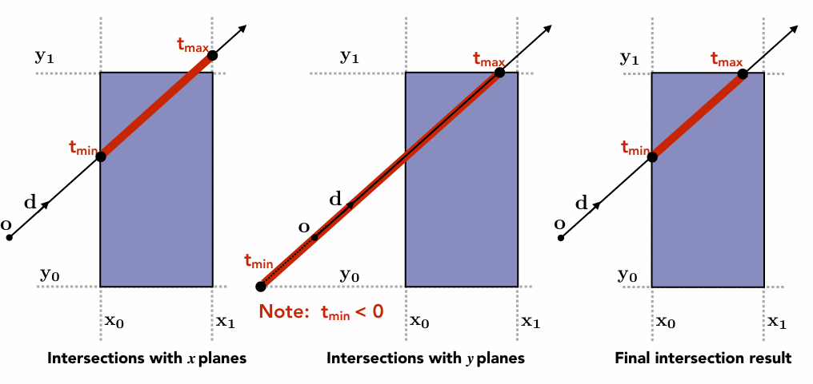

以二维为例，看光线和四条直线的交点，位于包围盒中的光线就是线段的交集。

再从三维情况考虑：光线只有都进入了包围盒三组对面的范围才算真正进入；但只要离开任意一组对面的范围就算真正离开。

因此对于三组对面，各自计算$t_{\min}$和$t_{\max}$，然后求出$t_{\text{enter}}=\max\{t_{\min}\}$，$t_{\text{exit}}=\min\{t_{\max}\}$。

如果$t_{\text{enter}}\leqslant t_{\text{exit}}$且$t_{\text{exit}}>0$，说明这段时间光线在包围盒内，进一步说明光线和包围盒相交。

!!! Note
    若$t_{\text{exit}}<0$，说明包围盒在光线背后，没有交点；
    若$t_{\text{exit}}>0$但$t_{\text{enter}}<0$，说明光线的起点在包围盒内部，显然有交点。

**Uniform Spatial Partitions (Grids):**

我们可以将空间划分为均匀的网格，并判断哪些格子有物体（表面）。

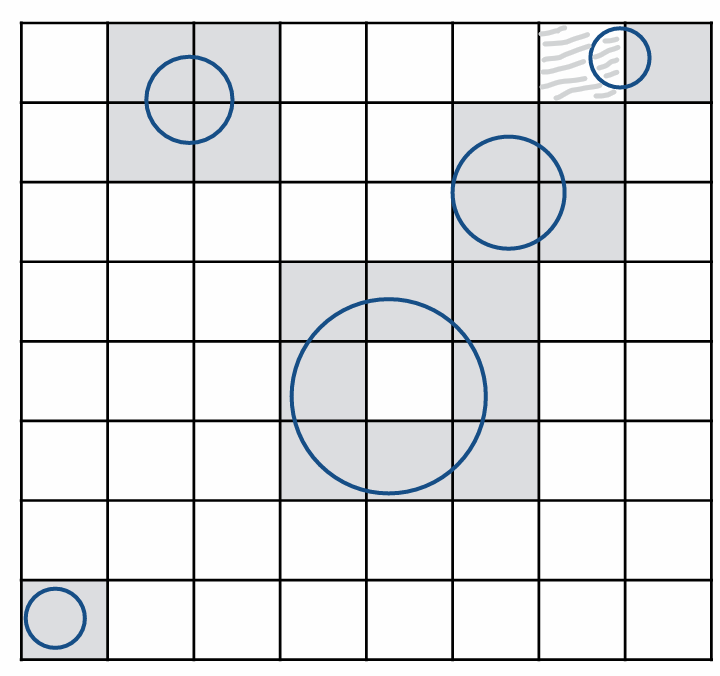

对于一条光线，如果它进入的格子是空格子，则可以直接跳过；如果格子内有物体，再检查是否与其相交。

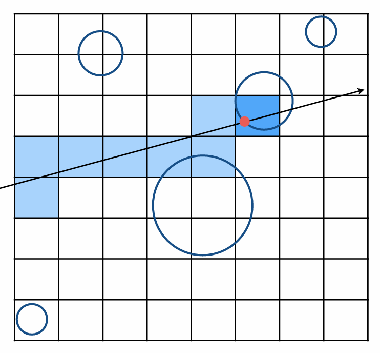

**KD-Tree:**

当场景物体分布不均匀时，均匀网格的效果不好，因为稀疏的地方没有必要使用过多格子并进行判断。

KD-Tree给出了一种非均匀划分方法。在做光追之前，对给定的场景构建KD-Tree，简单来说就是沿$x$轴划分、沿$y$轴划分、沿$z$轴划分交替进行，直到达到某个人为设定的标准。

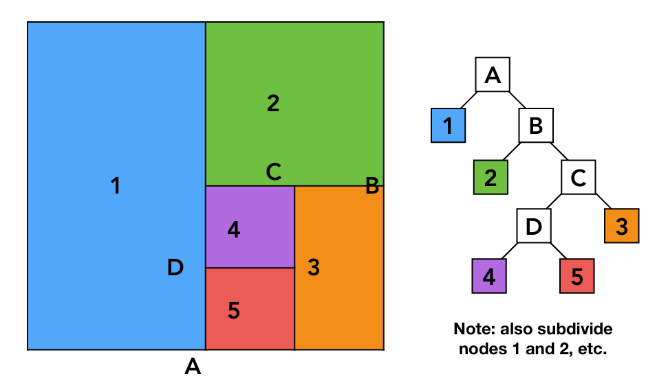

!!! Note
    类似于格子1和格子2等还会继续划分，但此处为了简单起见没有继续划分。

对于如下图所示的光线，先判断和A是否有交点，如果有则考虑A的划分子节点1和B。

先和1求交，判断出来和1有交点，因为1是叶子节点，因此和1中的物体求交。

再和B求交，判断出来和B有交点，那么接着判断B的划分节点2和C。2也是叶子节点，那么之后之后的操作和1类似。

继续沿着KD-Tree走，和C求交……

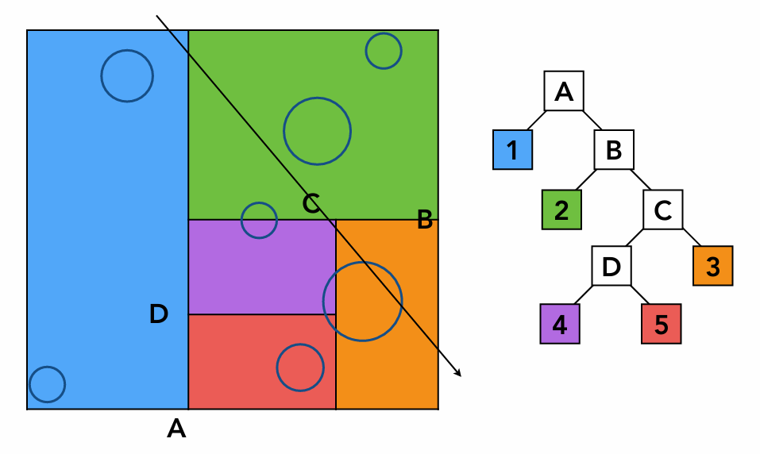

如果要找最近的物体，那么可以找到所有与物体的交点，保留最近的即可。

**Bounding Volume Hierarchy (BVH):**

对于上述的KD-Tree，其有一个显然的缺点，就是同一个物体可能会被划分到多个格子中，导致重复计算。

BVH的思想是从物体角度考虑划分，而不是从空间角度考虑划分。

步骤：

* find bounding box
* recursively split set of objects in two subsets
* recompute the bounding box of the subsets
* stop when necessary
* store objects in each leaf node

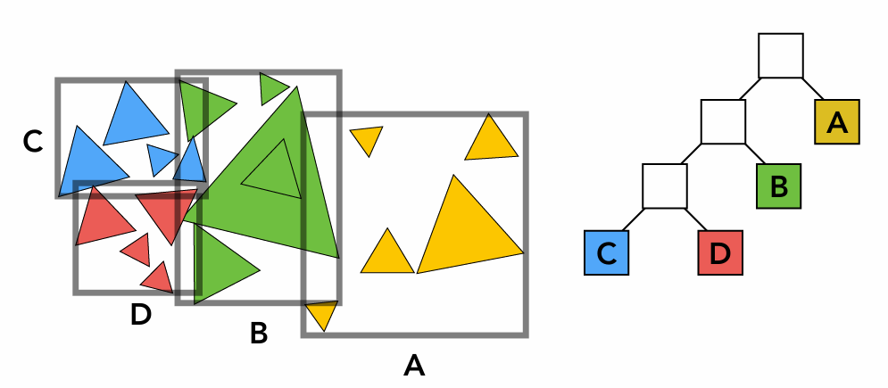

!!! Note
    划分技巧：
    技巧1：纵切最长的轴来让格子长宽高比较均匀。
    技巧2：一串物体排列下来，取中位数的物体作为划分依据，为的是保证物体划分均匀，最后树的深度小。

***

## Radiometry

之前提到的Whitted-Style Ray Tracing还是不够真实，我们需要引入辐射度量学来更好地度量光照，从而获得更加精确的模型。

### Definitions

**Radiant Energy and Flux (Power):**

radiant energy是电磁辐射的能量，记作$Q$。

radiant flux (power)是单位时间的能量：

$$\Phi=\frac{dQ}{dt}$$

**Solid Angle:**

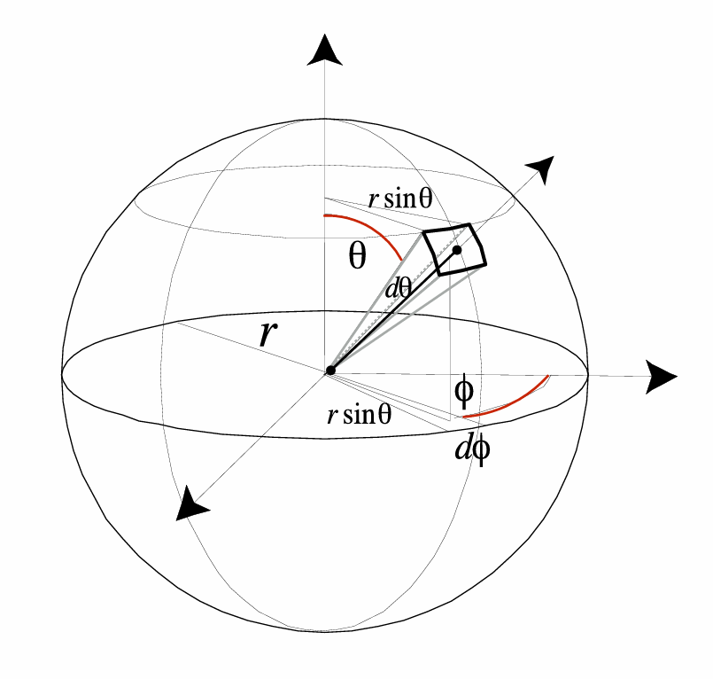

立体角：

$$w=\frac{A}{r^2}$$

$$dA=(rd\theta)(r\sin\theta d\phi)=r^2\sin\theta d\theta d\phi$$

$$dw=\frac{dA}{r^2}=\sin\theta d\theta d\phi$$

**Radiant Intensity:**

radiant intensity更多从发射端考虑，是单位立体角的功率：

$$I(w)=\frac{d\Phi}{dw}$$

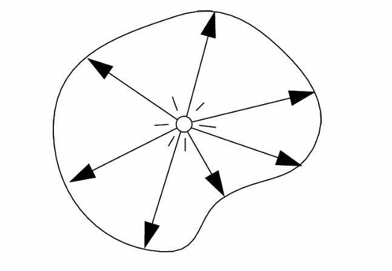

**Irradiance:**

irradiance更多从接收端考虑，是单位面积的功率：

$$E(p)=\frac{d\Phi}{dA}$$

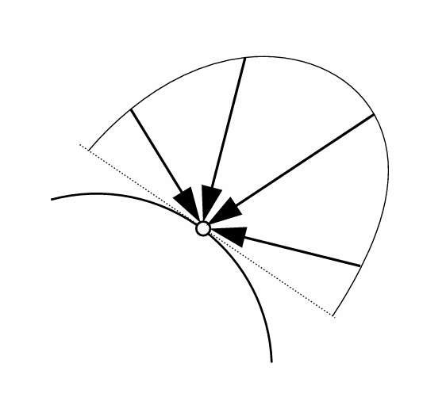

!!! Note
    如果光线不是垂直入射的，与表面夹角为$\theta$，则有效面积变为$dA\cos\theta$，即对面积进行投影。

**Radiance:**

radiance更多从光线传播考虑，是单位面积上单位立体角的功率：

$$L(p,w)=\frac{d^2\Phi}{dwdA\cos\theta}$$

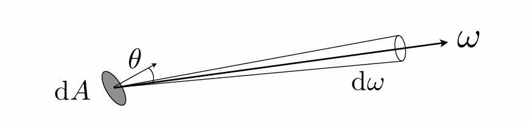

irradiance是单位面积接收到的所有能量，而radiance是在这些能量中一个特定方向上的一部分，也就是说入射的radiance在irradiance的基础上进一步限制了方向：

$$L(p,w)=\frac{dE(p)}{dw\cos\theta}$$

intensity是朝着同一方向（立体角）发射出去的所有能量，而出射的radiance在intensity的基础上进一步限制了面积，必须是单位面积发射出去的：

$$L(p,w)=\frac{dI(p,w)}{dA\cos\theta}$$

### The Rendering Equation

**Bidirectional Reflectance Distribution Function (BRDF):**

我们用上述定义来理解反射。

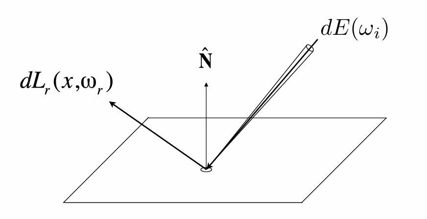

反射实际上就是能量的走向。光线从$w_i$方向入射，带着能量到达单位面积上并被吸收。已知radiance为$L(w_i)$，则这一小块总共获得的irradiance为：

$$dE(w_i)=L(w_i)\cos\theta_idw_i$$

能量被吸收后会往各个方向反射出去，不同的反射方向获得不同的能量比例，而BRDF描述的就是这种能量分布，记作$f$。更概括地说，BRDF描述了光线与物体如何作用，定义了不同材质。

**The Reflectance Equation:**

针对某个反射方向$w_r$，对应获得的能量就是不同入射方向打到这个点的光的能量的积分（贡献的累加）：

$$L_r(x,w_r)=\int_{H^2}f(x,w_i,w_r)L_i(x,w_i)\cos\theta_idw_i$$

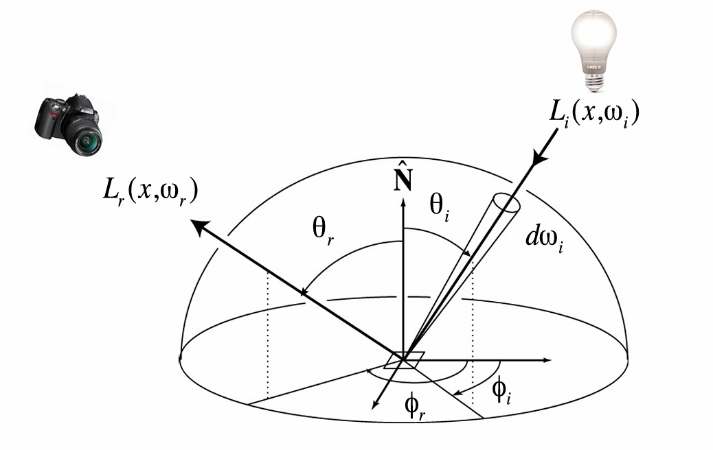

**The Rendering Equation:**

渲染方程原本反射方程的基础上，考虑了物体自身发光的情况：

$$L_r(x,w_r)=L_e(x,w_r)+\int_{H^2}L_i(x,w_i)f(x,w_i,w_r)\cos\theta_idw_i$$

**Understanding the Rendering Equation:**

当考虑光多次弹射的情况时，打到物体表面的光就不一定来自光源，而有可能来自其他物体的反射。因此，渲染方程可以写成：

$$L_r(x,w_r)=L_e(x,w_r)+\int_{H^2}L_r(x',-w_i)f(x,w_i,w_r)\cos\theta_idw_i$$

因此，不同位置的radiance相互依赖，形成递归。

在数学上进行极大的简化：

$$L=E+KL$$

其中$K$是一个抽象的反射操作符。通过更抽象的变换，可以得到：

$$L=E+KE+K^2E+K^3E+...$$

* $E$: Emission directly from light source
* $KE$: Direct illumination on surfaces
* $K^2E$: One bounce indirect illumination
* $K^3E$: Two bounce indirect illumination
* ...

这样便可以引入全局光照的概念。全局光照就是光线弹射1次、2次、3次……的总和，即$KE+K^2E+K^3E+...$。

!!! Note
    光栅化做的是$E+KE$，即弹射0次（光源自己）和1次（光源->物体->眼睛）。

***

## Path Tracing

### Monte Carlo Integration

对于定积分$\int_a^bf(x)dx$，如果$f(x)$比较复杂，无法利用解析的方法积分，我们可以用数值积分的方法来近似计算。

蒙特卡洛积分采用随机采样的方法。在$a$和$b$之间随机取一个$x_i$，计算$f(x_i)$，此时长方形高度为$f(x_i)$，宽度为$(b-a)$，面积为$(b-a)f(x_i)$，近似为积分结果。

随机采样足够多次，取平均值，就可以得到很好的近似。

$$\int f(x)dx=\frac{1}{N}\sum\limits_{i=1}^N\frac{f(X_i)}{p(X_i)},X_i\sim p(x)$$

最常见的采样方法是均匀采样，即$p(x)=\frac{1}{b-a}$。此时，蒙特卡洛积分为$\frac{b-a}{N}\sum\limits_{i=1}^N f(X_i)$。

### Path Tracing

**A Simple Monte Carlo Solution:**

我们知道渲染方程相比Whitted-Style Ray Tracing更加精确，我们的目的就是解出渲染方程中的$L$（其他均已知，包括BRDF）。

我们先考虑简单场景，只考虑一个点处的渲染方程，只考虑直接光照，不考虑自身发光。

$$L_r(x,w_r)=\int_{H^2}L_i(x,w_i)f(x,w_i,w_r)\cos\theta_idw_i$$

这个式子实际上只是一个积分，迁移到蒙特卡洛积分上：

$$f(x)=L_i(x,w_i)f(x,w_i,w_r)\cos\theta_i$$

对入射方向使用最简单的半球均匀采样：

$$p(w_i)=\frac{1}{2\pi}$$
通过蒙特卡洛积分进行计算，这样就已经可以算出$L_r(x,w_r)$了。

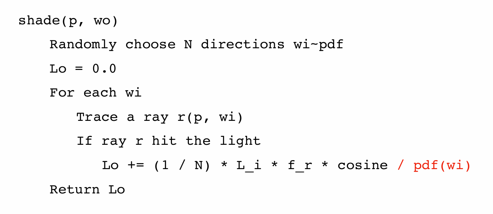

**Introducing Global Illumination:**

接下来引入间接光照。从我们考虑的点回溯，如果沿着采样的方向，到达的不是光源而是另一个物体怎么办？

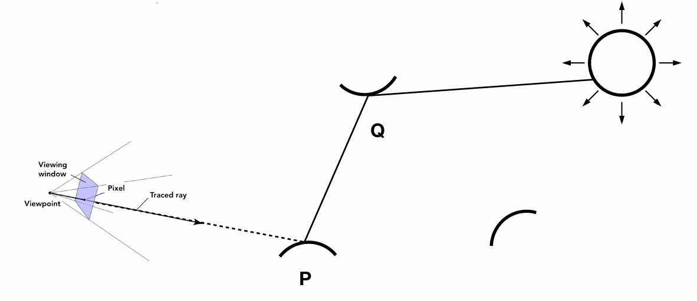

如图所示，我们研究的点是P，采样入射到P的不同方向的时候采到了来自Q的间接光照。这个时候，我们就要将视线放在PQ之间，要算P接收的来自Q的光，也就是要算Q在PQ方向发出的光。这个时候我们就要递归地考虑光源对Q的直接光照。

因此，算法改进：

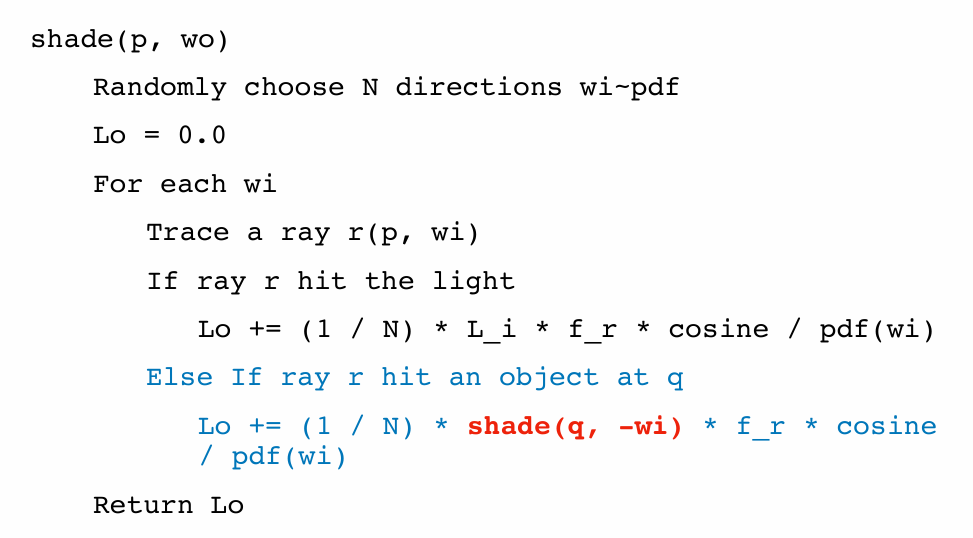

**Avoiding Explosion:**

考虑我们的采样数$N$，如果递归深度为$D$，那么总的采样数就是$N^D$，会带来指数爆炸。

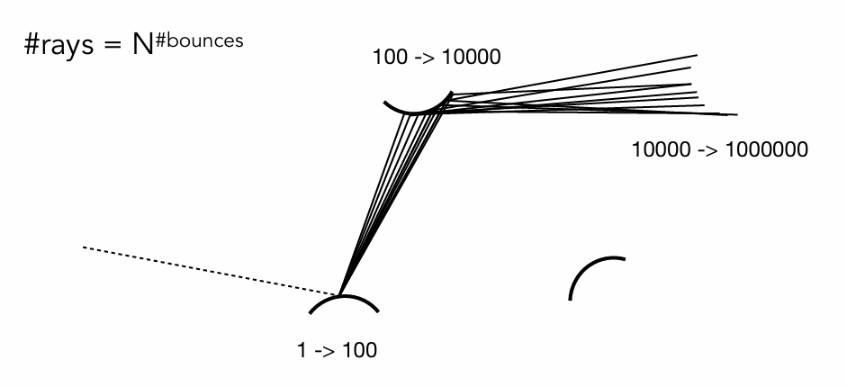

只有当$N=1$时才不会爆炸，所以我们每次只采样一个方向。

因此，算法改进：

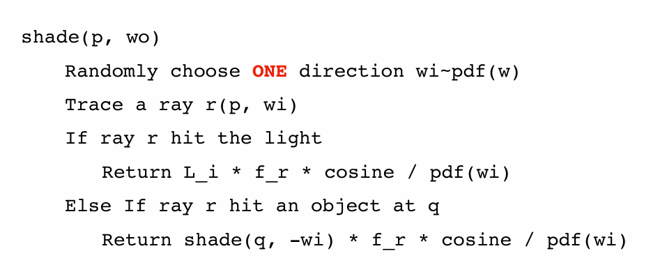

虽然只采样一次会有很大的噪声，但不要紧，对于同一个像素，有无数条对应的路径，在像素层面上取平均就行。

当前的算法才能称为Path Tracing。

**Russian Roulette (RR):**

当前的算法中，递归没有终止条件。但我们不能直接限制弹射次数，因为真实世界的情况就是光弹射无穷多次。

考虑RR：以一定的概率停止追踪。假设概率为$P$，以概率$P$保留光线，得到的结果除以$P$：$\frac{L_o}{P}$；以概率$1-P$停止追踪，得到的结果为$0$。

计算期望：

$$E=P\*\frac{L_o}{P}+(1-P)\*0=L_o$$

发现期望依然是$L_o$，因此我们在有机会停下的同时，依然保持了无偏性。

因此，算法改进：

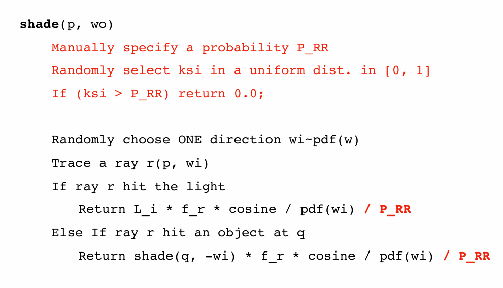

**Sampling the Light (Pure Path):**

如果光源很小，需要更多的光线才有可能采样到。为了保证采样的有效性，我们可以考虑在光源上采样。

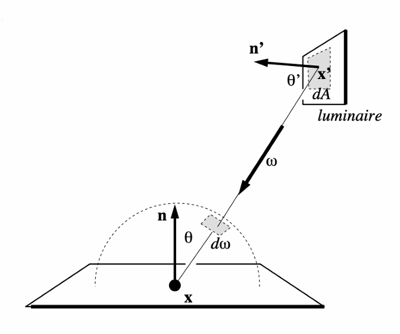

假设光源为二维平面，我们要重写渲染方程，就要重写成在光源表面的积分。我们需要得到$dw$和$dA$之间的关系：

$$dw=\frac{dA\cos\theta'}{||x'-x||^2}$$

因此重写渲染方程：

$$L_r(x,w_r)=\int_{A_{\text{light}}}L_i(x,w_i)f(x,w_i,w_r)\frac{\cos\theta\cos\theta'}{||x'-x||^2}dA$$

现在，着色点的光由两部分组成：

* light source (direct, no need to have RR，采用光源采样)
* other reflectors (indirect, with RR，采用原本采样)

因此，算法改进：

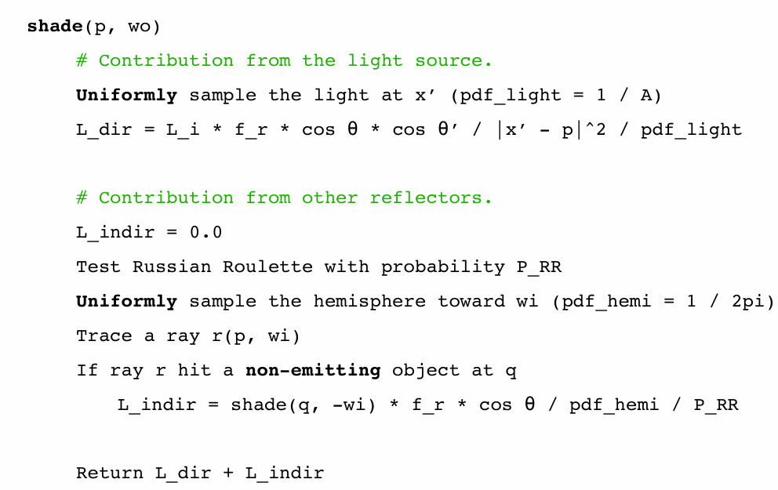

只要再加上遮挡物判断，就是一个完整的Path Tracing算法了。