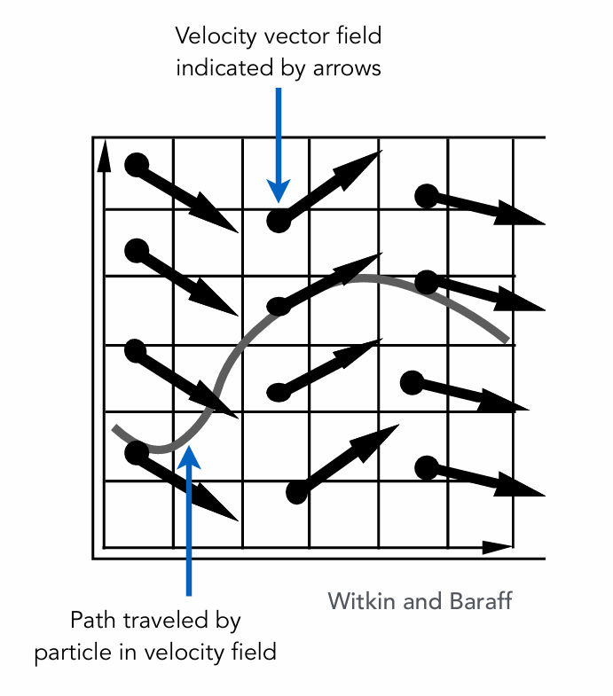
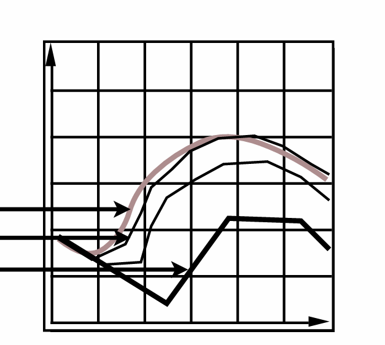
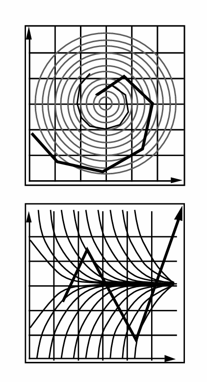
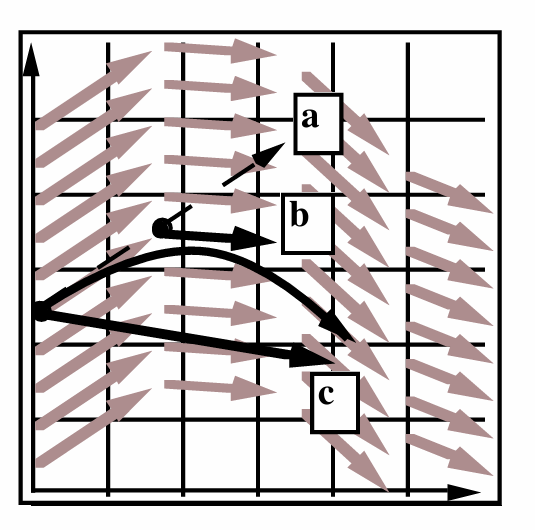
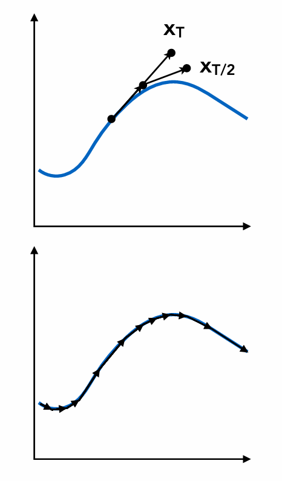

# Lec6 Animation 动画

***

## Single Particle Simulation

如果我们规定好了一个速度场，那么在任意一个位置，粒子如何运动？

### Euler's Method

我们可以假设很小的时间间隔$\Delta t$（步长），在时间上做离散化：

$$x^{t+\Delta t}=x^t+\Delta t\dot{x}^t$$

$$\dot{x}^{t+\Delta t}=\dot{x}^t+\Delta t\ddot{x}^t$$

欧拉方法有两个问题。

问题一：如果步长太大会有误差可通过减小步长来解决。

问题二：稳定性，无法完美解决，只能想办法缓解。

### Midpoint Method

在某一点处，我们通过之前的欧拉方法模拟得到会走到$a$，但实际考虑中点$b$，用$b$处的速度来更新位置，最终实际走到$c$。

$$x_{mid}=x(t)+\frac{\Delta t}{2}\cdot v(x(t),t)$$

$$x(t+\Delta t)=x(t)+\Delta t\cdot v(x_{mid},t)$$

中点法的核心是使用两次欧拉方法，第一次估计中点；第二次使用中点的速度估计终点。

中点法准确的地方在于实际模拟了一个抛物线，而不是一条直线：

$$x^{t+\Delta t}=x^t+\frac{\Delta t}{2}(\dot{x}^t+\dot{x}^{t+\Delta t})$$

$$\dot{x}^{t+\Delta t}=\dot{x}^t+\Delta t\ddot{x}^t$$

$$x^{t+\Delta t}=x^t+\Delta t\dot{x}^{t}+\frac{1}{2}\Delta t^2\ddot{x}^{t}$$

### Adaptive Step Size

仍然利用中点的思想：时间减半，先到原先模拟终点的中点，再从中点用中点的速度到另一个终点。

如果两个终点差距很大，说明步长太大，继续减半，迭代直到差距足够小。

### Implicit Euler Method

永远使用下一刻的速度：

$$x^{t+\Delta t}=x^t+\Delta t\dot{x}^{t+\Delta t}$$

$$\dot{x}^{t+\Delta t}=\dot{x}^t+\Delta t\ddot{x}^{t+\Delta t}$$

要用下一时刻的速度，这个量是未知的，因此需要解一个方程组，可以考虑使用牛顿迭代法。

***

## Fluid Simulation

水体由许多不可压缩的刚体粒子组成。

假设水在任何位置都不可压缩，密度不变。因此，给定任何时刻粒子分布，都可以知道任何一个地方的密度，如果密度和一开始的值不一样，那么就需要修正。通过移动粒子的位置来修正。此即为**Position-Based Method**。

为了修正，需要知道任何一个粒子的密度梯度。即粒子微小移动后，某一处密度如何变化。只要知道了这个，就变成了梯度下降法。