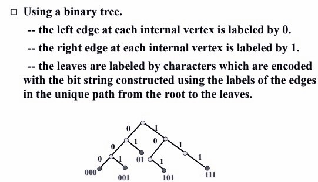
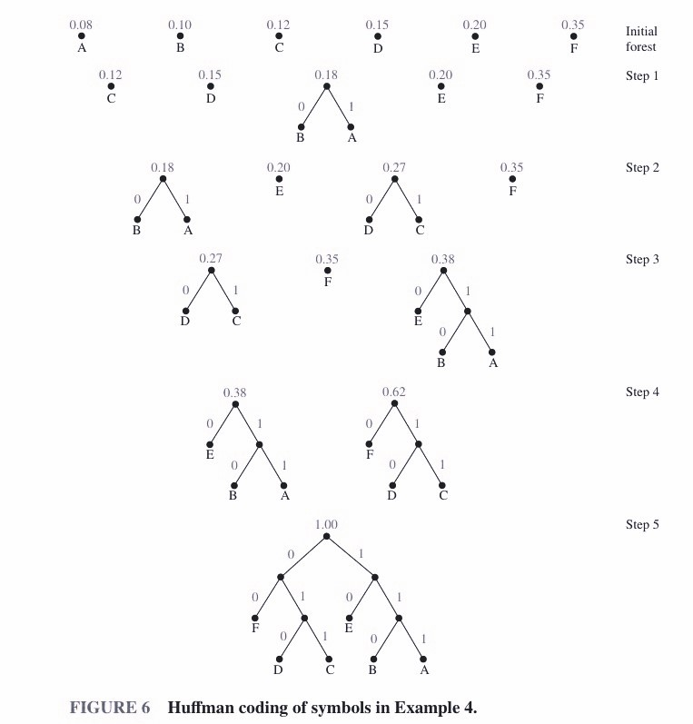

# Chapter10 Trees

***

## 10.1 Introduction to Trees

**Theorem 1:**

An undirected graph is a tree if and only if there is a unique simple path between any two of its vertices.

无向图是树的充要条件：任意两个顶点之间的简单路径只有一条，即没有回路。

**Theorem 2:**

A full $m$-ary tree with $i$ internal vertices contains $n=mi+1$ vertices.

**Balanced Tree:**

A tree is **balanced** if:  

* The left and right subtrees' heights differ by at most $1$
* The left subtree is balanced
* The right subtree is balanced
  
平衡树要求：左右子树均为平衡树，且左右子树的高度相差不超过 $1$。

***

## 10.2 Applications of Trees

**Prefix Codes（前缀编码）:**

To ensure that no bit string corresponds to more than one sequence of letters, the bit string for a letter must never occur as the first part of the bit string for another letter. Codes with this property are called **prefix codes**.

任何一个编码都不是其他任何编码的前缀。

**Huffman Coding:**

***

## 10.3 Spanning Trees

**Spanning Tree:**

Let $G$ be a simple graph. A **spanning tree** of $G$ is a subgraph of $G$ that is a tree containing every vertex of $G$.

$G$的所有顶点连接而成的一棵树。

**Depth-first Search:**

能走多远走多远+回退。

**Breadth-first Search:**

一次先把所有相邻的顶点遍历一遍，再往下走。

***

## 10.4 Minimum Spanning Trees

**Prim's Algorithm:**

先挑出最小的边，然后在已经形成的树的相邻的边中找最小的边加进去。

**Kruskal's Algorithm:**

在整张图中依次挑出最小的边，如果不形成回路则连起来。