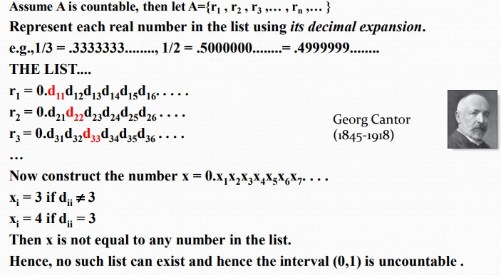

# Chapter2 Basic Structures

***

## 2.1 Sets

**Set Cardinality（基数）:**

集合中元素的个数。

**Power Set（幂集）:**

由集合 $A$ 的所有子集构成的集合，记为 $P(A)$。 

$n$ 个元素的集合的幂集的元素个数为 $2^n$。

**Tuple（元组）:**

一串有序的数 $a_1,a_2,···,a_n$  

两个元素的元组叫做序偶（ordered pair）。

**Cartesian Product（笛卡尔积）:**

$$A\times B=\\{(a,b)|a\in A\wedge b\in B\\}$$  

$$A_1\times A_2\times···\times A_n=\\{(a_1,a_2,···,a_n)|a_i\in A_i\\}$$

**Truth Set（真值集）:**

对于推断 $P$，若满足 $P(x)$ 为真，则 $x$ 构成的集合为 $P$ 的真值集。

***

## 2.2 Set Operations

**Difference（差集）:**

由在 $A$ 中但不在 $B$ 中的元素组成的集合。

$$A-B=\\{x|x\in A\wedge x\notin B\\}$$  

**Symmetric Difference（对称差）:**

由只在 $A$ 中和只在 $B$ 中的元素组成的集合。

$$A\oplus B=(A-B)\cup(B-A)$$  

**De Morgan's Laws:**

* $\overline{A\cup B}=\overline{A}\cap\overline{B}$

* $\overline{A\cap B}=\overline{A}\cup\overline{B}$

***

## 2.3 Functions

**Injection（单射）:**

又叫 one-to-one，每个 image 都对应唯一的 preimage。  

**Surjection（满射）:**

又叫 onto，codomain 中的每个元素都有 preimage。  

**Bijection（双射）:**

又叫 one-to-one correspondence，既是单射又是满射，也可逆。

**Floor Function（下取整）:**

$$f(x)=\lfloor x\rfloor$$

取小于等于$x$的最大整数。

**Ceiling Function（上取整）**

$$f(x)=\lceil x\rceil$$

取大于等于 $x$ 的最小整数。

**Partial Function（偏函数）**

只定义了 $A$ 中的部分元素。

!!! Example
    $f:Z\rightarrow R$，$f(n)=\sqrt{n}$  

***

## 2.4 Sequences and Summations

**Geometric Progression（等比数列）:**  

initial term 首项  
common ratio 公比  

**Arithmetic Progression（等差数列）:**  

common difference 公差  

***

## 2.5 Cardinality of Sets

**Countable and $\aleph_0$:**  

如果一个集合有限或者和$Z^+$的元素一样多，就称为可数的（countable）。

可数的无限集的基数记为 $\aleph_0$，基数为$\aleph_0$的无限集有$Z^+$，$Z$，序偶，$Q^+$等。  

* 两个可数集的并集还是可数集

* 有限个可数集的并集还是可数集

* 可数个可数集的并集还是可数集

**Cantor Diagonalization  Argument（康托对角线论证法）and $\aleph_1$:**

$R$ 和 $(0,1)$ 的基数一样，记为 $\aleph_1$。

**The Continuum Hypothesis（连续统假设）:**

不存在基数 $a$ 使得 $\aleph_0<a<\aleph_1$。

***

## 2.6 Matrices

**Terminologies:**

* identity matrix 单位矩阵  

* transpose of matrix 矩阵的转置  

* $A\wedge B$：对应位与操作  

* $A\vee B$：对应位或操作  

* $A\odot B$：矩阵的布尔积  
$C_{ij}=(a_{i1}\wedge b_{1j})\vee···\vee(a_{in}\wedge b_{nj})$  
$A^{[r]}=A\odot A\odot···\odot A$（一共 $r$ 次）