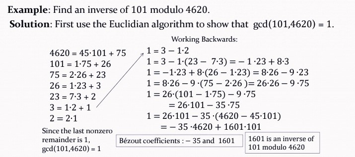
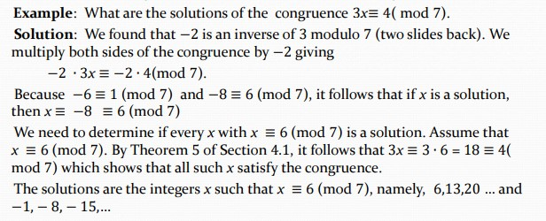
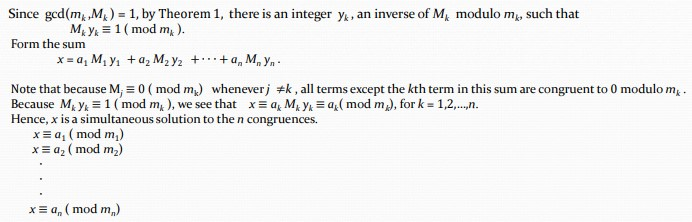

# Chapter4 Number Theory

***

## 4.1 Divisibility and Modular Arithmetic

**Division（整除）:**

$a|b$，$a$ 整除 $b$，$a$ 是 divisor/factor。

如果 $a$ 是整数，$d$ 是正整数，那么存在唯一整数 $q$，$r$，$0\leqslant d$，使得 $a=qd+r$。

* $d$: divisor 除数
* $a$: dividend 被除数
* $q$: quotient 商
* $r$: remainder 余数

**Congruence（同余）:**

若 $m$ 整除 $a-b$，则 $a$ 和 $b$ 模 $m$ 同余。

同余式左右同除同一个整数不一定仍成立。

记 

$$Z_m=\\{0,1,2,···,m-1\\}$$

模 $m$ 加法 $+_m$：

$$a+_mb=(a+b)\mod m$$

模 $m$ 乘法 $·_m$：

$$a·_mb=(a·b)\mod m$$

***

## 4.2 Integer Representations and Algorithms

计算： 

$$b^n\mod m$$

方法：

将 $n$ 拆成 $a_{k-1}2^{k-1}+···+a_12^1+a_0$，$a$ 为0/1，因此 $b^n$ 可以拆成 $b^1,b^2,b^4,···,b^{2^{k-1}}$的乘积，$a=0$ 则没有这一项  
然后依次计算 $b\mod m$，$b^2\mod m$，$b^4\mod m$，···，$b^{2^{k-1}}\mod m$，这一部分可以递推地计算，然后再把 $a=1$ 的部分的余数相乘再 $\mod m$。

复杂度：

$$O((\log m)^2\log n)$$

***

## 4.3 Primes and Greatest Common Divisors

**Mersenne Primes（梅森质数）:**

形式为 $2^p-1$ 的质数，其中 $p$ 也为质数。

**Prime Number Theorem（素数定理）:**

用 $\pi(x)$ 表示不超过$x$的质数的个数，则  

$$\pi(x)\sim\frac{x}{\ln x},~x\rightarrow\infty$$

**Relatively Prime（互质）:**

最大公约数为 $1$。

**Euclidean Algorithm（辗转相除法）:**

每次除下来，除数变为被除数，余数变为除数，一直进行下去，直到整除，此时除数即为最大公约数。

若 $ac\equiv bc(\mod m)$，$\gcd(c,m)=1$，则$a\equiv b(\mod m)$

***

## 4.4 Solving Congruences

**Inverse（逆元）:**

If 

$$ax\equiv1(\mod m)$$

then $x$ is an inverse of $a$ modulo $m$.

**Bézout’s Theorem:**

If $a$ and $b$ are positive integers, then there exist integers $s$ and $t$ such that 

$$\gcd(a,b)=sa+tb$$

**Theorem 1:**

If $a$ and $m$ are relatively prime integers and $m>1$, then there exists an inverse $x$ of $a$ modulo $m$. Moreover, if the inverse $x$ is a positive integer and $x<m$, then it is unique and every other inverse is congruent to $x$ modulo $m$.

**Finding Inverse:**

**Solving Congruences:**

**Chinese Remainder Theorem（中国剩余定理）:**

Let $m_1,m_2,···,m_n$ be pairwise relatively prime positive integers greater than 1.

$$x\equiv a_1(\mod m_1)$$

$$x\equiv a_2(\mod m_2)$$

$$···$$

$$x\equiv a_n(\mod m_n)$$

There exists a solution 

$$0\leqslant x<m=m_1m_2···m_n$$

**Fermat's Little Theorem（费马小定理）:**

If $p$ is a prime and $a$ is an integer not divisible by $p$, then 

$$a^{p-1}\equiv1(\mod p)$$

Furthermore, for every integer $a$ we have 

$$a^p\equiv a(\mod p)$$

**Pseudoprime（伪质数）:**

Let $b$ be a positive integer. If $n$ is a composite integer, and 

$$b^{n-1}\equiv 1(\mod n)$$

then $n$ is called a pseudoprime to the base $b$.

**Primitive Root（原根）:**

$p$ is a prime integer. $U_p=\\{0,1,···,p-1\\}$. If $r\in U_p$ is a primitive root of $p$, then 

$$\\{r^1(\mod p),r^2(\mod p),···\\}=U_p$$

**Carmichael Number:**

合数 $n$，满足对于任意满足 $\gcd(b,n)=1$ 的 $b$，都有 $n$ 是 $b$ 的伪质数。