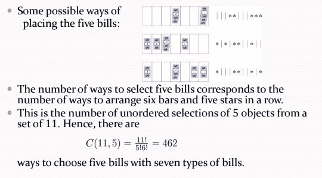

# Chapter6 Counting

***

## 6.1 The Pigeonhole Principle

**The Pigeonhole Principle（鸽巢原理）:**

If $k$ is a positive integer and $k+1$ objects are placed into $k$ boxes, then at least one box contains two or more objects.

!!! Example 
    **Show that for every integer $n$ there is a multiple of $n$ that has only $0$s and $1$s in its decimal expansion.**

    Let $n$ be a positive integer.   
    Consider the $n+1$ integers $1$, $11$, $111$, $···$, $11···1$(where the last has $n+1$ $1$s).   
    There are $n$ possible remainders when an integer is divided by $n$.   
    By the pigeonhole principle, when each of the $n+1$ integers is divided by $n$, at least two must have the same remainder.   
    Subtract the smaller from the larger and the result is a multiple of $n$ that has only $0$s and $1$s in its decimal expansion.  

**The Generalized Pigeonhole Principle:**

If $N$ objects are placed into $k$ boxes, then there is at least one box containing at least $\lceil\frac{N}{k}\rceil$ objects.

!!! Example
    **During $30$ days a baseball team plays at least one game a day, but no more than $45$ games; show that there must be a period of some number of consecutive days during which the team must play exactly $14$ games.** 

    $a_j$: the number of games played on j-th day  
    $b_j=\sum\limits_{i=1}^ja_i$, $b_1,b_2 ,...b_{30}$ are strictly increasing number.   
    $c_j= b_j+14$, then $15\leqslant c_j\leqslant 45+14=59$, the $60$ integer numbers $b_1,b_2 ,···,b_{30} , c_1,c_2 ,···,c_{30}$ are all less than or equal to $59$, then two of these integers are equal  
    hence $b_i = c_j=b_j+14$,it implies $a_{j+1} + a_{j+2} +··· +a_i=14$  

**Ramsey Number:**

The Ramsey number $R(m,n)$ is the smallest number of people at a party that there either $m$ mutual friends or $n$ mutual enemies. (two men should be either friends or enemies)

***

## 6.2 Binomial Coefficients and Identities

**Pascal's Identity:**

$$C_n^{k-1}+C_n^k=C_{n+1}^k$$

**Vandermonde's Identities:**

$$C_{m+n}^r=\sum\limits_{k=0}^rC_m^{r-k}C_n^k$$

**Corollary 1:**

$$C_{2n}^n=\sum\limits_{k=0}^n(C_n^k)^2$$

**Corollary 2:**

$$C_{n+1}^{r+1}=\sum\limits_{j=r}^nC_j^r$$

***

## 6.3 Generalized Permutations and Combinations

