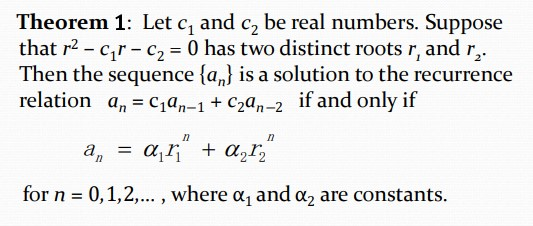
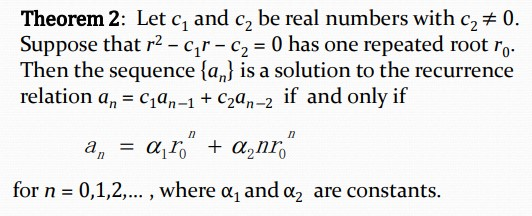
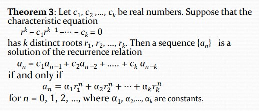
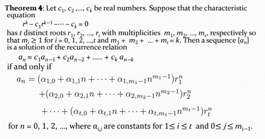
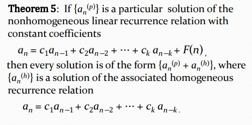
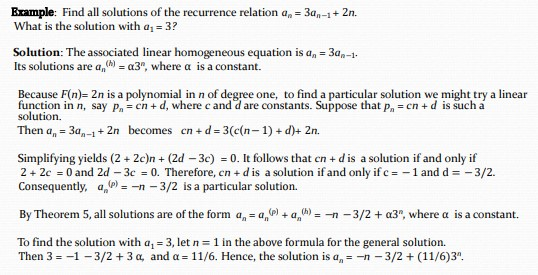
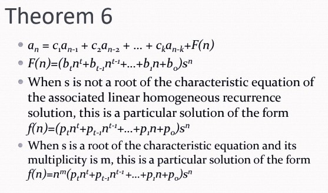
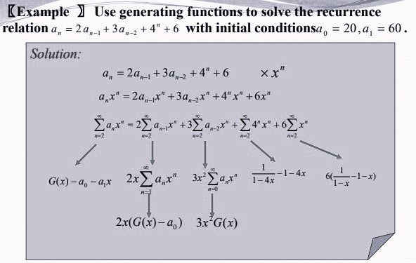
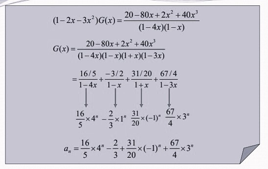

# Chapter7 Advanced Counting Techniques

***

## 7.1 Applications of Recurrence Relations

**Degree:**

The **degree** of a recurrence relation is the number of initial conditions needed to uniquely identify the sequence.

***

## 7.2 Solving Linear Recurrence Relations

**Linear Homogeneous Recurrence Relations（线性齐次递归关系）:**

A linear homogeneous recurrence relation of degree $k$ with constant coefficients is a recurrence relation of the form  

$$a_n=c_1a_{n-1}+c_2a_{n-2}+···+c_ka_{n-k}$$  

where $c_1,c_2,···,c_k$ are real numbers, and $c_k\neq 0$.

**Solving Linear Homogeneous Recurrence Relations:**

**Linear Nonhomogeneous Recurrence Relations with Constant Coefficients:**

A linear nonhomogeneous recurrence relation with constant coefficients is a recurrence relation of the form

$$a_n=c_1a_{n-1}+c_2a_{n-2}+···+c_ka_{n-k}+F(n)$$

where $c_1,c_2,···,c_k$ are all real numbers, and $F(n)$ is a function not identically zero depending only on $n$.

***

## 7.3 Generating Functions（生成函数）

**Generating Function:**

The **generating function** for the sequence $a_0,a_1,···,a_k,···$ of real numbers is the finite series

$$G(x)=a_0+a_1x+···a_kx^k+···=\sum\limits_{k=0}^{\infty}a_kx^k$$

**Extended Binomial Coefficients:**

$$\begin{pmatrix}
    u\\\
    k
\end{pmatrix}=\begin{cases}
\frac{u(u-1)···(u-k+1)}{k!},k>0\\\
1,k=0
\end{cases}$$

**Useful Generating Functions:**

Sequence|Generating Function
:---:|:---:
$C_n^k$|$(1+x)^n$
$C_n^ka^k$|$(1+ax)^n$
$1,1,···,1$|$\frac{1}{1-x}$
$a^k$|$\frac{1}{1-ax}$
$k+1$|$\frac{1}{(1-x)^2}$
$C_{n+k-1}^k$|$(1-x)^{-n}$
$(-1)^kC_{n+k-1}^k$|$(1+x)^{-n}$
$C_{n+k-1}^ka^k$|$(1-ax)^{-n}$
$\frac{1}{k!}$|$e^x$
$\frac{(-1)^{k+1}}{k}$|$\ln(1+x)$

***

## 7.4 Inclusion-Exclusion

**The Principle of Inclusion-Exclusion:**

$$|A_1\cup A_2\cup ···\cup A_n|=\sum\limits_{1\leqslant i\leqslant n}|A_i|-\sum\limits_{1\leqslant i\leqslant j\leqslant n}|A_i\cap A_j|+\sum\limits_{1\leqslant i\leqslant j\leqslant k\leqslant n}|A_i\cap A_j\cap A_k|-···+(-1)^{n+1}|A_1\cap A_2\cap ···\cap A_n|$$

***

## 7.5 Applications of Inclusion-Exclusion

**Derangement:**

A **derangement** is a permutation of objects that leaves no object in the original position.

!!! Example  
    The permutation of $21453$ is a derangement of $12345$ because no number is left in its original position. But $21543$ is not a derangement of $12345$ because $4$ is in its original position.

The number of derangements of a set with $n$ elements is

$$D_n=n![1-\frac{1}{1!}+\frac{1}{2!}-\frac{1}{3!}+···+(-1)^n\frac{1}{n!}]$$
