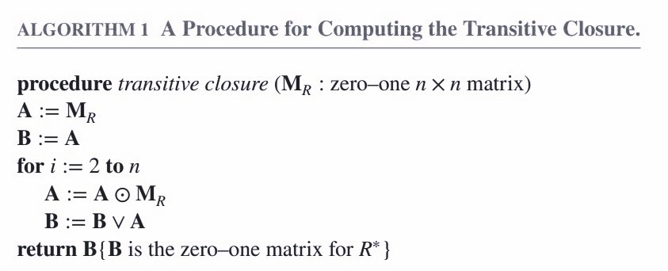

# Chapter8 Relations

***

## 8.1 Relations and Their Properties

* **Reflexive Relations（自反）**  
$\forall x[x\in U\rightarrow(x,x)\in R]$
* **Irreflexive Relations（反自反）**  
$\forall x[x\in U\rightarrow(x,x)\notin R]$
* **Symmetric Relations（对称）**  
$\forall x\forall y[(x,y)\in R\rightarrow(y,x)\in R]$
* **Antisymmetric Relations（反对称）**  
$\forall x\forall y[(x,y)\in R\wedge(y,x)\in R\rightarrow x=y]$
* **Asymmetric Relations（非对称）**  
$\forall x\forall y[(x,y)\in R\rightarrow(y,x)\notin R]$
* **Transitive Relations（传递）**  
$\forall x\forall y\forall z[(x,y)\in R\wedge(y,z)\in R\rightarrow(x,z)\in R]$

**Theorem:**

relation $R$ on a set $A$ is transitive $\Longleftrightarrow$ $R^n\subseteq R$，$n=1,2,3,···$

***

## 8.2 Representing Relations

**Inverse Relation:**

$$R^{-1}=\\{(b,a)|(a,b)\in R\\}$$

**Complement Relation:**

$$\overline{R}=\\{(a,b)|(a,b)\notin R\\}$$

***

## 8.3 Closure of Relations

**Closure（闭包）:**

The closure of a relation $R$ with respect to property $P$ is the relation obtained by adding the minimum number of ordered pairs to $R$ to obtain property $P$.

比如说自反性的闭包，就是一个关系集合加上最少的关系得到的满足自反性的新的关系集合。

**Theorem 1:**

Let $R$ be a relation on a set $A$, there is a path of length $n$ from $a$ to $b$ if and only if $(a,b)\in R^n$.

**Theorem 2:**

The transitive closure of a relation $R$ equals the connectivity $R^*=\bigcup_1^nR^i$

**Theorem 3:**

$$M_{R^*}=M_R\vee M_{R^2}\vee M_{R^3}\vee···\vee M_{R^n}$$

**Warshall's Algorithm:**

***

## 8.4 Equivalence Relations

**Equivalence Relation（等价关系）:**

A relation on a set $A$ is called an **equivalence relation** if it is reflexive, symmetric, and transitive. 

（自反性，对称性，传递性）

Two elements $a$ and $b$ that are related by an equivalence relation are called **equivalent**. (a~b) 

Let $R$ be an equivalence relation on a set $A$. The set of all elements that are related to an element $a$ of $A$ is called the  **equivalence class** of $a$. The equivalence class of $a$ with respect to $R$ is denoted by $[a]_R$. $a$ is called a **representative（代表元）**.

If $R$ and $S$ are equivalence relations on $A$, then $R\cap S$ is also an equivalence relations. $R\cup S$ is a reflexive and symmetric relation on $A$ (not necessarily equivalence relation). However, $(R\cup S)^*$ is an equivalence relations on $A$.

**Partition:**

A **partition（分割）** of a set $A$ is a collection of disjoint nonempty subsets of $A$ that have $A$ as their union.

Notation: 

$$pr(A)=\\{A_i|i\in I\\}$$

$\bigcup\limits_{a\in A}[a]_R=A$. Therefore, the equivalence classes form a partition of $A$, because they split $A$ into disjoint subsets. 

***

## 8.5 Partial Orderings

**Partial Orderings（偏序）:**

A relation $R$ on a set $S$ is called a **partial ordering**, or **partial order**, if it is reflexive, antisymmetric, and transitive.

（自反性，反对称性，传递性）

A set $S$ together with a partial ordering $R$ is called a **partially ordered set**, or **poset**, and is denoted by $(S,R)$.

**Comparability:**

The elements $a$ and $b$ of a poset $(S,\preceq)$ are comparable if either $a\preceq b$ or $b\preceq a$.

The symbol $\preceq$ is used to denote the relation in any poset.

If $(S,\preceq)$ is a poset and every two elements of $S$ are comparable, $S$ is called a **totally ordered** or **linearly ordered set**, and $\preceq$ is called a **total order（全序）** or a **linear order（线序）**.  A totally ordered set is also called a **chain**.

$(S,\preceq)$ is a **well-ordered** set if it is a poset such that $\preceq$ is a total ordering and every nonempty subset of $S$ has a least element.

**Hasse Diagrams:**

A **Hasse diagram** is a visual representation of a partial ordering that leaves out edges that must be present because of the reflexive and transitive properties.

* **maximal（极大元）**  
  在$S$中不存在$b$，使得$a\preceq b$
* **minimal（极小元）**  
  在$S$中不存在$b$，使得$a\preceq b$
* **greatest element（最大元）**  
  对于任意$b\in S$，都有$b\preceq a$
* **least element（最小元）**  
  对于任意$b\in S$，都有$a\preceq b$
* **upper bound（上界）**  
  $A$为$S$的子集，对于任意$a\in A$，都有$a\preceq u$
* **lower bound（下界）**  
  $A$为$S$的子集，对于任意$a\in A$，都有$l\preceq a$
* **least upper bound（最小上界）**  
  对于$A$的任意上界$u$，都有$x\preceq u$
* **greatest lower bound（最大下界）**  
  对于$A$的任意下界$l$，都有$l\preceq y$

**Lattice（格）:**

A partially ordered set in which every pair of elements has both a least upper bound and greatest lower bound is called a **lattice**.

对于任意一对元素，既有最小上界，又有最大下界。