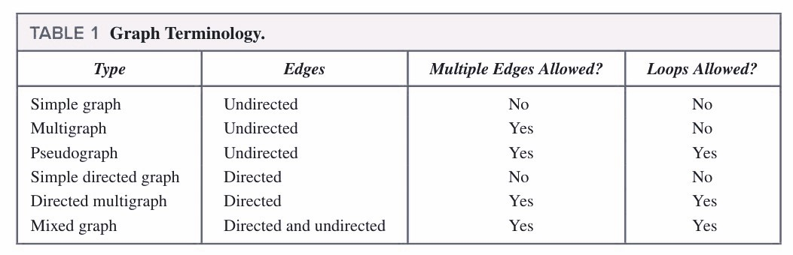

# Chapter9 Graphs

***

## 9.1 Graphs amd Graph Models

**Simple Graph:**

A graph in which each edge connects two different vertices and where no two edges connect the same pair of vertices.

每条边连两个顶点，每两个顶点之间最多一条边。

**Multigraph:**

A graph that may have multiple edges connecting the same vertices.

每条边连两个顶点，每两个顶点之间可能不止一条边。

**Pseudograph:**

A graph that may include loops, and possibly multiple edges connecting the same pair of vertices.

每条边可连同一顶点，每两个顶点之间可能不止一条边。

***

## 9.2 Graph Terminology and Special Types of Graphs

**Theorem 1:**

$$\sum\limits_{v\in V}\deg(v)=2e$$

**Theorem 2:**

An undirected graph has an even number of vertices of odd degree.

**Theorem 3:**

$$\sum\limits_{v\in V}d^+(v)=\sum\limits_{v\in V}d^-(v)=|E|$$

**Complete Graph（$K_n$）:**

**Cycle（$C_n$）:**

**Wheel（$W_n$）:**

**n-Cube（$Q_n$）:**

**Bipartite Graphs:**

A simple graph $G$ is **bipartite（二分）** if $V$ can be partitioned into two disjoint subsets $V_1$ and $V_2$ such that every edge connects a vertex in $V_1$ and a vertex in $V_2$.

可将顶点分成两组，组内没有边，边只在两个组之间连接。

The **complete bipartite graph** is the simple graph that has its vertex set partitioned into two subsets $V_1$ and $V_2$ with $m$ and $n$ vertices, respectively, and every vertex in $V_1$ is connected to every vertex in $V_2$, denoted by $K_{m,n}$, where $m=|V_1|$ and $n=|V_2|$.

在两组中任取一对顶点都有一条边连接。

**Regular Graph（正则图）:**

A simply graph is called **n-regular** if every vertex of this graph has the same degree $n$.

每个顶点度数相同。

**Matching:**

A **matching** $M$ in a simple graph is a subset of edges of the graph such that no two edges are incident with the same vertex.

两两不相邻的边组成的集合。

A vertex that is the endpoint of an edge of a matching $M$ is said to be **matched** in $M$.

A matching $M$ in a bipartite graph with bipartition $(V_1,V_2)$ is a **complete matching** from $V_1$ to $V_2$ if every vertex in $V_1$ is the endpoint of an edge in the matching.

二分图中第一组的每个顶点都被匹配。

**Hall's Marriage Theorem:**

The bipartite graph with bipartition $(V_1,V_2)$ has a complete matching from $V_1$ to $V_2$ if and only if $|N(A)|\geqslant |A|$ for all $A\subseteq V_1$.

从 $V_1$ 中任取 $k$ 个顶点，则 $V_2$ 中与之相连的顶点数大于等于 $k$。

**Subgraph:**

$G=(V,E)$，$H=(W,F)$

* $H$ is a **subgraph** of $G$ if $W\subseteq V$ and $F\subseteq E$.
* Subgraph $H$ is a **proper subgraph（真子图）** of $G$ if $H\neq G$.
* $H$ is a **spanning subgraph（生成子图）** of $G$ if $W=V$ and $F\subseteq E$.
* Subgraph $H$ is **induced（诱导）** by $G$ if $W\subseteq V$ and the edge set $F$ contains an edge in $E$ if and only if both endpoints are in $W$.（$W$ 顶点组在原图的边全部迁移至新图）

***

## 9.3 Representing Graphs and Graph Isomorphism

**Isomorphism of Graph（同构）:**

Two simple graphs $G_1=(V_1,E_1)$ and $G_2=(V_2,E_2)$ are **isomorphic** if there is a 1-1 and onto function $f$ from $V_1$ to $V_2$ such that for all $a$ and $b$ in $V_1$, $a$ and $b$ are adjacent in $G_1$ iff $f(a)$ and $f(b)$ are adjacent in $G_2$. Such a function $f$ is called an **isomorphism**.

给 $G_1$ 的点重新标号后就变成了 $G_2$，即一一对应。

***

## 9.4 Connectivity

The number of different paths of length $r$ from $v_i$ to $v_j$ is equal to $a_{ij}$ of $A^r$, where $A$ is the adjacency matrix representing the graph.

若要计算 $v_i$ 到 $v_j$ 之间长度为 $r$ 的路径数量，只需计算矩阵 $A$ 的 $r$ 次方，所得矩阵的 $a_{ij}$ 即为答案。

The maximally connected subgraphs of $G$ are called the **connected components** or just the **components**.

**Cut Vertex（割点）:**

A vertex is a **cut vertex**（or **articulation point**）, if removing it and all edges incident with it results in more connected components than in the original graph.

移掉割点，连通分量增加。

Similarly if removal of an edge creates more components the edge is called a **cut edge** or **bridge**.

**Strongly/weakly Connected:**

A directed graph is **strongly connected** if there is a path from $a$ to $b$ and from $b$ to $a$ for all vertices $a$ and $b$ in the graph. 

有向图中的强连通表示任意一对顶点都有路径。

The graph is **weakly connected** if the underlying undirected graph is connected.

有向图中的弱连通表示看作无向图是连通的。

***

## 9.5 Euler and Hamilton Paths

**Euler Path:**

An **Euler path** is a simple path containing every edge of $G$.

一笔画。

**Euler Circuit:**

An **Euler circuit** is a simple circuit containing every edge of $G$.

起点和终点相同的一笔画。

**Euler Graph:**

A graph contains an Euler circuit.

有欧拉回路的图。

**Necessary and Sufficient Conditions:**

**Theorem 1:** A connected multigraph has an Euler circuit if and only if each of its vertices has even degree.
（欧拉回路的充要条件：每个顶点的度均为偶数）

**Theorem 2:** A connected multigraph has an Euler path but not an Euler circuit if and only if it has exactly two vertices of odd degree.
（欧拉路径但不是欧拉回路的充要条件：只有两个顶点的度是奇数）

**Theorem 3:** A directed multigraph having no isolated vertices has an Euler circuit if and only if  

* the graph is weakly connected
* the in-degree and out-degree of each vertex are equal
  
（有向图的欧拉回路的充要条件：弱连通且每个顶点的入度和出度相等）

**Theorem 4:** A directed multigraph having no isolated vertices has an Euler path but not an Euler circuit if and only if   

* the graph is weakly connected 
* the in-degree and out-degree of each vertex are equal for all but two vertices, one that has in-degree $1$ larger than its out-degree and the other that has out-degree $1$ larger than its in-degree.

（有向图有欧拉路径但没有欧拉回路的充要条件：弱连通，且除了两个顶点外其余的顶点入度和出度相等，剩余的两个顶点一个入度比出度多 $1$，一个出度比入度多 $1$）

**Hamilton Path:**

A **Hamilton path** in a graph $G$ is a path which visits every vertex in $G$ exactly once.

所有的顶点连接起来。

**Hamilton Circuit:**

A **Hamilton circuit**(or **Hamilton cycle**) is a cycle which visits every vertex exactly once, except for the first vertex, which is also visited at the end of the cycle.

所有的顶点连接起来形成回路。

**Hamilton Graph:**

If a connected graph $G$ has a Hamilton circuit, then $G$ is called a **Hamilton graph**.

有汉密尔顿回路的图。

**Necessary and Sufficient Conditions:**

**Dirac Theorem:** If $G$ is a simple graph with $n$ vertices with $n\geqslant3$ such that the degree of every vertex in $G$ is at least $\frac{n}{2}$, then $G$ has a Hamilton circuit.
（汉密尔顿回路的充分条件：每个顶点的度数至少为总顶点数的一半）

**Ore Theorem:** If $G$ is a simple graph with $n$ vertices with $n\geqslant 3$ such that $\deg(u)+\deg(v)\geqslant n$ for every pair of nonadjacent vertices $u$ and $v$ in $G$, then $G$ has a Hamilton circuit.
（汉密尔顿回路的充分条件：任意两个顶点的度数之和不小于总顶点数）

**Theorem 3:** For undirected graph, the necessary condition for the existence of Hamilton path  

* $G$ is connected
* there are at most two vertices which degree are less than $2$
  
（汉密尔顿路径的必要条件：连通，且度数小于 $2$ 的顶点最多只有两个）

**Theorem 4:** The necessary condition for the existence of Hamilton circuit is that the degree of each vertex is larger than $1$.
（汉密尔顿回路的必要条件：每个顶点的度数都大于 $1$）

**Theorem 5:** $G$ is a Hamilton graph, for any nonempty subset $S$ of set $V$, the number of connected components in $G-S\leqslant S$.
（对于一个汉密尔顿图，对于所有顶点的任意非空子集，$G$去掉该集合后的连通图的个数小于子集的顶点个数）

***

## 9.6 Shortest Path Problems

**Dijkstra's Algorithm:**

**Floyd Algorithm:**

***

## 9.7 Planar Graphs

**Planar Graph（平面图）:**

A graph is called **planar** if it can be drawn in the plane without any edges crossing.

画出来的图边不交叉。

**Region:**

A **region** is a part of the plane completely disconnected off from other parts of the plane by the edges of the graph.

由边划分出来的区域。注意：图之外也是一片区域，称为 unbounded region。

**Euler's Formula:**

For connected planar simple graph $G$:  

$$r=e-v+2$$

* $r$: regions
* $e$: edges
* $v$: vertices

**Degree of Region:**

Suppose $R$ is a region of a connected planar simple graph, the number of the edges on the boundary of $R$ is called the **degree of $R$**.

区域的度数就是围成这个区域的边数。

**Corollary 1:**

If $G$ is a connected planar simple graph with $e$ edges and $v$ vertices where $v\geqslant3$, then $e\leqslant3v-6$.

**Corollary 2:**

If $G$ is a connected planar simple graph, then $G$ has a vertex of degree not exceeding 5.

**Corollary 3:**

If a connected planar simple graph has $e$ edges and $v$ vertices with $v\geqslant3$ and no circuits of length 3,then $e\geqslant 2v-4$.

**Homeomorphic Graphs（同胚）:**

**Kuratowski's Theorem:**

A graph is nonplanar if and only if it contains a subgraph homeomorphic to $K_{3,3}$ or $K_5$.

非平面图的充要条件为其存在一个子图与 $K_{3,3}$ 或 $K_5$ 同胚。

***

## 9.8 Graph Coloring

**Four Color Theorem:**

The chromatic number of a planar graph is no greater than four.

若相邻两点颜色不同，则一张平面图最多只需要四种颜色。