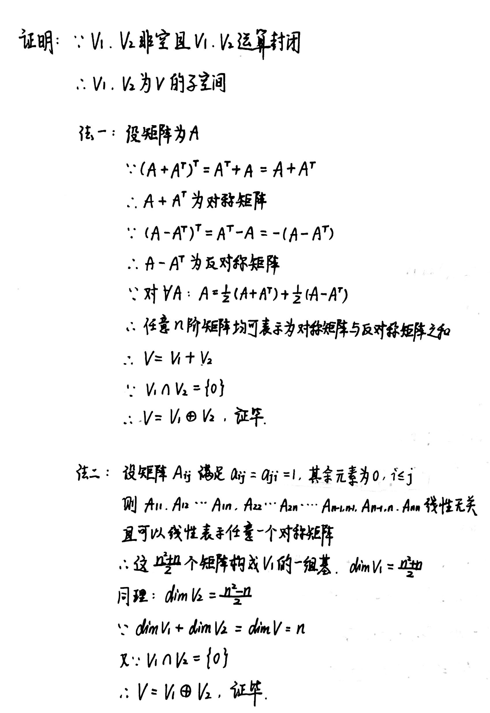

# Chapter1 线性空间与内积空间

***

## 1.1 线性空间

### 线性空间引入

若非空集合V和域F满足以下要求：

1.加法和数乘封闭

2.加法满足：  
   1. 交换律  
   2. 结合律  
   3. 单位元  
   4. 逆元  
   
3.数乘满足：  
   1. 分配律1  
   2. 分配律2  
   3. 结合律  
   4. 单位元  

则称**线性空间V(F)（向量空间）**。

**典例：**

**1.** 系数属于数域$F$且次数不超过$n$的全体多项式(包括零多项式)组成的集合$F[x]_{n+1}$（或$P_n(F)$），在数域$F$上构成线性空间。

但对于固定的$n$，数域$F$上的多项式集合$\\{p(x)|p(x)=a_0+a_1x+···+a_nx^n,a_n\neq 0\\}$不构成线性空间(加法运算不封闭)。

**2.** 实数集$R$在实数集$R$上构成线性空间，复数集$C$在实数集$R$和复数集$C$上分别构成线性空间，但实数集$R$在复数集$C$上不构成线性空间(数乘运算不封闭)。

### 线性子空间

若$V(F)$的非空子集$W$对于$V(F)$的线性运算封闭，则$W$是$V$的**线性子空间**。

零子空间和$V$本身称为$V$的**平凡子空间**。

**线性扩张：** 

V(F)的非空子集S的**线性扩张**：

$$L(S)=\\{\lambda_1\alpha_1+···+\lambda_k\alpha_k|\lambda_1,···,\lambda_k\in F,\alpha_1,···,\alpha_k\in S,k\in N^*\\}$$

线性空间$V(F)$的非空子集$S$的线性扩张$L(S)$是$V$中包含$S$的最小子空间。

!!! Tip "Proof"
    

### 线性相关性

若存在不全为零的$\lambda_1,\lambda_2,···,\lambda_m\in F$，使得

$$\lambda_1\alpha_1+\lambda_2\alpha_2+···+\lambda_m\alpha_m=0$$

则称$\alpha_1,\alpha_2,···,\alpha_m$**线性相关**，否则称为**线性无关**。

**定理1：**

若向量组$\\{\alpha_1,\alpha_2,···,\alpha_n\\}$线性无关，而向量组$\\{\beta,\alpha_1,\alpha_2,···,\alpha_n\\}$线性相关，则$\beta$可由$\alpha_1,\alpha_2,···,\alpha_n$线性表示，且表示法唯一。（若向量组线性相关，则表示方法有无穷多种）  

**定理2：**

如果$\\{\alpha_1,\alpha_2,···,\alpha_n\\}$是$R^n$中线性无关的$n$个向量，则$R^n$中任一向量$\alpha$可由$\alpha_1,\alpha_2,···,\alpha_n$线性表示，且表示法唯一。

**定理3：**

设$V(F)$中向量组$\\{\beta_1,\beta_2,···,\beta_s\\}$的每个向量可由另一向量组$\\{\alpha_1,\alpha_2,···,\alpha_r\\}$线性表示.如果$s>r$，则$\\{\beta_1,\beta_2,···,\beta_s\\}$线性相关。

等价命题：如上所设。如果$\\{\beta_1,\beta_2,···,\beta_s\\}$线性无关，则$s\leqslant r$。

### 基，秩与维数

如果线性空间$V(F)$的有限子集$B=\\{\alpha_1,··,\alpha_n\\}$线性无关，且$L(B)=V$，则称$B$为$V$的一组**基**，并称$n$为$V$的**维数**，记作$\dim V=n$。

设集合$S$中存在线性无关的向量组$B=\\{\alpha_1,···,\alpha_r\\}$，且$S$中每个元素都可由$B$线性表示，则$B$中向量的个数$r$叫做$S$的**秩**，向量组$B$称为$S$的**极大线性无关组**。

!!! Note
    维数和秩的主要差别：维数一定对应线性空间，秩可以对应非线性空间。

!!! Example
    **例：已知$R^4$的一个子集$S=\{\alpha_1,\alpha_2,\alpha_3,\alpha_4\}$，其中  
    $\alpha_1=(1,1,0,1)$  
    $\alpha_2=(0,1,2,4)$  
    $\alpha_3=(2,1,-2,-2)$  
    $\alpha_4=(0,1,1,1)$  
    求$L(S)$的维数及其一组基$B$。**

    

**定理：**

如果$W$是$n$维线性空间$V$的一个子空间，则$W$的基可以扩充为$V$的基。

**扩充方法：**

设线性空间维数为$n$，已有的线性无关向量组$B=\\{\alpha_1,\alpha_2,···,\alpha_s\\}$，其中$s<n$，算法如下：

(1) 若$V$不是$F^n$空间，则选择$V$的一组自然基，得到$B$中每一向量在该自然基下的坐标。

(2) 另外选择$V$的一组基$B_0=\\{\beta_1,\beta_2,···,\beta_n\\}$（也可以是自然基），得到新的向量组$B_1=\\{\alpha_1,\alpha_2,···,\alpha_s,\beta_1,\beta_2,···,\beta_n\\}$。

(3) 求解$B_1$的极大线性无关组（注意：$\alpha_1,\alpha_2,···,\alpha_s$不可以扔掉）。

(4) 将所得的极大线性无关组根据(1)的坐标还原即为扩充得到的一组基。

### 交、和与直和

设$W_1,W_2$是线性空间$V(F)$的两个子空间，则

$$W_1\cap W_2=\\{\alpha|\alpha\in W_1~and~\alpha\in W_2\\}$$

$$W_1+W_2=\\{\alpha|\alpha=\alpha_1+\alpha_2,\alpha_1\in W_1,\alpha_2\in W_2\\}$$

分别称为$W_1,W_2$的**交**与**和**，其仍为$V$的子空间。

设$W_1,W_2$是$V(F)$两个子空间，如果$W_1\cap W_2=\\{0\\}$，则$W_1+ W_2$为$W_1$和$W_2$的**直和**，记作$W_1\oplus W_2$。

若线性空间$V=W_1\oplus W_2$，则$W_1$和$W_2$互为**补空间**。

**等价命题：**

对子空间$W_1$和$W_2$，下列命题等价：

(1) $W_1\cap W_2$是直和（即$W_1\cap W_2=\\{0\\}$）；

(2) $W_1+W_2$中的每个向量$\alpha$的分解式$\alpha=\alpha_1+\alpha_2$是唯一的.

(3) 零向量$0$的分解式$0=\alpha_1+\alpha_2$，当且仅当$\alpha_1=\alpha_2=0$时成立.

(4) $\dim(W_1+W_2)=\dim W_1+\dim W_2$.

**与多空间直和相关的定理：**

若

$$V=V_1\oplus V_2,~V_1=V_{11}\oplus V_{12}\oplus···\oplus V_{1s},~V_2=V_{21}\oplus V_{22}\oplus···\oplus V_{2t}$$

则

$$V=V_{11}\oplus V_{12}\oplus···\oplus V_{1s}\oplus V_{21}\oplus V_{22}\oplus···\oplus V_{2t}$$

**维数公式:**

$$\dim W_1+\dim W_2=\dim(W_1+W_2)+\dim(W_1\cap W_2)$$

!!! Tip "Proof"
    

!!! Example
    **例1：设$R^4$的两个子空间$S_1$和$S_2$为：  
    $S_1=\\{(x_1,x_2,x_3,x_4)|x_1+x_2+x_3+x_4=0\\}$ 
    $S_2=\\{(x_1,x_2,x_3,x_4)|x_1-x_2-x_3+x_4=0,x_1+x_2+x_3-x_4=0\\}$   
    求$S_1+S_2,S_1\cap S_2$和$S_2$的补空间的基。**

    
    

!!! Example
    **例2：数域$F$上所有$n$阶方阵组成的线性空间$V=M_n(F)$，$V_1$表示所有对称矩阵组成的集合，$V_2$表示所有反对称矩阵组成的集合.证明：$V_1,V_2$均为$V$的子空间，且$V=V_1\oplus V_2$。**

    

***

## 1.2 内积空间

### 内积空间

在实空间$V(R)$上定义一个二元运算，记作$(\alpha ,\beta)$，若满足：

$(1)(\alpha ,\beta)=(\beta ,\alpha)$

$(2)(\alpha +\beta ,\gamma)=(\alpha ,\gamma )+(\beta ,\gamma )$

$(3)(\lambda \alpha ,\beta)=\lambda (\alpha ,\beta)$

$(4)(\alpha ,\alpha)\geqslant 0\Leftrightarrow\alpha=0$

则称实数$(\alpha ,\beta)$为向量$\alpha,\beta$的**内积**，定义了内积的线性空间称为**内积空间**，有限维的内积空间又叫**欧氏空间**。

**长度：**

$$|\alpha|=\sqrt{(\alpha ,\alpha)}$$

**Cauchy-Schwarz不等式：**

$$|(\alpha ,\beta)|\leqslant |\alpha||\beta|$$

**三角不等式：**

$$|\alpha +\beta|\leqslant|\alpha|+|\beta|$$

**夹角：**

$$\langle \alpha ,\beta \rangle = \arccos\frac{(\alpha ,\beta)}{|\alpha||\beta|}$$

**正交：**

$$(\alpha ,\beta)=0$$

在内积空间中两两正交的非零向量组$S={\alpha_1,\alpha_2,···,\alpha_n}$是线性无关的。

### 欧氏空间的单位正交基

设$B=\\{\varepsilon_1,\varepsilon_2,···,\varepsilon_n\\}$是$n$维欧氏空间$V(R)$的一个子集，如果

$$(\varepsilon_i,\varepsilon_j)=\begin{cases}
   1,i=j\\\
   0,i\neq j
\end{cases}
i,j=1,2,···,n$$

则称$B$为$V$的**单位正交基**。欧氏空间恒有单位正交基(Schmidt正交化过程)。

!!! Tip "Proof"
    

**单位正交基与坐标：**

如果$B=\\{\varepsilon_1,\varepsilon_2,···,\varepsilon_n\\}$是$n$维欧氏空间的一组单位正交基，$\alpha,\beta$关于基$B$的坐标为分别为$(a_1,a_2,···,a_n)$和$(b_1,b_2,···,b_n)$，则

$$a_i=(\alpha,\varepsilon_i),~i=1,2,···,n$$

$$(\alpha,\beta)=a_1b_1+a_2b_2+···+a_nb_n$$