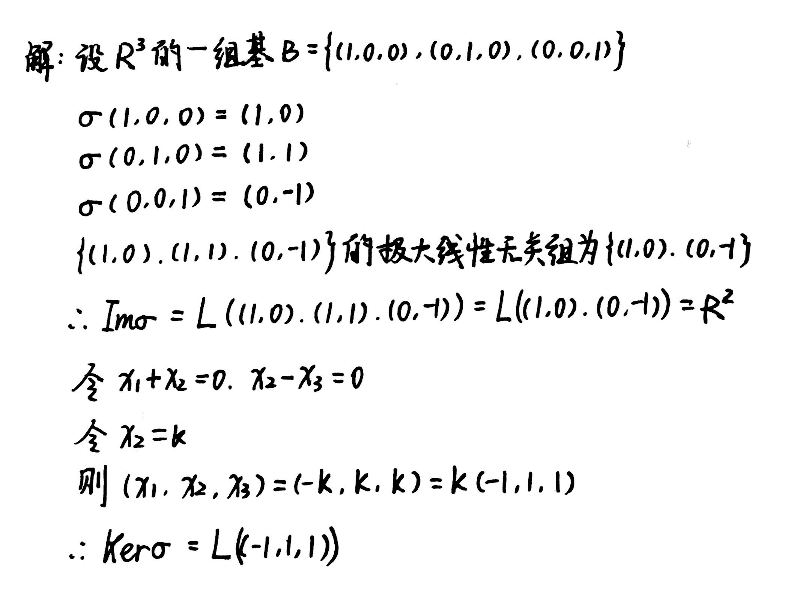
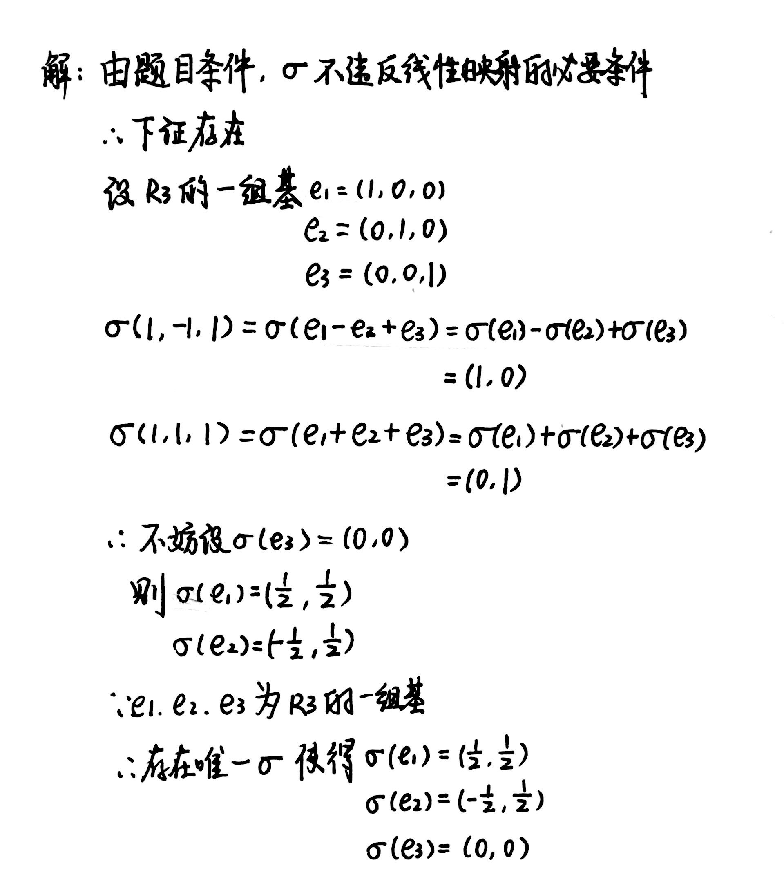
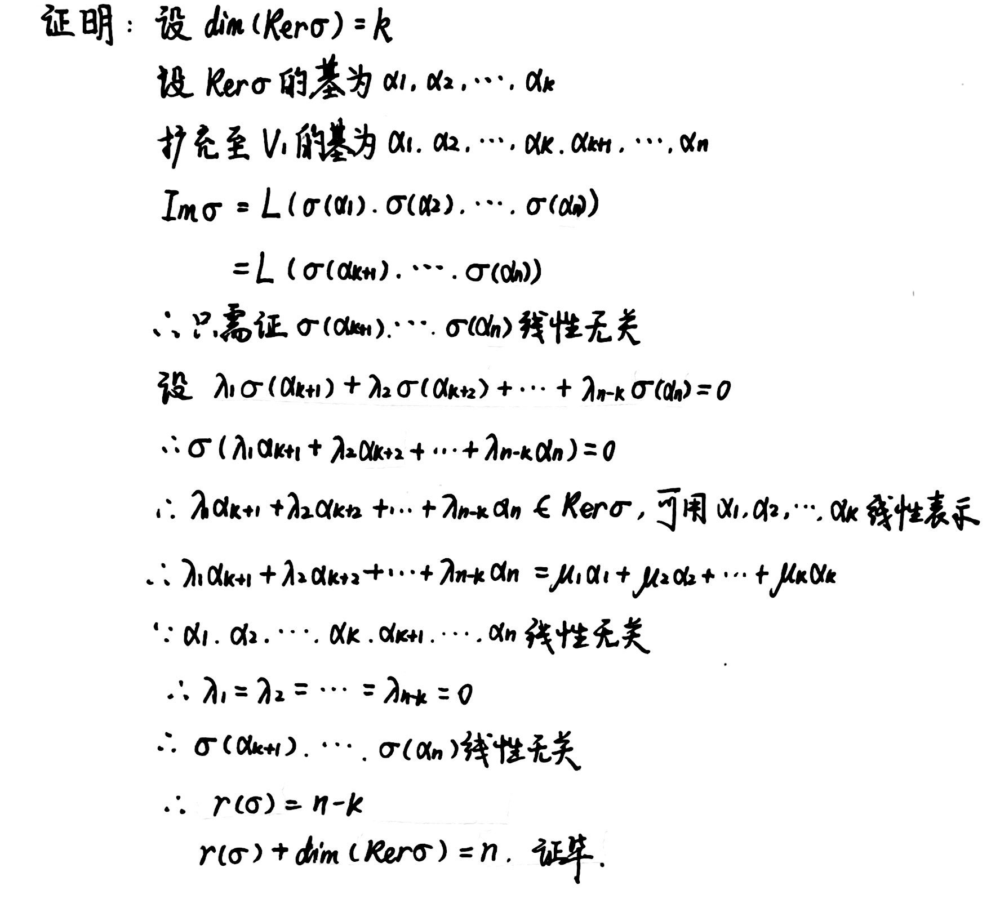

# Chapter2 线性映射

***

## 2.1 线性映射

### 线性映射基本知识

设线性空间$V_1(F)$到$V_2(F)$的一个映射$\sigma$，若对于$\forall \alpha,\beta\in V_1$和$\forall \lambda,\mu\in F$都有

$$\sigma(\lambda\alpha+\mu\beta)=\lambda\sigma(\alpha)+\mu\sigma(\beta)$$

即对于加法和数乘封闭，则映射$\sigma$称为**线性映射**。

从线性空间$V$到自身的线性映射$\sigma$也叫做$V$上的**线性变换**。

从线性空间$V(F)$到域$F$的线性映射$f$叫做$V$上的**线性函数**。

**线性空间的基本性质：**

若$V_1(F)$中的向量组$\alpha_1,\alpha_2,···,\alpha_m$线性相关，则它们的像$\sigma(\alpha_1),\sigma(\alpha_2),···,\sigma(\alpha_m)$也线性相关。

!!! Note
    注意：若$\alpha_1,\alpha_2,···,\alpha_m$线性无关，则它们的像也有可能线性相关。

### 线性空间的像与核

$V_1$所有元素在线性映射$\sigma$下的像所组成的集合称为$\sigma$的**像**，记为$Im(\sigma)$。

$V_2$的零元在线性映射$\sigma$下所有原像所组成的集合称为$\sigma$的**核**，记为$Ker(\sigma)$。

**像与核的性质：**

(1) $Im\sigma$是$V_2$的子空间，$Ker\sigma$是$V_1$的子空间

(2) $\sigma$是单射$\Longleftrightarrow$$Ker\sigma=\\{0\\}$

(3) 设$V_1$的一组基$B=\\{\alpha_1,\alpha_2,···,\alpha_n\\}$，则$Im\sigma=L(\sigma(\alpha_1),\sigma(\alpha_2),···,\sigma(\alpha_n))$

!!! Example
    **例：已知$R^3$到$R^2$的映射$\sigma$为$\sigma(x_1,x_2,x_3)=(x_1+x_2,x_2-x_3)$，求$Im\sigma,Ker\sigma$。**

    

### 线性映射的运算空间$L(V_1,V_2)$

线性空间$V_1(F)$到$V_2(F)$的所有线性映射组成的集合称为$L(V_1,V_2)$，该集合也是一个线性空间。

$$(\sigma+\tau)(\alpha)=\sigma(\alpha)+\tau(\alpha)$$

$$(\lambda \sigma)(\alpha)=\lambda(\sigma(\alpha))$$

$$\tau \sigma(\alpha)=\tau(\sigma(\alpha))$$

### 线性映射的确定

设$B=\\{\alpha_1,\alpha_2,···,\alpha_n\\}$是$V_1(F)$的基，$S=\\{\beta_1,\beta_2,···,\beta_n\\}$是$V_2(F)$的任意$n$个向量，则存在唯一的$\sigma\in L(V_1,V_2)$，使得

$$\sigma(\alpha_i)=\beta_i,~i=1,2,···,n$$

**判断线性映射的方法：**

(1) 若$V_1$的零元映射到$V_2$不是零元，则$\sigma$不是线性映射。

(2) 若线性相关的向量组映射到了线性无关的向量组，则$\sigma$不是线性映射。

(3) 若映射是从低维空间到高维空间的满射，则$\sigma$不是线性映射。

如果题目给定的映射不违反上述线性映射的必要条件，那我们可以根据上述定理构造出相应的映射。

!!! Example
    **例：是否存在$R^3$到$R^2$的线性映射$\sigma$满足$\sigma(1,-1,1)=(1,0),\sigma(1,1,1)=(0,1)$?**

    

***

## 2.2 线性映射基本定理

### 线性映射的秩

设$\sigma\in L(V_1,V_2)$，若$Im\sigma$是$V_2$的有限维子空间，则$Im\sigma$的维数称为$\sigma$的**秩**，记作$r(\sigma)$，即

$$r(\sigma)=\dim(Im\sigma)$$

**线性映射基本定理：**

设$\sigma\in L(V_1,V_2)$，若$\dim(V_1)=n$，则

$$r(\sigma)+\dim(Ker\sigma)=n$$

!!! Tip "Proof"
    

**等价命题：**

设$\sigma\in L(V_1,V_2),\dim V_1=\dim V_2=n$，则下列命题等价：

(1) $r(\sigma)=n$（$\sigma$满秩）

(2) $\sigma$是单射

(3) $\sigma$是满射

(4) $\sigma$是可逆线性映射

(5) $Ker\sigma=\\{0\\}$

**其他定理：**

(1) 设$V_1,V_2,V_3$分别是$m,n,s$维线性空间，$\sigma\in L(V_1,V_2),\tau \in L(V_2,V_3)$，则

$$r(\sigma)+r(\tau)-n\leqslant r(\tau\sigma)\leqslant \min(r(\sigma),r(\tau))$$

(2) 设$V_1$是有限维线性空间，$\sigma,\tau \in L(V_1,V_2)$，则

$$r(\sigma+\tau)\leqslant r(\sigma)+r(\tau)$$

(3) 设$\sigma\in L(V,V)$，若$\sigma$为幂等变换（即$\sigma^2=\sigma$），则

$$V=Ker\sigma \oplus Im\sigma$$

(4) 若$V_1(F)$和$V_2(F)$分别是$n$和$m$维线性空间，则空间$L(V_1,V_2)$的维数为$nm$

### 线性映射的同构

如果线性空间$V_1(F)$到$V_2(F)$存在一个线性双射$\sigma$，则称$V_1(F)$和$V_2(F)$**同构**，记作

$$V_1(F)\cong V_2(F)$$

$\sigma$为**同构映射**。

两个有限维线性空间$V_1(F)$和$V_2(F)$同构的充要条件为**维数相等**。

**定理：**

若$\sigma$是$V_1$到$V_2$的同构映射，$S_1=\\{\alpha_1,\alpha_2,···,\alpha_m\\}$为$V_1$任意一组向量，$S_2=\\{\sigma(\alpha_1),\sigma(\alpha_2),···,\sigma(\alpha_m)\\}$，则$r(S_1)=r(S_2)$，即同构映射不改变向量组的秩，具有相同的线性相关性。
