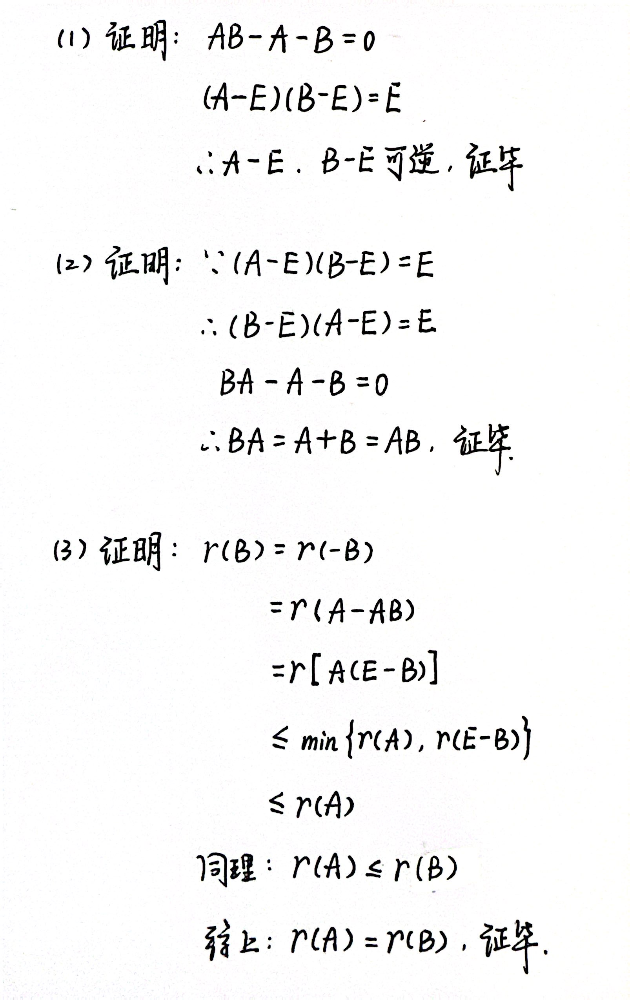

# Chapter3 矩阵

***

## 3.1 矩阵基础知识

$$\begin{pmatrix}
{a_{11}}&{a_{12}}&{···}&{a_{1n}}\\\
{a_{21}}&{a_{22}}&{···}&{a_{2n}}\\\
{···}&{···}&{···}&{···}\\\
{a_{m1}}&{a_{m2}}&{···}&{a_{mn}}\\
\end{pmatrix}$$

记作$M_{m\times n}(F)$或$F^{m\times n}$。

### 特殊矩阵

**方阵(n阶矩阵)：** $m=n$的矩阵

**对角矩阵(对角阵)：** 非主对角线上的元素全为0的方阵

**上(下)三角矩阵：** 主对角线之下(上)的元素全为0的方阵

**单位矩阵($E$):** 主对角线上的元素全为1，非主对角线上的元素全为0的方阵

**数量矩阵($\lambda E$):** 主对角线上的元素全为$\lambda $，非主对角线上的元素全为0的方阵 

### 线性映射的矩阵表示

**定义：**

设$B_1=\\{\varepsilon_1,\varepsilon_2,···,\varepsilon_n\\}$是$V_1(F)$的基，$B_1=\\{e_1,e_2,···,e_m\\}$是$V_2(F)$的基，设线性映射$\sigma\in L(V_1,V_2)$，则

$$\begin{cases}
\sigma(\varepsilon_1)=a_{11}e_1+a_{21}e_2+···+a_{m1}e_m\\\
\sigma(\varepsilon_2)=a_{12}e_1+a_{22}e_2+···+a_{m2}e_m\\\
···\\\
\sigma(\varepsilon_n)=a_{1n}e_1+a_{2n}e_2+···+a_{mn}e_m
\end{cases}$$

$\sigma(\varepsilon_1),\sigma(\varepsilon_2),···,\sigma(\varepsilon_n)$关于基$B_2$的坐标可按列排成矩阵$M(\sigma)$，即

$$\begin{pmatrix}
{a_{11}}&{a_{12}}&{···}&{a_{1n}}\\\
{a_{21}}&{a_{22}}&{···}&{a_{2n}}\\\
{···}&{···}&{···}&{···}\\\
{a_{m1}}&{a_{m2}}&{···}&{a_{mn}}
\end{pmatrix}$$

该矩阵为$\sigma$关于基$B_1$和基$B_2$的矩阵。$m$为到达空间的维数，$n$为出发空间的维数。

可表示为

$$(\sigma (\varepsilon_1),\sigma(\varepsilon_2),···,\sigma(\varepsilon_n))=\sigma(\varepsilon_1,\varepsilon_2,···\varepsilon_n)=(e_1,e_2,···,e_n)M(\sigma)$$

**维数：**

域$F$上全体$m×n$矩阵组成的集合$M_{m×n}(F)$对矩阵的加法和数乘运算在域$F$上构成一个线性空间，维数等于$m×n$.

证明：可以找到$m\times n$个矩阵，每个矩阵各自有一个元素为1，其余元素为0，则这$m\times n$个矩阵线性无关，且可以表示所有$m\times n$的矩阵，即为集合$M_{m\times n}(F)$的基。

!!! Example
    **例：已知$\sigma\in L(R^3,R^2)$且$\sigma(x_1,x_2,x_3)=(x_1+x_2,2x_1-x_2-4x_3)$，求$\sigma$关于$R^3$的自然基$B_1=\\{\varepsilon_1,\varepsilon_2,\varepsilon_3\\}$和$R^2$的自然基$B_2=\\{e_1,e_2\\}$的矩阵$M(\sigma)$。**

    $\sigma(\varepsilon_1)=\sigma(1,0,0)=(1,2)=e_1+2e_2$  
    $\sigma(\varepsilon_2)=\sigma(0,1,0)=(1,-1)=e_1-e_2$  
    $\sigma(\varepsilon_3)=\sigma(0,0,1)=(0,-4)=-4e_2$  
    所以$M(\sigma)=\begin{pmatrix}  
    {1}&{1}&{0}\\\  
    {2}&{-1}&{-4}  
    \end{pmatrix}$  

### 矩阵的乘法

**定义:**

新矩阵的第$i$行第$j$列元素$c_{ij}$等于前一个矩阵的第$i$行乘上后一个矩阵的第$j$列。

**满足规律:**

1.结合律1：$(AB)C=A(BC)$

2.结合律2：$\lambda (AB)=(\lambda A)B=A(\lambda B)$

3.左分配律：$A(B+C)=AB+AC$

4.右分配律：$(B+C)P=BP+CP$

!!! Note
    注意：矩阵的乘法不一定满足交换律.若满足$AB=BA$，则$A,B$必为同阶方阵，此时称$A$与$B$**可交换**。

**常用结论:**

1.$n$阶单位矩阵$E$和$\forall A\in M(F)$，都有$EA=AE=A$

2.$n$阶数量矩阵$\lambda E$与$\forall A\in M(F)$，有$(\lambda E)A=A(\lambda E)=\lambda A$

3.设$\sigma\in L(V_1,V_2)$关于$V_1$和$V_2$的基$B_1$和$B_2$的矩阵为$A$，$\alpha$关于基$B_1$的坐标矩阵为$X$，$\sigma(\alpha)$关于基$B_2$的坐标矩阵为$Y$，则
$Y=AX$

### 可逆矩阵

**定义：**

设$A\in M_n(F)$，如果存在$B\in M_n(F)$，使得$BA=AB=E$，则称矩阵$A$是**可逆的**，$B$是$A$的**逆矩阵**。

设$A,B\in M_n(F)$，若$AB=E$，则必有$BA=E$，即$A,B$互为**逆矩阵**。

等价关系：$\sigma$可逆 $\Leftrightarrow A$可逆 $\Leftrightarrow AX=0$当且仅当$X=0 \Leftrightarrow A$的列向量线性无关

**运算性质:**

(1) 若$A$可逆，则对于$\forall \lambda \in F$且$\lambda \neq 0，\lambda A$可逆，且$(\lambda A)^{-1}=\lambda^{-1}A^{-1}$

(2) 若$A,B\in M_n(F)$都可逆，则$AB$可逆，且$(AB)^{-1}=B^{-1}A^{-1}$

(3) 若$A,B\in M_n(F)$且$AB$可逆，则$A,B$都可逆

(4) 若$A$可逆，则由$AB=AC$可以推出$B=C$

(5) 主对角元都是非零数的对角矩阵一定可逆，且逆矩阵就是对角线上元素取倒数

**例题：**

!!! Example
    **例1：求逆矩阵的法一。判断下面矩阵$A、B$是否可逆？若可逆，求其逆矩阵。**

    $A=\begin{pmatrix}    
        {1}&{-1}&{1}\\\  
        {0}&{1}&{2}\\\  
        {1}&{0}&{4}  
    \end{pmatrix}$ $B=\begin{pmatrix}  
        {1}&{-1}&{1}\\\  
        {0}&{1}&{2}\\\  
        {1}&{0}&{3}  
    \end{pmatrix}$  

    

!!! Example
    **例2：设方阵$B$为幂等矩阵（即$B^2=B,从而\forall k\in N^{\*},B^k=B$），$A=E+B$，证明$A$是可逆阵，并求$A^{-1}$。**

    

!!! Example
    **例3：求证：矩阵$A$可逆的充要条件是存在多项式$f(x)$满足$f(A)=0$且$f(0)\neq 0$。**

    

### 矩阵的转置

**定义：**

把矩阵$A=(a_{ij})_{m×n}$的行列依次互换得到的一个$n×m$矩阵，称为$A$的**转置矩阵**,记作$A^T$。

**运算性质：**

$$(A+B)^T=A^T+B^T$$

$$(AB)^T=B^TA^T$$

$$(A^T)^{-1}=(A^{-1})^T$$

**对称矩阵与反对称矩阵：**

方阵$A$为**对称矩阵**的充要条件是

$$A^T=A$$

方阵$A$为**反对称矩阵**的充要条件是

$$A^T=-A$$

### 矩阵的初等变换

**定义：**

将单位矩阵$E$作一次初等变换所得到的矩阵称为**初等矩阵**。

三种初等变换分别为：

1.将单位矩阵第$i$行（或列）乘$c$，得到初等倍乘矩阵$E_i(c)$；

2.将单位矩阵第$i$行乘$c$加到第$j$行，或将第$j$列乘$c$加到第$i$列，得到初等倍加矩阵$E_{ij}(c)$；

3.将单位矩阵第$i,j$行（或列）对换，得到初等对换矩阵$E_{ij}$。

**性质：**

1.初等矩阵左乘矩阵$A$是对$A$作相应的初等行变换；初等矩阵右乘矩阵$A$是对$A$作相应的初等列变换。

2.初等矩阵都是可逆矩阵。

3.对任一个可逆矩阵$A$，都可以作若干次初等行变换将其化为单位矩阵$E$，即存在初等矩阵$P_1,P_2,···,P_k$，使得

$$P_k···P_2P_1A=E$$

推论1：可逆矩阵$A$可表示为若干初等矩阵的乘积。

推论2：如果对可逆矩阵$A$和同阶单位矩阵$E$作同样的初等变换，则当$A$变为$E$时，$E$变为$A^{-1}$。

### 矩阵的秩

**定义：**

设$A$是线性映射$\sigma$对应的矩阵，$\sigma$的像空间的维数等于矩阵$A$的**秩**，记作$r(A)$。

矩阵$A$的列向量的秩(列向量极大线性无关组元素的个数)称为$A$的**列秩**，记作$r_c(A)$。

矩阵$A$的行向量的秩(行向量极大线性无关组元素的个数)称为$A$的**行秩**，记作$r_r(A)$。

**定理：**

1.$r(A)=r_c(A)=r_r(A)$

2.阶梯形矩阵的秩等于它的非零行的个数。

3.初等行变换和初等列变换都不改变矩阵的秩。

4.若秩$(A_{m×n})=r$,则存在可逆矩阵$P,Q$，使得

$$PAQ=\begin{pmatrix}
{1}&{0}&{···}&{0}&{0}&{···}&{0}\\\
{0}&{1}&{···}&{0}&{0}&{···}&{0}\\\
{···}&{ }&{ }&{ }&{ }&{ }&{···}\\\
{0}&{0}&{···}&{1}&{0}&{···}&{0}\\\
{0}&{0}&{···}&{0}&{0}&{···}&{0}\\\
{···}&{ }&{ }&{ }&{ }&{ }&{···}\\\
{0}&{0}&{···}&{0}&{0}&{···}&{0}
\end{pmatrix}=
\begin{pmatrix}
   {E_r}&{0}\\\
   {0}&{0}
\end{pmatrix}=U_r$$

5.$r(A+B)\leqslant r(A)+r(B)$

6.$r(AB)\leqslant \min\{r(A),r(B)\}$

7.$r\begin{pmatrix}
A&O\\\
O&B    
\end{pmatrix}=r(A)+r(B)$

!!! Example
    **例：若$A,B$为$n$阶矩阵且$A+B=AB$，证明：  
    （1）$A-E,B-E$均可逆  
    （2）$AB=BA$  
    （3）$r(A)=r(B)$**  

    

### 相抵标准形

设$m\times n$矩阵$A$，则存在可逆矩阵$P,Q$，使得

$$PAQ=\begin{pmatrix}
{E_r}&{O}\\\
{O}&{O}    
\end{pmatrix}=U_r$$

其中$E_r$表示$r$阶单位矩阵，$r=r(A)$，矩阵$U_r$称为$A$的**相抵标准形**。

任何一个矩阵都有相抵标准形，所有行列数相等且秩相等的矩阵有相同的相抵标准形。

设$A,B\in M_{m×n}(F)$，如果$A$经过初等变换可以化为$B$，就称$A$**相抵于**$B$($A$**等价于**$B$)，记作$A\cong B$。

**性质：**

1.$A\cong B$的充要条件是存在可逆矩阵$P,Q$，使得$PAQ=B$。

2.$A\cong B$的充要条件是$r(A)=r(B)$。

3.设$A\in M_n(F)$，则下列命题等价：

* $A$可逆
* $r(A)=n$
* $A$的$n$个列(行)向量线性无关
* 齐次线性方程组$AX=0$只有零解

### 迹

$n$阶方阵$A$的主对角线上的元素之和称为$A$的**迹**，记为$tr(A)$，即

$$tr(A)=\sum\limits_{i=1}^{n}a_{ii}$$

### 分块矩阵

分块矩阵的乘法：把矩阵当作数来乘。

分块矩阵的转置：大矩阵要转置，小矩阵也要转置。

当$n$阶方阵$A$中非零元素都集中在主对角线附近时，可将$A$分块成**对角块矩阵**(又称**准对角矩阵**)：

$$A=diag(A_1,A_2,···,A_m)$$

对角块矩阵可逆的充要条件是子块都可逆，且$A^{-1}$也是对角块矩阵：

$$A^{-1}=diag(A_1^{-1},A_2^{-1},···,A_m^{-1})$$

!!! Example
    **例：设$n$阶矩阵$A$分块为  
    $A=\begin{pmatrix}  
    {B}&{O}\\\  
    {C}&{D}     
    \end{pmatrix}$  
    其中$B,D$分别为$k$阶和$m$矩阵.证明：$A$可逆的充要条件为$B,D$都是可逆矩阵，并求$A^{-1}$。**

    

### 分块矩阵的初等变换

对于矩阵

$$A=\begin{pmatrix}
{A_{11}}&{A_{12}}\\\
{A_{21}}&{A_{22}}  
\end{pmatrix}$$

和可逆矩阵$C$：

**分块倍乘矩阵:**

左乘$\begin{pmatrix}
{C}&{O}\\\
{O}&{E_m}  
\end{pmatrix}$：原矩阵第一行倍乘$C$

右乘$\begin{pmatrix}
{C}&{O}\\\
{O}&{E_m}  
\end{pmatrix}$：原矩阵第一列倍乘$C$

左乘$\begin{pmatrix}
{E_k}&{O}\\\
{O}&{C}  
\end{pmatrix}$：原矩阵第二行倍乘$C$

右乘$\begin{pmatrix}
{C}&{O}\\\
{O}&{E_m}  
\end{pmatrix}$：原矩阵第二列倍乘$C$

**分块倍加矩阵:**

左乘$\begin{pmatrix}
{E_k}&{O}\\\
{C}&{E_m}  
\end{pmatrix}$：原矩阵第一行乘$C$倍加到第二行

右乘$\begin{pmatrix}
{E_k}&{O}\\\
{C}&{E_m}  
\end{pmatrix}$：原矩阵第二列乘$C$倍加到第一列

左乘$\begin{pmatrix}
{E_k}&{C}\\\
{O}&{E_m}  
\end{pmatrix}$：原矩阵第二行乘$C$倍加到第一行

右乘$\begin{pmatrix}
{E_k}&{C}\\\
{O}&{E_m}  
\end{pmatrix}$：原矩阵第一列乘$C$倍加到第二列

**分块对换矩阵:**

左乘$\begin{pmatrix}
{O}&{E_m}\\\
{E_k}&{O}  
\end{pmatrix}$：原矩阵第一行和第二行交换

右乘$\begin{pmatrix}
{O}&{E_m}\\\
{E_k}&{O}
\end{pmatrix}$：原矩阵第一列和第二列交换

!!! Example
    **例：$n$阶矩阵$A$分块表示为    
    $A=\begin{pmatrix}  
    {A_{11}}&{A_{12}}\\\    
    {A_{21}}&{A_{22}}   
    \end{pmatrix}$  
    其中$A_{11},A_{22}$是方阵.证明：如果$A$和$A_{11}$可逆，则$A_{22}-A_{21}A_{11}^{-1}A_{12}$可逆，并求$A^{-1}$。** 

    

### 变换矩阵

**定义：**

设$B_1={\alpha_1,\alpha_2,···,\alpha_n}$和$B_2={\beta_1,\beta_2,···,\beta_n}$是线性空间$V(F)$的两组基，$\beta_i=a_{1i}\alpha_1+a_{2i}\alpha_2+···+a_{ni}\alpha_n$，即$\beta_i$在基$B_1$下的坐标为$(a_{1i},a_{2i},···,a_{ni})$，因此

$$(\beta_1,\beta_2,···,\beta_n)=(\alpha_1,\alpha_2,···,\alpha_n)
\begin{pmatrix}
{a_{11}}&{a_{12}}&{···}&{a_{1n}}\\\
{a_{21}}&{a_{22}}&{···}&{a_{2n}}\\\
{···}&{ }&{ }&{···}\\\
{a_{n1}}&{a_{n2}}&{···}&{a_{nn}}
\end{pmatrix}$$

我们称右侧矩阵为基$B_1$变为基$B_2$的**变换矩阵**。

**性质：**

设上述变换矩阵为$A$，如果$\xi \in V(F)$，且在$B_1,B_2$下的坐标分别为$X,Y$，则

$$Y=A^{-1}X$$

!!! Example
    **例：已知$R[x]_4$的两组基$B_1=\{g_1,g_2,g_3,g_4\}$和$B_2=\{h_1,h_2,h_3,h_4\}$为    
    $g_1=1+x+x^2+x^3$   
    $g_2=x+x^2+x^3$ 
    $g_3=x^2+x^3$   
    $g_4=x^3$   
    $h_1=1-x+x^3$   
    $h_2=1+x$   
    $h_3=1+x-x^2$   
    $h_4=1-x+x^2$   
    求$B_1$变为$B_2$的变换矩阵$C$。**   

    

### 矩阵重要定理

**定理一：**

若$\alpha_1,\alpha_2,···,\alpha_s$线性无关，且$(\beta_1,\beta_2,···,\beta_s)=(\alpha_1,\alpha_2,···,\alpha_s)A$，则向量组$\beta_1,\beta_2,···,\beta_s$的秩等于矩阵$A$的秩。

**定理二：**

已知$\beta_i=a_{1i}\alpha_1+a_{2i}\alpha_2+···+a_{ni}\alpha_n,i=1,2,···,n$，且$A=(a_{ij})$可逆，则$\alpha_1,\alpha_2,···,\alpha_n$与$\beta_1,\beta_2,···,\beta_n$等价，即可以互相线性表示。

### 特殊矩阵

**对角矩阵和对角块矩阵：**

(1) 对角矩阵$diag(d_1,d_2,···,d_n)$可逆当且仅当对角线上元素均不为零，此时逆矩阵为$diag(d_1^{-1},d_2^{-1},···,d_n^{-1})$。

(2) 对角块矩阵$diag(A_1,A_2,···,A_n)$可逆当且仅当每个分块矩阵$A_i$可逆，此时逆矩阵为$diag(A_1^{-1},A_2^{-1},···,A_n^{-1})$。

(3)  两个对角矩阵$A=diag(a_1, a_2,···,a_n),B=diag(b_1,b_2,···,b_n)$的乘积仍然是对角矩阵，且$AB=diag(a_1b_1,a_2b_2,···,a_nb_n)$。

(4)  两个对角块矩阵$A=diag(A_1,A_2,···,A_n),B=diag(B_1,B_2,···,B_n)$中$A_i$和$B_i$是同级方阵，则乘积仍然是准对角矩阵，且$AB=diag(A_1B_1,A_2B_2,···, A_nB_n)$。

**上下三角矩阵：**

(1) 若$A,B$都是上三角矩阵，则$AB$仍然是上三角矩阵，且$AB$的主对角元素等于$A,B$主对角元元素的乘积，即$a_{11}b_{11},a_{22}b_{22},···,a_{nn}b_{nn}$。

(2) 若$A$是上三角矩阵，则$A$可逆的充要条件是其主对角元均不为零，且$A$可逆时，$A^{-1}$也是上三角矩阵，且$A^{-1}$的主对角元元素分别为$a_{11}^{-1},a_{22}^{-1},···,a_{nn}^{-1}$。