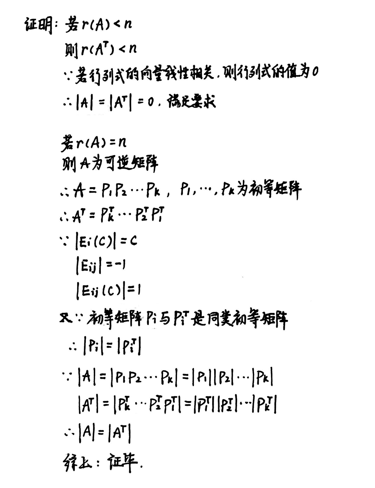
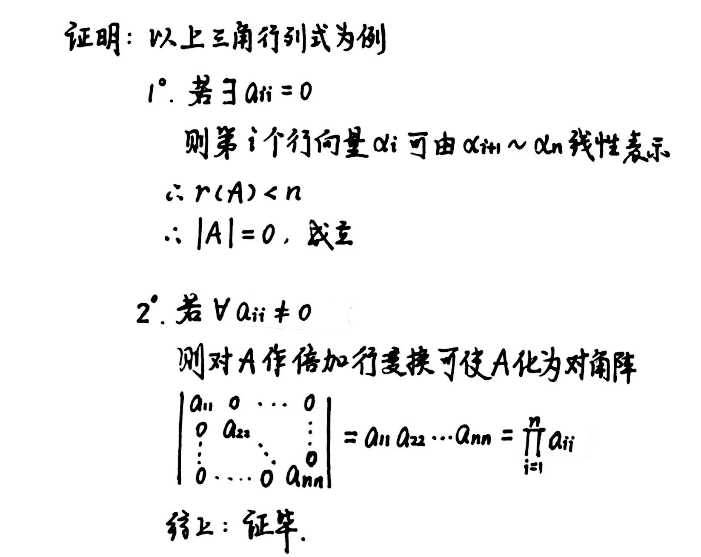
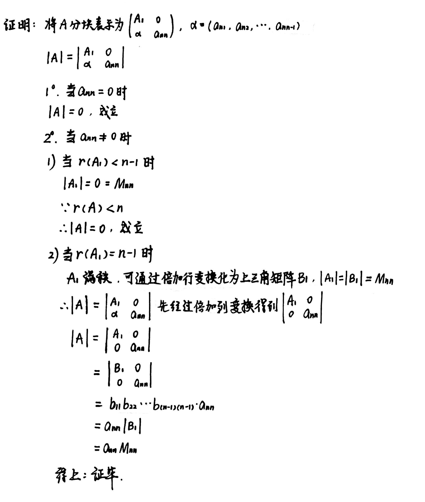
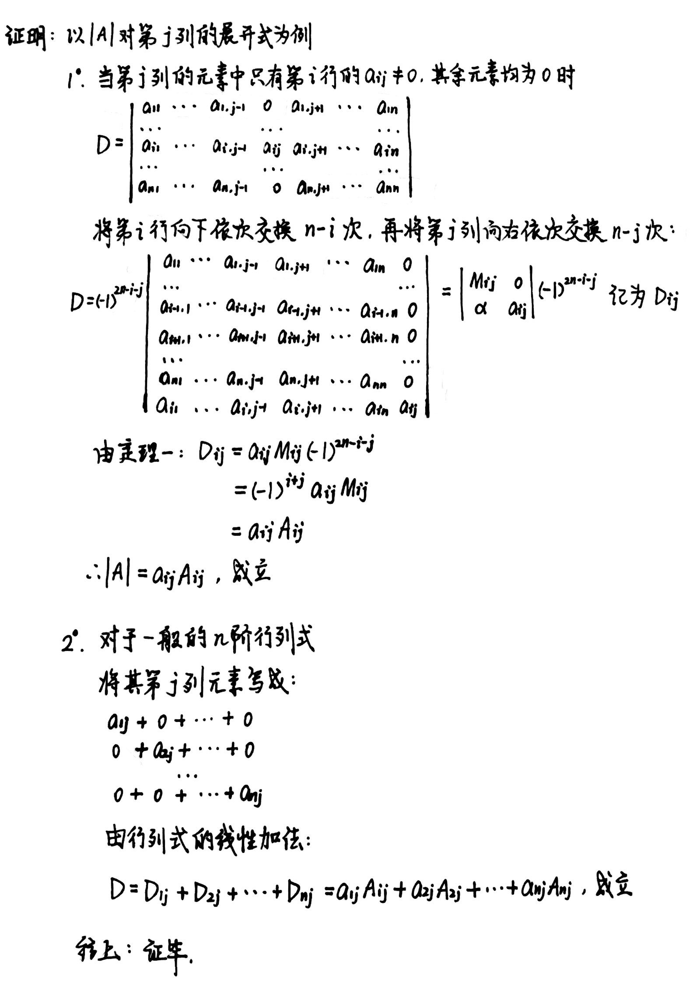
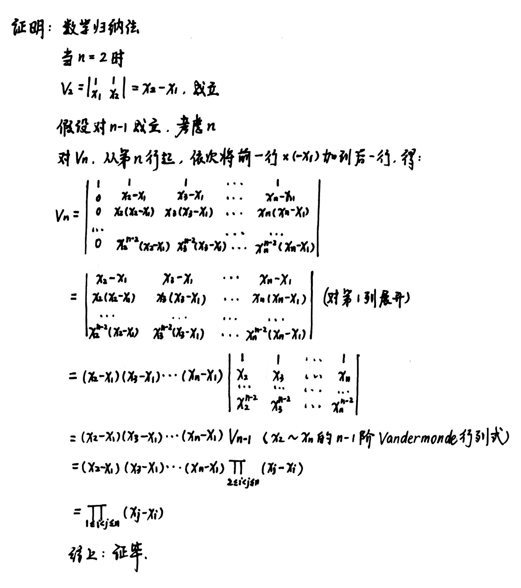
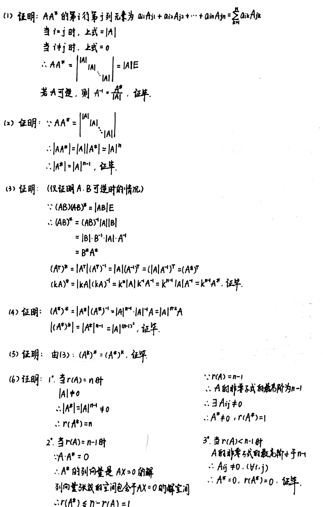

# Chapter4 行列式

***

## 4.1 行列式的定义与基本性质

### 定义

$$\left|\begin{array}{c}
a_{11}&a_{12}&···&a_{1n}\\\
a_{21}&a_{22}&···&a_{2n}\\\
···&&&···\\\
a_{n1}&a_{n2}&···&a_{nn}
\end{array}\right|=
D(\alpha_1 ,\alpha_2 ,··· ,\alpha_n)
$$

(1) 齐性：

$$D(\alpha_1,···,\lambda \alpha_i,···,\alpha_n)=\lambda D(\alpha_1,···,\alpha_i,···,\alpha_n)$$

(2) 加性：

$$D(\alpha_1,···,\alpha_i+\beta_i,···,\alpha_n)=D(\alpha_1,···,\alpha_i,···,\alpha_n)+D(\alpha_1,···,\beta_i,···,\alpha_n)$$

(3) 交错：

$$D(\alpha_1,···,\alpha_i,···,\alpha_j,···,\alpha_n)=-D(\alpha_1,···,\alpha_j,···,\alpha_i,···,\alpha_n)$$

(4) 规范：

$$D(e_1,e_2,···,e_n)=1$$

### 基本性质

(1) 若行列式有一列为零向量，则行列式的值等于零。

(2) 若行列式有两列元素相同，则行列式的值等于零。

(3) 若行列式有两列元素成比例，则行列式的值等于零。

(4) 将行列式的某一项乘以常数加到另一列，则行列式的值不变。

(5) 若行列式的向量线性相关，则行列式的值等于零。

### 计算性质

$$|A^T|=|A|$$

!!! Tip "Proof"
    

$n$阶上三角行列式(下三角行列式)

$$\left|\begin{array}{c}
a_{11}&a_{12}&···&a_{1n}\\\
0&a_{22}&···&a_{2n}\\\
···&&&···\\\
0&0&···&a_{nn}
\end{array}\right|
=\prod\limits_{i=1}^{n}a_{ii}$$

!!! Tip "Proof"
    

$$|AB|=|A||B|$$

***

## 4.2 行列式的展开式

### 余子式

在$n$阶行列式中，去掉元素$a_{ij}$所在的第$i$行和第$j$列的所有元素得到的$n-1$阶行列式，称为元素$a_{ij}$的**余子式**，记作$M_{ij}$，并把

$$A_{ij}=(-1)^{i+j}M_{ij}$$

称为元素$a_{ij}$的**代数余子式**。

### 展开式

**定理一：**

设$A_{n\times n}$中$a_{in}=0(i=1,2,···,n-1)$，则

$$|A|=a_{nn}M_{nn}$$

!!! Tip "Proof"
    

**定理二：**

$|A|$对第$j$列的展开式：

$$|A|=a_{1j}A_{1j}+a_{2j}A_{2j}+···+a_{nj}A_{nj},~j=1,···,n$$

$|A|$对第$i$行的展开式：

$$|A|=a_{i1}A_{i1}+a_{i2}A_{i2}+···+a_{in}A_{in},~i=1,···,n$$

!!! Tip "Proof"
    

**定理三：**

$n$阶行列式的某一列（或行）元素与另一列（或行）相应元素的代数余子式的乘积之和为零，即

$$a_{1j}A_{1i}+a_{2j}A_{2j}+···+a_{nj}A_{ni}=0,~i\neq j$$

$$a_{j1}A_{i1}+a_{j2}A_{i2}+···+a_{jn}A_{jn}=0,~i\neq j$$

### Vandermonde行列式

$$V_n=
\left|\begin{array}{c}
1&1&1&···&1\\\
x_1&x_2&x_3&···&x_n\\\
x_1^2&x_2^2&x_3^2&···&x_n^2\\\
···&&&&···\\\
x_1^{n-1}&x_2^{n-1}&x_3^{n-1}&···&x_n^{n-1}
\end{array}\right|
=\prod\limits_{1\leqslant i<j\leqslant n}(x_j-x_i)$$

!!! Tip "Proof"
    

事实上我们有以下结论：

$$\left|\begin{array}{c}
A&O\\\
C&B
\end{array}\right|=
\left|\begin{array}{c}
A&D\\\
O&B
\end{array}\right|
=\left|\begin{array}{c}
A&O\\\
O&B
\end{array}\right|=|A||B|
$$

$$\left|\begin{array}{c}
O&A\\\
B&C
\end{array}\right|=(-1)^{k+m}|A||B|$$

***

## 4.3 行列式进阶

### 伴随矩阵

**定义：**

$$A^*=\begin{pmatrix}
A_{11}&A_{21}&···&A_{n1}\\\
A_{12}&A_{22}&···&A_{n2}\\\
···&&&···\\\
A_{1n}&A_{2n}&···&A_{nn}
\end{pmatrix}$$

**性质：**

$A^{\*}$称为$A$的**伴随矩阵**，它是$A_{m\times n}$的元素$a_{ij}$的代数余子式$A_{ij}$组成的矩阵的转置。

(1) $AA^{\*}=A^{\*}A=|A|E$，若$A$可逆，则$A^{-1}=\frac{A^{\*}}{|A|}$

(2) $|A^{\*}|=|A|^{n-1}$

(3) $(AB)^{\*}=B^{\*}A^{\*},(A^T)^{\*}=(A^{\*})^T,(kA)^{\*}=k^{n-1}A^{\*}$

(4) $A$可逆时，$(A^{\*})^{\*}=|A|^{n-2}A,|(A^{\*})^{\*}|=|A|^{(n-1)^2}$

(5) 对正整数$k$，$(A^k)^{\*}=(A^{\*})^k$

(6) $r(A^{\*})=\begin{cases}
n~~~r(A)=n\\\
1~~~r(A)=n-1\\\
0~~~r(A)<n-1   
\end{cases}$

!!! Tip "Proof"
    

### 行列式秩

矩阵$A$的任意$k$行和任意$k$列相交得到的$k^2$个元素组成的行列式称为$A$的一个**k阶子式**。当$A$为方阵且$k$行和$k$列一一对应时称为**k阶主子式**。若取$A$的前$k$行和前$k$列，则称为$A$的**k阶顺序主子式**。

矩阵$A$的非零子式的最高阶数$r$称为$A$的**行列式秩**，即$A$至少有一个$r$阶子式不为0，且$r+1$阶及以上的子式均为0。

秩$A$为$r$的充要条件是$A$的行列式秩为$r$。

### Cramer法则

当$n$阶方阵$A$的行列式$|A|\neq 0$时，线性方程组$AX=0$的解可用行列式表示，其解法称为**Cramer法则**。

$$x_j=\frac{D_j}{D},~j=1,2,···,n$$

其中

$$D_j=\left|\begin{array}{c}
a_{11}&···&a_{1,j-1}&b_1&a_{1,j+1}&···&a_{1n}\\\
a_{21}&···&a_{2,j-1}&b_2&a_{2,j+1}&···&a_{2n}\\\
···&&&&&&···\\\
a_{n1}&···&a_{n,j-1}&b_n&a_{n,j+1}&···&a_{nn}
\end{array}\right|$$

$$D=\left|\begin{array}{c}
a_{11}&a_{12}&···&a_{1n}\\\
a_{21}&a_{22}&···&a_{2n}\\\
···&&&···\\\
a_{n1}&a_{n2}&···&a_{nn}
\end{array}\right|$$