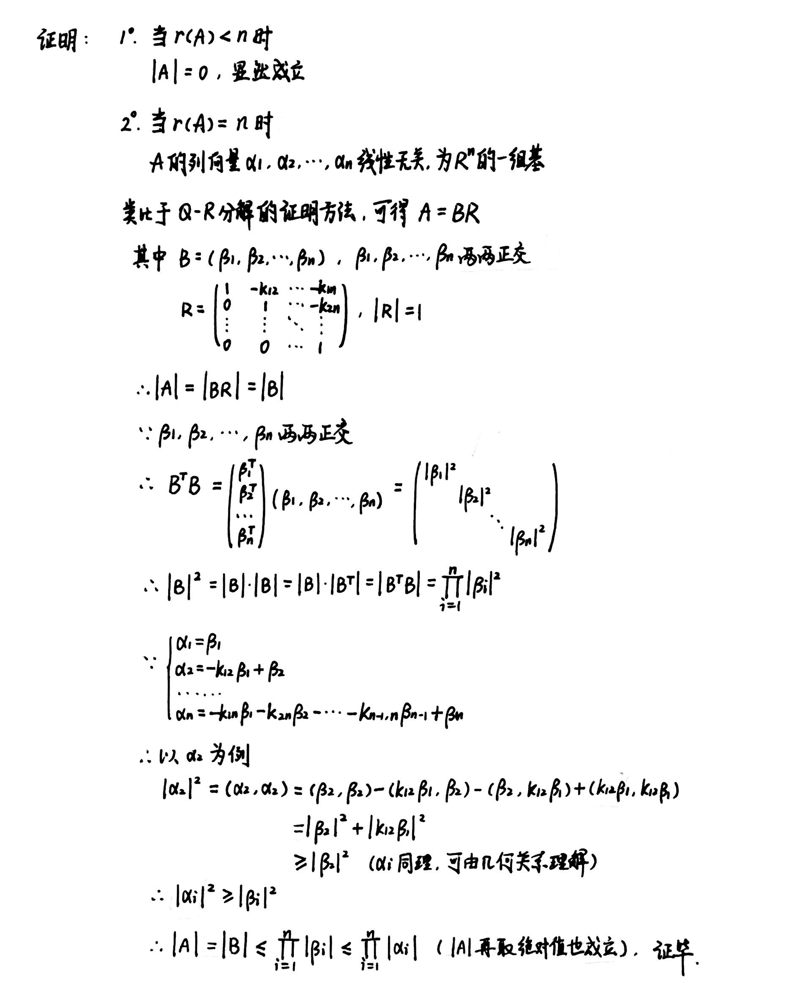
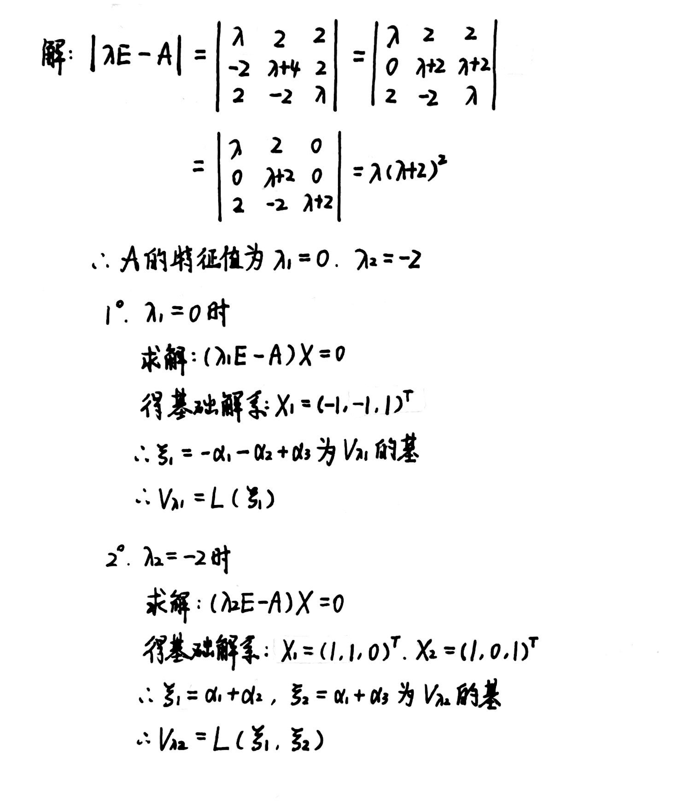

# Chapter5 特征值、特征向量与矩阵的标准形

***

## 5.1 正交变换与正交矩阵

### 正交变换

欧氏空间$V(R)$的一个线性变换$\sigma$如果对$\forall \alpha,\beta\in V$满足：

$$(\sigma(\alpha),\sigma(\beta))=(\alpha,\beta)$$

即线性变换后内积不变，则称$\sigma$为**正交变换**.

**等价条件：长度不变**

$$|\sigma(\alpha)|=|\alpha|,~\forall \alpha\in V$$

**性质一：夹角不变**

若$\sigma$是正交变换，则

$$\langle \sigma(\alpha),\sigma(\beta )\rangle=\langle\alpha,\beta\rangle$$

**性质二：单射**

若$\sigma$是正交变换，则$\sigma$是单射，从而可逆。

**等价关系：**

若$\sigma\in(V,V)$，则下列命题等价：

① $\sigma$是正交变换

② 对任意一组单位正交基$\varepsilon_1,\varepsilon_2,···,\varepsilon_n$，$\sigma(\varepsilon_1),\sigma(\varepsilon_2),···,\sigma(\varepsilon_n)$也是单位正交基

③ 对任意一组单位正交基$\varepsilon_1,\varepsilon_2,···,\varepsilon_n$，满足

$$(\sigma(\varepsilon_1),\sigma(\varepsilon_2),···,\sigma(\varepsilon_n))=(\varepsilon_1,\varepsilon_2,···,\varepsilon_n)M(\sigma)$$

其中$M(\sigma)$满足

$$M(\sigma)^TM(\sigma)=M(\sigma)M(\sigma)^T=E$$

!!! Tip "Proof"
    

### 正交矩阵

**定义一：**

欧氏空间$V(R)$的正交变换$\sigma$关于$V$的单位正交基所对应的矩阵$A$称为**正交矩阵**。

$$\sigma(\varepsilon_1,\varepsilon_2,···,\varepsilon_n)=(\varepsilon_1,\varepsilon_2,···,\varepsilon_n)A$$

**定义二：**

满足

$$A^TA=E$$

的方阵$A$称为**正交矩阵**（或：如果$A$的列向量组是一组单位正交基）。

**正交矩阵的性质：**

（1）若$A$为正交矩阵，则$A^{-1}=A^T$，且$A^T$也是正交矩阵.

（2）若$A$为正交矩阵，则$|A|=±1$

（3）若$A,B$都是正交矩阵，则$AB$也是正交矩阵

**第一类正交变换（旋转变换）：**

$$|A|=1$$

**第二类正交变换（镜面变换）：**

$$|A|=-1$$

### Q-R分解

若$A$为可逆实矩阵，则存在正交矩阵$Q$和主对角元为正数的上三角矩阵$R$，使得

$$A=QR$$

!!! Tip "Proof"
    

### Hadamard不等式

$n$阶实矩阵$A$的行列式的绝对值小于等于$A$的$n$个列（行）向量长度的乘积，即

$$|detA|\leqslant \prod\limits_{i=1}^{n}|\alpha_i|$$

!!! Tip "Proof"
    

***

## 5.2 线性变换在不同基下的矩阵表示 相似矩阵

### 线性变换基所对应的矩阵关系

设线性变换$\sigma\in L(V,V)$，$B_1=\\{\alpha_1,···,\alpha_n\\}$和$B_2=\\{\beta_1,···,\beta_n\\}$是线性空间$V(F)$的两组基，基$B_1$变为基$B_2$的变换矩阵为$C$，如果$\sigma$在基$B_1$下的矩阵为$A$，则$\sigma$在基$B_2$下的矩阵为$C^{-1}AC$。

!!! Tip "Proof"
    

### 相似矩阵

若对于$A,B\in M_n(F)$，存在可逆矩阵$C\in M_n(F)$,使得

$$C^{-1}AC=B$$

则称$A$**相似于**$B$，记作$A\sim B$。

相似矩阵的性质(等价关系)：

（1）自反性：$A\sim A$

（2）对称性：若$A\sim B$，则$B\sim A$

（3）传递性：若$A_1\sim A_2$，$A_2\sim A_3$，则$A_1\sim A_3$

（4）若$A\sim B$，则

$$C^{-1}(AB)C=(C^{-1}AC)(C^{-1}BC)$$

（5）若$A\sim B$，则

$$C^{-1}(kA+tB)C=kC^{-1}AC+tC^{-1}BC$$

（6）若$A\sim B$，则$A^m\sim B^m$（$m$为正整数）

（7）若$A\sim B$，则$f(A)\sim f(B)$，其中

$$f(x)=a_mx^m+a_{m-1}x^{m-1}+···+a_1x+a_0$$

**相似矩阵的特征：**

相似矩阵有相同的特征多项式，从而有相同的特征值、迹和行列式，但特征向量不一定相同。

特征多项式相同则特征值相同，迹等于所有特征值之和，行列式等于所有特征值之积，因此相似矩阵有相同的迹，行列式，特征值。

相似矩阵来源于同一线性变换在不同基下的表示，因此它们的特征向量是线性变换的特征向量在不同基下的坐标，因此不一定相同。

***

## 5.3 特征值与特征向量

### 特征值和特征向量（线性变换）

设$\sigma\in L(V,V)$，若存在非零向量$\alpha\in V$和数$\lambda \in F$，使得

$$\sigma(\alpha)=\lambda \alpha$$

则称$\lambda$是$\sigma$的一个**特征值**，$\alpha$是$\sigma$的一个关于其特征值$\lambda$的**特征向量**。

所有$\sigma$的关于特征值$\lambda$的特征向量（加上零向量）组成的集合$V_\lambda$称为$\sigma$关于其特征值$\lambda$的**特征子空间**。

### 特征值和特征向量（矩阵）

**引入：**

已知

$$\sigma(\xi)=\lambda_0\xi$$

上式等价于

$$(\lambda_0I-\sigma)(\xi)=0$$

其中$I$为恒等变换

所以特征子空间$V_{\lambda_0}$为线性变换$(\lambda_0I-\sigma)$的核

因为$V_{\lambda_0}$中必有非零向量

所以

$$\dim(Ker(\lambda_0I-\sigma))\geqslant 1$$

由维数公式：

$$\dim(Ker(\lambda_0I-\sigma))+\dim(r(\lambda_0I-\sigma))=\dim(V)=n$$

得到

$$r(\lambda_0I-\sigma)\leqslant n-1$$

若$\sigma$关于基$B$的对应矩阵为$A$

则线性变换$(\lambda_0I-\sigma)$关于基$B$所对应的矩阵为$\lambda_0E-A$

所以

$$|\lambda_0E-A|=0$$

齐次线性方程组$(\lambda_0E-A)X=0$有非零解

非零解$X=(x_1,···,x_n)^T$所对应的非零向量

$$\xi=x_1e_1+···+x_ne_n\in Ker(\lambda_0I-\sigma)$$

$\xi$即为特征向量

综上：$\sigma$的特征值即为方程$|\lambda_0E-A|=0$的根，所对应的特征向量即为方程组$(\lambda_0E-A)X=0$的解所对应的向量。

**定义：**

设矩阵$A\in M_n(F)$，如果存在数$\lambda_0\in F$和非零向量$X\in F^n$，使得

$$AX=\lambda_0X$$

则称$\lambda_0$为矩阵$A$的一个**特征值**，称非零向量$X$为矩阵$A$的属于其特征值$\lambda_0$的**特征向量**，称$\lambda$的$n$次多项式$f(\lambda)=|\lambda E-A|$为矩阵$A$的**特征多项式**。

!!! Example
    **例：已知$R^3$的线性变换$\sigma$关于$R^3$的某一组基$\\{\alpha_1,\alpha_2,\alpha_3\\}$所对应的矩阵为  
    $A=\begin{pmatrix}  
        {0}&{-2}&{-2}\\\    
        {2}&{-4}&{-2}\\\    
        {-2}&{2}&{0}    
    \end{pmatrix}$  
    求$\sigma$的特征值及相应的特征子空间。**

    

### 定理1

若$\lambda_1,\lambda_2,···,\lambda_m$是$\sigma(A)$不同的特征值，$\eta_{i1},\eta_{i2},···,\eta_{ir_i}$是关于$\lambda_i$的线性无关的特征向量，则$\eta_{11},···,\eta_{1r_1},\eta_{21},···,\eta_{2r_2},···,\eta_{m1},···,\eta_{mr_m}$线性无关。

!!! Tip "Proof"
    

### 定理2

$n$维线性空间$V(F)$的线性变换$\sigma$的每个特征值$\lambda_i$的重数 **(代数重数)** 大于等于其特征子空间的维数 **(几何重数)**。

!!! Tip "Proof"
    

***

## 5.4 可对角化的条件 相似标准形

### 对角化

如果有限维线性空间$V(F)$的线性变换$\sigma$在某个基下对应的矩阵为对角阵，则称$\sigma$为**可对角化的线性变换**，与对角阵相似的矩阵$A$称为**可对角化矩阵**。

### 可对角化的条件

**充要条件1：**

$n$维线性空间$V(F)$的线性变换$\sigma$（或$A\in M_n(F)$）可对角化的充要条件为$\sigma$（或$A$）有$n$个线性无关的特征向量。

!!! Tip "Proof"
    

**推论：**

若$n$维线性变换$\sigma$有$n$个互不相同的特征值，则$\sigma$可对角化。

**充要条件2：**

$n$维线性空间$V(F)$的线性变换$\sigma$可对角化的充要条件为：$\sigma$的每个特征值的重数等于其特征子空间的维数，且重数和为$n$。

!!! Tip "Proof"
    充分性：    
    若重数和为$n$且代数重数等于几何重数 
    则由定理1：$n$个特征向量线性无关    
    所以可对角化    
    必要性：    
    考虑反证法  
    若重数和小于$n$ 
    则由定理2：维数和也小于$n$  
    所以$\sigma$的线性无关的特征向量的个数小于$n$   
    所以不可能对角化，矛盾  
    若重数和等于$n$但有一个特征值的重数大于其特征子空间的维数   
    则由定理2：维数和小于$n$    
    同样可推得矛盾  
    综上：证毕  

!!! Example
    **例：求证：若矩阵$A$满足$A^2-(\lambda_1+\lambda_2)A+\lambda_1\lambda_2E=0,\lambda_1\neq \lambda_2$，则$A$可对角化。**
    

### 解对角阵和变换矩阵的一般步骤

对于一个$n$阶可对角化矩阵$A$，求变换矩阵$P$，使得$P^{-1}AP=\Lambda$（对角阵），其解题步骤如下：

① 求$A$的所有特征值$\lambda_1,\lambda_2,···,\lambda_m$

② 求每个$\lambda$对应的特征子空间的基（基础解系）

③ 将所有的基向量（$n$个）依次按列排列成$n$阶矩阵，即为变换矩阵$P$

④ $\Lambda=diag(\lambda_1,···,\lambda_1,···,\lambda_m,···,\lambda_m)$

***

## 5.5 实对称矩阵的对角化

### 定理

**定理一：**

实对称矩阵的特征值都是实数。

**定理二：**

实对称矩阵属于不同特征值的特征向量是正交的。

**定理三：**

若$A$是一个$n$阶实对称矩阵，则存在$n$阶正交矩阵$Q$，使得

$$Q^{-1}AQ=diag(\lambda_1,\lambda_2,···,\lambda_n)$$

!!! Example
    **例：设$A=\begin{pmatrix}  
    {2}&{2}&{-2}\\\     
    {2}&{5}&{-4}\\\     
    {-2}&{-4}&{5}   
    \end{pmatrix}$  
    求正交矩阵$Q$，使得$Q^{-1}AQ$为对角矩阵，并求出该对角矩阵。**

    

***

## 5.6 双线性函数和二次型

### 双线性函数

如果$V\times V$到$F$上的映射$f$满足$\forall \alpha,\beta \in V,\forall k \in F:$

$$f(\alpha,k_1\beta_1 +k_2\beta_2)=k_1f(\alpha,\beta_1)+k_2f(\alpha ,\beta_2)$$

$$f(k_1\alpha_1+k_2\alpha_2,\beta)=k_1f(\alpha_1,\beta)+k_2f(\alpha_2,\beta)$$

即对于$\alpha,\beta$都是线性函数，则称$f$为**双线性函数**。（典例：欧氏空间的内积）

### 度量矩阵

设基

$$B=\\{e_1,e_2,···,e_n\\}$$

向量$\alpha$的坐标

$$X=(x_1,x_2,···,x_n)^T$$

向量$\beta$的坐标

$$Y=(y_1,y_2,···,y_n)^T$$

则

$$f(\alpha,\beta)=f(\sum\limits_{i=1}^{n}x_ie_i,\sum\limits_{j=1}^{n}y_je_j)=\sum\limits_{i=1}^{n}\sum\limits_{j=1}^{n}x_iy_jf(e_i,e_j)$$

令

$$a_{ij}=f(e_i,e_j)$$

则

$$f(\alpha,\beta)=\sum\limits_{i=1}^{n}x_i(a_{i1}y_1+a_{i2}y_2+···+a_{in}y_n)=(x_1,x_2,···,x_n)\begin{pmatrix}
 a_{11}y_1+a_{12}y_2+···+a_{1n}y_n\\\
 a_{21}y_1+a_{22}y_2+···+a_{2n}y_n \\\
 ······\\\
 a_{n1}y_1+a_{n2}y_2+···+a_{nn}y_n  
\end{pmatrix}=(x_1,x_2,···,x_n)\begin{pmatrix}
a_{11}&a_{12}&···&a_{1n}\\\
a_{21}&a_{22}&···&a_{2n}\\\
···&&&···\\\
a_{n1}&a_{n2}&···&a_{nn}
\end{pmatrix}
\begin{pmatrix}
y_1\\\
y_2\\\
···\\\
y_n
\end{pmatrix}=X^TAY$$

其中矩阵$A$称为双线性函数$f(\alpha,\beta)$在基$B$下的**度量矩阵**。

### 相合

**引入：**

设双线性函数$f(\alpha,\beta)$在基$B_1$下的度量矩阵为$A$，在基$B_2$下的度量矩阵为$B$，若基$B_1$到基$B_2$的变换矩阵为$C$，则

$$B=C^TAC$$

**定义：**

若存在可逆矩阵$C$，使得

$$B=C^TAC$$

则称$n$阶矩阵$A$**相合于**$B$（记作$A\simeq B$）

即：双线性函数不同基下的度量矩阵是相合的。

### 二次型

$n$元二次齐次多项式

$$f(x_1,x_2,···,x_n)=a_{11}x_1^2+2a_{12}x_1x_2+···+2a_{1n}x_1x_n+a_{22}x_2^2+2a_{23}x_2x_3+···+2a_{2n}x_2x_n+···+a_{n-1,n-1}x_{n-1}^2+2a_{n-1,n}x_{n-1}x_{n}+a_{nn}x_n^2$$

叫做数域$F$上的**二次型**。

如果令$a_{ij}=a_{ji}$，则

$$f(x_1,x_2,···,x_n)=X^TAX$$

其中$X=(x_1,x_2,···，x_n)^T,A=(a_{ij})_{n\times n}$为实对称矩阵，即上述二次型所对应的矩阵。

$n$元二次型与$n$维线性空间上的对称双线性函数$f(\alpha,\alpha)$一一对应，也就是和对称矩阵一一对应（对称双线性函数的度量矩阵为对称矩阵）。

令$X=CY$，即对$X$作坐标变换，变换矩阵为$C$。

则

$$X^TAX=Y^T(C^TAC)Y$$

$C^TAC$为与$A$相合的另一度量矩阵。

如果

$$C^TAC=diag(d_1,d_2,···,d_n)$$

则

$$Y^T(C^TAC)Y=d_1y_1^2+d_2y_2^2+···+d_ny_n^2$$

是$f(\alpha,\alpha)$最简单的坐标表示式，即**标准形**。

对于任意一个实对称矩阵，都存在可逆矩阵$C$，使得

$$C^TAC=diag(d_1,d_2,···,d_n)$$

这个对角阵是$A$的**相合标准形**。

***

## 5.7 实二次型的标准形 实对称矩阵的相合标准形

### 主轴定理

对于任一个$n$元二次型

$$f(x_1,x_2,···,x_n)=X^TAX$$

都存在正交变换$X=QY$，使得

$$X^TAX=Y^T(Q^TAQ)Y=\lambda_1y_1^2+\lambda_2y_2^2+···+\lambda_ny_n^2$$

其中$\lambda_1,\lambda_2,···,\lambda_n$是实对称矩阵$A$的$n$个特征值，$Q$的$n$个列向量是$A$的$n$个单位正交的特征向量。

!!! Example
    **例：三种方法将二次型化为不同的标准形**    
    **设三元二次齐次函数$f(x_1,x_2,x_3)=2x_1x_2-2x_1x_3+2x_2x_3$，将其化为标准形，并求坐标变换的变换矩阵$C$。**

    **法一：主轴定理**

    

    **法二：配方法**

    

    **法三：初等变换**

    

### 惯性指数与惯性定理

实对称矩阵$A$的相合标准形

$$diag=(1,···,1,-1,···,-1,0,···,0)$$

称为$A$的**相合规范形**。

$+1$的个数称为$A$的**正惯性指数**；$-1$的个数称为$A$的**负惯性指数**。

**惯性定理：**

实对称矩阵$A$的正负惯性指数是由$A$唯一确定的。

***

## 5.8 正定二次型与正定矩阵 其它有定二次型

### 正定二次型与正定矩阵

如果$n$元二次型对任意$X\neq 0$恒有

$$X^TAX>0$$

则该二次型称为**正定二次型**，矩阵$A$称为**正定矩阵**。

**等价命题：**

(1) $X^TAX$是正定二次型（$A$是正定矩阵）

(2) $A$的正惯性指数为$n$

(3) 存在可逆矩阵$P$，使得$A=P^TP$

(4) $A$的$n$个特征值都大于零

(5) $A$的$n$个顺序主子式（左上角主子式）都大于零

(6) 二次型化为$d_1x_1^2+d_2x_2^2+···+d_nx_n^2$的形式后$d_1,d_2,···,d_n$均大于零

**推导命题：**

若$A$为正定矩阵，则：

(1) $A^{-1}$也为正定矩阵

(2) $A$的主对角元均大于零

(3) $|A|=0$

(4) $A$的任何一个$k$阶主子式均大于零（(1)(2)为特殊情况）

(5) 存在正定矩阵$B$，使得$A=B^2$

### 其他二次型

若对于$\forall X\neq 0$

(1) $X^TAX<0$： **负定二次型**

(2) $X^TAX\geqslant 0$：**半正定二次型**

(3) $X^TAX\leqslant 0$：**半负定二次型**

(4) 其余：**不定二次型**