

# Chapter1 数列极限

***

## 1.1 实数系基本定理

### 确界存在定理

**有界集：**

设集合$E\subset R$，若

$$\exists M\in R,~\forall x\in E,~x\leqslant M$$

则称$M$是$E$的**上界**。（**下界**定义同理）

若集合$E$既有上界又有下界，即

$$\exists M\geqslant 0,~\forall x\in E,~|x|\leqslant M$$

则称$E$是**有界集**。

**上确界和下确界：**

若$\alpha$满足：

* $\alpha$是$E$的上界：$\forall x\in E,x\leqslant \alpha$

* 任何小于$\alpha$的数都不是$E$的上界：$\forall \varepsilon>0,\exists x'\in E,x'>\alpha-\varepsilon$

则称$\alpha$为$E$的**上确界**，记为**sup(E)**。（**下确界**同理，记为**inf(E)**）

**确界存在定理：**

非空有上界的数集必有上确界，非空有下界的数集必有下确界。

!!! Tip "Proof"
    （注：Dedekind分割定理：若$A/B$为$R$的一个分割，则要么$A$有最大数，要么$B$有最小数）
    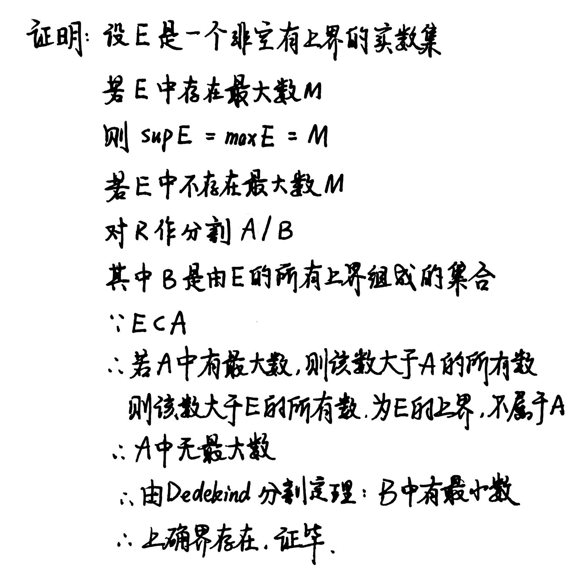

### 单调有界定理

**单调有界定理：**

单调有界数列必收敛。

!!! Tip "Proof"
    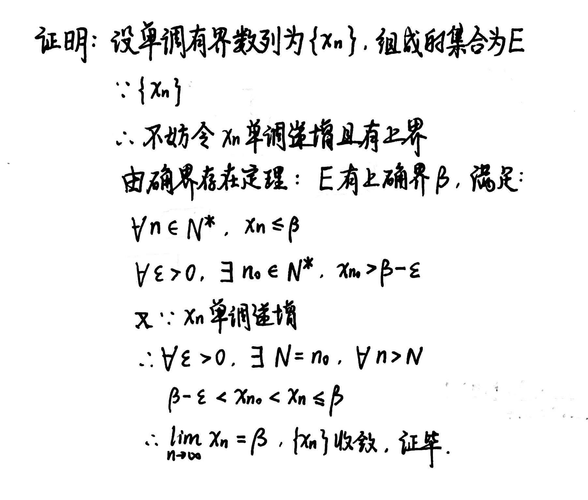

!!! Example
    **例1：设$a_1=\sqrt{2},a_{n+1}=\sqrt{2+a_n}$，研究$a_n$极限。**
    
    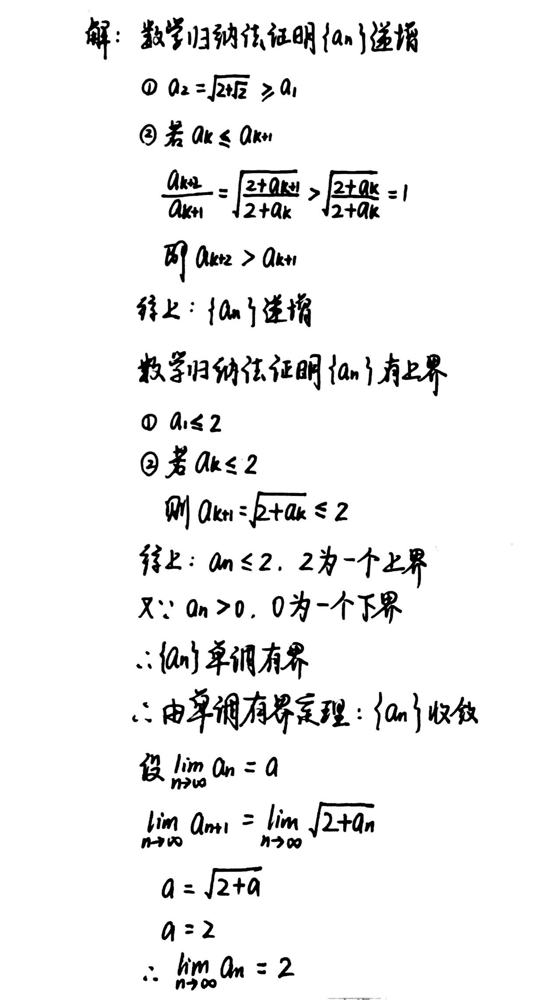

!!! Example
    **例2：设$a_1=1,a_{n+1}=\frac{1}{1+a_n}$，研究$a_n$极限。**

    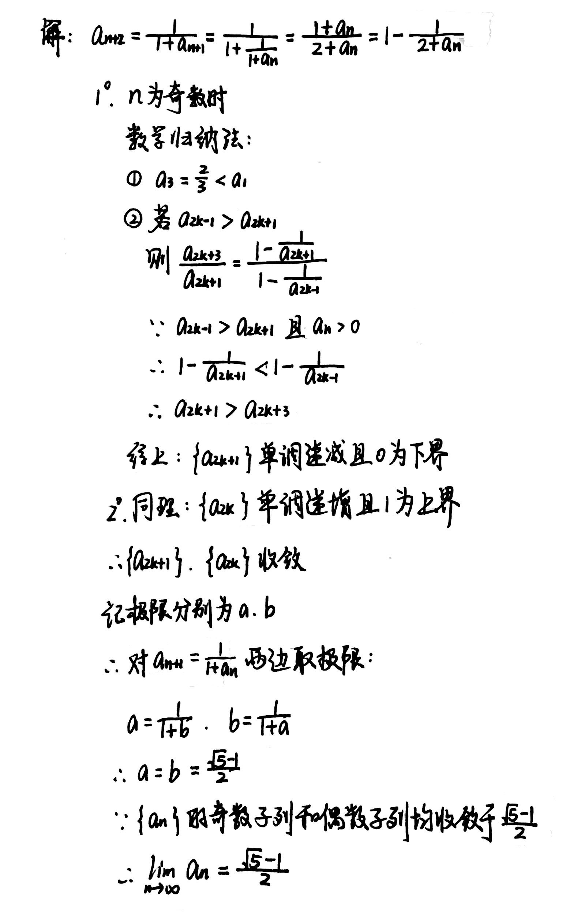

**重要极限e：**

设$x_n=(1+\frac{1}{n})^n,y_n=(1+\frac{1}{n})^{n+1}$，则$x_n,y_n$收敛，且收敛于同一极限（记为$e$）。

!!! Tip "Proof"
    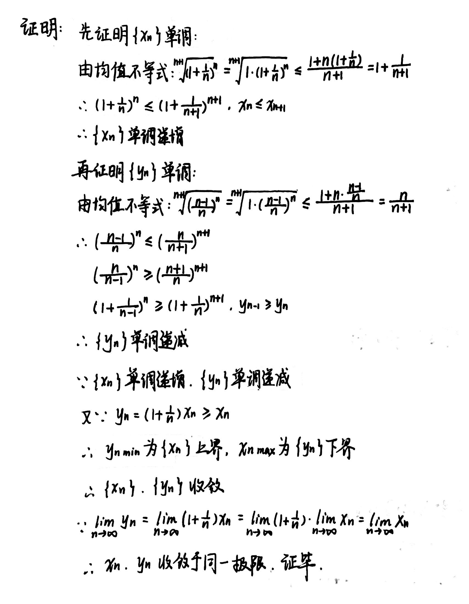

设$z_n=1+\frac{1}{2}+···+\frac{1}{n}-ln~n$，则$z_n$收敛（记为$Euler$常数$\gamma$）

!!! Tip "Proof"
    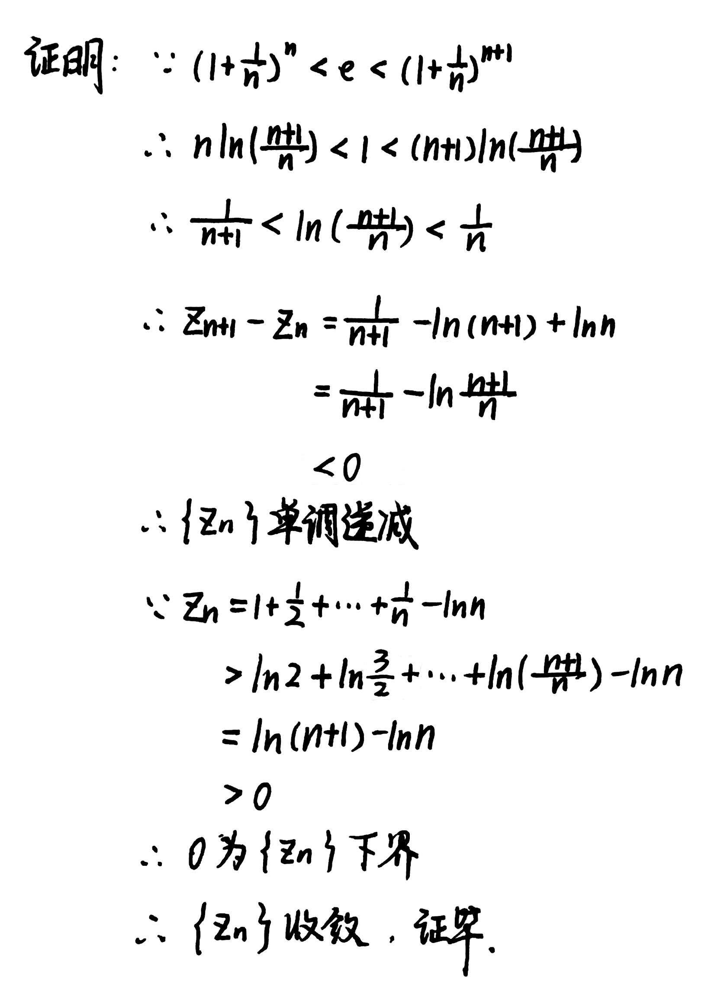

### 闭区间套定理

**闭区间套：**

若一系列闭区间$[a_n,b_n]$满足：

* $[a_{n+1},b_{n+1}]\subset [a_n,b_n]$

* $\lim\limits_{n\rightarrow \infty}(b_n-a_n)=0$

则称这一系列闭区间形成一个**闭区间套**。

**闭区间套定理：**

若一系列闭区间$\\{[a_n,b_n]\\}$形成闭区间套，则存在唯一$\xi$属于所有闭区间，且$\xi=\lim\limits_{n\rightarrow \infty}a_n=\lim\limits_{n\rightarrow \infty}b_n$。

!!! Tip "Proof"
    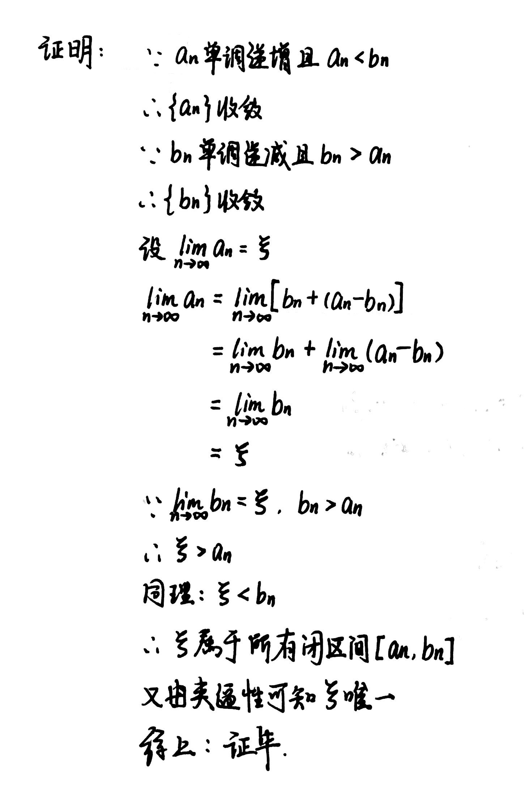

### Bolzano-Weierstrass定理（致密性定理）

**子列：**

设数列$\\{x_n\\},n_1<n_2<···<n_k<n_{k+1}<···$是一系列严格单调递增的正整数，则$x_{n_1},x_{n_2},···,x_{n_k},···$形成一个新的数列$\\{x_{n_k}\\}$，称为数列$\\{x_n\\}$的**子列**。

* 若$\\{x_n\\}$收敛于$a$，则其所有子列均收敛于$a$
* 若存在$\\{x_n\\}$的两个子列分别收敛于不同的极限，则$\\{x_n\\}$发散
* 若$\\{x_n\\}$的奇数子列和偶数子列都收敛于$a$，则$\\{x_n\\}$收敛于$a$
  
**致密性定理：**

有界数列必有收敛子列。

!!! Tip "Proof"
    法一：
    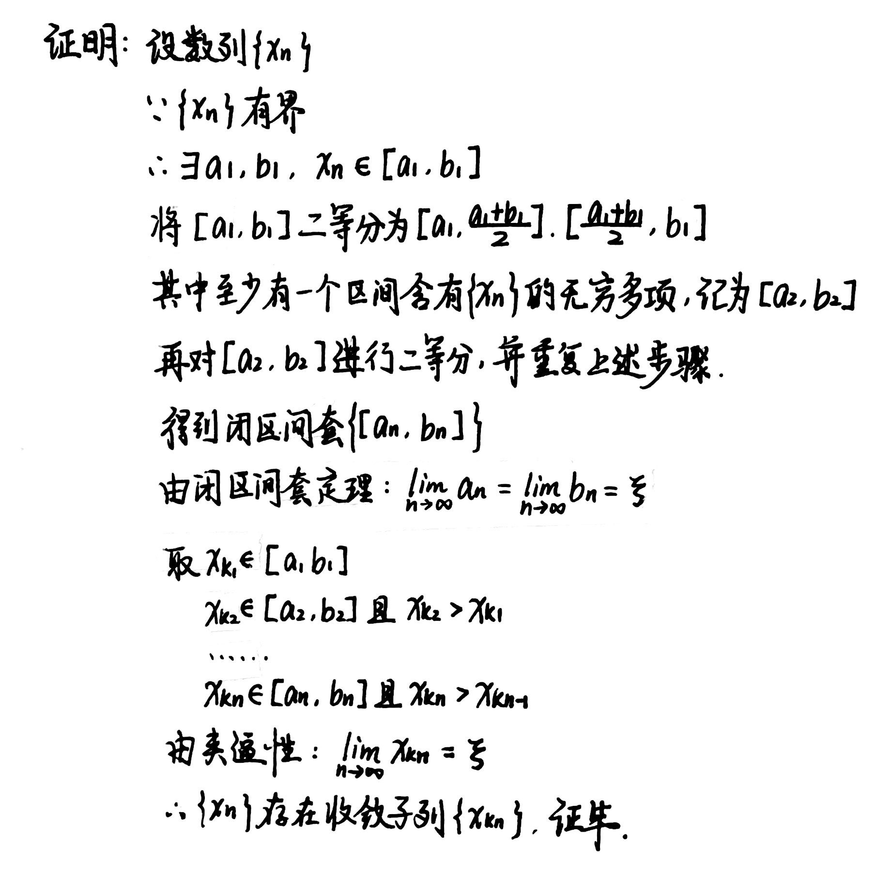
    法二：
    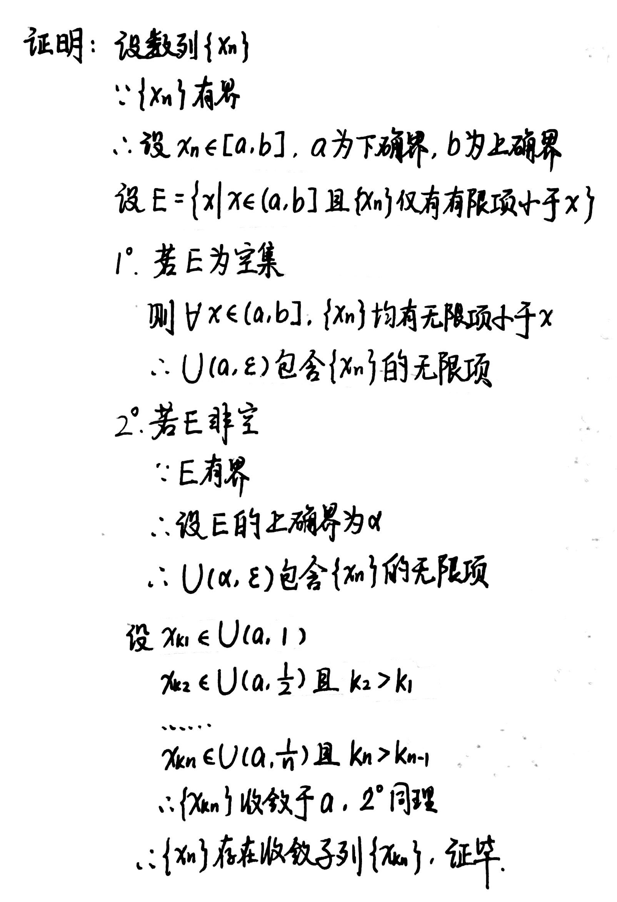

### Cauchy收敛原理

**基本数列：**

如果数列$\\{x_n\\}$满足：

$$\forall \varepsilon>0,~\exists N\in N^*,~\forall n,~m>N,~|x_n-x_m|<\varepsilon$$

则称$\\{x_n\\}$是一个**基本数列**。

**Cauchy收敛原理：**

数列$\\{x_n\\}$收敛的充要条件为：$\\{x_n\\}$是基本数列。

!!! Tip "Proof"
    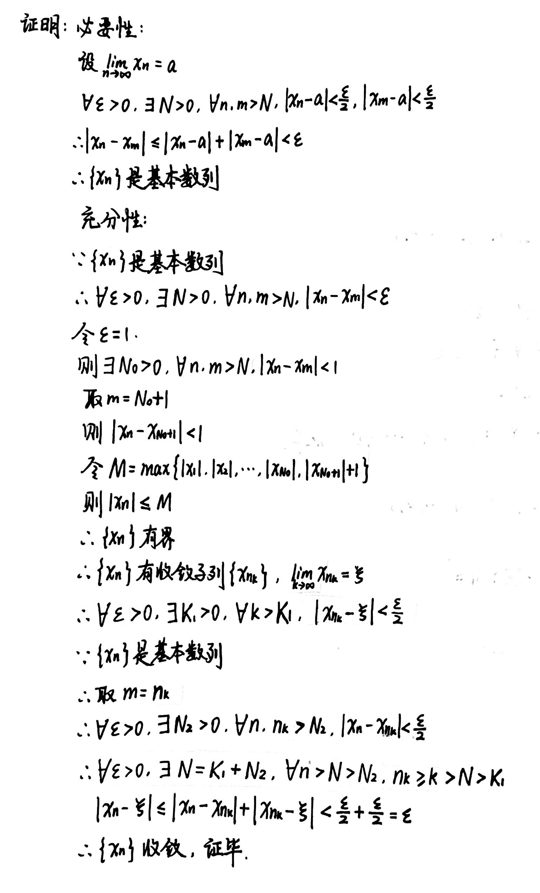

!!! Example
    **例：设数列$\\{a_n\\}$，若存在常数$C\geqslant 0,0\leqslant q \leqslant 1,N_0\in N^*$，使得当$n>N_0$时，有$|a_{n+1}-a_n|\leqslant Cq^n$，证明：$\\{a_n\\}$收敛。**

    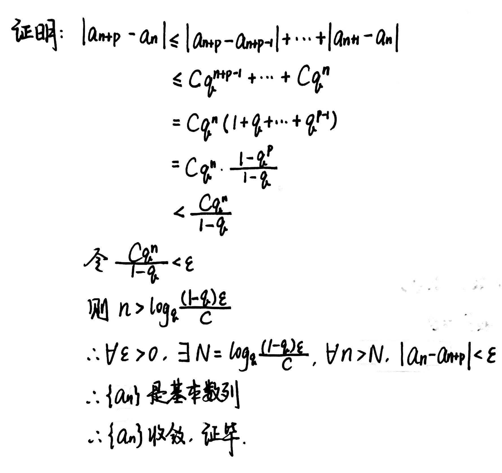

### 有限覆盖定理

**覆盖：**

设集合$A\subset R,\\{E_\lambda\\}$是一组$R$的子集组成的集合。若$A\subset \bigcup E_\lambda$，则称$\\{E_\lambda\\}$是$A$的一个**覆盖**。

若$\forall \lambda,E_\lambda$均为开区间，则该覆盖为**开覆盖**。

若只有有限个$E_\lambda$，则该覆盖为**有限覆盖**。

**有限覆盖定理：**

设闭区间$[a,b]$，对于任意一个$[a,b]$的开覆盖$\\{E_\lambda\\}$，存在$\\{E_\lambda\\}$的一个子集构成$[a,b]$的有限覆盖。

### 聚点定理

**聚点：**

设集合$E\subset R$，若$x_0\in R$满足

$$\forall \delta >0,~U^0(x_0,\delta)\cap E\neq \emptyset$$

则称$x_0$是$E$的一个**聚点**.

等价命题：
* $x_0$是$E$的聚点
* $\forall \delta >0$，在$U^0(x_0,\delta)$中有$E$的无穷多个点
* 存在$E$中互异的点组成的序列$\\{x_n\\}$，使得$\lim\limits_{n\rightarrow \infty}x_n=x_0$

**聚点定理：**

$R$中任何一个有界无穷子集至少有一个聚点。

***

## 1.2 数列极限

对于数列$\\{x_n\\}$，若：

$$\forall \varepsilon>0,~\exists N\in N^*,~\forall n>N,~|x_n-a|<\varepsilon$$

则$\lim\limits_{n\rightarrow \infty}x_n=a$，$\\{x_n\\}$**收敛**于$a$，$a$称为数列$\\{x_n\\}$的**极限**。

（若不存在$a$，则称数列$\\{x_n\\}$**发散**）

!!! Example
    **例：证明：若$\lim\limits_{n\rightarrow \infty}x_n=a$，则$\lim\limits_{n\rightarrow \infty}\frac{x_1+x_2+···x_n}{n}=a$。**

    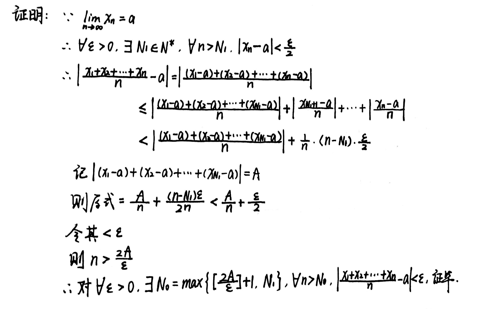

### 数列极限的性质

**唯一性：**

收敛数列的极限必唯一。

**有界性：**

收敛数列必有界。

**保号性：**

若$\lim\limits_{n\rightarrow \infty}x_n=a>0$，则必存在$N\in N^*$，当$n>N$时，$x_n>\frac{a}{2}$。

**保序性：**

设数列$\\{x_n\\},\\{y_n\\}$均为收敛数列，若$\exists N_0$，当$n>N_0$时，有$x_n\leqslant y_n$，则有$\lim\limits_{n\rightarrow \infty}x_n\leqslant \lim\limits_{n\rightarrow \infty}y_n$。

若$\lim\limits_{n\rightarrow \infty}x_n\leqslant \lim\limits_{n\rightarrow \infty}y_n$，则$\exists N_0$，当$n>N_0$时，有$x_n\leqslant y_n$。

**绝对值：**

若数列$\\{x_n\\}$收敛于$a$，则$\\{|x_n|\\}$收敛于$|a|$。

**夹逼性：**

若数列$\\{a_n\\},\\{b_n\\},\\{c_n\\}$满足：

$$\exists N_0\in N^*,~\forall n\geqslant N_0,~a_n\leqslant b_n\leqslant c_n$$

且

$$\lim\limits_{n\rightarrow \infty}a_n=\lim\limits_{n\rightarrow \infty}c_n=a$$

则:

$$\lim\limits_{n\rightarrow \infty}b_n=a$$

!!! Example
    **例1：证明：当$a>0$时，$\lim\limits_{n\rightarrow \infty}\sqrt[n]{a}=1$。**

    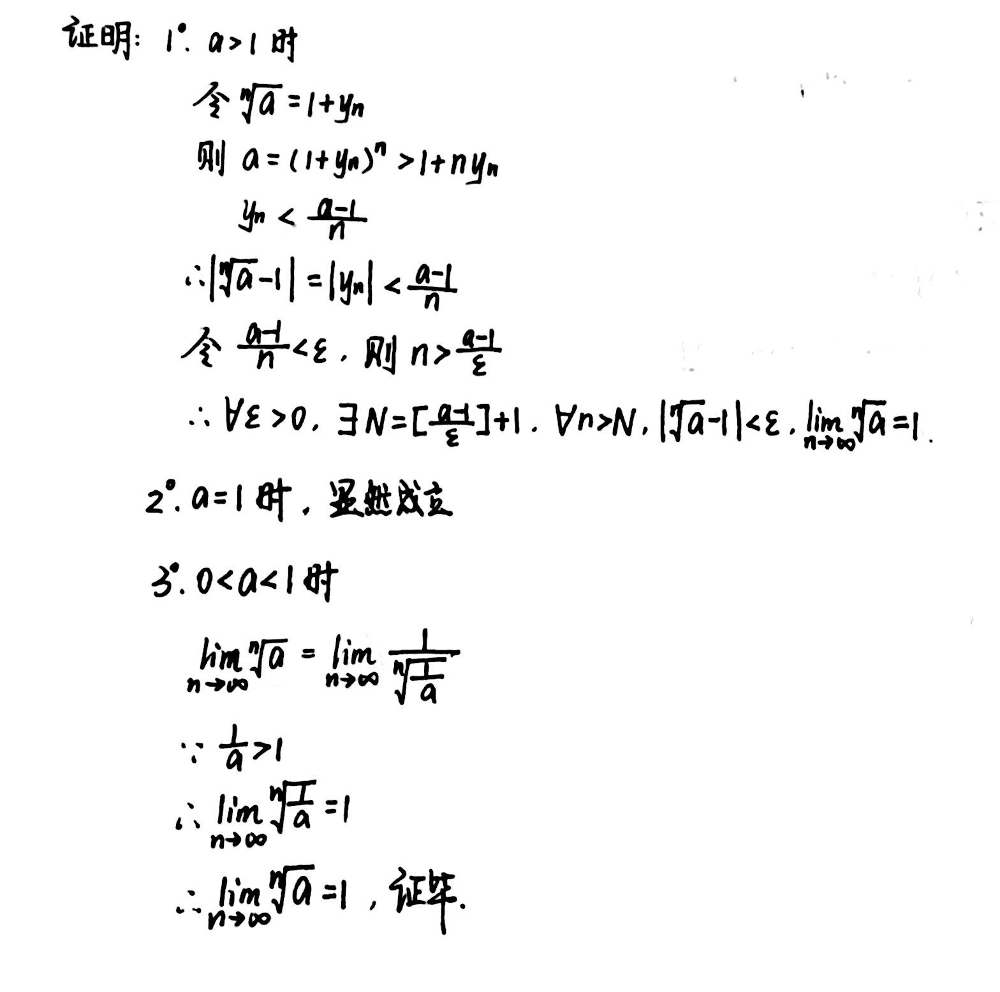

!!! Example
    **例2：设$x_n>0$，且$\lim\limits_{n\rightarrow \infty}x_n=a$，证明：$\lim\limits_{n\rightarrow \infty}\sqrt[n]{x_1x_2···x_n}=a$。**

    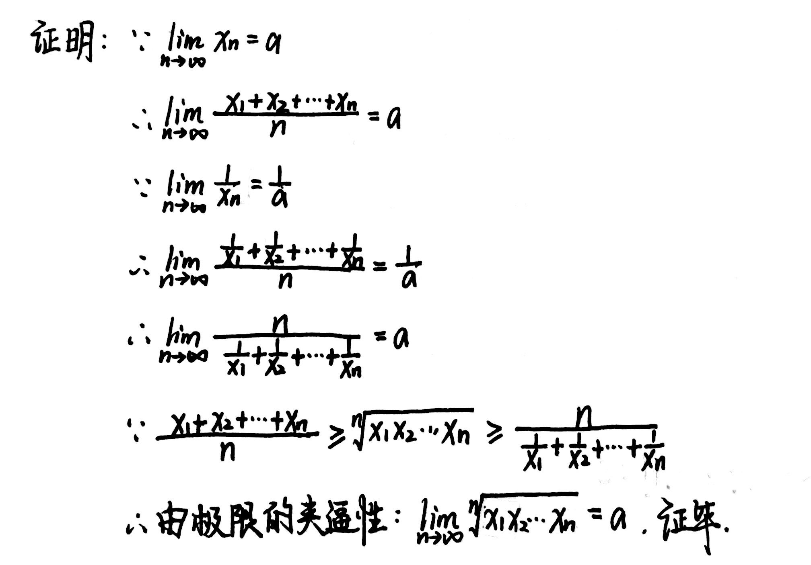

!!! Example
    **例3：证明：$\lim\limits_{n\rightarrow \infty}(a_1^n+a_2^n+···+a_p^n)^{\frac{1}{n}}=\max\limits_{1\leqslant i\leqslant p}\\{a_i\\}$，其中$a_i\geqslant 0(i=1,2,···,p)$**

    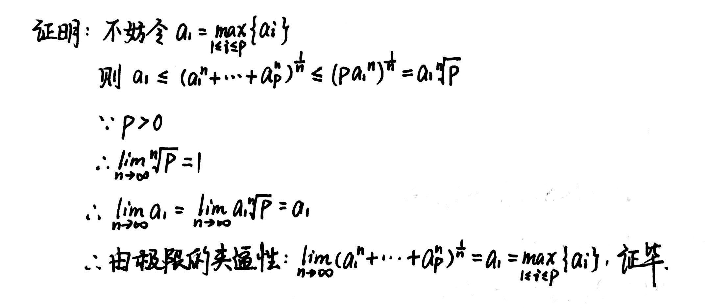

***

## 1.3 无穷量

### 无穷小量

若数列$\\{x_n\\}$满足$\lim\limits_{n\rightarrow \infty}x_n=0$，则称$\\{x_n\\}$为**无穷小量**。

### 无穷大量

若$\forall G>0,~\exists N\in N^{\*},~\forall n>N,~|x_n|>G$，则数列$\\{x_n\\}$是**无穷大量**。

若$\forall G>0,~\exists N\in N^{\*},~\forall n>N,~x_n>G$，则数列$\\{x_n\\}$是**正无穷大量**。（**负无穷大量**同理）

### Stolz定理

若$\\{y_n\\}$是严格单调递增的正无穷大量，且

$$\lim\limits_{n\rightarrow \infty}\frac{x_n-x_{n-1}}{y_n-y_{n-1}}=a$$

其中$a$可以为有限量，$+\infty$与$-\infty$。则

$$\lim\limits_{n\rightarrow \infty}\frac{x_n}{y_n}=a$$

!!! Tip "Proof"
    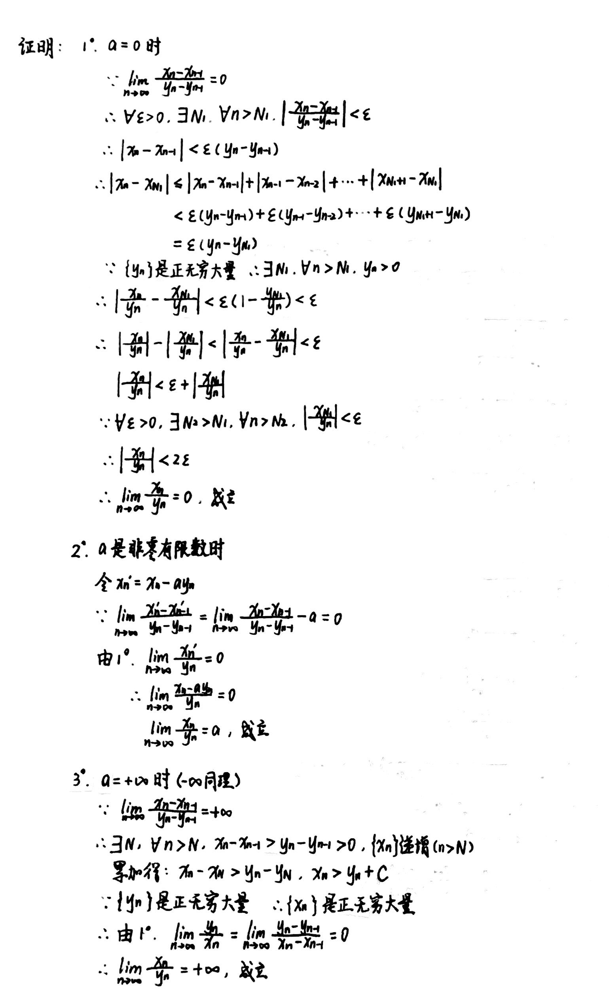