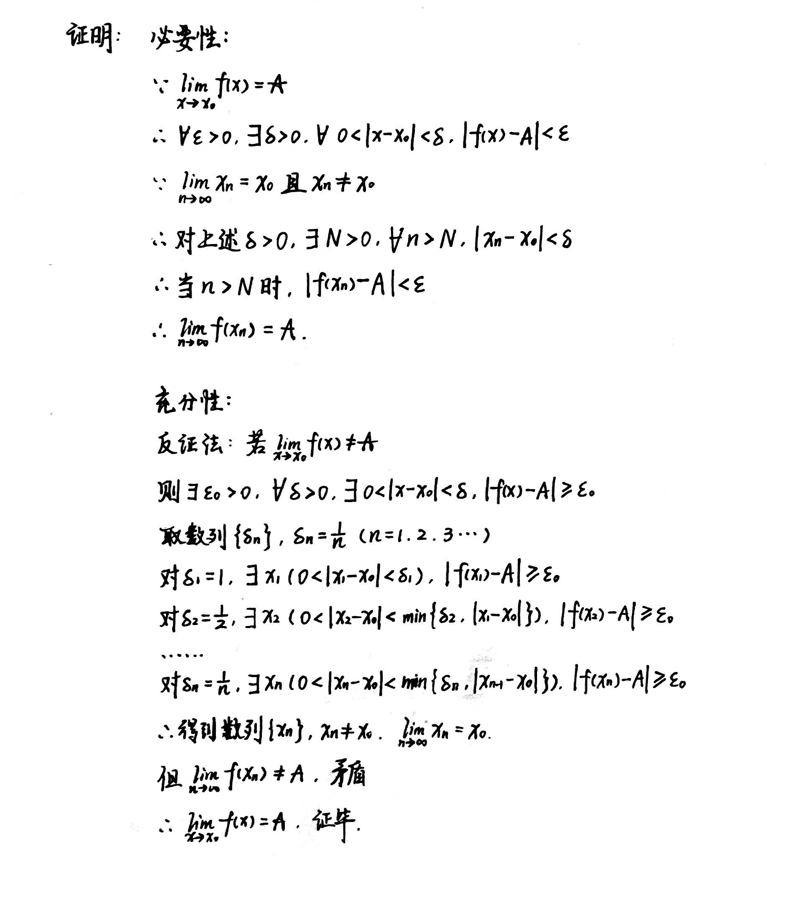
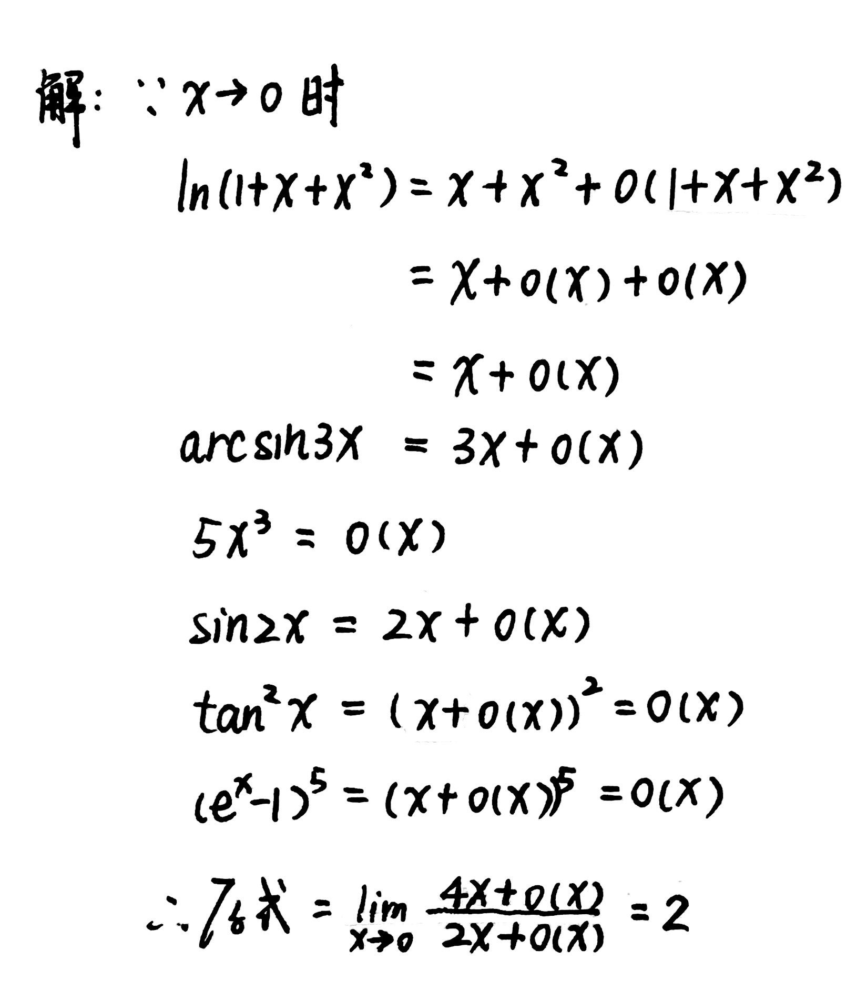

# Chapter2 函数极限与连续函数

***

## 2.1 函数极限

### 定义

**极限定义：**

若

$$\forall \varepsilon >0,~\exists \delta >0,~\forall 0<|x-x_0|<\delta,~|f(x)-A|<\varepsilon$$

则称$A$是$f(x)$在$x_0$处的**极限**，记为

$$\lim\limits_{x\rightarrow x_0}f(x)=A$$

**单侧极限定义：**

若

$$\forall \varepsilon >0,~\exists \delta >0,~\forall -\delta <x-x_0<0,~|f(x)-A|<\varepsilon$$

则称$A$是$f(x)$在$x_0$处的**左极限**（**右极限**同理），记为

$$\lim\limits_{x\rightarrow x_0^-}f(x)=A$$

$f(x)$在$x_0$处极限存在的充要条件是：$f(x)$在$x_0$处的左右极限相等。

**极限定义的扩充：**

$f(x)$趋向|语言描述
---|---
$f(x)\rightarrow A$(有限数)|$\forall \varepsilon >0,···,\|f(x)-A\|<\varepsilon$
$f(x)\rightarrow \infty$|$\forall G >0,···,\|f(x)\|>G$
$f(x)\rightarrow +\infty$|$\forall G >0,···,f(x)>G$
$f(x)\rightarrow -\infty$|$\forall G >0,···,f(x)<-G$

$x$趋向|语言描述
---|---
$x\rightarrow x_0$|$···,\exists \delta>0,\forall 0<\|x-x_0\|<\delta,···$
$x\rightarrow x_0^+$|$···,\exists \delta>0,\forall 0<x-x_0<\delta,···$
$x\rightarrow x_0^-$|$···,\exists \delta>0,\forall -\delta <x-x_0 <0,···$
$x\rightarrow \infty$|$···,\exists X>0,\forall \|x\|>X,···$
$x\rightarrow +\infty$|$···,\exists X>0,\forall x>X,···$
$x\rightarrow -\infty$|$···,\exists X>0,\forall x<-X,···$

### 性质

**唯一性：**

设$A,B$都是函数$f(x)$在点$x_0$处的极限，则$A=B$。

**局部保序性：**

* 若$\lim\limits_{x\rightarrow x_0}f(x)=A,\lim\limits_{x\rightarrow x_0}g(x)=B$，且$A>B$，则$\exists \delta>0,\forall 0<|x-x_0|<\delta,f(x)>g(x)$
* 若$\lim\limits_{x\rightarrow x_0}f(x)=A\neq 0$，则$\exists \delta >0,\forall 0<|x-x_0|<\delta,|f(x)|>\frac{|A|}{2}$
* 若$\lim\limits_{x\rightarrow x_0}f(x)=A,\lim\limits_{x\rightarrow x_0}g(x)=B$，且$\exists \delta>0,\forall 0<|x-x_0|<\delta,g(x)\leqslant f(x)$，则$B\leqslant A$

**局部有界性：**

若$\lim\limits_{x\rightarrow x_0}f(x)=A$，则存在$\delta>0$，使得$f(x)$在邻域$U^0(x_0,\delta)$上有界。

**夹逼性：**

若$\exists \delta >0,\forall 0<|x-x_0|<\delta,g(x)\leqslant f(x)\leqslant h(x)$，且$\lim\limits_{x\rightarrow x_0}g(x)=\lim\limits_{x\rightarrow x_0}h(x)=A$，则$\lim\limits_{x\rightarrow x_0}f(x)=A$。

### 定理

**Heine定理：**

$\lim\limits_{x\rightarrow x_0}f(x)=A$的充要条件是：对于任意满足条件$\lim\limits_{n\rightarrow \infty}x_n=x_0$且$x_n\neq x_0$的数列$\\{x_n\\}$，相应的函数值数列$\\{f(x_n)\\}$满足：$\lim\limits_{n\rightarrow \infty}f(x_n)=A$。

!!! Tip "Proof"
    

另一种表述：

$\lim\limits_{x\rightarrow x_0}f(x)$存在的充要条件是：对于任意满足条件$\lim\limits_{n\rightarrow \infty}x_n=x_0$且$x_n\neq x_0$的数列$\\{x_n\\}$，$\\{f(x_n)\\}$收敛。

**单调有界收敛定理：**

* 若$f(x)$在$x\in (x_0,\delta)$上单调递增且有界，则$\lim\limits_{x\rightarrow x_0^+}f(x)=inf\\{f(x)|x\in (x_0,\delta)\\}$
* 若$f(x)$在$x\in (x_0,\delta)$上单调递减且有界，则$\lim\limits_{x\rightarrow x_0^+}f(x)=sup\\{f(x)|x\in (x_0,\delta)\\}$

**Cauchy收敛原理：**

$\lim\limits_{x\rightarrow +\infty}f(x)$存在且有限的充要条件是：$\forall \varepsilon>0,\exists X>0,\forall x_1,x_2>X,|f(x_1)-f(x_2)|<\varepsilon$。

***

## 2.2 连续函数

### 定义

若

$$\forall \varepsilon >0,~\exists \delta>0,~ \forall |x-x_0|<\delta ,~|f(x)-f(x_0)|<\varepsilon$$

则称函数$f(x)$在点$x_0$处连续，记为

$$\lim\limits_{x\rightarrow x_0}f(x)=f(x_0)$$

### 间断点

若$f(x_0^+),f(x_0^-)$均存在且相等，则称$x_0$为**第一类间断点**中的**可去间断点**。

若$f(x_0^+),f(x_0^-)$均存在但不等，则称$x_0$为**第一类间断点**中的**跳跃间断点**。

若$f(x_0^+),f(x_0^-)$至少有一个不存在，则称$x_0$为**第二类间断点**。

### 反函数定理

**反函数存在性定理：**

若函数$y=f(x)$是严格单调递增（递减）的，则存在它的反函数$x=f^{-1}(y)$，且$f^{-1}(y)$也是严格单调递增（递减）的。

**反函数连续性定理：**

若函数$y=f(x)$在$[a,b]$上连续且严格单调递增，$f(a)=\alpha,f(b)=\beta$，则它的反函数$x=f^{-1}(y)$在$[\alpha,\beta]$上连续且严格单调递增。

### 复合函数的连续性

若$u=g(x)$在点$x_0$连续，$g(x_0)=u_0$，又$y=f(u)$在点$u_0$连续，则复合函数$y=f\circ g(x)$在点$x_0$处连续，且

$$\lim\limits_{u\rightarrow u_0}f(u)=\lim\limits_{x\rightarrow x_0}f\circ g(x)$$

***

## 2.3 无穷小量与无穷大量的阶

已知$x\rightarrow x_0$时$f(x),g(x)$均为无穷小量（或者均为无穷大量）。

### 有界量O

若

$$\exists M>0,~\exists \delta >0,~\forall |x-x_0|<\delta,~|f(x)|\leqslant M|g(x)|$$

则称$x\rightarrow x_0$时，$\frac{|f(x)|}{|g(x)|}$是**有界量**，记为

$$f(x)=O(g(x))$$

### 高阶/低阶量o

若$f(x),g(x)$均为无穷小量，且

$$\lim\limits_{x\rightarrow x_0}\frac{f(x)}{g(x)}=0$$

则称$x\rightarrow x_0$时，$f(x)$关于$g(x)$是**高阶无穷小量**，记为

$$f(x)=o(g(x))$$

（**高阶无穷大量**同理）

### 等价量~

若

$$\lim\limits_{x\rightarrow x_0}\frac{f(x)}{g(x)}=1$$

则称$x\rightarrow x_0$时，$f(x)$和$g(x)$是**等价量**，记为

$$f(x)\sim g(x)$$

### 常见量阶等式

* $O(x^n)+O(x^m)=O(x^{min(m,n)}),(x\rightarrow 0)$
* $O(x^n)O(x^m)=O(x^{m+n}),(x\rightarrow 0)$
* $o(f(x))\pm o(f(x))=o(f(x))$
* $O(f(x))\pm O(f(x))=O(f(x))$
* $o(f(x))=O(f(x))$
* $o(f(x))O(g(x))=o(f(x)g(x))$
* $O(f(x))O(g(x))=O(f(x)g(x))$
* $o(O(f(x)))=O(f(x))$
* $O(o(f(x)))=o(f(x))$

### 常见量阶$(x\rightarrow 0)$

* $sinx=x+o(x)$
* $cosx=1-\frac{1}{2}x^2+o(x^2)$
* $tanx=x+o(x)$
* $arcsinx=x+o(x)$
* $ln(1+x)=x+o(x)$
* $e^x=1+x+o(x)$
* $(1+x)^{\alpha}=1+\alpha x+o(x)$

!!! Example
    **例：求$\lim\limits_{x\rightarrow 0}\frac{ln(1+x+x^2)+arcsin3x-5x^3}{sin2x+tan^2x+(e^x-1)^5}$。**

    

***

## 2.4 闭区间上的连续函数

### 有界性定理

若$f(x)$在$[a,b]$上连续，则它在$[a,b]$上有界。

### 最值定理

若$f(x)$在$[a,b]$上连续，则它在$[a,b]$上必能取到最大值和最小值，即$\exists \xi,\eta \in [a,b],\forall x\in [a,b]$成立

$$f(\xi)\leqslant f(x) \leqslant f(\eta)$$

### 零点存在定理

若$f(x)$在$[a,b]$上连续，且$f(a)f(b)<0$，则一定存在$\xi \in [a,b]$，使$f(\xi)=0$。

### 中间值定理

若$f(x)$在$[a,b]$上连续，则它一定能取到最大值$M$和最小值$m$之间的任何一个值。（$f(x)$的值域为$[m,M]$）

### 一致连续与Cantor定理

**一致连续：**

设$f(x)$在区间$X$上定义，若

$$\forall \varepsilon >0,~\exists \delta >0,~\forall x_1,x_2\in X,~|x_1-x_2|<\delta,~|f(x_1)-f(x_2)|<\varepsilon$$

则称$f(x)$在区间$X$上**一致连续**。

$f(x)$在区间$X$上一致连续$\rightarrow$$f(x)$在区间$X$上连续

**定理一：**

设$f(x)$在区间$X$上定义，则$f(x)$在$X$上一致连续的充要条件为：对任何点列$\\{x_n'\\},\\{x_n''\\}$，只要满足

$$\lim\limits_{n\rightarrow \infty}(x_n'-x_n'')=0$$

就成立

$$\lim\limits_{n\rightarrow \infty}(f(x_n')-f(x_n''))=0$$

**定理二：Cantor定理：**

若$f(x)$在$[a,b]$上连续，则$f(x)$在$[a,b]$上一致连续。

**定理三：**

若$f(x)$在有限开区间$(a,b)$上连续，则$f(x)$在$(a,b)$上一致连续的充要条件是：$f(a^+),f(b^-)$存在。