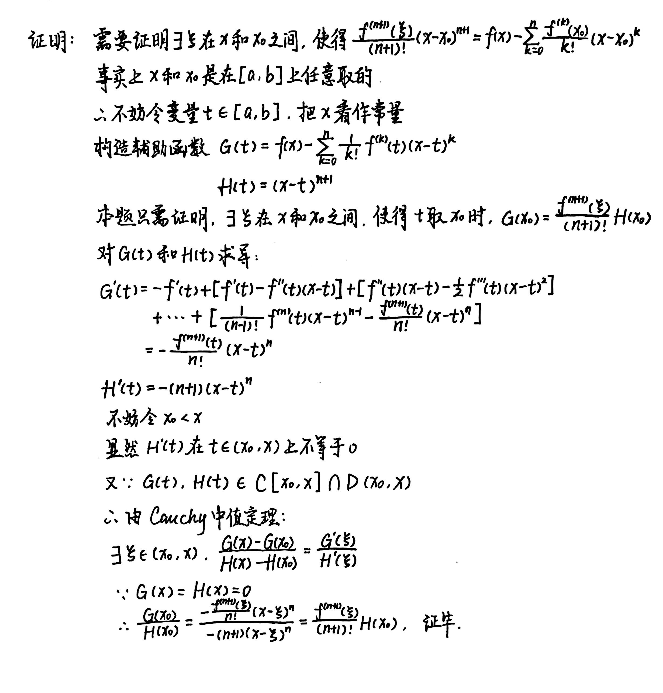
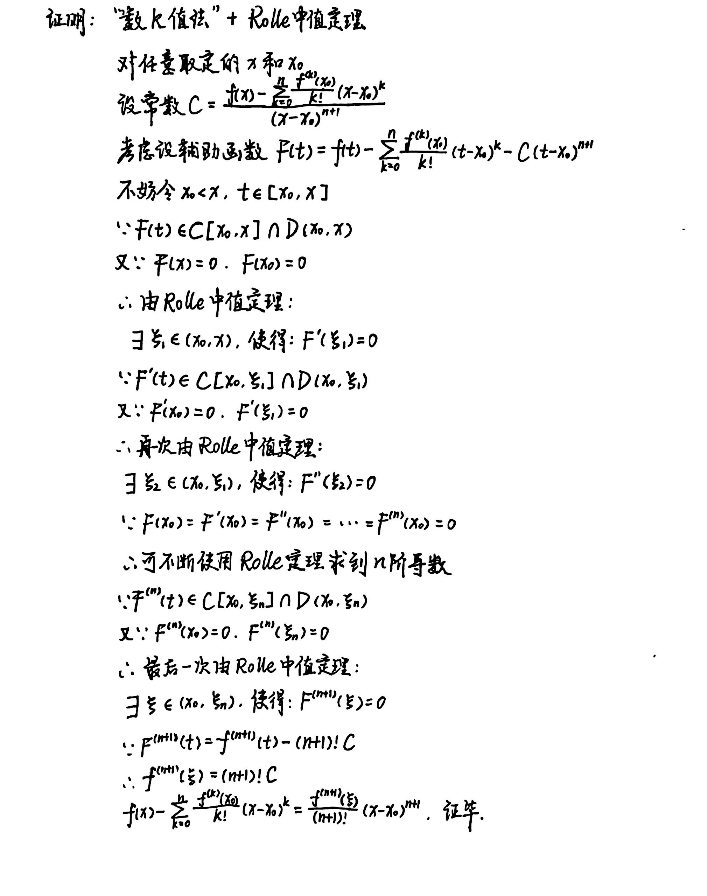

# Chapter4 微分中值定理及其应用

***

## 4.1 微分中值定理

### Fermat引理

设$x_0$是$f(x)$的一个极值点，且$f(x)$在$x_0$处导数存在，则$f'(x_0)=0$。

### Darboux定理

设$f(x)\in C(a,b),x_1,x_2\in (a,b)$.若$f'(x_1)·f'(x_2)<0$，则在$x_1$和$x_2$之间至少存在一点$\xi$，使得$f'(\xi )=0$。

### Rolle定理

若函数$f(x)$满足：

* 在$[a,b]$上连续；

* 在$(a,b)$上可导；

* $f(a)=f(b)$

则至少存在一点$ξ∈(a,b)$，使得$f'(ξ)=0$。

### Lagrange中值定理

设函数$f(x)$在闭区间$[a,b]$上连续，在开区间$(a,b)$上可导，则至少存在一点$ξ∈(a,b)$，使得

$$f'(ξ)=\frac{f(b)-f(a)}{b-a}$$

!!! Tip "Proof"
    

### Cauchy中值定理

若$f(x)$和$g(x)$都在闭区间$[a,b]$上连续，在开区间$(a,b)$上可导，且对于$∀x∈(a,b),g'(x)≠0$，则至少存在一点$\xi\in(a,b)$，使得

$$\frac{f'(ξ)}{g'(ξ)}=\frac{f(b)-f(a)}{g(b)-g(a)}$$

!!! Tip "Proof"
    

### 导数极限定理

设函数$f(x)$在邻域$U(x_0,δ)$上连续，在去心邻域$U^0(x_0,δ)$上可导，若有$\lim\limits_{x→x_0}f'(x)=A$，则$f(x)$在$x_0$处可微，且$f'(x_0)=A$。

!!! Example
    **例1：$p_n(x)=\frac{1}{2^nn!}\frac{d^n}{dx^n}(x^2-1)^n(n=0,1,2,···)$，又称Legendre多项式。证明：$p_n(x)$在$(-1,1)$上恰有$n$个不同的根。**

    

!!! Example
    **例2：证明恒等式：$3arccosx-arccos(3x-4x^3)=\pi ,(x\in [-\frac{1}{2},\frac{1}{2}])$。**

    

***
## 4.2 L'Hospital法则

设函数$f(x)$和$g(x)$在关于$x_0$的去心邻域$U^0(x_0,\delta)$上可导，且满足：

* $\lim\limits_{x\rightarrow x_0}f(x)=\lim\limits_{x\rightarrow x_0}g(x)=0$
或$\lim\limits_{x\rightarrow x_0}g(x)=\infty$

* $\forall x\in U^0(x_0,\delta),g'(x)\neq 0$

* $\lim\limits_{x\rightarrow x_0}\frac{f'(x)}{g'(x)}=A$

则成立$\lim\limits_{x\rightarrow x_0}\frac{f(x)}{g(x)}=A$。

!!! Tip "Proof"
    
    

!!! Example
    **例：**  
    **(1)$0·\infty$型的转换:**  求$\lim\limits_{x\rightarrow 0+}x\ln x$。  
    **(2)$\infty -\infty$型的转换：** 求$\lim\limits_{x\rightarrow 0+}(\cot x-\frac{1}{x})$。  
    **(3)$0^0$型的转换：** 求$\lim\limits_{x\rightarrow 0+}x^x$。  
    **(4)$\infty ^0$型的转换：** 求$\lim\limits_{x\rightarrow 0+}\ln^x\frac{1}{x}$。  
    **(5)$1^{\infty}$型的转换：** 求$\lim\limits_{x\rightarrow \frac{\pi}{2}+}(\sin x)^{\tan x}$。

    

***
## 4.3 Taylor公式

### 形式1.带Peano余项的Taylor公式

设$f(x)$在$x_0$处有$n$阶导数，则存在$x_0$的一个邻域，对于该邻域的任意一点$x$，成立

$$f(x)=f(x_0)+f'(x_0)(x-x_0)+\frac{f''(x_0)}{2!}(x-x_0)^2+···+\frac{f^{(n)}(x_0)}{n!}(x-x_0)^n+r_n(x)$$

其中$r_n(x)=o((x-x_0)^n)$为$Peano$余项。

!!! Tip "Proof"
    

### 形式2.带Lagrange余项的Taylor多项式

设$f(x)$在$[a,b]$上具有$n$阶连续导数，且在$(a,b)$上有$n+1$阶导数，设$x_0\in [a,b]$为一定点，则对于任意$x\in [a,b]$,成立

$$f(x)=f(x_0)+f'(x_0)(x-x_0)+\frac{f''(x_0)}{2!}(x-x_0)^2+···+\frac{f^{(n)}(x_0)}{n!}(x-x_0)^n+r_n(x)$$

其中余项$r_n(x)=\frac{f^{(n+1)}(\xi)}{(n+1)!}(x-x_0)^{n+1}$,$\xi$在$x$和$x_0$之间,为$Lagrange$余项。

!!! Tip "Proof"
    法一：
    
    法二：
    

### 一些重要函数在x=0处的Taylor公式（Maclaurin公式）

$$e^x=1+x+\frac{x^2}{2!}+\frac{x^3}{3!}+···+\frac{x^n}{n!}+r_n(x)$$

它的余项为$r_n(x)=o(x^n)$或$r_n(x)=\frac{e^{\theta x}}{(n+1)!}x^{n+1},\theta \in (0,1)$

$$\sin x=x-\frac{x^3}{3!}+\frac{x^5}{5!}-···+(-1)^n\frac{x^{2n+1}}{(2n+1)^!}+r_{2n+2}(x)$$

它的余项为$r_{2n+2}(x)=o(x^{2n+2})$或$r_{2n+2}(x)=\frac{x^{2n+3}}{(2n+3)!}\sin(\theta x+\frac{2n+3}{2}\pi),\theta \in (0,1)$

$$\cos x=1-\frac{x^2}{2!}+\frac{x^4}{4!}-···+(-1)^n\frac{x^{2n}}{(2n)!}+r_{2n+1}(x)$$

它的余项为$r_{2n+1}(x)=o(x^{2n+1})$或$r_{2n+1}(x)=\frac{x^{2n+2}}{(2n+2)!}\cos(\theta x+\frac{2n+2}{2}\pi),\theta \in (0,1)$

$$(1+x)^a=
\begin{pmatrix}
{\alpha}\\\
{0}\\\
\end{pmatrix}+\begin{pmatrix}
{\alpha}\\\
{1}\\\
\end{pmatrix}x+\begin{pmatrix}
{\alpha}\\\
{2}\\\
\end{pmatrix}x^2+\begin{pmatrix}
{\alpha}\\\
{3}\\\
\end{pmatrix}x^3+···+\begin{pmatrix}
{\alpha}\\\
{n}\\\
\end{pmatrix}x^n+r_n(x)$$

其中$\begin{pmatrix}
{\alpha}\\\
{k}\\\
\end{pmatrix}=\frac{\alpha(\alpha-1)···(\alpha -k+1)}{k!}$，它的余项为$r_n(x)=o(x^n)$或$r_n(x)=\begin{pmatrix}
{\alpha}\\\
{n+1}\\\
\end{pmatrix}(1+\theta x)^{\alpha -(n+1)}·x^{n+1}$

当$\alpha =-1$时

$$\frac{1}{1+x}=1-x+x^2-x^3+x^4-···+（-1)^nx^n+o(x^n)$$

当$\alpha =\frac{1}{2}$时

$$\sqrt{1+x}=1+\frac{1}{2}x-\frac{1}{2·4}x^2+\frac{1·3}{2·4·6}x^3-···+(-1)^{n-1}\frac{(2n-3)!!}{(2n)!!}x^n+o(x^n)$$

当$\alpha =-\frac{1}{2}$时

$$\frac{1}{\sqrt{1+x}}=1-\frac{1}{2}x+\frac{1·3}{2·4}x^2-\frac{1·3·5}{2·4·6}x^3+···+(-1)^n\frac{(2n-1)!!}{(2n)!!}x^n+o(x^n)$$

### Taylor公式的应用

**求Taylor公式：**

!!! Example
    **例1：求$f(x)=sin^2(1+x^2)$的带$Peano$余项的$Maclaurin$公式，展开至第五项。**

    

!!! Example
    **例2：求$f(x)=arctanx$的带$Peano$余项的$Maclaurin$公式。**

    

**求极限：**

!!! Example
    **例：求$\lim\limits_{x\rightarrow +\infty}(\sqrt[3]{x^3+3x}-\sqrt{{x^2-3x}})$**

    

**证明不等式：**

!!! Example
    **例1:设$f(x)\in D^3(0,+\infty),\lim\limits_{x\rightarrow+\infty}f(x)=A,\lim\limits_{x\rightarrow+\infty}f'''(x)=0.$ 证明：$\lim\limits_{x\rightarrow+\infty}f'(x)=\lim\limits_{x\rightarrow+\infty}f''(x)=0.$**

    

!!! Example
    **例2：设$f(x)\in D^2[0,1]$，且对于$\forall x\in [0,1]$，有$|f(x)|\leqslant A,|f''(x)|\leqslant B$. 证明：$|f'(x)|\leqslant 2A+\frac{B}{2},x\in [0,1]$**

    

!!! Example
    **例3：设$f(x)\in D^2[a,b],f'(a)=f'(b)=0$. 证明：$\exists c\in (a,b)$，使得$|f''(c)|\geqslant \frac{4}{(b-a)^2}|f(b)-f(a)|.$**
    
    

我们不难发现，利用Taylor公式证明不等式时常使用带Lagrange余项的Taylor公式，解题的关键点是寻找合适的$x$和$x_0$。

***

## 4.4 函数相关性质

### 极值点

设定义在$(a,b)$上的函数$f(x)，x_0∈(a,b)$，若存在邻域$U(x_0,δ)⊆(a,b)$，使得$∀x∈U(x_0,δ)，f(x)≤f(x_0)$，则称$x_0$是$f(x)$的**极大值点**，$f(x_0)$是$f(x)$的**极大值**。(**极小值点,极小值**同理)  

!!! Note
    对极值点的定义并不涉及函数的其他性质，如连续，可导等。例如，对于区间$(0,1)$上的$Riemann$函数  
    $R(x)=\begin{cases}  
        \frac{1}{p},x=\frac{q}{p}\in Q\\\  
        0,x\notin Q  
    \end{cases}$  
    $(0,1)$上的每个有理点都是极大值点，每个无理点都是极小值点.但$Riemann$函数在每个有理点都不连续，在每个无理点都连续。

### 极值点判定定理

设函数$f(x)$在$x_0$点连续。

**判定法1：**

设$f(x)$在$x_0$点的某一邻域上可导。

* 若左邻域上$f'(x)\geqslant 0$，右邻域上$f'(x)\leqslant 0$，则$x_0$是$f(x)$的极大值点

* 若左邻域上$f'(x)\leqslant 0$，右邻域上$f'(x)\geqslant 0$，则$x_0$是$f(x)$的极小值点

* 若左邻域与右邻域上$f'(x)$同号，则$x_0$不是$f(x)$的极值点

**判定法2：**

设$f'(x_0)=0$，且$f(x)$在$x_0$点二阶可导。

* 若$f''(x_0)<0$，则$x_0$是$f(x)$的极大值点

* 若$f''(x_0)>0$，则$x_0$是$f(x)$的极小值点

* 若$f''(x_0)=0$，则$x_0$可能是$f(x)$的极大值点，也可能是$f(x)$的极小值点

**推广：**

设$f(x)\in D^n(U(x_0)),f'(x_0)=f''(x_0)=···=f^{(n-1)}(x_0)=0,f^{(n)}(x_0)\neq 0$，则

* 当$n$为奇数时，$f(x)$在$x_0$点不取极值

* 当$n$为偶数且$f^{(n)}(x_0)>0$时，$f(x)$在$x_0$点取极小值

* 当$n$为偶数且$f^{(n)}(x_0)<0$时，$f(x)$在$x_0$点取极大值

### 凸性

**定义：**

设定义在区间$I$上的函数$f(x)$,若对于$I$中的任意两点$x_1,x_2$和任意$\lambda \in (0,1)$,都有

$$f(\lambda x_1+(1-\lambda )x_2)\leqslant \lambda f(x_1+（1-\lambda)f(x_2))$$

(本质上即$x_1,x_2$两点之间的所有点都在$x_1,x_2$连线的下方)，则称$f(x)$是$I$上的**下凸函数**。(**上凸函数**同理)

**性质：**

设函数$f(x)\in D^2(I)$,则$f(x)$在区间$I$上是下凸函数的充要条件是：

$$\forall x\in I,f''(x)\geqslant 0$$

$f(x)$在区间$I$上是下凸函数的充要条件是：

$$\forall x_1,x_2,x_3\in I,~x_1<x_2<x_3,~\frac{f(x_2)-f(x_1)}{x_2-x_1}<\frac{f(x_3)-f(x_1)}{x_3-x_1}<\frac{f(x_3)-f(x_2)}{x_3-x_2}$$

设$f(x)\in C[a,b]\cap D(a,b)$，则下列命题等价：

* $f(x)$为$[a,b]$上的下凸函数

* $f'(x)$在$(a,b)$上单调递增

* $\forall x_0\in (a,b),f(x)\geqslant f(x_0)+f'(x_0)(x-x_0)$，即切线在图像下方

### 拐点

设$f(x)\in D^2(I)$,存在关于$x_0$的邻域.若$f''(x)$在左右邻域的符号相反，则点$(x_0,f(x_0))$称为$f(x)$的**拐点**。

**性质：**

$(x_0,f(x_0))$为$f(x)$拐点的充要条件是：

$$f''(x_0)=0,~f'''(x_0)\neq 0$$

### Jensen不等式

若$f(x)$为区间$I$上的下凸函数，则对于$\forall x_i\in I$和满足$\sum\limits_{i=1}^{n}\lambda_i=1$的$\lambda_i>0(i=1,2,···,n)$，成立

$$f(\sum\limits_{i=1}^{n}\lambda _ix_i)\leqslant\sum\limits_{i=1}^{n}\lambda _if(x_i)$$

特别地，取$\lambda _i=\frac{1}{n}(i=1,2,···,n)$，有
$f(\frac{1}{n}\sum\limits_{i=1}^{n}x_i)

$\leqslant\frac{1}{n}\sum\limits_{i=1}^{n}f(x_i)$$

### 函数作图

1.定义域和值域

2.有界性，奇偶性，周期性

3.解方程$f'(x)=0$，列表确定函数的增减区间和极值点

4.解方程$f''(x)=0$，列表确定函数的凹凸区间和拐点

5.斜渐近线和垂直渐近线
若$y=kx+b$是$y=f(x)$的一条渐近线，则

$$k=\lim\limits_{x\rightarrow +\infty}\frac{f(x)}{x},b=\lim\limits_{x\rightarrow +\infty}(f(x)-kx)$$

6.计算特殊点的函数值（如与坐标轴的交点）