

# Chapter5 不定积分

***

## 5.1 不定积分的概念和运算法则

### 不定积分

一个函数$f(x)$若存在原函数，则其原函数全体称为这个函数的**不定积分**，记作$\int f(x)dx$。

### 线性性

若函数$f(x)$和$g(x)$原函数都存在，则对于任意常数$k_1$和$k_2$，函数$k_1f(x)+k_2g(x)$的原函数也存在，且有

$$\int [k_1f(x)+k_2g(x)]dx=k_1\int f(x)dx+k_2\int g(x)dx$$

### 常见不定积分

$$\int \sec^2xdx=\tan x+C$$

$$\int \csc^2xdx=-\cot x+C$$

$$\int \tan x·\sec xdx=\sec x+C$$

$$\int \cot x·\csc xdx=-\csc x+C$$

$$\int \frac{dx}{\sqrt{1-x^2}}=\arcsin x+C$$

$$\int \frac{dx}{1+x^2}=\arctan x+C$$

***

## 5.2 求不定积分常用方法

### 第一类换元积分法

将$\int f(x)dx$转换为$\int f(g(x))g'(x)dx$，即为$\int f(u)du,u=g(x)$的形式，最后得到$F(g(x))+C$，其中$F(u)$即为$f(u)$的原函数。

### 第二类换元积分法

令$x=\phi(t)$进行换元，代入不定积分中得到便于求解的$\int g(t)dt$，从而得到$G(t)+C$，再将$t=\phi^{-1}(x)$代回即可。（要求：$\phi (t)$单调，可取反）

技巧：

$$\sqrt{a^2-x^2}\rightarrow x=a\sin t$$

$$\sqrt{x^2-a^2}\rightarrow x=a\sec t$$

$$\sqrt{x^2+a^2}\rightarrow x=a\tan t$$

### 分部积分法

$$\int u(x)v'(x)dx=u(x)v(x)-\int v(x)u'(x)dx$$

即把原来的$f(x)$看作$u(x)$和$v'(x)$的乘积，套用分部积分公式，$v'(x)$通常取$e^x,\sin x,\cos x,x^n$。

### 例题

!!! Example
    **例1：常见分式的不定积分**     
    **(1) 求$\int \frac{1}{x^2+a^2}dx$。**  
    **(2) 求$\int \frac{1}{x^2-a^2}dx$。**  
    **(3) 求$\int \frac{1}{x^2+px+q}dx$。(递推式)** 

    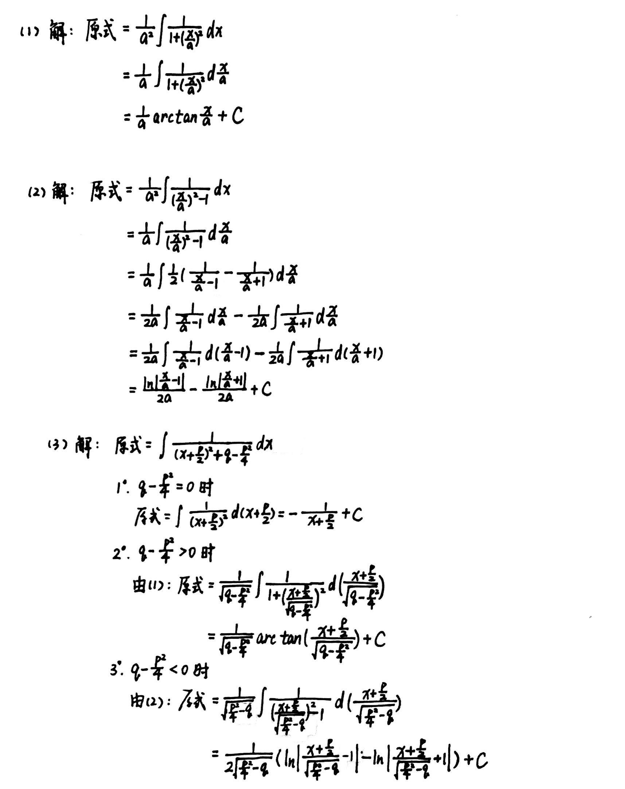

!!! Example
    **例2：$\tan x$的n次不定积分**  
    **(1) 求$\int \tan xdx$。**     
    **(2) 求$\int \tan^2xdx$。**    
    **(3) 求$\int \tan^nxdx$。**    

    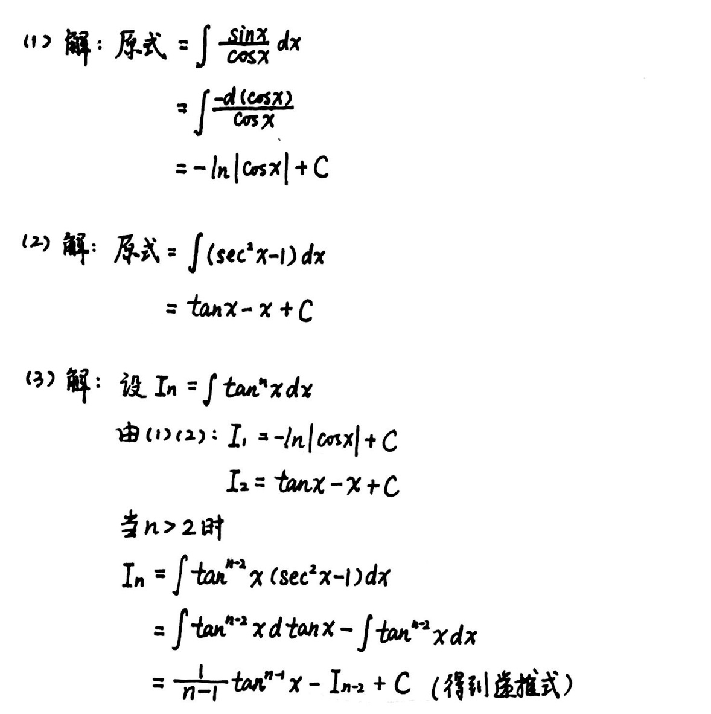

!!! Example
    **例3：$\sec x$的n次不定积分**      
    **(1) 求$\int \sec xdx$。**     
    **(2) 求$\int \sec^2xdx$。**     
    **(3) 求$\int \sec^nxdx$。(递推式)**

    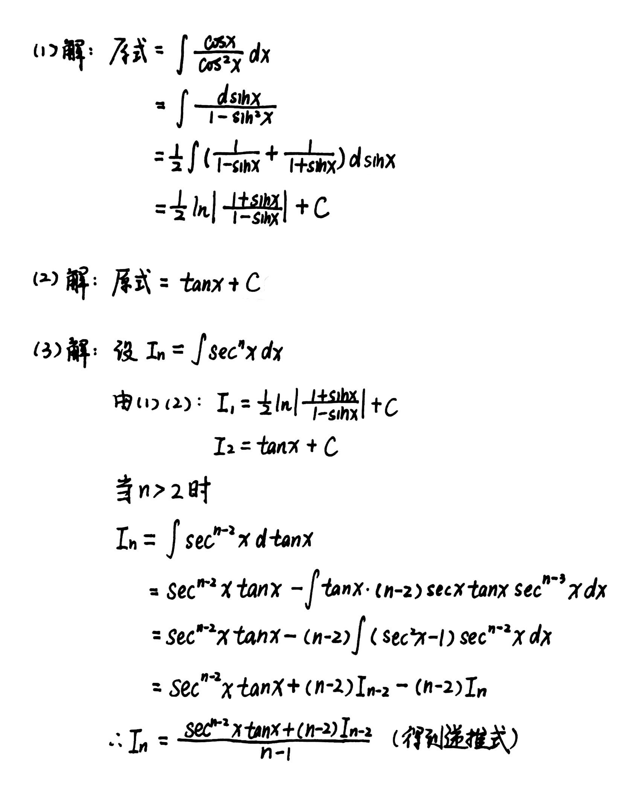

!!! Example
    **例4：两两配对，通过联立方程组解出各自的不定积分**     
    **(1) 求$I=\int \frac{1}{1+x^3}dx,J=\int \frac{x}{1+x^3}$。**   
    **(2) 求$I=\int \frac{\cos x}{a\cos x+b\sin x}dx,J=\int \frac{\sin x}{a\cos x+b\sin x}dx$。**

    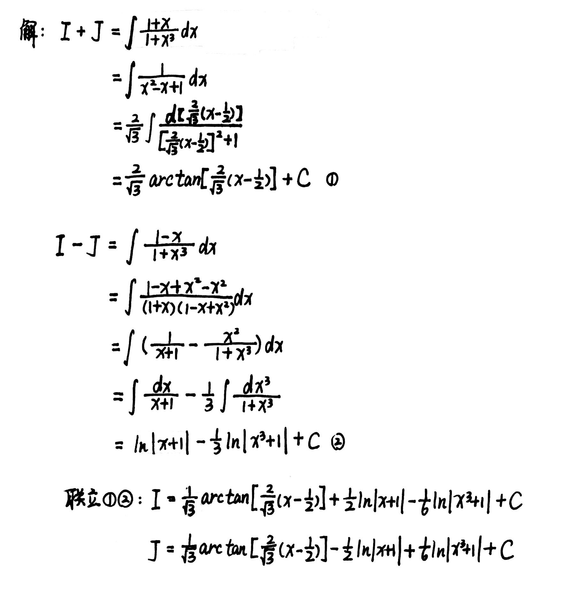
    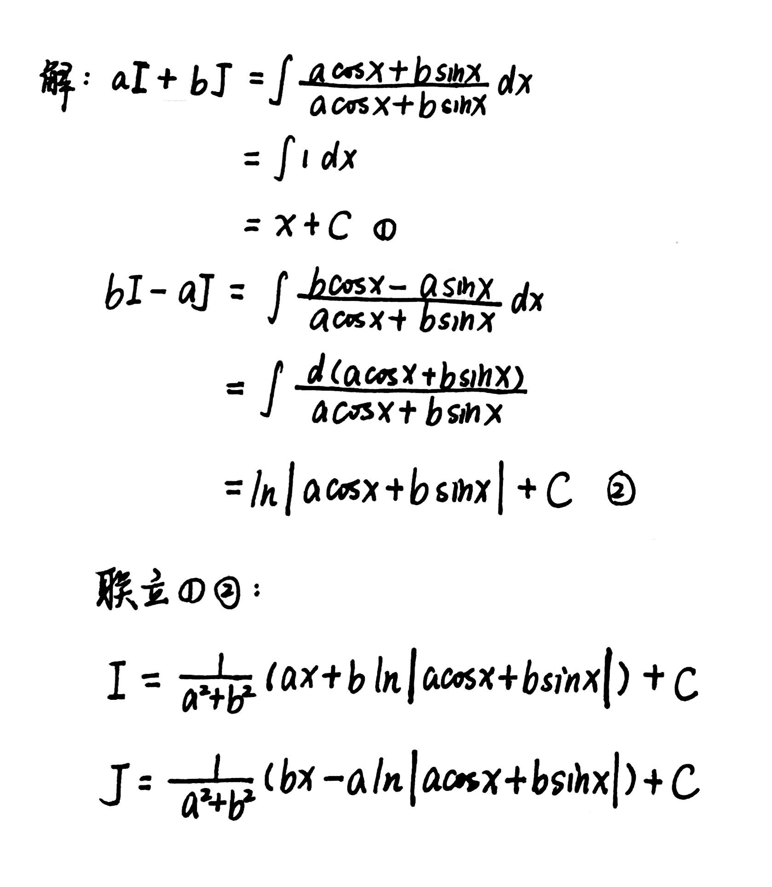

***

## 5.3 有理函数的不定积分

### 有理函数

考虑有理真分式$(n<m)$：

$$f(x)=\frac{P(x)}{Q(x)}=\frac{a_0x^n+a_1x^{n-1}+···+a^{n-1}x+a_n}{b_0x^m+b_1x^{m-1}+···+b_{m-1}x+n_m}$$

有理真分式可分解为形如下列四种最简真分式的线性组合：

$$\frac{A}{x-a},~\frac{A}{(x-a)^k},~\frac{Bx+C}{x^2+px+q},~\frac{Bx+C}{(x^2+px+q)^k}$$

其中$p^2-4q<0,~k\geqslant 2$

!!! Example
    **例：**    
    **(1) 求$\int \frac{x^2+1}{(x-1)(x+1)^2}dx$。**     
    **(2) 求$\int \frac{2x^4+5x^2-2}{2x^3-x-1}dx$。**   

    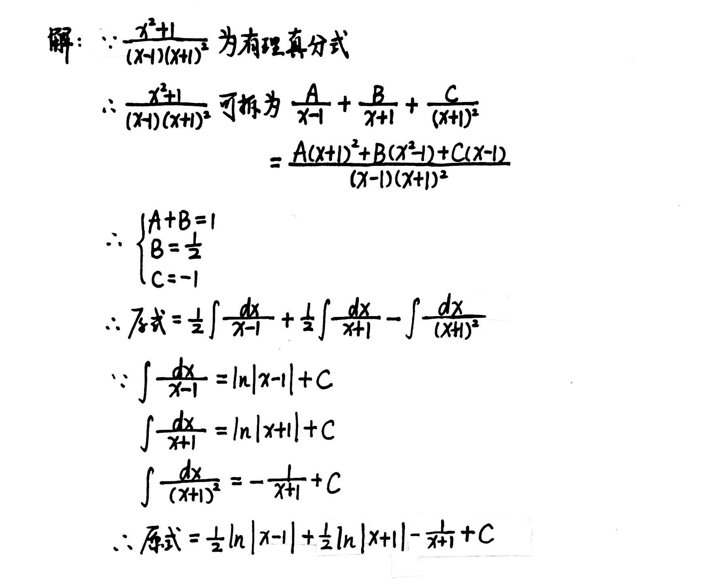
    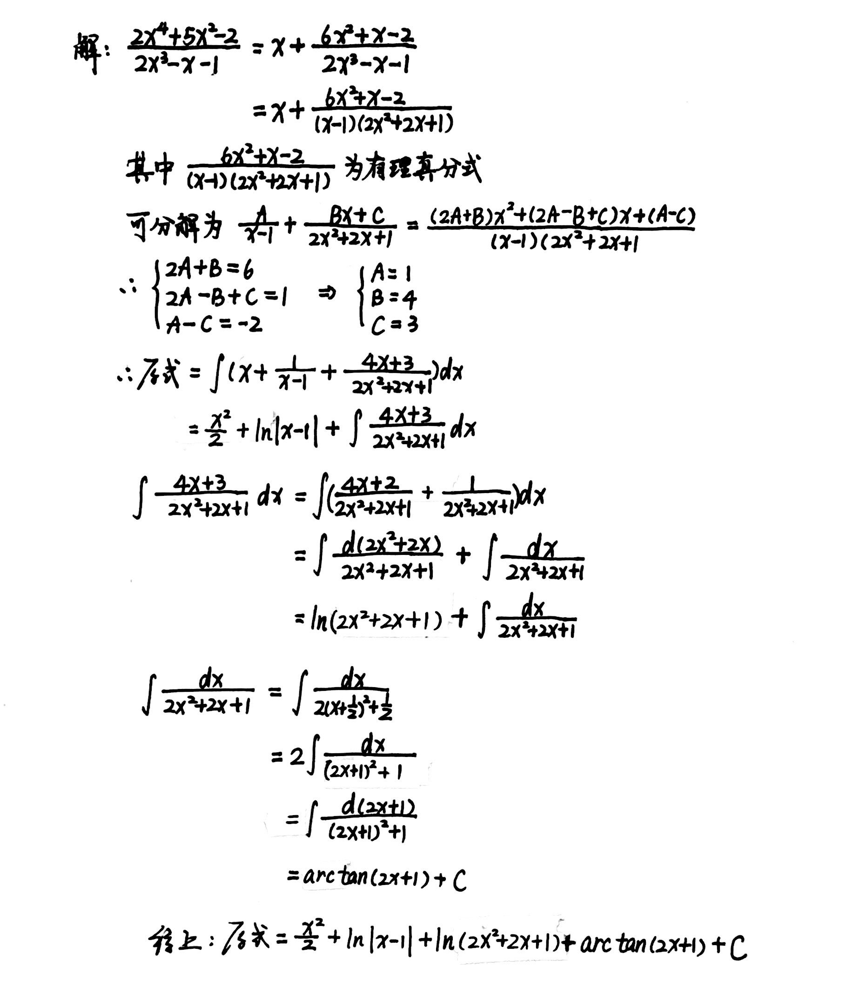

### 三角函数转换为有理函数

**万能公式：**

令

$$t=\tan\frac{x}{2}$$

则

$$\sin x=\frac{2t}{1+t^2}$$

$$\cos x=\frac{1-t^2}{1+t^2}$$

$$dx=\frac{2dt}{1+t^2}$$

!!! Example
    **例1：求$\int \frac{1}{3\sin x+4\cos x}dx$。**

    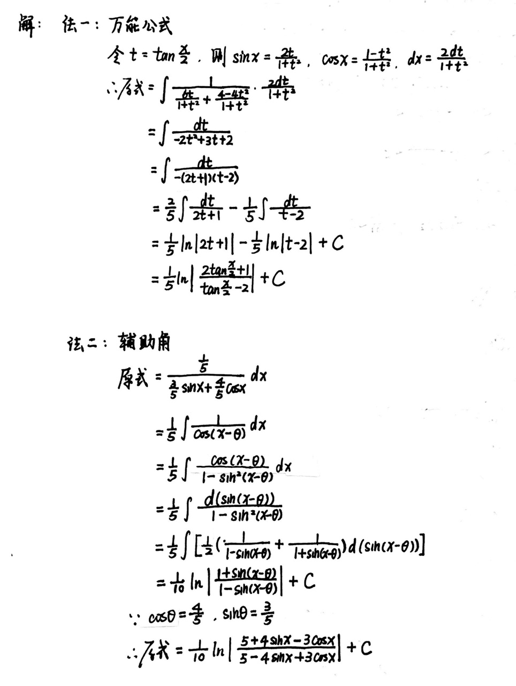

**其他换元：**

若

$$R(\cos x,-\sin x)=-R(\cos x,\sin x)$$

则令

$$t=\cos x$$

若

$$R(-\cos x,\sin x)=-R(\cos x,\sin x)$$

则令

$$t=\sin x$$

若

$$R(-\cos x,-\sin x)=R(\cos x,\sin x)$$

则令

$$t=\tan x$$

!!! Example
    **例2：**   
    **(1)求$\int \frac{\cos^3x}{1+\sin^2x}dx$。**   
    **(2)求$\int \frac{\sin x\cos x}{\sin^2x+\cos x}dx$。**      
    **(3)求$\int \frac{\cos^2x}{(a^2\sin^2x+b^2\cos^2x)^2}dx$。**    

    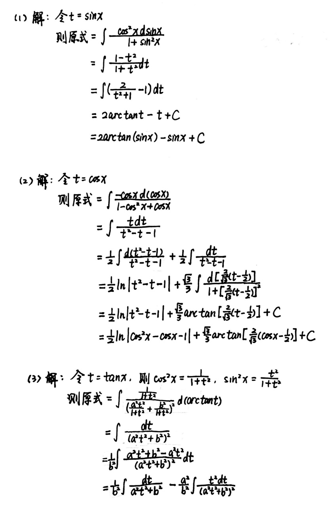
    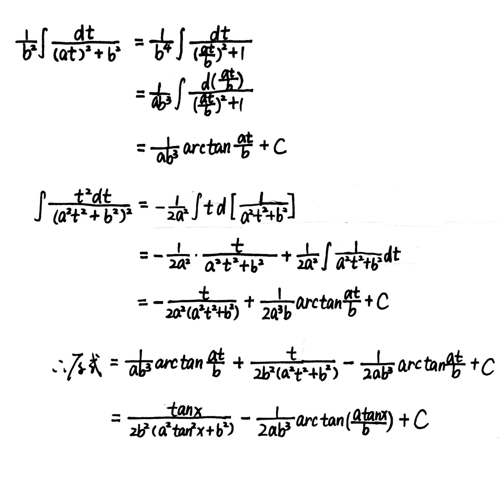

### 根式转换为有理函数

**类型一：**

$$R(x,\sqrt[m]{\frac{ax+b}{cx+d}})$$

$$t=\sqrt[m]{\frac{ax+b}{cx+d}}$$

!!! Example
    **例：求$\int \sqrt[3]{\frac{2-x}{2+x}}\frac{dx}{(2-x)^2}$**

    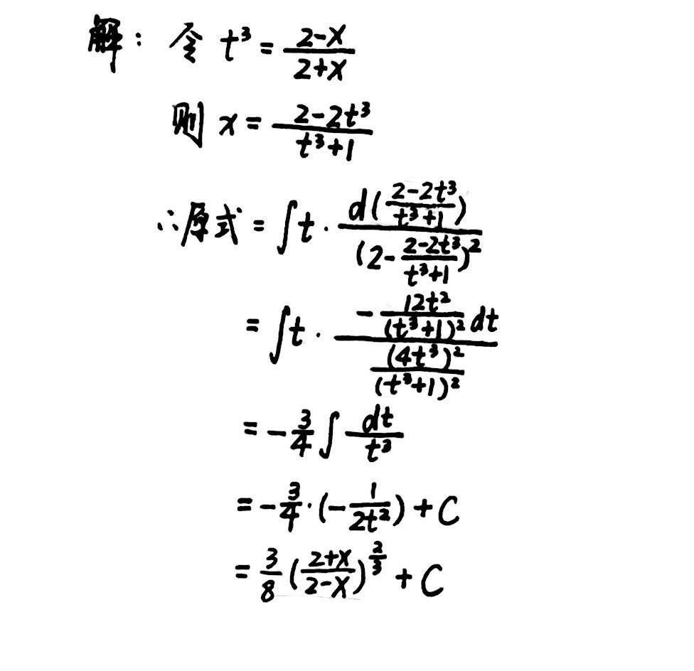

**类型二：**

$$R(x,\sqrt{ax^2+bx+c})$$

① Euler第一替换：

若$a>0$，则令

$$\sqrt{ax^2+bx+c}=\pm \sqrt{a}x+t$$

② Euler第二替换：

若$c>0$，则令

$$\sqrt{ax^2+bx+c}=xt+\sqrt{c}$$

③ Euler第三替换：

若$ax^2+bx+c=a(x-\alpha)(x-\beta)$，则令

$$\sqrt{ax^2+bx+c}=(x-\alpha)t$$

!!! Example
    **例：求$\int \frac{1-\sqrt{1+x+x^2}}{x\sqrt{1+x+x^2}}dx$**

    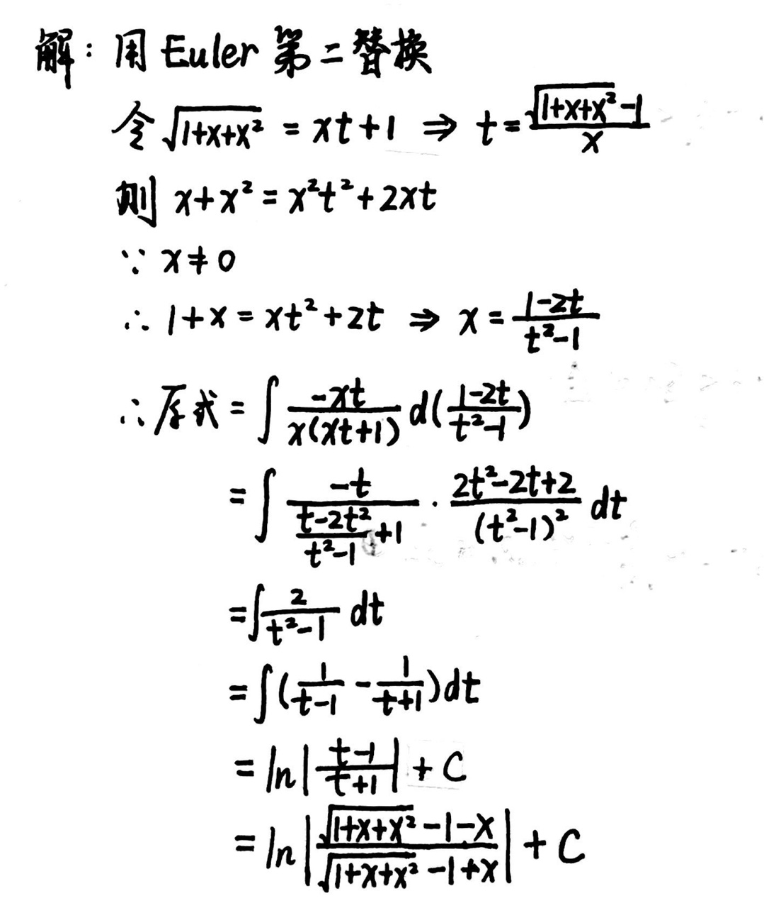

一般来讲，Euler替换会带来繁重的计算，针对下列情形可做适当调整：

$$I=\int \frac{P_n(x)}{\sqrt{ax^2+bx+c}}dx$$

可转化为

$$I=Q(x)\sqrt{ax^2+bx+c}+\beta\int \frac{dx}{\sqrt{ax^2+bx+c}}$$

可用待定系数法求导解出。

!!! Example
    **例：求$\int\frac{12x^3+16x^2+9x+2}{\sqrt{x^2+4x+2}}$。**

    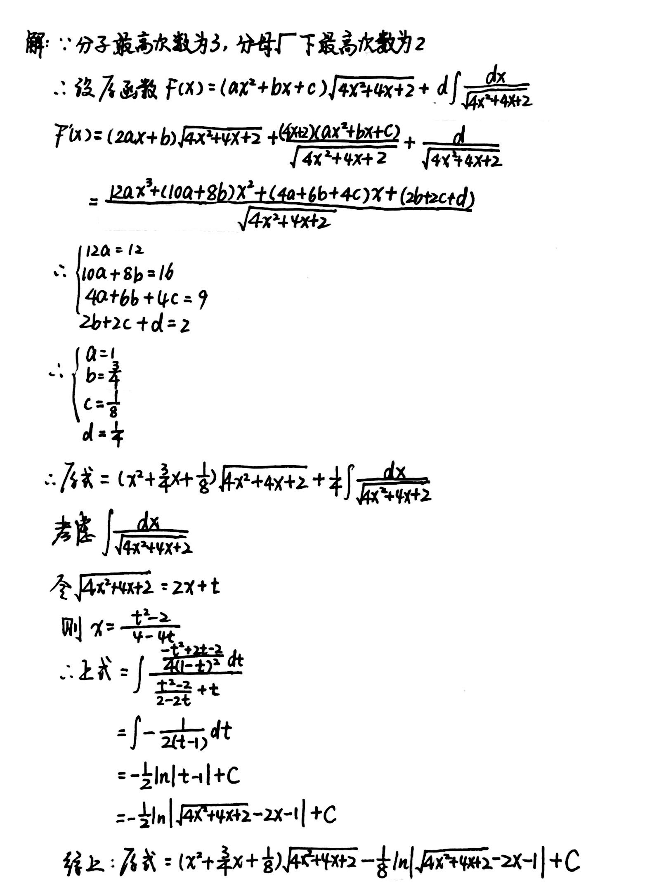

**类型三：**

$$\int x^m(a+bx^n)^pdx$$

其中$m,n,p$为有理数。令

$$t=x^n$$

则原式转化为

$$\int t^{\frac{m}{n}}(a+bt)^p\frac{1}{n}t^{\frac{1}{n}-t}dt=\frac{1}{n}\int t^{\frac{m+1}{n}-1}(a+bt)^pdt$$

令

$$q=\frac{m+1}{m}-1$$

则原式转化为

$$\frac{1}{n}\int t^q(a+bt)^pdt$$

* $p$为整数，$q$为有理数

* $q$为整数，$p$为有理数

* $p+q$为整数，$p$为有理数

满足以上三种情况之一的不定积分可以转化为类型一（其他情况都推不出原函数）。

!!! Example
    **例：求$\int \frac{1}{\sqrt[4]{1+x^4}}dx$。**

    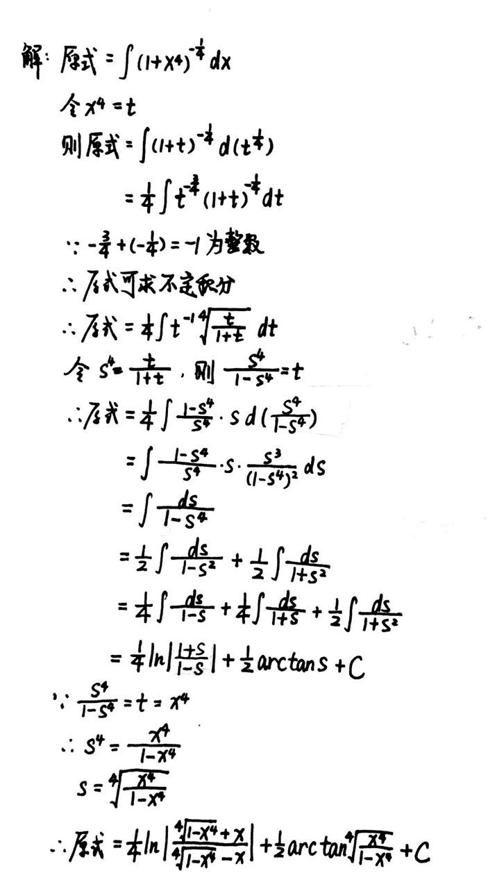