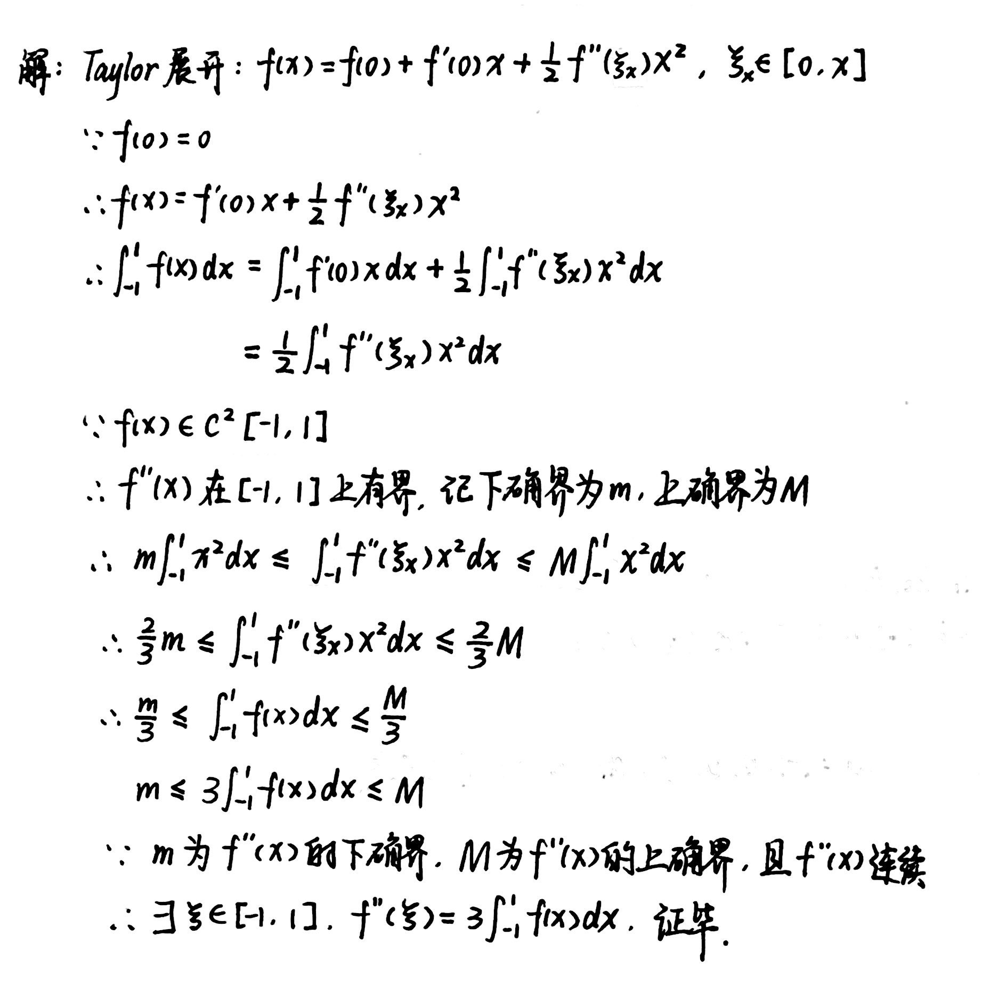

# Chapter6 定积分

***

## 6.1 定积分的概念和可积条件

### 定积分的定义

设$f(x)$在$[a,b]$上有界，取划分

$$\Delta:a=x_0<x_1<x_2<···<x_n=b$$

在每个小区间$[x_i,x_{i+1}]$中任取点$\xi_i$，令$||\Delta||$为小区间长度的最大值，若当$||\Delta||\rightarrow 0$时，极限

$$\lim\limits_{||\Delta||\rightarrow 0}\sum\limits_{i=1}^{n}f(\xi_i)\Delta x_i$$

存在，且与$\Delta$的划分和$\xi_i$的取法无关，则称$f(x)$在$[a,b]$上**Riemann可积**，上述极限值称为$f(x)$在$[a,b]$上的**定积分**.

### 加细分割/合并分割

设$\Delta_1,\Delta_2$是$[a,b]$的两个分割。

若$\Delta_1$的分点全是$\Delta_2$的分点，则称$\Delta_2$是$\Delta_1$的**加细分割**，记作$\Delta_1\subset \Delta_2$。

若$\Delta^{\*}$是合并$\Delta_1$和$\Delta_2$的全体分点而形成的分割，则称$\Delta^{\*}$为$\Delta_1$与$\Delta_2$的**合并分割**，记作$\Delta^{\*}=\Delta_1\cup\Delta_2$。

### 上和/下和

记$f(x)$在每段小区间上的上确界为$M_i$，下确界为$m_i$，则

$$\overline{S_{\Delta}}=\sum\limits_{i=1}^{n}M_i\Delta x_i$$ 

记作**Darboux上和（大和）**。

$$\underline{S_{\Delta}}=\sum\limits_{i=1}^{n}m_i\Delta x_i$$ 

记作**Darboux下和（小和）**。

### 引理：大和不增，小和不减                      

设$\Delta_1,\Delta_2$是$[a,b]$的两个分割，若$\Delta_1\subset \Delta_2$，且$\Delta_2$仅比$\Delta_1$多一个分点，则

$$0\leqslant \overline{S_{\Delta_{1}}}-\overline{S_{\Delta_{2}}}\leqslant ||\Delta_1||(M-m)$$

$$0\leqslant \underline{S_{\Delta_{2}}}-\underline{S_{\Delta_{1}}}\leqslant ||\Delta_1||(M-m)$$

!!! Tip "Proof"
    

**推论1：** 

若$\Delta_2$是$\Delta_1$添加$k$个新分点后形成的分割，则

$$0\leqslant \overline{S_{\Delta_{1}}}-\overline{S_{\Delta_{2}}}\leqslant k||\Delta_1||(M-m)$$

$$0\leqslant \underline{S_{\Delta_{2}}}-\underline{S_{\Delta_{1}}}\leqslant k||\Delta_1||(M-m)$$

**推论2：** 

设$\Delta_1,\Delta_2$是$[a,b]$的任意两个分割，则

$$\underline{S_{\Delta_1}}\leqslant \overline{S_{\Delta_2}}$$

上和一定大于下和。

### 上积分/下积分

对$[a,b]$的任意分割做相应的上和数集$\\{\overline{S_\Delta}\\}$与下和数集$\\{\underline{S_\Delta}\\}$，则上和数集的下确界为**上积分**，记作$\overline{A}$.下和数集的上确界为**下积分**，记作$\overline{A}$。

### Darboux定理

$$\lim\limits_{||\Delta||\rightarrow 0}\overline{S_\Delta}=\overline{A}$$

$$\lim\limits_{||\Delta||\rightarrow 0}\underline{S_\Delta}=\underline{A}$$

!!! Tip "Proof"
    

### 可积的充要条件

**1:** 上积分和下积分相等，即

$$\overline{A}=\underline{A}$$

!!! Tip "Proof"
    

**2:** $\forall \varepsilon>0,\exists \delta>0,\forall \Delta$满足$||\Delta||<\delta$，有$\overline{S_\Delta}-\underline{S_\Delta}<\varepsilon$。

**3:** $\forall \varepsilon>0,\exists \Delta,\overline{S_\Delta}-\underline{S_\Delta}=\sum\limits_{i=1}^{n}\omega_i\Delta x_i<\varepsilon$。其中$\omega_i=M_i-m_i$为该区间上的**振幅**。

**4:** $\forall \varepsilon>0,\forall \sigma >0,\exists \Delta :a=x_0<x_1<···<x_n=b$，其相应于$\omega_i\geqslant \varepsilon$的子区间$\Delta x_i$的长度总和小于$\sigma$。

!!! Tip "Proof"
    

***

## 6.2 定积分的基本性质

### 定积分的五个性质

**1.线性性：**

设$f(x),g(x)\in R[a,b],k_1,k_2$为常数。则$k_1f(x)+k_2g(x)\in R[a,b]$，且有

$$\int_a^b[k_1f(x)+k_2g(x)]dx=k_1\int_a^bf(x)dx+k_2\int_a^bg(x)dx$$

**2.乘积可积性：**

设$f(x),g(x)\in R[a,b]$，则$f(x)·g(x)\in R[a,b]$

**3.保序性：**

设$f(x),g(x)\in R[a,b]$，且在$[a,b]$上恒有$f(x)\geqslant g(x)$，则有

$$\int_a^bf(x)dx\geqslant\int_a^b g(x)dx$$

**4.绝对可积性：**

设$f(x)\in R[a,b]$，则$|f(x)|\in R[a,b]$，且有

$$|\int_a^b f(x)dx|\leqslant \int_a^b|f(x)|dx$$

**5.区间可加性：**

设$f(x)\in R[a,b]$，则对任意点$c\in[a,b],f(x)\in R[a,c],f(x)\in R[c,b]$，反过来也成立，即有

$$\int_a^b f(x)dx=\int_a^c f(x)dx+\int_c^b f(x)dx$$

### 阶梯逼近

设$f(x)\in R[a,b],\forall \varepsilon >0$

(1)$\exists [a,b]$上的阶梯函数$h(x),\int_a^b|f(x)-h(x)|dx<\varepsilon$

(2)$\exists [a,b]$上的连续函数$g(x),\int_a^b |f(x)-g(x)|dx<\varepsilon$

***

## 6.3 微积分基本定理

### Newton-Leibniz公式

若$f(x)\in R[a,b]$，$F(x)$是$f(x)$在$[a,b]$上的一个原函数，则成立

$$\int_a^b f(x)dx=F(b)-F(a)=F(x)|_a^b$$

### Cauchy-Schwarz不等式

若$f(x),g(x)\in R[a,b]$，则有

$$(\int_a^b|f(x)g(x)|dx)^2\leqslant\int_a^bf^2(x)dx·\int_a^bg^2(x)dx$$

!!! Tip "Proof"
    

### Riemann-Lebesque引理

若$f(x)\in R[a,b]$，则有

$$\lim\limits_{\lambda\rightarrow +\infty}\int_a^bf(x)\sin\lambda xdx=0$$

!!! Tip "Proof"

### 变限积分

设$f\in R[a,b]$，则$\forall x\in [a,b],f(t)\in R[a,x]$，称

$$F(x)=\int_a^x f(t)dt$$

为$f$在$[a,b]$上的**变上限积分**，$F(x)$的导数即为$f(x)$。(同样可定义**变下限积分**)

$$[\int_{\phi(x)}^{\psi(x)}f(t)dt]'=f(\psi(x))\psi'(x)-f(\phi(x))\phi'(x)$$

### 换元积分法

设$f(x)\in C[a,b],x=\phi(t)\in C^1[\alpha,\beta],\phi(\alpha)=a,\phi(\beta)=b$，则

$$\int_a^bf(x)dx=\int_\alpha^\beta f(\phi(t))\phi'(t)dt$$

条件可减弱为：$f(x)\in R[a,b],\phi'(t)\in R[\alpha,\beta]$

### 分部积分法

设$u(x),v(x)\in C^1[a,b]$，则

$$\int_a^bu(x)v'(x)dx=[u(x)v(x)]|_a^b-\int_a^bv(x)u'(x)dx$$

条件可减弱为：$u(x),v(x)\in R[a,b]$

### Wallis公式

$$\lim\limits_{n\rightarrow \infty}[\frac{(2n)!}{(2n-1)!!}]^2·\frac{1}{2n+1}=\frac{\pi}{2}$$

### Stirling公式

$$n!\sim\sqrt{2n\pi}(\frac{n}{e})^n,~(n\rightarrow \infty)$$

***

## 6.4 积分中值定理

### 积分第一中值定理

设$g(x)\in R[a,b]$且函数值不变号。

(1) 若$f(x)\in R[a,b],m=\inf f(x),M=\sup f(x)$，则存在$\eta\in [m,M]$，使得

$$\int_a^bf(x)g(x)dx=\eta\int_a^bg(x)dx$$

(2) 若$f(x)\in C[a,b]$，则存在$\xi \in[a,b]$，使得

$$\int_a^bf(x)g(x)dx=f(\xi)\int_a^bg(x)dx$$

!!! Example
    **例1：设$f(x)\in C^2[-1,1],f(0)=0$，求证：$\exists\xi\in[-1,1]$，使得$f''(\xi)=3\int_{-1}^{1}f(x)dx$。**

    

!!! Example
    **例2：设$f(x)\in C[0,\pi],\int_0^{\pi} f(x)dx=0,\int_0^{\pi}f(x)cosxdx=0$，求证：$\exists\xi_1,\xi_2\in(0,\pi)$，使得$f(\xi_1)=f(\xi_2)=0$。**

    

### 积分第二中值定理

设$g(x)\in R[a,b]$

**Bonnet型：**

(1) 若$f(x)$是$[a,b]$上的非负递减函数，则存在$\xi \in [a,b]$，使得

$$\int_a^bf(x)g(x)dx=f(a)\int_a^{\xi}g(x)dx$$

(2) 若$f(x)$是$[a,b]$上的非负递增函数，则存在$\xi \in [a,b]$，使得

$$\int_a^bf(x)g(x)dx=f(b)\int_{\xi}^bg(x)dx$$

**Weierstrass型：**

若$f(x)$在$[a,b]$上单调，则存在$\xi\in[a,b]$，使得

$$\int_a^bf(x)g(x)dx=f(a)\int_a^{\xi}g(x)dx+f(b)\int_{\xi}^bg(x)dx$$

!!! Example
    **例1：设$f(x)\in D[a,b]$，且$f'(x)$单调递减，$f'(b)\geqslant m>0$，求证：$|\int_a^b\cos f(x)dx|\leqslant \frac{2}{m}$。**

    

!!! Example
    **例2：设$f(x)=\begin{cases}
    \int_0^x\sin\frac{1}{t}dt,~~~x\neq 0\\\
    0,~~~~~~~~~~~~~~~~~~x=0
    \end{cases}$
    求证：$f(x)$在0处可导，且$f'(0)=0$。**

    

### Abel变换

设有两组数$\\{a_k\\},\\{b_k\\},A_k=\sum\limits_{i=1}^ka_i$，则

$$\sum\limits_{k=1}^na_kb_k=\sum\limits_{k=1}^{n-1}(b_k-b_{k+1})A_k+A_nb_n$$

***

## 6.5 定积分在几何计算中的应用

### 面积、弧长与体积

### 曲率

**平均曲率：**

$$\overline{K}=|\frac{\Delta \phi}{\Delta s}|$$

其中$\Delta \phi$是$A,B$两点切线的夹角，$\Delta s$是$A,B$两点之间的弧长。

**曲率：**

$$K=\lim\limits_{\Delta a\rightarrow 0}|\frac{\Delta \phi}{\Delta s}|=|\frac{d\phi}{ds}|$$

**曲率半径：**

$$R=\frac{1}{K}$$

**参数方程的曲率：**

设参数方程

$$\begin{cases}
x=x(t)\\\
y=y(t)    
\end{cases}$$

$$K=\frac{|x'(t)y''(t)-x''(t)y'(t)|}{(x'^2(t)+y'^2(t))^{\frac{3}{2}}}$$