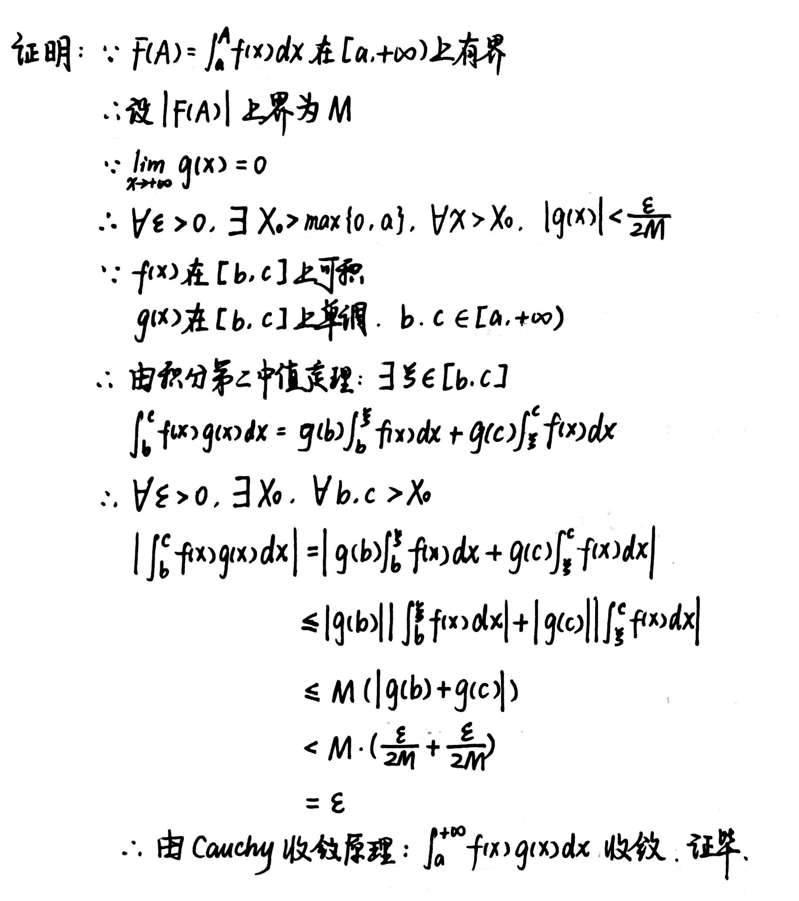

# Chapter7 反常积分

***

## 7.1 无穷积分

### 无穷积分

设函数$f(x)$在$[a,+\infty)$有定义，且在任意有限区间上可积，若极限

$$\lim\limits_{b\rightarrow +\infty}\int_a^bf(x)dx$$

存在，则称反常积分$\int_a^{+\infty}f(x)dx$**收敛**，上式即为其积分值（反之则称其**发散**）

!!! Example
    **例1：设$p$为任意实数，探究$\int_1^{+\infty}\frac{dx}{x^p}$的敛散性。**

    

!!! Example
    **例2：求$\int_1^{+\infty}\frac{1}{x\sqrt{1+x^2}}dx$。**

    

### 反常积分的Cauchy收敛原理

#### Cauchy收敛原理

$\int_a^{+\infty}f(x)dx$收敛的充要条件为：

$$\forall \varepsilon>0,~\exists A_0>a,~\forall c>b>A_0,~|\int_b^cf(x)dx|<\varepsilon$$

推论：

若$\int_a^{+\infty}|f(x)|dx$收敛，则$\int_a^{+\infty}f(x)dx$也收敛，且

$$|\int_a^{+\infty}f(x)dx|\leqslant \int_a^{+\infty}|f(x)|dx$$

#### 绝对收敛和条件收敛

若$\int_a^{+\infty}|f(x)|dx$收敛，则$\int_a^{+\infty}f(x)dx$**绝对收敛**。

若$\int_a^{+\infty}|f(x)|dx$发散，$\int_a^{+\infty}f(x)dx$收敛，则$\int_a^{+\infty}f(x)dx$**条件收敛**。

### 非负函数反常积分的收敛判别法

**比较判别Ⅰ：**

设在$[a,+\infty)$上恒有$0\leqslant f(x) \leqslant Cg(x)$，其中$C$是正数，则

(1) 若$\int_a^{+\infty}g(x)dx$收敛，则$\int_a^{+\infty}f(x)dx$也收敛

(2) 若$\int_a^{+\infty}f(x)dx$发散，则$\int_a^{+\infty}g(x)dx$也发散

**比较判别Ⅱ：**

设$f(x),g(x)$在$[a,+\infty)$上非负，且$\lim\limits_{x\rightarrow +\infty}\frac{f(x)}{g(x)}=C$，则

(1) 若$0\leqslant C<+\infty$，则$\int_a^{+\infty}g(x)dx$收敛时，$\int_a^{+\infty}f(x)dx$也收敛

(2) 若$0<C\leqslant +\infty$，则$\int_a^{+\infty}g(x)dx$发散时，$\int_a^{+\infty}f(x)dx$也发散

!!! Example
    **例：探究$\int_a^{+\infty}e^{-x^2}dx$的收敛性。**

    

### 一般函数反常积分的收敛判别法

**Abel判别：**

若$\int_a^{+\infty}f(x)dx$收敛，$g(x)$在$[a,+\infty)$上单调有界，则$\int_a^{+\infty}f(x)g(x)dx$收敛。

!!! Tip "Proof"
    

**Dirichlet判别：**

若$F(A)=\int_a^{A}f(x)dx$在$[a,+\infty)$上有界，$g(x)$在$[a,+\infty)$上单调且$\lim\limits_{x\rightarrow +\infty}g(x)=0$，则$\int_a^{+\infty}f(x)g(x)dx$收敛。

!!! Tip "Proof"
    

***

## 7.2 瑕积分

略