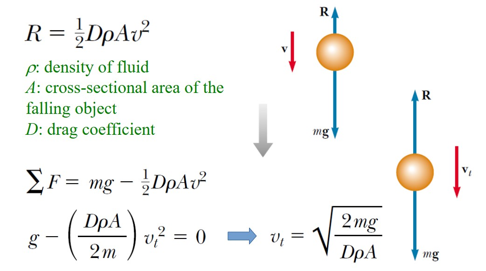
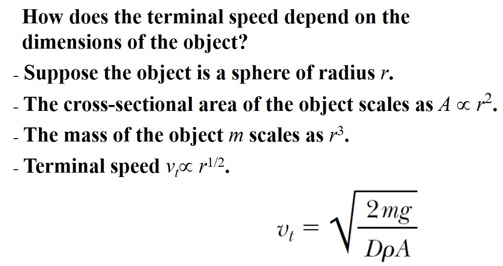
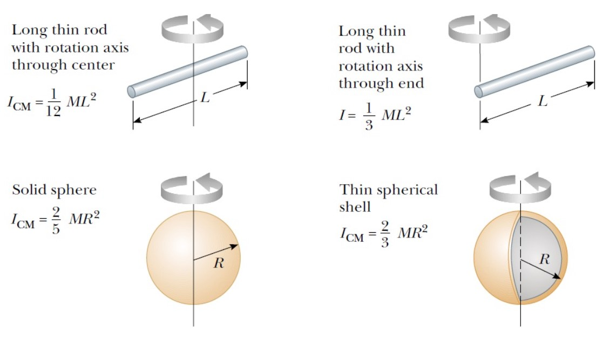
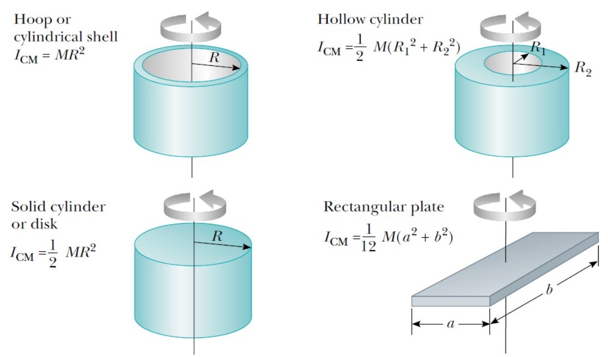
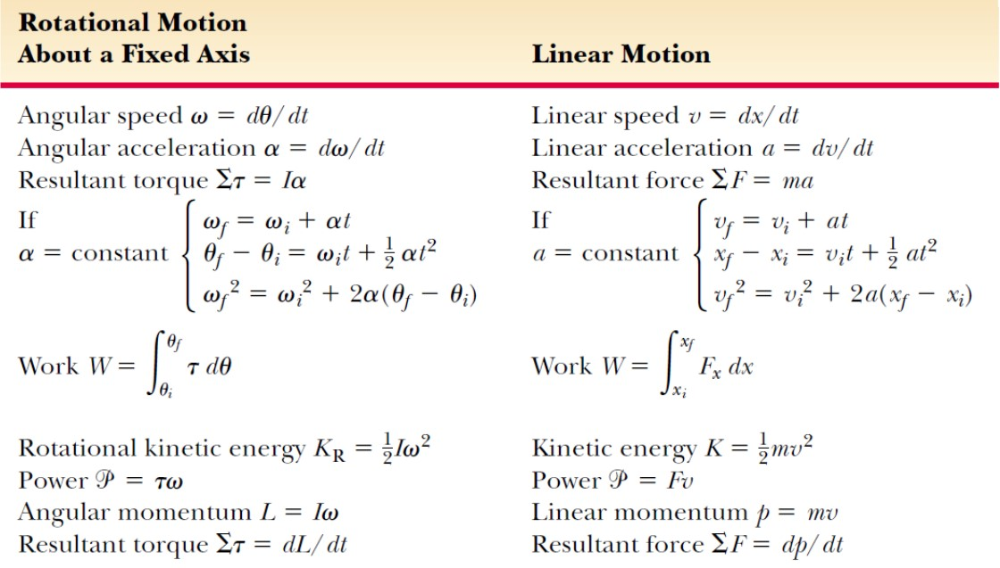

# Chapter1 动力学

***

## 1.1 Newton's Laws

**Drag（阻力）**

$$R=bv$$

!!! Note
    This assumption is valid for objects falling **slowly** through a liquid and for very **small** objects, such as dust particles, moving through air. 

$$R=cv^2$$

!!! Note
    This assumption is valid for **large** and **fast** moving objects, such as a skydiver moving through air in free fall.

**Scaling**

**Center-of-mass Frame（质心系）**

In the center-of-mass frame, the total momentum is always **zero**.

!!! Tip "Proof"
    $\vec{v}_{CM}=\frac{\sum m_i\vec{v}_i}{M}$  
    $\vec{p}'_{tot}=\sum m_i\vec{v}'_i=\sum m_i(\vec{v}_i-\vec{v}_{CM})$    
    $=\sum m_i\vec{v}_i-\sum m_i\vec{v}_{CM}$   
    $=M\vec{v}_{CM}-M\vec{v}_{CM}$  
    $=0$    

**König’s theorem（柯尼希定理）**

$$E_k=\frac{1}{2}Mv_{CM}^2+\sum\frac{1}{2}m_iv_i'^2$$

The total kinetic energy equals the kinetic energy of center-of-mass plus the kinetic energy in the center-of-mass frame.（总动能等于质心的动能加质心系下的总动能）

**Gravitational Potential Energy（引力势能）**

总机械能：

$$E=\frac{1}{2}mv^2-\frac{GMm}{r}=-\frac{GMm}{2r}$$

如果是椭圆轨道：$E=-\frac{GMm}{2a}$，其中$a$为椭圆的半长轴

**Thrust（推力）**

对于水平火箭发射：

$$(M+\Delta m)v=M(v+\Delta v)+\Delta m(v-v_e)$$

$$M\Delta v=v_e\Delta m$$

$$Mdv=-v_edM$$

$$F_{Thrust}=M\frac{dv}{dt}=|v_e\frac{dM}{dt}|$$

***

## 1.2 Rotations

**Angular displacement（角位移）**

$$\Delta\theta=\theta_f-\theta_i$$

!!! Note
    Finite angular displacement is not a vector.

**Angular speed（角速度）**

$$\omega=\frac{d\theta}{dt}$$

Units: $rad/s$ or $s^{-1}$
Direction: positive for counterclockwise motion（逆时针）

**Angular acceleration（角加速度）**

$$\alpha=\frac{d\omega}{dt}$$

Units: $rad/s^2$ or $s^{-2}$
Direction: positive when the rate of counterclockwise rotation is increasing

!!! Note
    When rotating about a fixed axis, every particle on a rigid object rotates through the same angle and has the same angular speed and the same angular acceleration.   
    For rotation about a fixed axis, the only direction that uniquely specifies the rotational motion is the direction along the axis of rotation. Therefore, the directions of $\omega$ and $\alpha$ are along this axis. They obey the **Right-Hand Rule**.

**Rotational kinematics（旋转动力学）**

$$\omega_f=\omega_i+\alpha t$$

$$\theta_f=\theta_i+\omega_i t+\frac{1}{2}\alpha t^2$$

$$\omega_f^2-\omega_i^2=2\alpha(\theta_f-\theta_i)$$

（Under constant angular acceleration）

**Transformation between angular and linear vectors**

$$v=\omega r~(\vec{v}=\vec{\omega}\times\vec{r})$$

$$a_{\bot}=r\omega^2$$

$$a_{//}=r\alpha$$

**Torque（力矩）**

$$\tau=Fd~(\vec{\tau}=\vec{r}\times\vec{F})

!!! Note
    $d$ is the perpendicular distance from the axis to the line of action of $F$; also called the **moment arm（力臂）** of F.

    counterclockwise torque: positive; clockwise torque: negative

**Moment of inertia（转动惯量）**

$$\tau=I\alpha$$

$$I=mr^2$$

**Rotational kinetic energy（转动动能）**

$$K_R=\frac{1}{2}I\omega^2$$

**Power in rotation（转动功率）**

$$P=\tau\omega$$

**Useful equations in rotational and linear motion**

**Parallel-Axis Theorem（平行轴定理）**

$$I_P=I_{CM}+Md^2$$

!!! Note
    $I_P$: moment of inertia with respect to the axis crossing $P$.  
    $I_{CM}$:moment of inertia with respect to the axis crossing the center of mass.  
    $d$:the distance between $P$ and the center of mass.  

**Coriolis force（科里奥利力）**

$$d\vec{r}|_I=d\vec{r}|_R+(\vec{\omega}\times\vec{r})dt$$

$$\frac{d\vec{r}}{dt}|_I=\frac{d\vec{r}}{dt}|_R+\vec{\omega}\times\vec{r}$$

$$\frac{d^2\vec{r}}{dt^2}|_I=[\frac{d}{dt}|_R+\vec{\omega}\times]^2\vec{r}=\frac{d^2\vec{r}}{dt^2}|_R+2\vec{\omega}\times\frac{d\vec{r}}{dt}|_R+\vec{\omega}\times(\vec{\omega}\times\vec{r})$$

$$\vec{F_R}=m\frac{d^2\vec{r}}{dt^2}|_R=m\frac{d^2\vec{r}}{dt^2}|_I-2m\vec{\omega}\times\frac{d\vec{r}}{dt}|_R-m\vec{\omega}\times(\vec{\omega}\times\vec{r})$$

$$=\vec{F_I}-2m\vec{\omega}\times\vec{v_R}-m\vec{\omega}\times(\vec{\omega}\times\vec{r})$$

If $\vec{r}\bot\vec{\omega}$:

$$\vec{F_R}=\vec{F_I}-2m\vec{\omega}\times\vec{v_R}+m\omega^2\vec{r}$$

**Coriolis force（科里奥利力）：**

$$-2m\vec{\omega}\times\vec{v_R}$$

**Centrifugal force（离心力）：**

$$m\omega^2\vec{r}$$

**Pure rolling motion（纯滚动）**

$$v_{CM}=R\omega$$

$$a_{CM}=r\alpha$$

$$K=\frac{1}{2}I_{CM}\omega^2+\frac{1}{2}Mv_{CM}^2=\frac{1}{2}I_P\omega^2$$

!!! Note
    $P$ is the point which is between the object and the surface, and it is at rest relative to the surface because slipping does not occur.

**Angular momentum（角动量）**

$$L=mvr\sin\theta=I\omega$$

**Conservation of angular momentum（角动量守恒）**

The total angular momentum of a system is constant in both magnitude and direction if the resultant external torque acting on the system is **zero**.