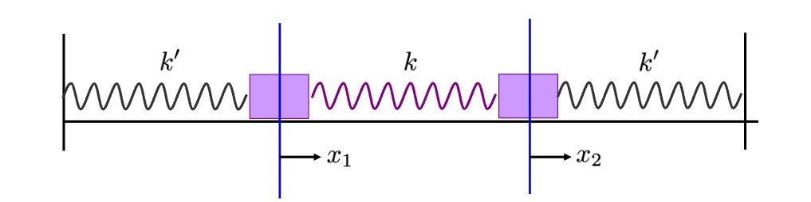
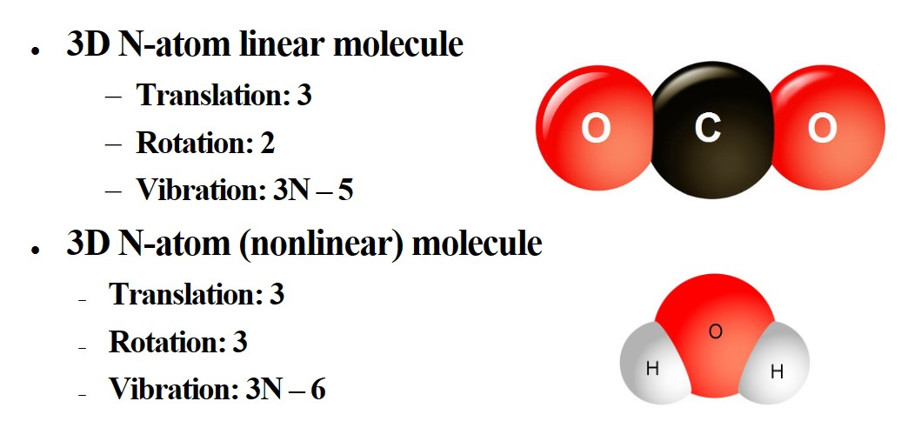
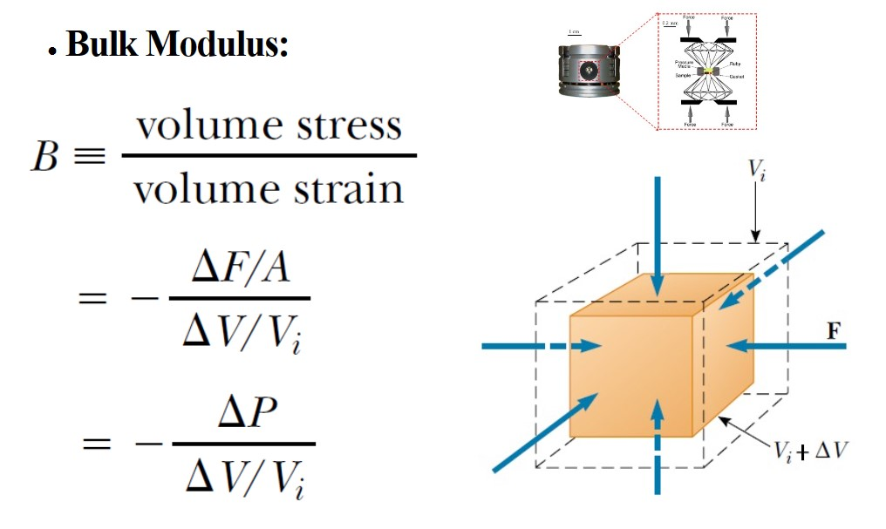

# Chapter2 机械波

***

## 2.1 Simple Harmonic Motion

**Equilibrium（平衡态）**

* **Translational equilibrium**
The linear momentum of its center of mass is constant
* **Rotational equilibrium**
The angular momentum about its center of mass, or about any other point, is also constant. 
* **Equilibrium**
An object is in equilibrium if it is in both translational and rotational equilibrium.
* **static equilibrium**
If the object is at rest and so has no linear speed or angular speed, the object is in static equilibrium.
* **stable static equilibrium**
If a body tends to return to a state of static equilibrium after having been displaced from that state by a force, the body is said to be in stable static equilibrium.

**Simple Harmonic Motion（简谐运动）**

Definition: An object moves with simple harmonic motion whenever its acceleration is proportional to its displacement from some equilibrium position and is oppositely directed.

$$F_x=-kx=ma$$

$$\omega=\sqrt{\frac{k}{m}}$$

$$x=A\cos(\omega t+\phi)$$

$$E=\frac{1}{2}kA^2$$

!!! Note
    For a simple harmonic oscillator, the **period** and **angular frequency** is an **intrinsic property** of the system.  
    However, the **amplitude** and **phase** are two **arbitrary constants** that depend on the initial condition of the system.

**Single Pendulum（单摆）**

$$\omega=\sqrt{\frac{g}{L}}$$

**Physical Pendulum（物理摆）**

$$\tau=mgd\sin\theta=mgd\theta$$

$$\alpha=\frac{d^2\theta}{dt^2}$$

$$\tau=I\alpha$$

$$\frac{d^2\theta}{dt^2}=\frac{mgd}{I}\theta=\omega^2\theta$$

$$\omega=\sqrt{\frac{mgd}{I}}$$

**Damped Oscillation（阻尼振动）**

$$F_D=bv$$

（$b$: damping coefficient）

$$x=Ae^{-\frac{b}{2m}t}\cos(\omega t+\phi)$$

$$\omega=\sqrt{\frac{k}{m}-(\frac{b}{2m})^2}$$

**Forced Oscillation（受迫振动）**

When the object is doing damped oscillation, if we exert a force $F_{ext}=cos(\omega't)$, whose $\omega$ is determined by the environment, the the equation will be like this:

$$x=Ae^{-\frac{b}{2m}t}\cos(\omega t+\phi)+A'\cos(\omega't+\phi')$$

!!! Note
    $Ae^{-\frac{b}{2m}t}\cos(\omega t+\phi)$ is called **transient solution**.  
    $A'\cos(\omega't+\phi')$ is called **steady solution**.  
    $\omega=\sqrt{\frac{k}{m}-(\frac{b}{2m})^2}$  
    $\omega'$ is driving frequency,not the intrinsic frequency of the harmonic oscillator.  

When $t$ is big enough, the result tends to be the steady solution.

* **slow drive:** $\omega'<\sqrt{\frac{k}{m}}$
The driving force is slow enough that the oscillator can follow the force after the transient motion decays. 
* **fast drive:** $\omega'>\sqrt{\frac{k}{m}}$
The driving force is fast such that the oscillator cannot follow the force and lags behind ( $\pi$ out of phase). Note that the amplitude is smaller than that for slow drive.
* **resonance（共振）:** $\omega'=\sqrt{\frac{k}{m}}$
The amplitude quickly grows to a maximum. After the transient motion decays and the oscillator settles into steady state motion, the displacement $\frac{\pi}{2}$ out of phase with force.

**Normal Mode（简正模）**

A normal mode of an oscillating system is a pattern of motion in which all parts of the system oscillate harmonically with the same frequency and phase.
The most general motion of the system is a superposition（叠加）of its normal modes.

!!! Example
    **How to find normal mode?**  

    * 1.Assume normal mode:  
    $x_i=A_i\cos(\omega t+\phi), i=1,2$  
    * 2.Find equations of motion:  
    $m\frac{d^2x_1}{dt^2}=-k'x_1-k(x_1-x_2)$  
    $m\frac{d^2x_2}{dt^2}=-k'x_2-k(x_2-x_1)$  
    * 3.Substitute into the formula:  
    $m\omega^2A_1=(k'+k)A_1-kA_2$  
    $m\omega^2A_2=-kA_1+(k'+k)A_2$  
    * 4.Transform the equations into matrix format:  
    $\begin{pmatrix}  
    k'+k-m\omega^2&-k\\\  
    -k&k'+k-m\omega^2  
    \end{pmatrix}  
    \begin{pmatrix}  
    A_1\\\  
    A_2  
    \end{pmatrix}=0$  
    * 5.To ensure there are solutions, the determinant（行列式）of the matrix should be 0:  
    $\omega_1=\sqrt{\frac{k'+2k}{m}}, A_1=-A_2$  
    $\omega_2=\sqrt{\frac{k'}{m}}, A_1=A_2$  

**Elastic Modulus（弹性模量）**

$$Elastic~modulus\equiv\frac{stress}{strain}$$

!!! Success "Definition"
    **Stress（应力）：** A quantity that is proportional to the force causing a deformation; more specifically, stress is the external force acting on an object per unit cross-sectional area.  
    **Strain（应变）：** A measure of the degree of deformation.    

***

## 2.2 Wave Motion

**Reflection of Waves**

**Linear Wave Equation**

$$\frac{\partial^2y}{\partial t^2}=v^2\frac{\partial^2y}{\partial x^2}$$

The linear wave equation applies in general to various types of linear waves. 

**Wave Function**

$$y=A\sin(kx-\omega t+\phi)$$

!!! Note
    $k=\frac{2\pi}{\lambda}$（angular wave number）  
    $\omega=\frac{2\pi}{T}$（angular frequency）  

**The Speed of Waves on Strings**

$$v=\sqrt{\frac{F}{\mu}}$$

!!! Tip "Proof"
    $\Delta m=\mu\Delta x$  
    （$\mu$ is linear mass density）  
    $F_{1x}=F_{2x}\approx F$  
    （$F$ is tension in the string）  
    $\Delta ma_y=F_y$  
    $\mu\Delta x\frac{\partial^2y}{\partial t^2}=F\frac{\partial y}{\partial x}|_{x+\Delta x}-F\frac{\partial y}{\partial x}|_{x}$  
    $\frac{\partial^2y}{\partial t^2}=\frac{F}{\mu}\frac{\partial^2y}{\partial x^2}$  
    according to the linear wave equation:  
    $v=\sqrt{\frac{F}{\mu}}$  

**Rate of Energy Transfer**

$$P(x,t)=F_y(x,t)·v_y(x,t)$$

$$=-F\frac{\partial y}{\partial x}·\frac{\partial y}{\partial t}$$

$$=Fk\omega A^2\cos^2(kx-\omega t)$$

$$P_{avg}=\frac{1}{2}Fk\omega A^2=\frac{1}{2}\mu\omega^2A^2v$$

**Interference**

Same frequency, wavelength, amplitude, direction.
Different phase.

$$\Delta r=|r_1-r_2|=\begin{cases}
n\lambda:in~phase\\\
(n+\frac{1}{2})\lambda:out~of~phase
\end{cases}$$

**Beating**

Beating is the periodic variation in intensity at a given point due to the superposition of two waves having slightly different frequencies.

Beat frequency: 

$$f_b=|f_1-f_2|$$

**Standing Waves**

Same frequency, wavelength, amplitude. Different direction.

**Variations of Pressure of Sound Waves**

$$p(x,t)=-B\frac{\partial u(x,t)}{\partial x}$$

!!! Note
    $B$ is bulk modulus.

**Speed of Sound in a Fluid**

$$v=\sqrt{\frac{B}{\rho}}$$

!!! Note
$\rho$ is the density of the medium in equilibrium.

**Sound Intensity**

$$I(x,t)=p(x,t)v(x,t)$$

!!! Note
    Here $v$ is the speed of phonon.

$$I=\frac{1}{2}\rho v(\omega A)^2$$

!!! Note
    Here $v$ is the speed of sound.

**Decibel（分贝）**

$$\beta=10\log_{10}(\frac{I}{I_0})$$

$$I_0=1.00\times10^{-12}W/m^2$$

**Doppler Effect（多普勒效应）**

$$f'=\frac{v+v_O}{v-v_S}f$$

!!! Note
    $v_O$ is the speed of observer, + if from $O$ to $S$.  
    $v_S$ is the speed of source, + if from $S$ to $O$.

**Shock Wave（激波）**

A shock wave happens when the source is moving faster than the speed of wave.

