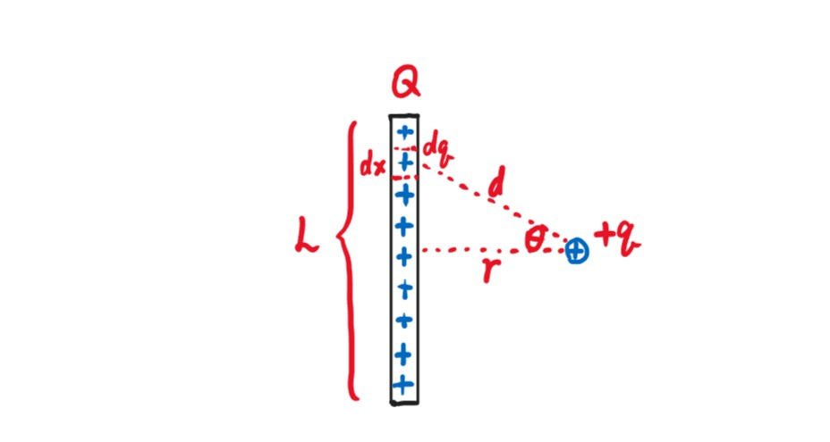
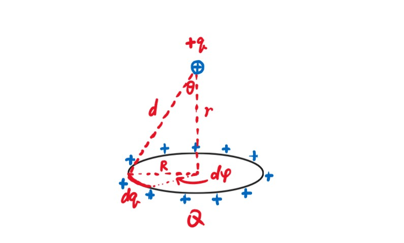
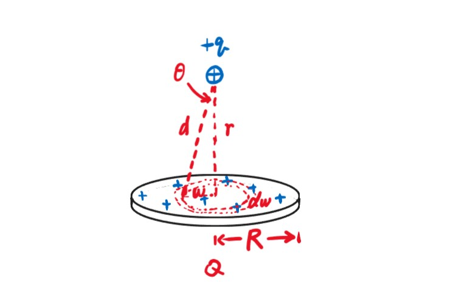

# Chapter1 电荷与库仑定律

## 1.1 库仑定律

$$\vec{F_{12}}=\frac{1}{4\pi\varepsilon_0}\frac{q_1q_2}{r_{12}^2}\hat{r_{12}}$$

有时将系数$\frac{1}{4\pi\epsilon_0}$称为系数$k$。

库仑定律成立当且仅当两物体的尺寸远小于两物体的距离（点电荷）。

!!! Example
    **If you were standing at arm's length from someone and each of you had one percent  more electrons than protons, the repelling force would be incredible.  How great?**  

    假设人体全由水构成，水的摩尔质量为$18$g：  
    $\frac{6\times 10^{23}molecules/mol}{18g/mol}\times 10e^-/molecule=3.3\times 10^{23}e^-/g$  
    假设人体重量为$80$kg：  
    $3.3\times10^{23}e^-/g\times80kg=2.6\times10^{28}e^-$  
    现在计算人体内$1\%$的电荷：  
    $1\%\times2.6\times10^{28}e^-\times1.6\times10^{-19}C/e^-=4.2\times10^7C$  
    两人相距$0.75$m：  
    $F=(9\times10^9N·m^2/C^2)\times(\frac{4.2\times10^7C}{0.75m})^2=2.8\times10^{25}N$  

***

## 1.2 导体与绝缘体

* **绝缘体（insulator）：**  
  电子无法自由移动，电荷均匀分布，密度很小
* **导体（conductor）：**  
  电子可以自由移动，电荷分布于外表面，密度很大
* **半导体（semiconductor）：**  
  高温时导电，低温时不导电，电荷密度受外界环境影响很大
* **超导体（superconductor）：**  
  $R=0$，$B=0$

***

## 1.3 电荷的连续分布

**符号约定：**

* 线电荷密度：$\lambda=\frac{dq}{dx}$
* 面电荷密度：$\sigma=\frac{dq}{dA}$
* 体电荷密度：$\rho=\frac{dq}{dV}$

!!! Example
    **例1：求均匀带电棒对试探电荷的库仑力。**    
        
    $\lambda=\frac{dq}{dx}=\frac{Q}{L}$    
    $dF=\frac{1}{4\pi\varepsilon_0}\frac{qdq}{d^2}$    
    $dF_r=dF\cos\theta=\frac{1}{4\pi\varepsilon_0}\frac{rqdq}{d^3}=\frac{1}{4\pi\varepsilon_0}\frac{rQqdx}{L(x^2+r^2)^{\frac{3}{2}}}$    
    $F=\int dF_r=\frac{1}{4\pi\varepsilon_0}\frac{rQq}{L}\int_{-\frac{L}{2}}^{\frac{L}{2}}\frac{dx}{(x^2+r^2)^{\frac{3}{2}}}=\frac{1}{4\pi\varepsilon_0}\frac{rQq}{L}(\frac{x}{r^2\sqrt{x^2+r^2}})\vert_{-\frac{L}{2}}^{\frac{L}{2}}=\frac{1}{4\pi\varepsilon_0}\frac{Qq}{r\sqrt{\frac{L^2}{4}+r^2}}$  

!!! Note
    $\int\frac{dx}{(x^2\pm a^2)^{\frac{3}{2}}}=\frac{\pm x}{a^2\sqrt{x^2\pm a^2}}$

!!! Example
    **例2：求均匀带电圆环对试探电荷的库仑力。**  
      
    $\lambda=\frac{dq}{Rd\varphi}=\frac{Q}{2\pi R}$  
    $dF=\frac{1}{4\pi\varepsilon_0}\frac{qdq}{d^2}$  
    $dF_r=dF\cos\theta=\frac{1}{4\pi\varepsilon_0}\frac{rqdq}{d^3}=\frac{1}{4\pi\varepsilon_0}\frac{rQqd\varphi}{2\pi(R^2+r^2)^{\frac{3}{2}}}$  
    $F=\int dF_r=\frac{1}{4\pi\varepsilon_0}\frac{rQq}{2\pi(R^2+r^2)^{\frac{3}{2}}}\int_0^{2\pi}d\varphi=\frac{1}{4\pi\varepsilon_0}\frac{rQq}{(R^2+r^2)^{\frac{3}{2}}}$  

!!! Example
    **例3：求均匀带电圆盘对试探电荷的库仑力。**  
      
    $\sigma=\frac{dq}{2\pi\omega d\omega}=\frac{Q}{\pi R^2}$  
    $dF=\frac{1}{4\pi\varepsilon_0}\frac{rqdq}{(\omega^2+r^2)^{\frac{3}{2}}}=\frac{1}{4\pi\varepsilon_0}\frac{2rQq\omega d\omega}{R^2(\omega^2+r^2)^{\frac{3}{2}}}$（利用例2的结论）  
    $F=\int dF=\frac{1}{4\pi\varepsilon_0}\frac{2rQq}{R^2}\int_0^R\frac{\omega d\omega}{(\omega^2+r^2)^{\frac{3}{2}}}=\frac{1}{4\pi\varepsilon_0}\frac{2rQq}{R^2}(-\frac{1}{\sqrt{\omega^2+r^2}})\vert_0^R=\frac{1}{4\pi\varepsilon_0}\frac{2rQq}{R^2}(\frac{1}{r}-\frac{1}{\sqrt{R^2+r^2}})$