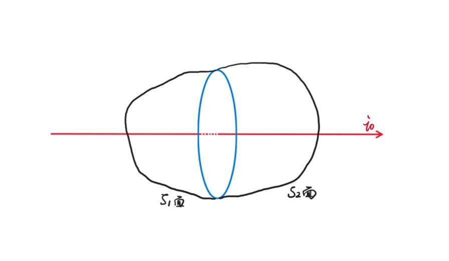
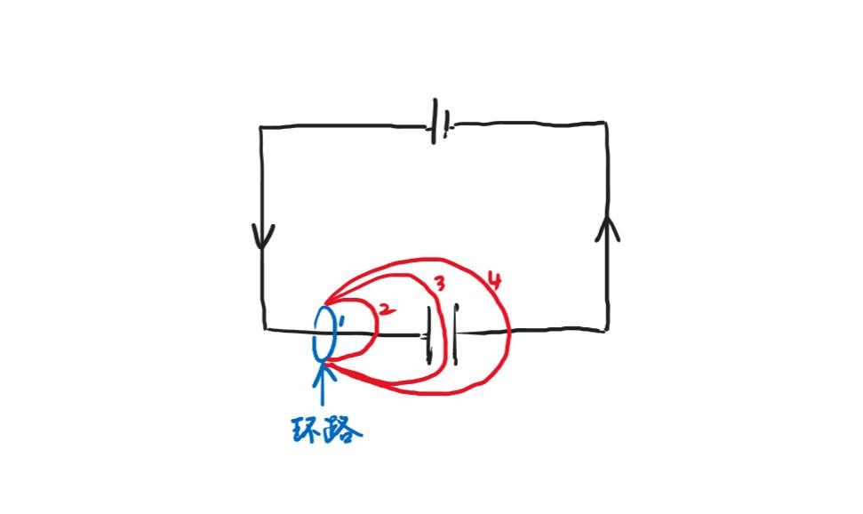

# Chapter10 Maxwell方程组

***

## 10.1 Maxwell方程组的确立

**真空：**

$$\iint\limits_{\substack{\circ}}\vec{E}\cdot d\vec{A}=\frac{q_0}{\varepsilon_0}$$

$$\iint\limits_{\substack{\circ}}\vec{B}\cdot d\vec{A}=0$$

$$\oint\vec{E}\cdot d\vec{l}=-\iint\frac{\partial\vec{B}}{\partial t}\cdot d\vec{A}$$

$$\oint\vec{B}\cdot d\vec{l}=\mu_0 i$$

**电介质和磁性材料介入：**

$$\iint\limits_{\substack{\circ}}\vec{D}\cdot d\vec{A}=q$$

$$\iint\limits_{\substack{\circ}}\vec{B}\cdot d\vec{A}=0$$

$$\oint\vec{E}\cdot d\vec{l}=-\iint\frac{\partial\vec{B}}{\partial t}\cdot d\vec{A}$$

$$\oint\vec{H}\cdot d\vec{l}=i=\iint\vec{j}\cdot d\vec{A}$$

**微分形式：**

$$\nabla\cdot\vec{D}=\rho$$

$$\nabla\cdot\vec{B}=0$$

$$\nabla\times\vec{E}=-\frac{\partial\vec{B}}{\partial t}$$

$$\nabla\times\vec{H}=\vec{j}$$

!!! Note 
    Stokes公式：$$\oint_L\vec{A}\cdot d\vec{l}=\iint_S(\nabla\times\vec{A})\cdot d\vec{S}$$     
    Gauss公式：$$\iint\limits_{\substack{\circ}}_S\vec{A}\cdot d\vec{S}=\iiint_V(\nabla\cdot\vec{A})dV$$

**修改安培环路定理：**

$$\oint\vec{H}\cdot d\vec{l}=i_0=\iint_{S_2}\vec{j_0}\cdot d\vec{A}$$

由Stokes公式：

$$\oint_L\vec{A}\cdot d\vec{l}=\iint_S\nabla\times\vec{A}\cdot d\vec{S}$$

$$-\iint_{S_1}\vec{j_0}\cdot d\vec{A}=\iint_{S_2}\vec{j_0}\cdot d\vec{A}=i_0$$

两个并起来：

$$\iint\limits_{\substack{\circ}}_S\vec{j_0}\cdot d\vec{A}=\iint_{S_1}\vec{j_0}\cdot d\vec{A}+\iint_{S_2}\vec{j_0}\cdot d\vec{A}=0$$

考虑电容器的充电过程，1、2、4号闭合曲面没有问题，但3号曲面只有流入的电流，没有流出的电流，$i_0\neq\iint_{S_3}\vec{j_0}\cdot d\vec{A}=0$。因此，应该将安培环路定理修改为：

$$\oint\vec{H}\cdot d\vec{l}=i_0+i_D$$

其中，$i_D$被称为**位移电流**。

$$\oint_{S_{13}}\vec{j_0}\cdot d\vec{A}=-\frac{dq_0}{dt}$$

由高斯定理：

$$\iint\limits_{\substack{\circ}}\vec{D}\cdot d\vec{A}=q_0$$

因此

$$\frac{dq_0}{dt}=\frac{d}{dt}\iint\limits_{\substack{\circ}}\vec{D}\cdot d\vec{A}=\frac{\partial\vec{D}}{\partial t}\cdot d\vec{A}$$

$$\iint\limits_{\substack{\circ}}\vec{j_0}\cdot d\vec{A}=-\frac{\partial\vec{D}}{\partial t}\cdot d\vec{A}$$

$$\iint\limits_{\substack{\circ}}(\vec{j_0}+\frac{\partial\vec{D}}{\partial t})\cdot d\vec{A}=0$$

$$-\iint_{S_1}(\vec{j_0}+\frac{\partial \vec{D}}{\partial t})\cdot d\vec{A}=\iint_{S_2}(\vec{j_0}+\frac{\partial\vec{D}}{\partial t})\cdot d\vec{A}$$

综上，Maxwell方程组第四项改为：

$$\oint\vec{H}\cdot d\vec{l}=i_0+i_D=\iint(\vec{j_0}+\frac{\partial\vec{D}}{\partial t})\cdot d\vec{A}$$

!!! Success "Definition"
    **电位移通量：**$\Phi_D=\iint\vec{D}\cdot d\vec{A}$  
    **位移电流：**$i_D=\frac{d\Phi_D}{dt}=\iint\frac{\partial\vec{D}}{\partial\vec{t}}\cdot d\vec{A}$   
    **位移电流密度：**$\vec{j}_D=\frac{\partial\vec{D}}{\partial t}$

****

## 10.2 电磁波

电磁波在自由空间（没有静止或运动的电荷）中具有以下性质：

* 性质1：横波，即$\vec{E}\perp \vec{k}$，$\vec{H}\perp \vec{k}$，其中$\vec{k}$为波的传播方向
* 性质2：电场和磁场相互垂直，即$\vec{E}\perp \vec{H}$
* 性质3：$E$和$H$同相位，即同时达到最大，同时达到最小
* 性质4：右手定则，即$\vec{E}$，$\vec{H}$，$\vec{k}$的方向与x，y，z轴一一对应，且$E$和$H$的振幅满足$\sqrt{\kappa_e\varepsilon_0}E_0=\sqrt{\kappa_m\mu_0}H_0$
* 性质5：传播速度$v=\frac{1}{\sqrt{\kappa_e\varepsilon_0\kappa_m\mu_0}}$，在真空中即为光速$c$
  
### 从Maxwell方程组推导电磁波的五大性质

**前期准备：**

根据Maxwell方程组的积分形式：

$$\iint\limits_{\substack{\circ}}\vec{E}\cdot d\vec{A}=\frac{q_0}{\varepsilon_0}$$

$$\iint\limits_{\substack{\circ}}\vec{H}\cdot d\vec{A}=0$$

$$\oint\vec{E}\cdot d\vec{l}=-\iint\frac{\partial\vec{B}}{\partial t}\cdot d\vec{A}$$

$$\oint\vec{H}\cdot d\vec{l}=i_0+\iint\frac{\partial\vec{D}}{\partial t}\cdot d\vec{A}$$

得到Maxwell方程组的微分形式：

$$\nabla\cdot\vec{E}=\frac{\rho_e}{\varepsilon_0}$$

$$\nabla\cdot\vec{H}=0$$

$$\nabla\times\vec{E}=-\frac{\partial\vec{B}}{\partial t}=-\kappa_m\mu_0\frac{\partial\vec{H}}{\partial t}$$

$$\nabla\times\vec{H}=\vec{j_0}+\frac{\partial\vec{D}}{\partial t}=\vec{j_0}+\kappa_e\varepsilon_0\frac{\partial\vec{E}}{\partial t}$$

考虑在自由空间中有$\rho_e=0$，$j_0=0$，因此有：

$$\nabla\cdot\vec{E}=\frac{\partial E_x}{\partial x}+\frac{\partial E_y}{\partial y}+\frac{\partial E_z}{\partial z}=0$$

$$\nabla\cdot\vec{H}=\frac{\partial H_x}{\partial x}+\frac{\partial H_y}{\partial y}+\frac{\partial H_z}{\partial z}=0$$

$$\nabla\times\vec{E}=\left|\begin{array}{c}
    \vec{i}&\vec{j}&\vec{k}\\\
    \frac{\partial}{\partial x}&\frac{\partial}{\partial y}&\frac{\partial}{\partial z}\\\
    E_x&E_y&E_z
\end{array}\right|=-\kappa_m\mu_0(\frac{\partial H_x}{\partial t}\vec{i}+\frac{\partial H_y}{\partial t}\vec{j}+\frac{\partial H_z}{\partial t}\vec{k})$$

$$\nabla\times\vec{H}=\left|\begin{array}{c}
    \vec{i}&\vec{j}&\vec{k}\\\
    \frac{\partial}{\partial x}&\frac{\partial}{\partial y}&\frac{\partial}{\partial z}\\\
    H_x&H_y&H_z
\end{array}\right|=\kappa_e\varepsilon_0(\frac{\partial E_x}{\partial t}\vec{i}+\frac{\partial E_y}{\partial t}\vec{j}+\frac{\partial E_z}{\partial t}\vec{k})$$

综上，我们有以下八个方程：

$$\frac{\partial E_x}{\partial x}+\frac{\partial E_y}{\partial y}+\frac{\partial E_z}{\partial z}=0~~~~~(1)$$

$$\frac{\partial E_z}{\partial y}-\frac{\partial E_y}{\partial z}=-\kappa_m\mu_0\frac{\partial H_x}{\partial t}~~~~~(2-1)$$

$$\frac{\partial E_x}{\partial z}-\frac{\partial E_z}{\partial x}=-\kappa_m\mu_0\frac{\partial H_y}{\partial t}~~~~~(2-2)$$

$$\frac{\partial E_y}{\partial x}-\frac{\partial E_x}{\partial y}=-\kappa_m\mu_0\frac{\partial H_z}{\partial t}~~~~~(2-3)$$

$$\frac{\partial H_x}{\partial x}+\frac{\partial H_y}{\partial y}+\frac{\partial H_z}{\partial z}=0~~~~~(3)$$

$$\frac{\partial H_z}{\partial y}-\frac{\partial H_y}{\partial z}=\kappa_e\varepsilon_0\frac{\partial E_x}{\partial t}~~~~~(4-1)$$

$$\frac{\partial H_x}{\partial z}-\frac{\partial H_z}{\partial x}=\kappa_e\varepsilon_0\frac{\partial E_y}{\partial t}~~~~~(4-2)$$

$$\frac{\partial H_y}{\partial x}-\frac{\partial H_x}{\partial y}=\kappa_e\varepsilon_0\frac{\partial E_z}{\partial t}~~~~~(4-3)$$

**对性质1的推导：**

如果考虑在足够远的距离取一个平面，那么可以将电磁波看作平面波，$\vec{E}$，$\vec{H}$与x，y无关。

$$(1)\Rightarrow\frac{\partial E_z}{\partial z}=0$$

$$(2-3)\Rightarrow\frac{\partial H_z}{\partial t}=0$$

$$(3)\Rightarrow\frac{\partial H_z}{\partial z}=0$$

$$(4-3)\Rightarrow\frac{\partial E_z}{\partial t}=0$$

我们发现$E_z$与$H_z$为常数，$\vec{E}$和$\vec{H}$在z方向上与时间无关，因此电磁波是横波。

**对性质2的推导：**

由于性质1的得证，不妨设$E_z=H_z=0$：

$$(2-1)\Rightarrow \frac{\partial E_y}{\partial z}=\kappa_m\mu_0\frac{\partial H_x}{\partial t}~~~~~(2-1)'$$ 

$$(2-2)\Rightarrow \frac{\partial E_x}{\partial z}=-\kappa_m\mu_0\frac{\partial H_y}{\partial t}~~~~~(2-2)'$$ 

$$(4-1)\Rightarrow \frac{\partial H_y}{\partial z}=-\kappa_e\varepsilon_0\frac{\partial E_x}{\partial t}~~~~~(4-1)'$$ 

$$(4-2)\Rightarrow \frac{\partial H_x}{\partial z}=\kappa_e\varepsilon_0\frac{\partial E_y}{\partial t}~~~~~(4-2)'$$ 

进一步，不妨设$\vec{E}$沿着x轴方向：

$$(2-1)'\Rightarrow \frac{\partial H_x}{\partial t}=0$$

$$(4-2)'\Rightarrow \frac{\partial H_x}{\partial z}=0$$

说明$\vec{H}$在x轴方向（即$\vec{E}$的方向）的分量始终为常数，因此$\vec{E}\perp\vec{H}$。

**对性质3、4、5的推导：**

在(2-2)'两边同时对$z$求导：

$$\frac{\partial^2 E_x}{\partial z^2}=-\kappa_m\mu_0\frac{\partial}{\partial t}\cdot\frac{\partial H_y}{\partial z}$$

再代入(4-1)'：

$$\frac{\partial^2 E_x}{\partial z^2}=\kappa_m\mu_0\kappa_e\varepsilon_0\frac{\partial^2 E_x}{\partial t^2}$$

此为波动方程，解得：

$$E_x=E_{x0}e^{i(\omega t-kz)}$$

$$H_y=H_{y0}e^{i(\omega t-kz)}$$

二者同相位，其中：

$$k=\sqrt{\kappa_e\varepsilon_0\kappa_m\mu_0}\omega,~\omega=\frac{2\pi}{T},~k=\frac{2\pi}{\lambda}$$

对波的某个相位的点进行速度的考察：

$$\omega t-kz=constant$$

$$v=\frac{dz}{dt}=\frac{1}{\sqrt{\kappa_e\varepsilon_0\kappa_m\mu_0}}$$

真空条件下，代入已知条件即可算出波速为$\sqrt{\varepsilon_0\mu_0}=c$。

将$E_x$和$H_y$代入(2-2)'式：

$$E_{x0}=\kappa_m\mu_0\frac{\omega}{k}H_{y0}=\kappa_m\mu_0vH_{y0}=\kappa_m\mu_0\frac{1}{\sqrt{\kappa_e\varepsilon_0\kappa_m\mu_0}}H_{y0}$$

$$\sqrt{\kappa_e\varepsilon_0}E_{x0}=\sqrt{\kappa_m\mu_0}H_{y0}$$

!!! Note
    真空时：   
    $\sqrt{\varepsilon_0}E_{x0}=\sqrt{\mu_0}H_{y0}$  
    $E_{x0}=\frac{\mu_0H_{y0}}{\sqrt{\varepsilon_0\mu_0}}=cB_{y0}$  
    即：电场强度的振幅等于磁感应强度的振幅乘上光速。

### 能流密度

在一定的体积内，电磁波的总能量：

$$U=\iiint(\frac{1}{2}\vec{D}\cdot\vec{E}+\frac{1}{2}\vec{B}\cdot\vec{H})dv$$

**初步变换：**

$$\frac{dU}{dt}=\frac{1}{2}\iiint\frac{\partial}{\partial t}(\vec{D}\cdot\vec{E}+\vec{B}\cdot\vec{H})dv$$

$$\frac{\partial}{\partial t}(\vec{D}\cdot\vec{E}+\vec{B}\cdot\vec{H})=\kappa_e\varepsilon_0\frac{\partial(\vec{E}\cdot\vec{E})}{\partial t}+\kappa_m\mu_0\frac{\partial(\vec{H}\cdot\vec{H})}{\partial t}$$

$$=2\kappa_e\varepsilon_0\vec{E}\cdot\frac{\partial\vec{E}}{\partial t}+2\kappa_m\mu_0\vec{H}\cdot\frac{\partial\vec{H}}{\partial t}$$

$$=2\vec{E}\cdot\frac{\partial\vec{D}}{\partial t}+2\vec{H}\cdot\frac{\partial\vec{B}}{\partial t}$$

$$=2\vec{E}\cdot(\nabla\times\vec{H}-\vec{j_0})-2\vec{H}\cdot(\nabla\times\vec{E})$$

由公式$\vec{E}\cdot(\nabla\times\vec{H})-\vec{H}\cdot(\nabla\times\vec{E})=-\nabla\cdot(\vec{E}\times\vec{H})$，可得：

$$\frac{\partial}{\partial t}(\vec{D}\cdot\vec{E}+\vec{B}\cdot\vec{H})=-2\nabla\cdot(\vec{E}\times\vec{H})-2\vec{j_0}\cdot\vec{E}$$

因此由Gauss公式：

$$\frac{dU}{dt}=-\iiint\nabla\cdot(\vec{E}\times\vec{H})dv-\iiint(\vec{j_0}\cdot\vec{E})dv$$

$$=-\iint\limits_{\substack{\circ}}(\vec{E}\times\vec{H})\cdot d\vec{A}-\iiint(\vec{j_0}\cdot\vec{E})dv$$

**对$\iiint(\vec{j_0}\cdot\vec{E})dv$的变换：**

已知：

$$\vec{j_0}=\sigma(\vec{E}+\vec{K})\Rightarrow \vec{E}=\rho\vec{j_0}-\vec{K}$$

其中，$\sigma$为电导率，$\rho$为电阻率，$\vec{K}$为电源把正电荷从负极移到正极的非静电力

$$\iiint(\vec{j_0}\cdot\vec{E})dv=(\vec{j_0}\cdot\vec{E})\Delta A\Delta l$$

$$=\rho j_0^2\Delta A\cdot\Delta l-\vec{j_0}\cdot\vec{K}\Delta A\cdot\Delta l$$

$$=\rho\frac{\Delta l}{\Delta A}(j_0\Delta A)^2-(j_0\Delta A)(\vec{K}\cdot\Delta\vec{l})$$

$$=Ri_0^2-i_0\Delta\varepsilon$$

$$=Q-P$$

$Q$是单位时间内产生的焦耳热，$P$是单位时间内电源做的功。

**对$\iint\limits_{\substack{\circ}}(\vec{E}\times\vec{H})\cdot d\vec{A}$的变换：**

定义**Poynting矢量（能流密度）**：

$$\vec{S}=\vec{E}\times\vec{H}$$

则：

$$\frac{dU}{dt}=-\iint\limits_{\substack{\circ}}\vec{S}\cdot d\vec{A}-Q+P$$

电磁波在单位时间内的总能量，一部分辐射出去（$\iint\limits_{\substack{\circ}}\vec{S}\cdot d\vec{A}$），一部分变成热量散失（$Q$），一部分来源于电源做功（$P$）。

**对能流密度的分析：**

在真空中：

$$\vec{S}=\vec{E}\times\vec{H}=\frac{\vec{E}\times\vec{B}}{\mu_0}$$

$$S=\frac{EB}{\mu_0}=\frac{E^2}{\mu_0c}$$

其方向与电磁波的传播方向一致。

由于$\vec{E}$随时间变化，因此给出新的概念：**强度**

$$I=\vec{S}=\frac{E_{max}^2}{2\mu_0c}$$

**电磁波的能量密度：**

在真空条件下：

$$u_E=\frac{1}{2}\varepsilon_0E^2$$

$$u_B=\frac{B^2}{2\mu_0}=\frac{E^2}{2c^2\mu_0}=u_E$$

$$u_{total}=u_E+u_B=\varepsilon_0E^2$$