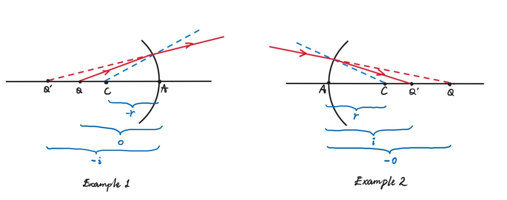
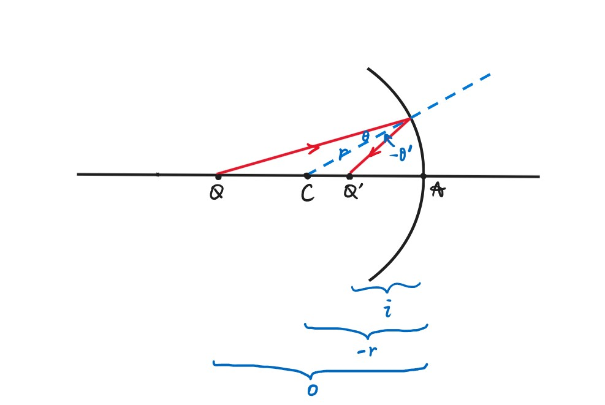

# Chapter11 几何光学

***

## 11.1 基本概念

**几何光学三定律：**

* 光沿直线传播
* **反射定律：** 入射角 = 反射角
* **折射定律：** $n_1\sin\theta_1=n_2\sin\theta_2$

**折射率（index of refraction）：**

已知

$$c=\frac{1}{\sqrt{\varepsilon_0\mu_0}}$$

$$v=\frac{1}{\sqrt{\kappa_e\kappa_m\varepsilon_0\mu_0}}$$

对于大部分材料

$$\kappa_m\approx 1$$

因此

$$v\approx\frac{c}{\sqrt{\kappa_e}}$$

由折射率定义

$$v=\frac{c}{n}$$

因此

$$n\approx\sqrt{\kappa_e}$$

!!! Note
    事实上，$n$还和光的频率有关，因此不同频率的光折射率不同，频率越大折射率越大。

**棱镜（prism）：**

如何得到棱镜的折射率$n$？

通过调整入射光的角度，可以得到$\delta$的最小值$\delta_{\min}$。

$$\delta=(i_1-i_2)+(i_1'-i_2')=(i_1+i_1')-(i_2+i_2')=(i_1+i_1')-\alpha$$

两边对$i_1$求导（$\delta$随着$i_1$的变化而变化）

$$\frac{d\delta}{di_1}=1+\frac{di_1'}{di_1}=0$$

$\delta$取$\delta_{\min}$时导数为0

$$\frac{di_1'}{di_1}=-1,~i_1'=-i_1$$

负号标明$i_1$增大时$i_1'$减小，因此实际上的大小关系为$i_1=i_1'$，此时$\delta$取$\delta_{\min}$。

$$i_2=i_2'=\frac{\alpha}{2}$$

$$i_1=i_1'=i_2+\frac{\delta_{\min}}{2}=\frac{\alpha+\delta_{\min}}{2}$$

$$n=\frac{\sin(\frac{\alpha+\delta_{\min}}{2})}{\sin\frac{\alpha}{2}}$$

**光程：**

$$t_{QP}=\frac{\Delta l_1}{v_1}+\frac{\Delta l_2}{v_2}+\frac{\Delta l_3}{v_3}=\sum\limits_{i}\frac{\Delta l_i}{v_i}=\sum\limits_{i}\frac{n_i\Delta l_i}{c}=\frac{(QMNP)}{c}$$

(QMNP)即为光程，指相同时间内，光在真空中走过的路程。

$$(QMNP)=ct_{QP}=\sum\limits_{i}n_i\Delta l_i$$

$$(QP)=\int_Q^Pndl$$

**费马原理：**

对于空间中固定的点$P$，$Q$，从$Q$到$P$的所有光线的光程的偏微分为0（极值或常数），即光会选择一条路径，使得两点之间传播所需的时间最短。

!!! Example
    

    **费马定理推导反射定律：**  

    此时不知道$\theta=\theta'$  
    $a,b,d$已知，$x$为自变量    
    光程$L=n(\sqrt{a^2+x^2}+\sqrt{b^2+(d-x)^2})$    
    由费马定理：$\frac{dL}{dx}-n(\frac{x}{\sqrt{a^2+x^2}}+\frac{x-d}{\sqrt{b^2+(d-x)^2}})=0$    
    $\frac{x}{\sqrt{a^2+x^2}}=\frac{d-x}{\sqrt{b^2+(d-x)^2}}    \Rightarrow\sin\theta=\sin\theta'\Rightarrow\theta=\theta'$

    **费马定理推导折射定律：**  

    此时不知道$n_1\sin\theta_1=n_2\sin\theta_2$     
    $a,b,d$已知，$x$为自变量    
    光程$L=n_1\sqrt{a^2+x^2}+n_2\sqrt{b^2+(d-x)^2}$     
    由费马定理：$\frac{dL}{dx}=\frac{n_1x}{\sqrt{a^2+x^2}}+\frac{n_2(x-d)}{\sqrt{b^2+(d-x)^2}}=0$   
    $n_1\frac{x}{\sqrt{a^2+x^2}}=n_2\frac{d-x}{\sqrt{a^2+x^2}}\Rightarrow n_1\sin\theta_1=n_2\sin\theta_2$

***

## 11.2 球面镜成像

### 球面镜折射成像

$Q$点发出两条光线，一条沿直线$Q\rightarrow A\rightarrow Q'$，一条被折射$Q\rightarrow M\rightarrow Q'$，汇聚于$Q'$成像。

在$\Delta MQC$中，由正弦定理：

$$\frac{p}{\sin\phi}=\frac{o+r}{\sin\theta}$$

在$\Delta MQ'C$中，由正弦定理：

$$\frac{p'}{\sin\phi}=\frac{i-r}{\sin\theta'}$$

由折射定律：

$$n\sin\theta=n'\sin\theta'$$

因此综合可得：

$$\frac{p}{n(o+r)}=\frac{p'}{n'(i-r)}$$

由角度关系：

$$\theta-u=\theta'+u'=\phi$$

在$\Delta MQC$中，由余弦定理：

$$p^2=(o+r)^2+r^2-2r(o+r)\cos\phi=o^2+4r(o+r)\sin^2\frac{\phi}{2}$$

在$\Delta MQ'C$中，由余弦定理：

$$p'^2=(i-r)^2+r^2+2r(i-r)\cos\phi=i^2-4r(i-r)\sin^2\frac{\phi}{2}$$

因此综合可得：

$$\frac{o^2}{n^2(o+r)^2}-\frac{i^2}{n'^2(i-r)^2}=-4r\sin^2\frac{\phi}{2}[\frac{1}{n^2(o+r)}+\frac{1}{n'^2(i-r)}]$$

对于固定的$o$，如果$\phi$不同，则$i$不同，意味着折射到的位置不同，不能成像，此时有两种解决方法。

**方法一：齐明点**

方程两边均为0.则对$\forall\phi$都成立，此时得到$o$和$i$的二元一次方程组，得到唯一的一组解$o$和$i$。

!!! Note
    此时不是成像，因为$o$随时要变。

**方法二：旁轴近似**

只有在十分靠近$A$点光线会在一个位置聚焦，此时$\sin\frac{\phi}{2}\approx 0$。

$$\frac{o^2}{n^2(o+r)^2}=\frac{i^2}{n'^2(i-r)^2}$$

$$\frac{n}{o}+\frac{n'}{i}=\frac{n'-n}{r}$$

当$i\rightarrow\infty$时，对应的$o$就是**第一焦距**

$$f=\frac{n}{n'-n}r$$

当$o\rightarrow\infty$时，对应的$i$就是**第二焦距**

$$f'=\frac{n'}{n'-n}r$$

综上

$$\frac{f}{o}+\frac{f'}{i}=1$$

**符号约定：**

若入射光线从左往右：

$Q$点在$A$点左边，说明是实物，$o>0$  
$Q$点在$A$点右边，说明是虚物，$o<0$  

$Q'$点在$A$点左边，说明是虚像，$i<0$  
$Q'$点在$A$点右边，说明是实像，$i>0$  

$C$点在$A$点左边，说明是凹的，$r<0$  
$C$点在$A$点右边，说明是凸的，$r>0$  

!!! Example

    

### 球面镜反射成像

把反射当成折射的一种特例来处理，此时约定符号：

$Q'$点在$A$点左边，说明是实像，$i>0$  
$Q'$点在$A$点右边，说明是虚像，$i<0$  

!!! Note
    个人理解正负还是要看虚实而不是左右。

已有$n\sin\theta=n'\sin\theta'$。若$\theta>0$，则$\theta'<0$，$n=-n'$。在原来的球面镜折射成像中，有焦距$f=\frac{n}{n'-n}r$，代入$n=-n'$，得到$f=-\frac{r}{2}$，同理，$f'=\frac{r}{2}$。代入成像公式$\frac{f}{o}+\frac{f'}{i}=1$得到：

$$\frac{1}{o}+\frac{1}{i}=-\frac{2}{r}$$

!!! Note
    $i$要变号，因为原本定义为$i$，此时为$-i$。

### 横向放大率

旁轴近似：$y^2,y'^2\ll o^2,i^2,r^2$

若$P$（或$P'$）在光轴上方，则$y$（或$y'$）$>0$  
若$P$（或$P'$）在光轴下方，则$y$（或$y'$）$<0$  

**横向放大率：**

$$m=\frac{y'}{y}$$

由

$$n\sin\theta=n'\sin\theta'\Rightarrow n\theta\approx n'\theta'$$

$$y\approx o\theta,~-y'\approx i\theta'$$

因此

$$m=\frac{y'}{y}=\frac{-i\theta'}{o\theta}=-\frac{ni}{n'o}$$

!!! Note
    对于反射，$i$变号且$n=-n'$，于是有$m=-\frac{i}{o}$。

### 复合球面镜折射成像

$$\begin{cases}
    \frac{n'}{i_1}+\frac{n}{o_1}=\frac{n'-n}{r_1}\\\
    \frac{n''}{i_2}+\frac{n'}{o_2}=\frac{n''-n'}{r_2}\\\
    \frac{n'''}{i_3}+\frac{n''}{o_3}=\frac{n'''-n''}{r_3}
\end{cases}\begin{cases}
    \frac{f_1'}{i_1}+\frac{f_1}{o_1}=1\\\
    \frac{f_2'}{i_2}+\frac{f_2}{o_2}=1\\\
    \frac{f_3'}{i_3}+\frac{f_3}{o_3}=1
\end{cases}\begin{cases}
    m_1=-\frac{ni_1}{n'o_1}\\\
    m_2=-\frac{n'i_2}{n''o_2}\\\
    m_3=-\frac{n''i_3}{n'''o_3}
\end{cases}$$

$$\frac{u}{-u'}\approx\frac{\sin u}{-\sin u'}\approx \frac{\frac{1}{o_1}}{\frac{1}{i_1}}=\frac{i_1}{o_1}$$

$$m=-\frac{ni_1}{n'o_1}=\frac{y'}{y}=\frac{nu}{n'u'}\Rightarrow ynu=y'n'u'$$

**拉格朗日-亥姆霍兹定理：**

$$ynu=y'n'u'=y''n''u''=···$$

***

## 11.3 薄透镜成像

### 薄透镜折射成像

第一次成像：$Q\rightarrow Q_1$，$n\rightarrow n_L$

第二次成像：$Q_1\rightarrow Q'$，$n'\rightarrow n_L$

对于第一个球面，想象$n$的右边全是$n_L$：

$$\frac{f_1'}{i_1}+\frac{f_1}{o_1}=1$$

对于第二个球面，想象$n'$的左边全是$n_L$：

$$\frac{f_2'}{i_2}+\frac{f_2}{o_2}=1$$

因此有

$$f_1=\frac{n}{n_L-n}r_1,~f_1'=\frac{n_L}{n_L-n}r_1$$

$$f_2=\frac{n_L}{n'-n_L}r_2,~f_2'=\frac{n'}{n'-n_L}r_2$$

由于薄透镜的$d\ll 0$，因此

$$-o_2=i_1-d\Rightarrow o_2=d-i_1\approx -i_1$$

因此代入

$$\begin{cases}
    \frac{f_1'f_2}{i_1}+\frac{f_1f_2}{o_1}=f_2\\\
    \frac{f_1'f_2'}{i_2}-\frac{f_1'f_2}{i_1}=f_1'
\end{cases}$$

相加得到：

$$\frac{f_1'f_2'}{i_2}+\frac{f_1f_2}{o_1}=f_1'+f_2$$

对于薄透镜，我们可以定义$i_2=i$，$o_1=o$，因此可以得到

$$\frac{f_1'f_2'}{i}+\frac{f_1f_2}{o}=f_1'+f_2$$

再给出定义$f=\frac{f_1f_2}{f_1'+f_2}$，$f'=\frac{f_1'f_2'}{f_1'+f_2}$，则

$$\frac{f'}{i}+\frac{f}{o}=1$$

### 相关公式

**磨镜者公式：**

由于

$$f'=\frac{f_1'f_2'}{f_1'+f_2}=\frac{\frac{n_L}{n_L-n}\cdot\frac{n'}{n'-n_L}r_1r_2}{\frac{n_L}{n_L-n}r_1+\frac{n_L}{n'-n_L}r_2}=\frac{n'}{\frac{n_L-n}{r_1}+\frac{n'-n_L}{r_2}}$$

$$f=\frac{f_1f_2}{f_1'+f_2}=\frac{\frac{n}{n_L-n}\cdot\frac{n_L}{n'-n_L}r_1r_2}{\frac{n_L}{n_L-n}r_1+\frac{n_L}{n'-n_L}r_2}=\frac{n}{\frac{n_L-n}{r_1}+\frac{n'-n_L}{r_2}}$$

因此

$$\frac{f'}{f}=\frac{n'}{n}$$

若$n=n'=1$则有**磨镜者公式**：

$$f=f'=\frac{1}{(n_L-1)(\frac{1}{r_1}-\frac{1}{r_2})}$$

**高斯公式：**

若$n=n'$，$f=f'$，则由公式$\frac{f}{o}+\frac{f'}{i}=1$，可以推出**高斯公式**：

$$\frac{1}{o}+\frac{1}{i}=\frac{1}{f}$$

**牛顿公式：**

若物与第一焦点的距离为$x$，像与第二焦点的距离为$x'$，则

$$o=f+x,~i=f'+x'$$

代入高斯公式得：

$$\frac{1}{f+x}+\frac{1}{f'+x'}=\frac{1}{f}$$

得到**牛顿公式**：

$$xx'=f^2=ff'$$

**符号定义：**

对于凸透镜，第一个球面的$r_1$为正，第二个球面的$r_2$为负。

对于凹透镜，第一个球面的$r_1$为负，第二个球面的$r_2$为正。

假设第一焦点在第二焦点左边，若物在第一焦点左边，则$x>0$，若物在第一焦点右边，则$x<0$；若像在第二焦点左边，则$x'<0$，若像在第二焦点右边，则$x'>0$。

### 薄透镜的横向放大倍数

$$m_1=-\frac{ni_1}{n_Lo_1},~m_2=-\frac{n_Li_2}{n'o_2}$$

定义

$$m=m_1m_2=\frac{-ni_1}{n_Lo_1}\cdot\frac{-n_Li_2}{n'o_2}=\frac{ni_1i_2}{n'o_1o_2}\approx-\frac{ni}{n'o}=-\frac{fi}{f'o}$$

代入牛顿公式：

$$m=-\frac{f(f'+x')}{f'(f+x)}=-\frac{f}{x}=-\frac{x'}{f'}$$