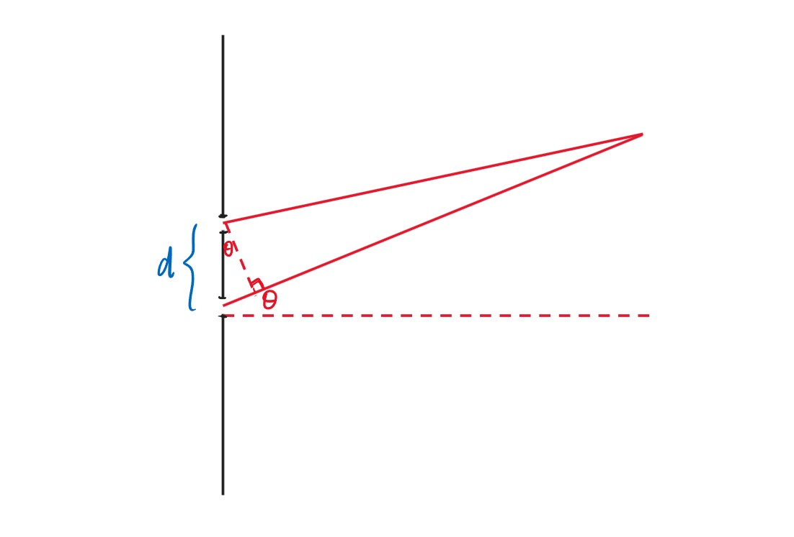
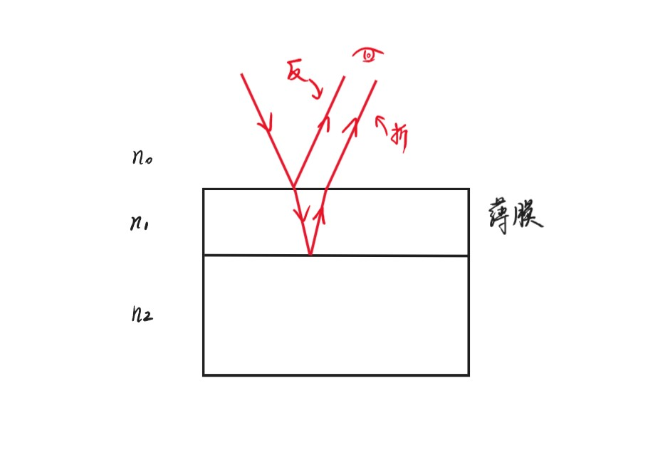
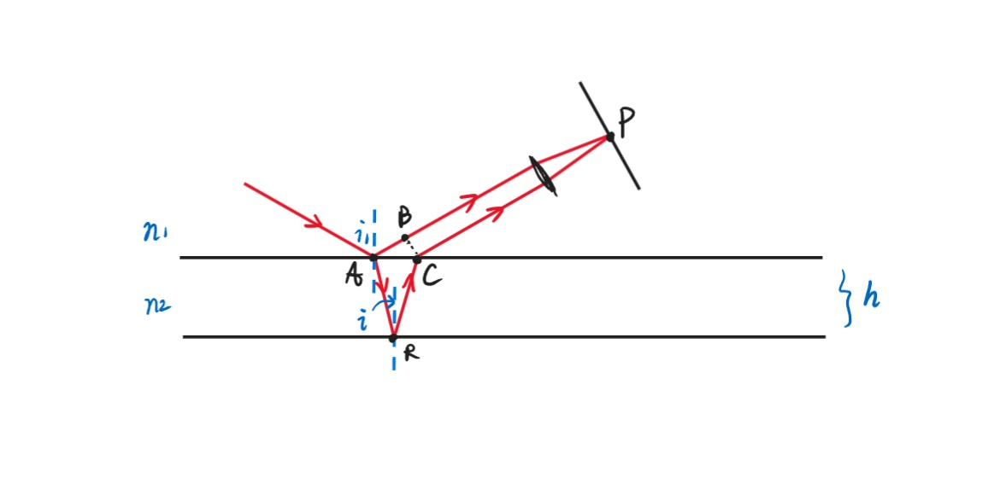
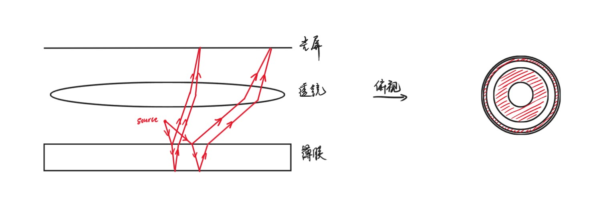
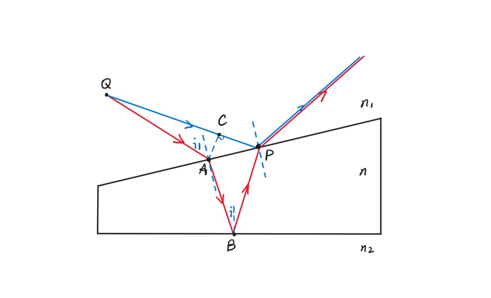
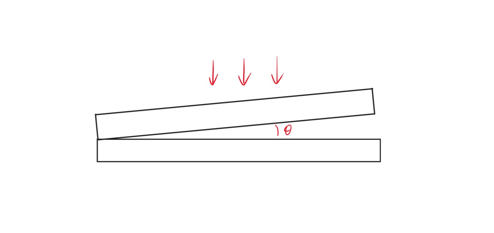
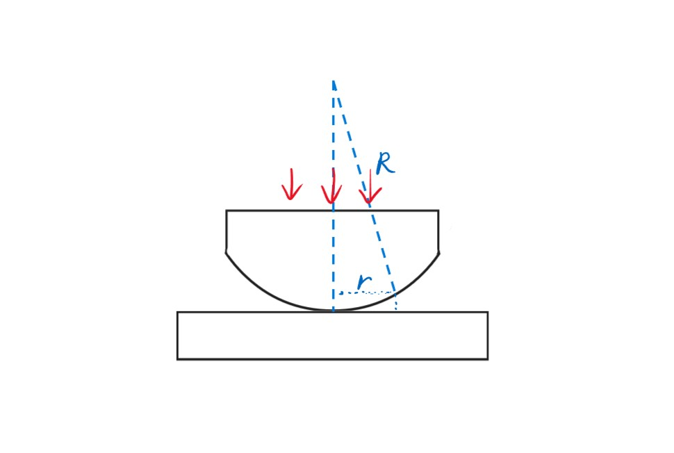

# Chapter12 波动光学

***

## 12.1 定态光波

### 定态光波

$$U(P,t)=A(P)\cos[\omega t-\varphi(P)]$$

定态光波的振幅、相位与时间无关，只与空间$P$点有关。

对于定态平面波：

振幅$A(P)$为常数，与$P$点空间位置$(x,y,z)$无关（强度不变，能量不变）。

相位

$$\varphi(P)=\vec{k}\cdot\vec{r}+\varphi_0=k_xx+k_yy+k_zz+\varphi_0$$

其中，$\vec{k}$的方向为平面波的传播方向，$\vec{k}\cdot\vec{r}$的意思是将$P$相对于$O$的位置（位移）投影到波的传播方向，即从$O$传播到$P$波实际走的距离。$\vec{k}$的大小为$\frac{2\pi}{\lambda}$，因此$\vec{k}\cdot\vec{r}$大小的含义就是：波从$O$传播到$P$，中间的波长数乘以$2\pi$（因为是相位）。

$\varphi_0$是初始相位，即$t=0$时原点处的相位。

对于定态球面波：

振幅

$$A(P)=\frac{a}{r}$$

其中$r$是到球心的距离，能量要守恒，波传播的球面越大，分散的能量越小（$E=\frac{1}{2}kA^2$，$E\cdot4\pi r=const$）。

相位

$$\varphi(P)=kr+\varphi_0$$

对于球面上的每一个点，$\vec{k}$和$\vec{r}$方向一致。

对于定态光波（电磁波）：

$$\vec{E}(P,t)=\vec{E_0}(P)\cos[\omega t-\varphi(P)]$$

!!! Note
    由于光波的磁场过于微弱，故只考虑电场。

### 复数描述

对于

$$U(P,t)=A(P)\cos[\omega t-\varphi(P)]$$

由于$e^{i\alpha}=\cos\alpha+i\sin\alpha$，$e^{-i\alpha}=\cos\alpha-i\sin\alpha$，其实部均为$\cos\alpha$，因此将原本的实数扩展为复数

$$\tilde{U}(P,t)=A(P)e^{\pm i[\omega t-\varphi(P)]}$$

!!! Note
    复数有利于分离变量，如$e^{-i[\omega t-\varphi(P)]}=e^{-i\omega t}\cdot e^{i\varphi(P)}$，分别为时间和空间。

这个复数的实部即为原本的波函数，虚部含义未知，但这个复数是另一种意义下的波函数。

不妨取$-i[\omega t-\varphi(P)]$，则

$$\tilde{U}(P,t)=A(P)e^{i\varphi(P)}\cdot e^{-i\omega t}$$

其中

$$A(P)e^{i\varphi(P)}$$

记作**复振幅$\tilde{U}(P)$**。

对于平面波：

$$\tilde{U}(P)=Ae^{i(k_xx+k_yy+k_zz+\varphi_0)}$$

对于球面波：

$$\tilde{U}(P)=\frac{a}{r}e^{i(kr+\varphi_0)}$$

在复数描述的情况下，波的强度

$$I(P)=[A(P)]^2=\tilde{U}(P)\cdot\overline{\tilde{U}(P)}$$

***

## 12.2 波的干涉

### 干涉的条件

若两列波频率相同，各点振幅不变：

$$\tilde{U}_1(P,t)=A_1e^{i\varphi_1(P)}\cdot e^{-i\omega t}$$

$$\tilde{U}_2(P,t)=A_2e^{i\varphi_2(P)}\cdot e^{-i\omega t}$$

则

$$\tilde{U}(P,t)=[A_1e^{i\varphi_1(P)}+A_2e^{i\varphi_2(P)}]e^{-i\omega t}$$

强度

$$I(P)=[A_1e^{i\varphi_1(P)}+A_2e^{i\varphi_2(P)}][A_1e^{-i\varphi_1(P)}+A_2e^{-i\varphi_2(P)}]=A_1^2+A_2^2+2A_1A_2\cos(\varphi_1-\varphi_2)$$

$$I(P)=I_1(P)+I_2(P)+2\sqrt{I_1(P)I_2(P)}\cos(\varphi_1-\varphi_2)$$

我们发现，强度并不是两列波的直接相加，波的干涉导致了强度的重新分布（或者说后者是干涉的一个表象）。

若$\delta(P)=\varphi_1-\varphi_2$不稳定，此时$\overline{\cos(\varphi_1-\varphi_2)}=0$，此时没有干涉现象。

!!! Note
    “不稳定”可解释为不同原子电子跃迁产生$h\nu$的光子的时间不一致。

因此，两个独立的光源不可能产生干涉效应，杨氏双缝干涉也只用同一束光分光。**干涉的第一个条件为：$\varphi_1-\varphi_2$稳定（同一光源）**。

**干涉的第二个条件为：若两列波为矢量波，则一定要有分量平行，不能完全垂直。**

否则，若

$$\vec{U_1(P,t)}\perp\vec{U_2(P,t)}$$

则

$$\vec{U}(P,t)=\vec{U_1}(P,t)+\vec{U_2}(P,t)$$

$$U^2(P,t)=U_1^2(P,t)+U_2^2(P,t)$$

即对于任意$P$，都有

$$I(P)=I_1(P)+I_2(P)$$

由于假设任意$P$的$A_1(P)$均相同，为$A_1$；任意$P$的$A_2(P)$均相同，为$A_2$，因此

$$I(P)=A_1^2+A_2^2$$

任意$P$强度均相同，无明暗之分。

**干涉的第三个条件为：$\omega_1=\omega_2$**

否则

$$\tilde{U}(P,t)=A_1e^{i\varphi_1(P)}e^{-i\omega_1t}+A_2e^{i\varphi_2(P)}e^{-i\omega_2t}$$

$$I(P,t)=\tilde{U}(P,t)\cdot\overline{\tilde{U}(P,t)}=A_1^2+A_2^2+2A_1A_2\cos[(\varphi_1-\varphi_2)-(\omega_1-\omega_2)t]$$

我们发现此时光强与时间也有关，平均下来为0（$\overline{\cos[(\varphi_1-\varphi_2)-(\omega_1-\omega_2)t]}=0$），因此强度也处处相等，无明暗之分。

**相干性：**

某个原子的电子跃迁，发出一条光波，任意且随机，无法干涉，相干性较差；同一束光波分成两半产生干涉，相干性较好。

**两列球面波的干涉：**

设两波源距离为$d$，波传到的位置距离第一个波源$r_1$，距离第二个波源$r_2$。

$$\varphi_1(P)=\varphi_{10}+\frac{2\pi}{\lambda}r_1,~\varphi_2(P)=\varphi_{20}+\frac{2\pi}{\lambda}r_2$$

$$\delta(P)=\varphi_1(P)-\varphi_2(P)=\varphi_{10}-\varphi_{20}+\frac{2\pi}{\lambda}(r_1-r_2)$$

其中$\varphi_{10}-\varphi_{20}$可视为0。

$$I(P)=I_1(P)+I_2(P)+2\sqrt{I_1(P)I_2(P)}\cos[\delta(P)]$$

$$I_1(P)=[A_1(P)]^2,~A_1(P)\propto\frac{1}{r_1}$$

$$I_2(P)=[A_2(P)]^2,~A_2(P)\propto\frac{1}{r_2}$$

当$r_1,r_2\gg d$时，可将$A_1(P)$和$A_2(P)$均视为$A$。因此

$$I(P)=4A^2\cos^2\frac{\delta(P)}{2}$$

$$\begin{cases}
    \Delta L=r_1-r_2=m\lambda\rightarrow I(P)\max\\\
    \Delta L=r_1-r_2=(m+\frac{1}{2})\lambda\rightarrow I(P)\min
\end{cases}$$

### 不同种类的干涉

**杨氏双缝干涉：**

$$\Delta L\approx d\sin\theta\approx d\theta$$

$$\Delta L=\begin{cases}
    m\lambda,~bright\\\
    (m+\frac{1}{2})\lambda,~dark
\end{cases}$$

对于两个相邻亮（暗）条纹：

$$d\Delta\theta=\lambda,~\Delta\theta=\frac{\lambda}{d}$$

$\Delta\theta$乘上缝到屏的距离$L$，即为相邻亮（暗）条纹之间的距离$\Delta x$

$$\Delta x=\frac{L\lambda}{d}$$

!!! Note
    若$\lambda>d$，则$\sin\theta>1$，这是不可能的，因此此时没有干涉现象。

**薄膜干涉：**

若从光密介质到光疏介质进行反射，则会有**半波损失**（相位改变，光程差增加$\frac{\lambda}{2}$）。

**等倾干涉：**

不考虑半波损失，推导光程差。

$B$到$P$和$C$到$P$的光程差一致，因此光程差为$(AR)+(RC)-(AB)$

$$\Delta L=2\cdot\frac{nh}{\cos i}-n_1\overline{AC}\sin i_1=\frac{2nh}{\cos i}-n_1\cdot 2h\tan i\sin i_1=2nh(\frac{1}{\cos i}-\frac{\sin^2 i}{\cos i})=2nh\cos i$$

$$\Delta L=\begin{cases}
    m\lambda,~bright\\\
    (m+\frac{1}{2})\lambda,~dark
\end{cases}$$

当$i=0$时（垂直入射），$\cos i=1$取最大，此时$m$也取最大。

越往外（半径越大），越稠密（间距越小）。

解释：

$$\Delta L_m=2nh\cos i_m=m\lambda~\rightarrow~\cos i_m=\frac{m\lambda}{2nh}$$

$$\Delta L_{m+1}=2nh\cos i_{m+1}=(m+1)\lambda~\rightarrow~\cos i_{m+1}=\frac{(m+1)\lambda}{2nh}$$

$$\cos i_{m+1}-\cos i_m=\frac{\lambda}{2nh}$$

利用微分思想：

$$(\cos i)'=\frac{\cos i_{m+1}-\cos i_m}{i_{m+1}-i_m}$$

$$\cos i_{m+1}-\cos i_m=-\sin i_m\cdot(i_{m+1}-i_m)=\frac{\lambda}{2nh}$$

$$\Delta r_m=r_{m+1}-r_m\propto f(i_{m+1}-i_m)=-\frac{f\lambda}{2nh\sin i_m}\propto-\frac{\lambda}{2nh\sin i_m}$$

一个条纹对应一个倾角，因此称为**等倾干涉**。

**等厚干涉：**

$A$和$P$几乎重合。

$$\Delta L=(QABP)-(QP)=(QA)-(QP)+(ABP)$$

$$(QA)-(QP)\approx-(CP)\approx-n_1\overline{AP}\sin i_1=-n\overline{AP}\sin i\approx-n(2h\tan i)\sin i=-2nh\frac{\sin^2i}{\cos i}$$

$$(ABP)\approx2(AB)\approx2\frac{nh}{\cos i}$$

$$\Delta L=2nh\cos i=\begin{cases}
    m\lambda,~bright\\\
    (m+\frac{1}{2})\lambda,~dark
\end{cases}$$

$$i=0,~\Delta L=2nh=m\lambda$$

$$2n\Delta h=\lambda~\rightarrow~\Delta h=\frac{\lambda}{2n}$$

对于空气（$n=1$）：两条亮（暗）条纹间距：

$$\Delta x\approx\frac{\lambda}{2\theta}~\rightarrow~\theta=\frac{\lambda}{2\Delta x}$$

**牛顿环：**

考虑半波损失：

$$\Delta L=2h+\frac{\lambda}{2}=\begin{cases}
    m\lambda,~bright\\\
    (m+\frac{1}{2})\lambda,~dark
\end{cases}$$

对于暗条纹：

$$2h_m=m\lambda$$

$$h_m=R-\sqrt{R^2-r_m^2}\approx\frac{1}{2}\frac{r_m^2}{R}=\frac{1}{2}m\lambda$$

$$r_m\approx\sqrt{m\lambda R}$$

因此可以估算弧度。