

# Chapter13 衍射与光栅

***

## 13.1 衍射

### 弗朗和夫衍射强度推导

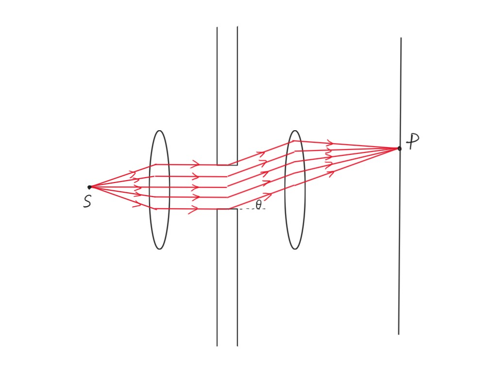

光源$S$在焦距处，发出一束光经透镜折射后平行到达狭缝，在狭缝处，每一条光线又可看作一个点光源（惠更斯原理），发出各个方向的光。考虑其发出的夹角为$\theta$的平行光，其经透镜汇聚到焦平面上的$P$点，不同的$\theta$汇聚到焦平面上的位置不同。

设狭缝宽度为$a$，由微积分的思想，我们考虑将$a$的狭缝分成$n$个$\frac{a}{n}$的狭缝，每个狭缝只透过一条光线，因此$P$点上为$n$个狭缝电场的叠加。

回忆复振幅：$\tilde{U}(P)=Ae^{i\varphi(P)}$在复平面上表示为

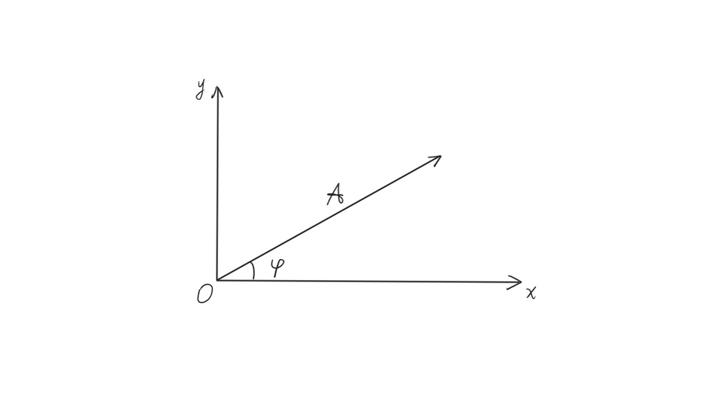

每一个狭缝都有

$$E=E_me^{i\varphi_m}$$

取第一个狭缝的$\varphi$为0，则

$$E_1=E_0e^{i\cdot 0},~E_2=E_0e^{i\Delta\varphi},~···,~E_N=E_0e^{i(N-1)\Delta\varphi}$$

其中

$$\Delta\varphi=\frac{2\pi}{\lambda}\cdot\frac{a}{N}\sin\theta$$

$P$点的电场是$E_1\sim E_N$的线性叠加（矢量），记为$E_{\theta}$（一个$\theta$对应一个$P$点），重新在复平面上表示：

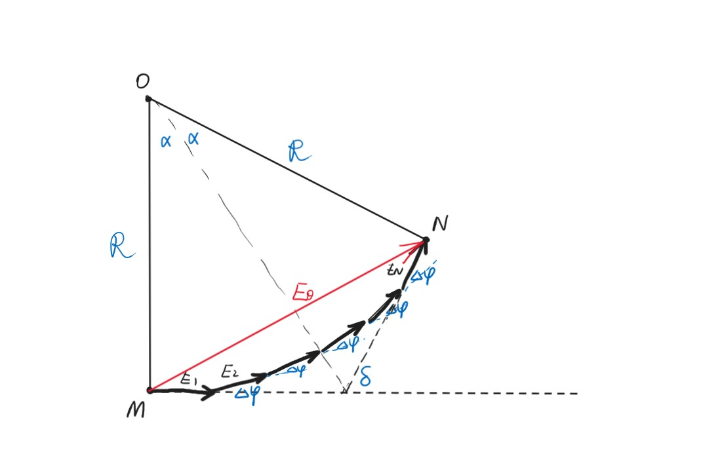

$$\delta=N\Delta\varphi=\frac{2\pi}{\lambda}a\sin\theta$$

$$\alpha=\frac{\delta}{2}=\frac{\pi a\sin\theta}{\lambda}$$

若要求$\mathop{MN}\limits^{\frown}$（$M$到$N$的弧长），则应当将这一条$\vec{E_1},~\vec{E_2},~···,~\vec{E_N}$的链拉直，长度等于弧长，此时$\Delta\varphi=0$，$\theta=0$，对应的是光屏最中心最亮的位置，记为$E_m$。

$$R=\frac{\mathop{MN}\limits^{\frown}}{2\alpha}$$

$$E_{\theta}=2R\sin\alpha=\mathop{MN}\limits^{\frown}\frac{\sin\alpha}{\alpha}=E_m\frac{\sin\alpha}{\alpha}$$

强度

$$I_{\theta}=E_{\theta}^2=E_m^2(\frac{\sin\alpha}{\alpha})^2=I_m(\frac{\sin\alpha}{\alpha})^2$$

强度分布即亮暗分布。

若$\alpha=\frac{\pi a\sin\theta}{\lambda}=m\pi~(a\sin\theta=m\lambda)$，则$I_{\theta}=0$，对应暗条纹。

若$\theta\rightarrow 0$，则$\alpha=\frac{\pi\alpha\sin\theta}{\lambda}\rightarrow 0$，$\lim\limits_{\alpha\rightarrow 0}(\frac{\sin\alpha}{\alpha})=1$，因此$I_{\theta=0}=I_m$，对应最亮的亮条纹。

若$\alpha=\frac{\pi a\sin\theta}{\lambda}=(m+\frac{1}{2})\pi$，则$I_\theta$对应局部亮条纹（粗略估计下）。

!!! Note
    若要精确估计，则$I_\theta'=[I_m(\frac{\sin\alpha}{\alpha})^2]'$，$\alpha=\sin\alpha$。

对于中间最亮条纹的宽度，考虑**半角宽度**：

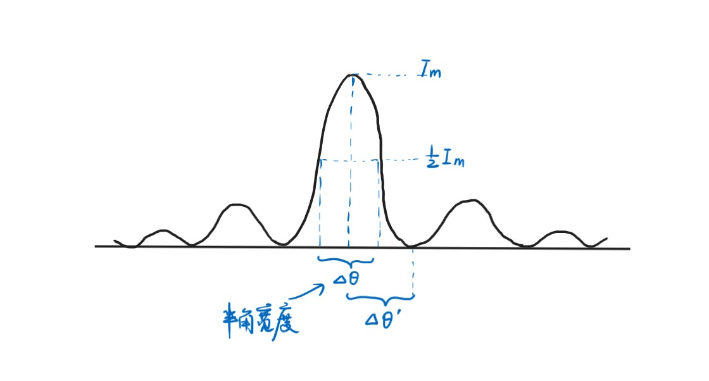

$$\Delta\theta\approx\Delta\theta'$$

第一个暗条纹：

$$a\sin\theta=\lambda~\Rightarrow~\theta\approx\frac{\lambda}{a}=\Delta\theta'$$

$$\Delta y_m\approx f\Delta\theta=\frac{f\lambda}{a}$$

求得的约为最亮条纹的一半宽度。

**半波片：**

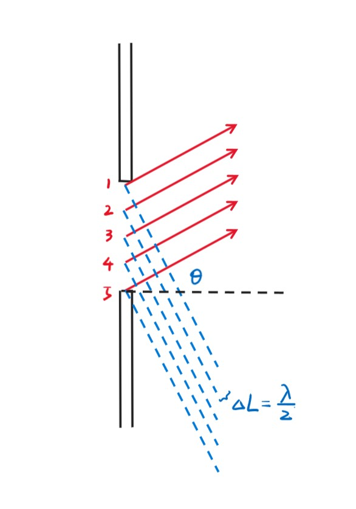

不再将狭缝均匀分成$N$份，而是划分，使得相邻两条光线的光程差为$\frac{\lambda}{2}$。因此，若分出偶数个，则为暗条纹，否则则为亮条纹。

$$\delta=a\sin\theta=\begin{cases}
    0,~brightest\\\
    2m\cdot\frac{\lambda}{2}=m\lambda,~dark\\\
    (2m+1)\frac{\lambda}{2},~bright
\end{cases}$$

!!! Example
    **缝宽$a$=0.5mm，透镜焦距$f$=100cm，一级最大离零级最大1.5mm，求波长和零级最大的宽度。**

    对于一级最大：  
    $a\sin\theta=\frac{(2m+1)\lambda}{2}=\frac{3}{2}\lambda$    
    $\sin\theta\approx\theta=\frac{x}{f}$   
    因此可以得到$\lambda$=500nm     
    对于一级最小：  
    $a\sin\theta=m\lambda=\lambda$，$\Delta\theta=\frac{\lambda}{a}$    
    $\Delta y_0=\frac{f\lambda}{a}\cdot 2=2$mm

### 弗朗和夫圆孔衍射

设圆孔半径为$a$，则

$$I(\theta)=I_0[\frac{2J_1(x)}{x}]^2,~x=\frac{2\pi a\sin\theta}{\lambda}$$

!!! Note
    $J_1(x)$为一阶贝塞尔函数，凭当前知识无法推导。

对于中心的最大亮斑，其圆心到一级最暗的距离即为半角宽度对应的距离

$$\Delta\theta=1.22\frac{\lambda}{D}$$

其中$D$为圆孔直径。

**瑞利判据：**

用于评判分辨本领。两个物体（物点）通过圆孔衍射成像，当第一个物点对应的零级最亮与第二个物点的一级最暗在同一位置处，此时恰好能分辨。

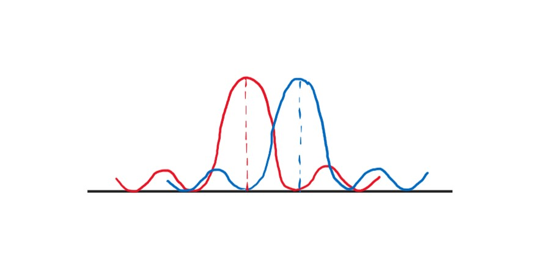

**分辨本领：**

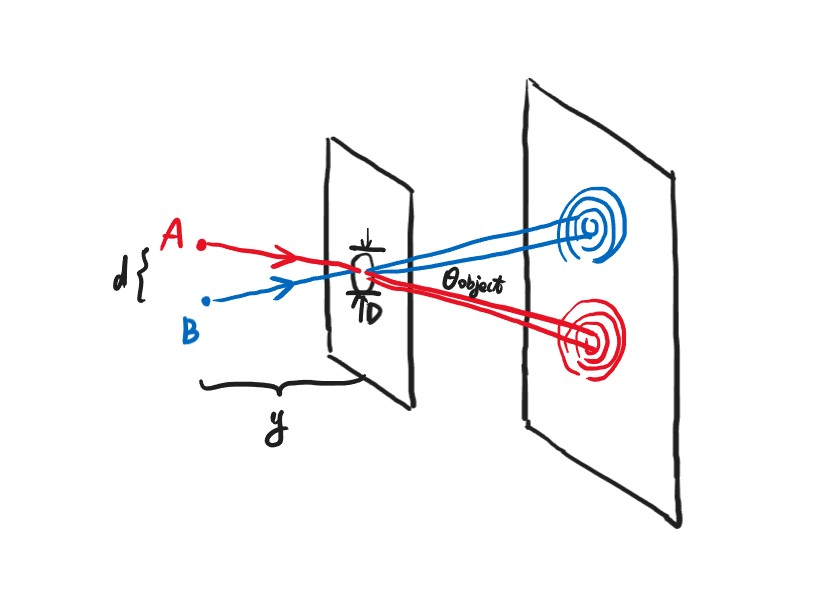

设$d$为物体之间的距离，$y$为物体到圆孔之间的距离。当刚好分辨时

$$\theta_{object}=\frac{d}{y}=1.22\frac{\lambda}{D}$$

**望远镜：**

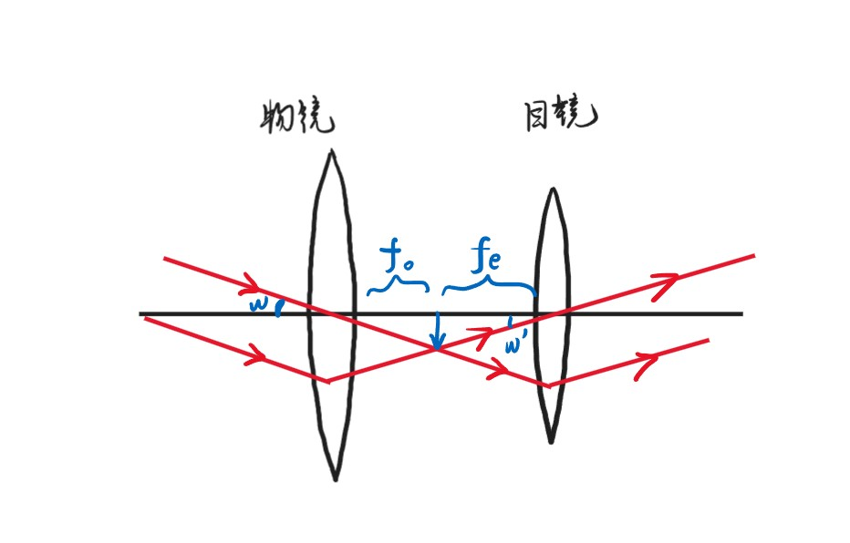

放大率：

$$M=\frac{w'}{w}=-\frac{f_o}{f_e}$$

其中，$w'$可看作人眼最小可分辨夹角，$w$可看作物体最小可分辨夹角。

!!! Note
    并不是$f_o\rightarrow\infty$，$f_e\rightarrow0$就可以无限放大，要考虑分辨率。

假设望远镜直径$D=5.0$cm，可见光波长（最敏感）$\lambda=550$nm，则$\theta_R=1.22\frac{\lambda}{D}=1.3\times 10^{-5}$rad，为最小可分辨夹角。

若$D$变为50cm，则$\theta_R$变为$1.3\times 10^{-6}$rad。

由于人眼最小分辨夹角$\theta_e=2.9\times 10^{-4}$rad，因此对于$D=5.0$cm的望远镜：$M=\frac{\theta_e}{\theta_R}=22.4$；对于$D=50$cm的望远镜：$M=224$。

提高分辨本领：增大$D$或减小$\lambda$。

***

## 13.2 光栅

### 光栅衍射+干涉强度推导

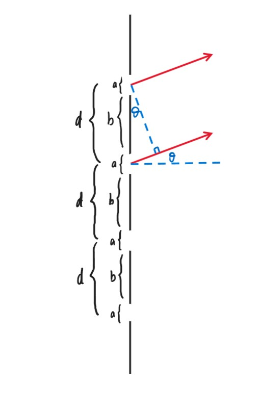

每条缝的缝宽为$a$，缝之间的距离$d=a+b$，相邻两条缝的光线的光程相差$d\sin\theta$，第$N$条缝的光线比第一条缝的光线多走$(N-1)\sin\theta$。

先考虑衍射：

将其他的缝挡住，只留一条缝，回到经典的单缝衍射，此时

$$E_{\theta}=E_m\frac{\sin\alpha}{\alpha},~\alpha=\frac{\pi a\sin\theta}{\lambda}$$

$$I_{\theta}=I_m(\frac{\sin\alpha}{\alpha})^2$$

!!! Note
    不用担心此时$\theta$的混淆，因为平行光依然会聚焦到最中间的$P$点。

再考虑干涉：

考虑第一条缝和第二条缝，其相位差$\delta=\frac{2\pi}{\lambda}d\sin\theta$，记作$2\beta$，因此$\beta=\frac{\pi d\sin\theta}{\lambda}$。

$$E_1=E_m(\frac{\sin\alpha}{\alpha})e^{i\cdot 0},~E_2=E_m(\frac{\sin\alpha}{\alpha})e^{i\delta},~···,~E_N=E_m(\frac{\sin\alpha}{\alpha})e^{i(N-1)\delta}$$

因此用之前的方法求$\vec{E_1}+\vec{E_2}+···+\vec{E_N}$（复平面上）：

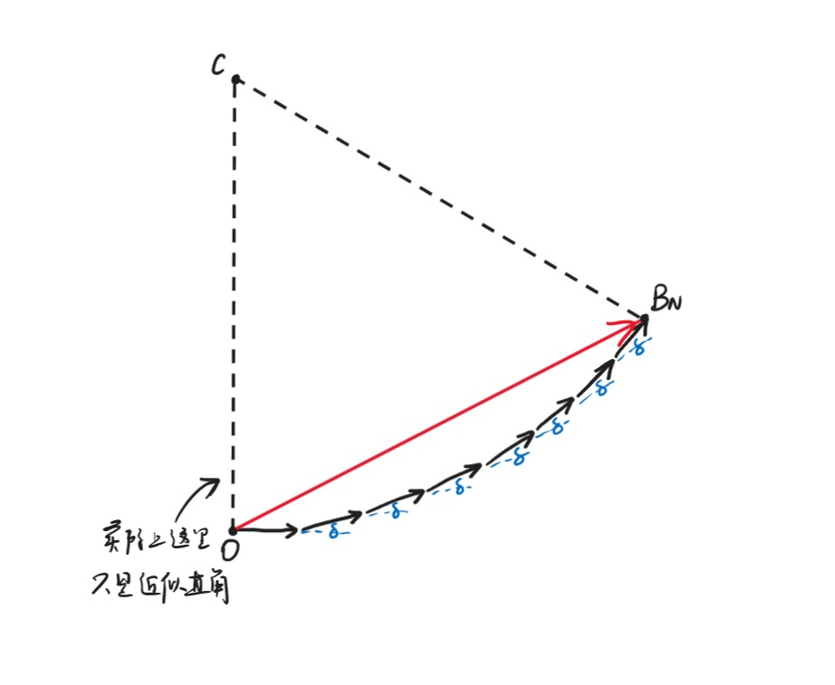

$$\angle OCB_N=N\delta=2N\beta$$

$$E_\theta=E_1+···+E_N=\overline{OB_N}=2\overline{OC}\sin(N\beta)=2\cdot\frac{E_1}{2\sin\beta}\cdot\sin(N\beta)=E_1\frac{\sin(N\beta)}{\sin\beta}$$

综上：

$$I_\theta=I_m(\frac{\sin\alpha}{\alpha})^2(\frac{\sin N\beta}{\sin\beta})^2$$

其中

$$\alpha=\frac{\pi a\sin\theta}{\lambda},~\beta=\frac{\pi d\sin\theta}{\lambda}$$

在两个主极大之间，有$N-1$个极小，$N-2$个次极大。

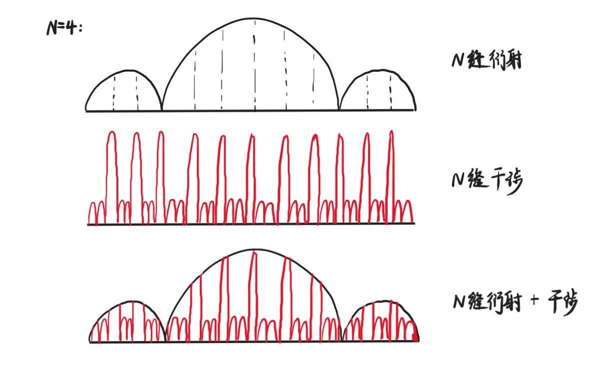

对于主极大：

$$I_{\theta}=I_1(\frac{\sin N\beta}{\sin\beta})^2$$

当$\beta=m\pi$时

$$\lim\limits_{\sin\beta\rightarrow 0}(\frac{\sin N\beta}{\sin\beta})^2=N$$

此时

$$I_{\theta}=N^2I_1$$

$$d\sin\theta=m\lambda$$

对应主极大。

!!! Note
    要有$|m_{\max}|<\frac{d}{\lambda}$，因此$\lambda>d$时无现象。

对于极小（暗条纹）：

$$\sin N\beta=0,~\sin\beta\neq0$$

因此

$$\beta=(m+\frac{n}{N})\pi,~m=0,\pm1,\pm2,···,~n=1,2,···,N-1$$

此时

$$\sin\theta=\frac{\lambda}{d}(m+\frac{n}{N})$$

这解释了为什么2个主极大之间有$N-1$个极小。

!!! Note
    由$N-1$个极小又可以推出$N-2$个次极大。

    以上两种情况都是在不考虑$\frac{\sin\alpha}{\alpha}$的情况下分析的。

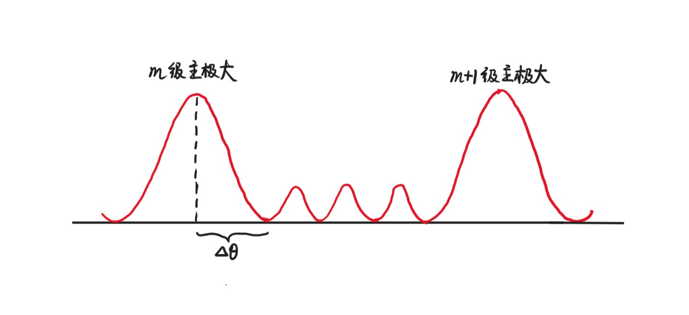

$$d\sin\theta=m\lambda$$

$$\theta_m\approx\frac{m\lambda}{d}$$

$$\theta_m+\Delta\theta\approx(m+\frac{1}{N})\frac{\lambda}{d}$$

$$\Delta\theta\approx\frac{\lambda}{Nd}$$

以上只是近似估计，若$\theta$不够小，则不能有$\sin\theta\approx\theta$的近似。

$$d\sin\theta_b=m\lambda,~d\sin\theta_d=(M+\frac{1}{N})\lambda$$

$$d(\sin\theta_b-\sin\theta_d)=\frac{\lambda}{N}$$

$$d\frac{\sin\theta_b-\sin\theta_d}{\Delta\theta}=\frac{\lambda}{N\Delta\theta}$$

$$d\cos\theta_b=\frac{\lambda}{N\Delta\theta}$$

$$\Delta\theta=\frac{\lambda}{Nd\cos\theta}$$

再考虑衍射，若$\sin\alpha=0$，则$\alpha=m\pi$，$\sin\theta=\frac{m\lambda}{a}$

此时

$$\beta=\frac{\pi dm}{a}$$

若$d$为$a$的整数倍，则

$$\sin N\beta=\sin\beta=0$$

原本在干涉情况下的主极大消失（变成极小）。

!!! Example
    **光栅的$N=5000$，两束光$\lambda_1=600$nm，$\lambda_2=400$nm，第一束光的第$m$级主极大与第二束光的第$m+1$级主极大在距离中心3cm处重合，透镜焦距$f=50$cm，求光栅常数$d$和主极大的典型宽度。**  

    $d\sin\theta=m\lambda$  
    $d\sin\theta=m\lambda_1=(m+1)\lambda_2$     
    $m=2$   
    $d\sin\theta\approx d\frac{y}{f}=m\lambda_1$    
    $d=\frac{mf\lambda_1}{y}=\frac{2\times50cm\times600nm}{3cm}=20\mu m$    
    $\Delta\theta=\frac{\lambda}{Nd\cos\theta}$     
    $m=2,~d\sin\theta=m\lambda_1$   
    因此$\theta\approx0.06,~\cos\theta\approx1$     
    $\Delta\theta_{m=2}=6\times10^{-6}$     
    $\Delta y_{m=2}=2f\Delta\theta_{m=2}=6\mu m$

### 色散

**色散：**

主极大有$d\sin\theta=m\lambda$，对于不同颜色的光，其$\lambda$的值不同，因此亮条纹对应的$\theta$也不同，于是发生色散。

**色散本领：**

不同颜色的光分开的距离越大，则光栅的色散本领越强。

色散本领的定义：

$$D=\frac{\Delta\theta}{\Delta\lambda}$$

在$d\sin\theta=m\lambda$基础上两边对$\theta$求导：

$$d\cos\theta=\frac{m}{D}$$

$$D=\frac{m}{d\cos\theta}$$

因此缝之间的距离越小，级数越高，色散本领越强，且$D$与$N$无关。

**分辨本领：**

使用瑞利判据：之前已经计算出半角宽度

$$\Delta\theta_w=\frac{\lambda}{Nd\cos\theta}$$

色散本领

$$D_{\theta}=\frac{m}{d\cos\theta}=\frac{\Delta\theta_w}{\Delta\lambda}$$

因此

$$\Delta\lambda=\frac{\Delta\theta_w}{D_{\theta}}=\frac{\lambda}{Nm}$$

分辨本领的定义：

$$R=\frac{\lambda}{\Delta\lambda}=Nm$$

$R$与$d$无关。