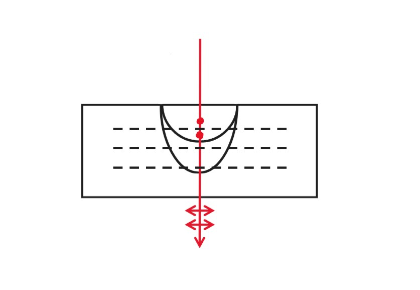

# Chapter14 偏振

***

## 14.1 偏振

### 线偏振强度推导

$$I_1=\frac{1}{2}I_0$$

原因：统计平均

$$I_2=I_1\cos^2\theta$$

原因：投影乘上$\cos\theta$，光强$I\propto E^2$，因此乘上$\cos^2\theta$（**马隆定律**）

!!! Example
    

    $I_{45}=\frac{1}{4}I_0$     
    原因：$E_1=\frac{\sqrt{2}}{2}E_0$，$E_2=\frac{\sqrt{2}}{2}E_1$      

    当$\theta=30°$时  
    $E_1=\frac{\sqrt{3}}{2}E_0$     
    $E_2=\frac{1}{2}E_1=\frac{\sqrt{3}}{4}E_0$  
    $I_{30}=\frac{3}{16}I_0<I_{45}$

### 圆偏振光

$$E_x=E_{x0}\sin(kz-\omega t+\phi_x)$$

$$E_y=E_{y0}\sin(kz-\omega t+\phi_y)$$

设波沿z轴方向传播。若$\phi_x=\phi_y$，则退化为线偏振。若$E_{x0}=E_{y0}$且$\phi_x-\phi_y=\pm\frac{\pi}{2}$，则对应的偏振态称为**圆偏振**。

!!! Note
    若$E_{x0}\neq E_{y0}$，则对应椭圆。

左手、右手的含义为：我们的视线与z轴方向一致，z从0开始不断增大，右手→顺时针，左手→逆时针。

将光照在晶体上，出来的光不转，为线偏振光。由于角动量守恒，因此晶体会转。

### 其他偏振态

**1.无偏振光（自然光）**

**2.线偏振光**

**3.部分偏振光**

偏振度：

$$P=\frac{I_{\max}-I_{\min}}{I_{\max}+I_{\min}}$$

对于线偏振光：

$$I_{\min}=0,~P=1$$

对于无偏振光：

$$I_{\min}=I_{\max},~P=0$$

**4.圆偏振光**

**5.椭圆偏振光**

$$\begin{cases}
    E_x=E_1\sin(kz-\omega t+\delta)\\\
    E_y=E_2\sin(kz-\omega t)
\end{cases}$$

要求$E_1\neq E_2$或者$\delta\neq\pm\frac{\pi}{2}$

### 反射产生的偏振

$\leftrightarrow$表示平行平面的偏振分量，$\cdot$表示垂直平面的偏振分量。入射光是无偏振光，各个方向都有偏振分量。

若有

$$\theta_p+\theta_r=90°$$

则代入$n_1\sin\theta_p=n_2\sin\theta_r$可解得：

$$\tan\theta_p=\frac{n_2}{n_1}$$

$\theta_p$被称为**布儒斯特角**。

此时反射光的电场只有垂直平面的分量，反射光为线偏振光。对于折射光，平行平面的电场强度强于垂直平面的电场强度（因为分了一部分给反射光），此时折射光为部分偏振光。

如果我们叠起玻璃片，且入射角为布儒斯特角：

每次反射都会少掉一点垂直平面的分量，因此最后出来的折射光只有平行平面的分量，也是偏振光。

***

## 14.2 双折射

光线垂直入射，却被分成两束。对于**寻常光（O光）**，满足一般的折射定律；对于**非寻常光（E光）**，不同方向的光折射率不同，速度也不同。

光经过折射，频率$f$不变。对于快的方向：$v_{fast}$大，$\lambda_{fast}$大；对于慢的方向，$v_{slow}$小，$\lambda_{slow}$小。材料的厚度影响了相位差。

对于O光，其对于同一材料只有一个折射率$n_o$，对应速度$v_o$；对于E光，折射率从$n_o$连续变化到$n_e$，对应速度从$v_o$到$v_e$。

### 光轴

在CaCO$_3$中：

O光在各个方向速度一样，E光沿y轴方向速度最快，沿z轴方向速度最慢，与O光一致。$v_e>v_o$，$n_e<n_o$，对应晶体为**负晶体**。

在SiO$_2$中：

$v_o>v_e$，$n_o<n_e$，对应晶体为**正晶体**。

**光轴：O光和E光速度相等的方向**

更明确的表述：**光的传播路径与光轴构成一个平面，若$\vec{E}$垂直该平面，则为O光；若$\vec{E}$平行该平面，则为E光。**

### 波片

波片为各向异性材料，虚线为光轴方向。光垂直入射，分成E光和O光，E光传播得更快。

O光光程：

$$L_o=n_od$$

E光光程：

$$L_e=n_ed$$

相位差：

$$\Delta\phi=\frac{2\pi}{\lambda}(n_o-n_e)d$$

若$(n_o-n_e)d=\pm\frac{1}{4}\lambda$，则$\Delta\phi=\pm\frac{\pi}{2}$，此时的波片称为 **$\frac{1}{4}$波片**。

若$(n_o-n_e)d=\pm\frac{1}{2}\lambda$，则$\Delta\phi=\pm\pi$，此时的波片称为 **半波片**。

将$\vec{E}$分成$\vec{E_x}$和$\vec{E_y}$两个相互垂直的分量，若入射光为线偏振光，则$\vec{E_x}$和$\vec{E_y}$相位一致，经过$\frac{1}{4}$波片后$\vec{E}_x$和$\vec{E}_y$相位差变为$\frac{\pi}{2}$，变成圆偏振光（或椭圆）。同理，圆偏振光经过$\frac{1}{4}$波片后变成线偏振光。

对于半波片，偏振光经过后旋转$90°$。

!!! Example
    

    $A_e=A\cos\theta$（E光）    
    $A_o=A\sin\theta$（O光）    
    若$\theta=45°$，则变成圆偏振光    
    若$\theta\neq45°$，则变成椭圆偏振光

!!! Note
    偏振片无法区分自然光和圆偏振光，但$\frac{1}{4}$波片可以。

**$\frac{1}{4}$波片强度推导：**

fast方向：E光（快了$\frac{\lambda}{4}$）

$$E_y=E_0\sin(kz-\omega t+\frac{\pi}{2})=-E_0\cos(kz-\omega t)$$

slow方向：O光（没有变化）

$$E_x=E_0\sin(kz-\omega t)$$

$$E_f=E_s=\frac{E_0}{\sqrt{2}}$$

若其再经过一个偏振片：

$$E_f'=E_s'=\frac{1}{\sqrt{2}}\cdot\frac{E_0}{\sqrt{2}}=\frac{E_0}{2}$$

由于其相位差刚好差$\frac{\pi}{2}$，无法抵消，因此

$$I=(\frac{E_0}{2})^2+(\frac{E_0}{2})^2=\frac{1}{2}I_0$$