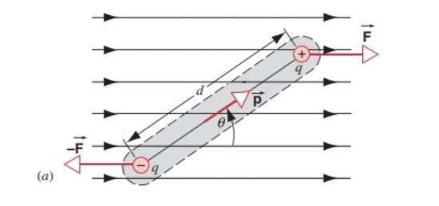

# Chapter 2 电场

***

## 2.1 电场

**定义：**

对于任一极小试探电荷$q_0$，其所在位置的电场强度为：

$$\vec{E}=\lim\limits_{q_0\rightarrow0}\frac{\vec{F}}{q_0}$$

对于任一点电荷$q$，其在距离为$r$处产生的电场强度为：

$$\vec{E}=\frac{1}{4\pi\varepsilon_0}\frac{q}{r^2}\hat{r}$$

**电偶极矩（Electric Dipole）：**

本质上就是一对带等量电荷的正负电荷。

定义**电偶极矩矢量$\vec{p}$**：

$$\vec{p}=q\vec{d}$$

其中$q$为点电荷的带电量，$\vec{d}$为正负电荷的距离，方向从负电荷指向正电荷。

若考虑x轴上的电场：

$$\cos\theta=\frac{\frac{d}{2}}{r}=\frac{\frac{d}{2}}{\sqrt{x^2+(\frac{d}{2})^2}}$$

$$E_{+}=E_{-}=\frac{1}{4\pi\varepsilon_0}\frac{q}{r^2}=\frac{1}{4\pi\varepsilon_0}\frac{q}{x^2+(\frac{d}{2})^2}$$

$$E=(E_{+}+E_{-})\cos\theta=\frac{1}{4\pi\varepsilon_0}\frac{qd}{[x^2+(\frac{d}{2})^2]^{\frac{3}{2}}}=\frac{1}{4\pi\varepsilon_0}\frac{p}{[x^2+(\frac{d}{2})^2]^{\frac{3}{2}}}$$

!!! Note
    当$x\gg d$时：    
    $E_x\rightarrow \frac{1}{4\pi\varepsilon_0}\frac{p}{x^3}$

若考虑y轴方向上的电场：

$$E_y=\frac{1}{4\pi\varepsilon_0}\frac{q}{(y-\frac{d}{2})^2}-\frac{1}{4\pi\varepsilon_0}\frac{q}{(y+\frac{d}{2})^2}=\frac{1}{4\pi\varepsilon_0}\frac{2yp}{(y^2-\frac{d^2}{4})^2}$$

!!! Note
    当$y\gg d$时：  
    $E_y\rightarrow\frac{1}{4\pi\varepsilon_0}\frac{2p}{y^3}$

综上：对于xy平面，有

$$E\propto\frac{1}{r^3}$$

**电场中的电偶极矩：**

力矩（方向向内）：

$$\tau=d\cdot F\sin\theta=dqE\sin\theta=pE\sin\theta=\vec{p}\times\vec{E}$$

若从$\theta_0$转向$\theta$（$\theta_0<\theta$），则做功：

$$W=-\int_{\theta_0}^\theta\tau d\theta=-\int_{\theta_0}^\theta pE\sin\theta d\theta=pE(\cos\theta-\cos\theta_0)$$

!!! Note
    第一个负号表明力矩$\tau$在阻碍角度$\theta$的增大。

$$\Delta U=U(\theta)-U(\theta_0)=-W=-pE(\cos\theta-\cos\theta_0)$$

定义$\theta_0=\frac{\pi}{2}$，$U(\frac{\pi}{2})=0$，则

$$U(\theta)=-\vec{p}·\vec{E}$$

***

## 2.2 连续分布电荷产生的电场

**均匀带电棒：**

$$F=\frac{1}{4\pi\varepsilon_0}\frac{Qq}{r\sqrt{\frac{L^2}{4}+r^2}}$$

$$E=\frac{F}{q}=\frac{1}{4\pi\varepsilon_0}\frac{Q}{r\sqrt{\frac{L^2}{4}+r^2}}$$

!!! Note
    当$L\rightarrow\infty$时：（即带电棒无限长）  
    $E\rightarrow\frac{1}{4\pi\varepsilon_0}\frac{Q}{r\cdot\frac{L}{2}}=\frac{1}{4\pi\varepsilon_0}\frac{2\lambda}{r}$

**均匀带电圆环：**

$$F=\frac{1}{4\pi\varepsilon_0}\frac{rQq}{(R^2+r^2)^{\frac{3}{2}}}$ $

$$E=\frac{F}{q}=\frac{1}{4\pi\varepsilon_0}\frac{rQ}{(R^2+r^2)^{\frac{3}{2}}}$$

!!! Note
    当$r\gg R$时：（即离圆环无限远处）  
    $E\rightarrow\frac{1}{4\pi\varepsilon_0}\frac{q}{r^2}$  
    此时圆环可看作点电荷    

**均匀带电圆盘：**

$$F=\frac{1}{4\pi\varepsilon_0}\frac{2rQq}{R^2}(\frac{1}{r}-\frac{1}{\sqrt{R^2+r^2}})$$

$$E=\frac{F}{q}=\frac{1}{4\pi\varepsilon_0}\frac{2rQ}{R^2}(\frac{1}{r}-\frac{1}{\sqrt{R^2+r^2}})=\frac{\sigma}{2\varepsilon_0}(1-\frac{1}{\sqrt{1+\frac{R^2}{r^2}}})$$

!!! Note
    当$r\gg R$时：（即离圆盘无限远处）  
    通过Taylor展开：  
    $\frac{1}{\sqrt{1+\frac{R^2}{r^2}}}=1-\frac{1}{2}\frac{R^2}{r^2}+o(···)$  
    $E\rightarrow\frac{\sigma}{2\varepsilon_0}\frac{R^2}{2r^2}=\frac{1}{4\pi\varepsilon_0}\frac{Q}{r^2}$  
    此时圆盘可看作点电荷

!!! Note
    $(1\pm x)^n=1\pm\frac{nx}{1!}+\frac{n(n-1)x^2}{2!}\pm···$
    $(1\pm x)^{-n}=1\mp\frac{nx}{1!}+\frac{n(n+1)x^2}{2!}\mp···$

!!! Note
    当$R\gg r$时：（即圆盘中心处）  
    $E\rightarrow\frac{\sigma}{2\varepsilon_0}$  
    此时圆盘可看作无限大的均匀带电平面

**均匀带电球体：**

$$\rho=\frac{Q}{\frac{4}{3}\pi R^3}$$

将球体分割成无限个球壳，当试探电荷与球心的距离$r<R$时，实际产生电场的为半径为$r$的球体：

$$q=\rho(\frac{4}{3}\pi r^3)=Q\frac{r^3}{R^3}$$

$$E_r=\frac{1}{4\pi\epsilon_0}\frac{Qr}{R^3}$$

当$r>R$时，相当于无限个球壳产生的电场叠加，每个球壳产生的电场相当于集中在一点的点电荷产生的电场：

$$E_r=\frac{1}{4\pi\epsilon_0}\frac{Q}{r^2}$$

