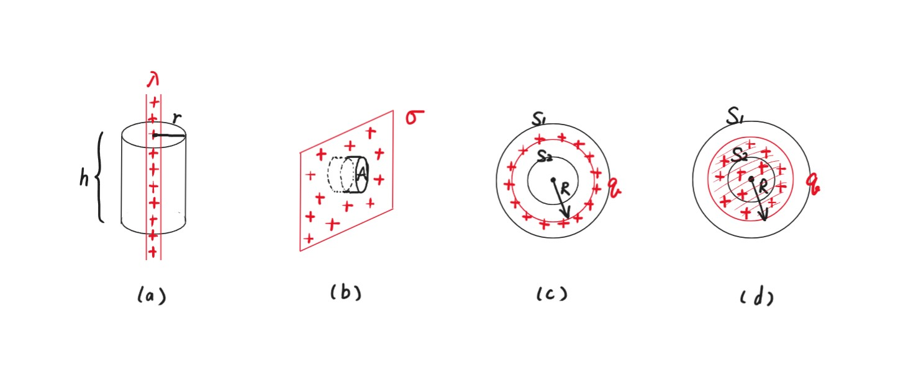
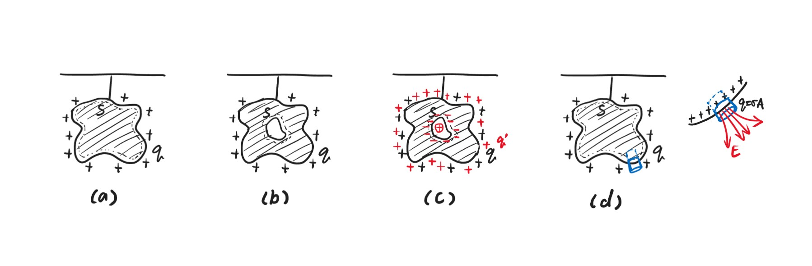

# Chapter3 高斯定理

***

## 3.1 高斯定理

**电通量：**

$$\varPhi_E=\sum\vec{E}\cdot\Delta\vec{A}=\iint\limits_{\substack{\circ}} \vec{E}\cdot d\vec{A}$$

对于封闭曲面，规定向外为正，向内为负。

**高斯定理：**

流过封闭曲面的电通量大小与包在曲面内的电荷大小成比例：

$$\varPhi_E=\iint\limits_{\substack{\circ}}\vec{E}\cdot d\vec{A}=\frac{q_{enclosed}}{\varepsilon_0}$$

!!! Note
    高斯定理的应用关键在于寻找便于计算积分的封闭曲面（球、圆柱体、长方体）。

**高斯定理推导库仑定律：**

考虑带电量为$q$的点电荷和以其为球心的半径为$r$的封闭球形曲面，易知：电场线与封闭球形曲面处处垂直。

由高斯定理：

$$\varepsilon_0\iint\limits_{\substack{\circ}}\vec{E}\cdot d\vec{A}=\varepsilon_0\cdot E\cdot 4\pi r^2=q$$

因此：

$$E=\frac{1}{4\pi\varepsilon_0}\frac{q}{r^2}$$

即为库仑定律。

***

## 3.2 高斯定理的计算

**(a) 无穷长导线周围的电场：**

$$\varepsilon_0\iint\limits_{\substack{\circ}}\vec{E}\cdot d\vec{A}=q_{enclosed}$$

$$\varepsilon_0E\cdot 2\pi rh=\lambda h$$

$$E=\frac{\lambda}{2\pi\varepsilon_0 r}$$

**(b) 无穷大均匀带电板周围的电场：**

$$\varepsilon_0\iint\limits_{\substack{\circ}}\vec{E}\cdot d\vec{A}=q_{enclosed}$$

$$\varepsilon_0(EA+EA)=\sigma A$$

$$E=\frac{\sigma}{2\varepsilon_0}$$

!!! Note
    若为一正一负两块无穷大均匀带电板并排放置，则板间电场强度$E=\frac{\sigma}{\varepsilon_0}$，板外电场强度为0。

**(c) 均匀带电球壳产生的电场：**

当$r>R$时：使用的高斯面为$S_1$

$$\varepsilon_0\cdot E_r\cdot 4\pi r^2=q$$

$$E_r=\frac{1}{4\pi\varepsilon_0}\frac{q}{r^2}$$

当$r<R$时：使用的高斯面为$S_2$

$$\varepsilon_0\cdot E_r\cdot 4\pi r^2=0$$

$$E_r=0$$

**(d) 均匀带电球体产生的电场：**

当$r>R$时：使用的高斯面为$S_1$

$$\varepsilon_0\cdot E_r\cdot 4\pi r^2=q$$

$$E_r=\frac{1}{4\pi\varepsilon_0}\frac{q}{r^2}$$

当$r<R$时：使用的高斯面为$S_2$

$$\varepsilon_0\cdot E_r\cdot 4\pi r^2=q'$$

$$\frac{q'}{q}=\frac{\frac{4}{3}\pi r^3}{\frac{4}{3}\pi R^3}=\frac{r^3}{R^3}$$

$$E_r=\frac{1}{4\pi\varepsilon_0}\frac{qr}{R^3}$$

***

## 3.3 高斯定理与导体

**(a):**

$S$为紧贴孤立带电导体外表面的封闭曲面。

由于导体内部电场处处为0，因此$\varPhi_E=0$，$q_{enclosed}=0$

因此电荷全部分布在导体外表面。

**(b):**

若导体内部有一空洞，$S$为紧贴空洞内表面的封闭曲面。

由于导体内部电场处处为0，因此$\varPhi_E=0$，$q_{enclosed}=0$

因此空洞内表面也无电荷分布。

**(c):**

若空洞内有点电荷$+q'$，则由高斯定理易知，内表面带电$-q'$，外表面带电$+(q+q')$。

**(d):**

设导体外表面某一处电荷面密度为$\sigma$，则考虑高度极小的封闭圆柱。

圆柱在导体内的底面的$\varPhi_E=0$，因为导体内部电场处处为0。

圆柱在导体外的底面的$\varPhi_E=EA=\frac{q}{\varepsilon_0}=\frac{\sigma A}{\varepsilon_0}$

$E=\frac{\sigma}{\varepsilon_0}$，即为导体外表面电荷面密度为$\sigma$处产生的电场大小。