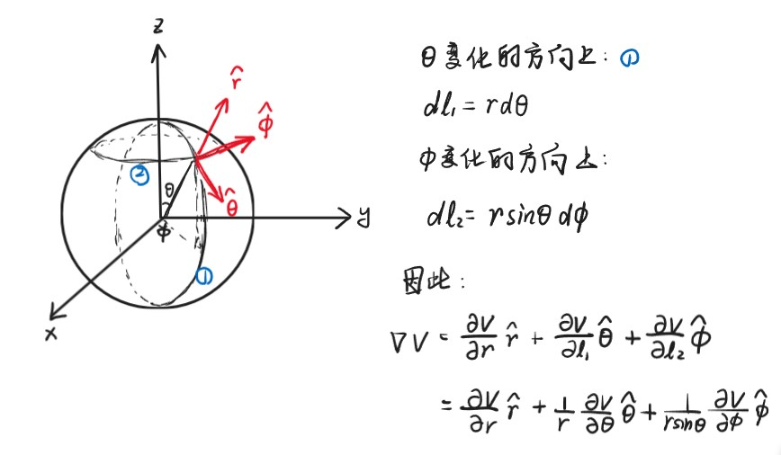

# Chapter4 电势能与电势

***

## 4.1 电势能

假设$q$和$q_0$带同种电荷，则在库仑力的作用下，考虑$q_0$从$a$点运动到$b$点的过程：

$$\vec{F}=\frac{1}{4\pi\varepsilon_0}\frac{qq_0}{r^2}\hat{r}$$

$$W_{ab}=\int_a^b\vec{F}\cdot d\vec{l}=\int_a^bFdl\cos\theta=\int_{r_a}^{r_b}Fdr=\int_{r_a}^{r_b}\frac{1}{4\pi\varepsilon_0}\frac{qq_0}{r^2}dr=\frac{qq_0}{4\pi\varepsilon_0}(\frac{1}{r_a}-\frac{1}{r_b})$$

此即为库仑力所做的功。

从$a$点到$b$点的势能变化量等于库仑力所做功的相反数：  

$$\Delta U_{ab}=U_b-U_a=-W_{ab}$$

现在定义无穷远处（$b\rightarrow\infty$）的电势能为0，则此时对于两个距离为$r$的静止点电荷$q_1$和$q_2$，其具有的电势能为：

$$U(r)=\frac{q_1q_2}{4\pi\varepsilon_0 r}$$

如果两个点电荷同号，则势能为正；如果两个点电荷异号，则势能为负。

!!! Note
    电势能是系统具有的属性，不能针对于单一电荷。

对于含有$q_1$，$q_2$，···，$q_n$的系统，其具有的总电势能为其中两两点电荷之间的电势能的标量和，即：

$$U_{total}=U_{12}+U_{13}+···+U_{1n}+U_{23}+···+U_{2n}+···+U_{n-1n}=\sum\limits_{i\neq j}\frac{1}{2}U_{ij}$$

***

## 4.2 电势

对于试探电荷$q_0$，其在某一位置的电势能为$U$，则该位置的电势$V$为

$$V=\frac{U}{q_0}$$

$$\Delta V=V_b-V_a=\frac{U_b-U_a}{q_0}=\frac{-W_{ab}}{q_0}=\frac{-\int_a^b\vec{F}\cdot d\vec{l}}{q_0}=\frac{-\int_a^bq_0\vec{E}\cdot d\vec{l}}{q_0}=-\int_a^b\vec{E}\cdot d\vec{l}$$

**点电荷：**

对于固定的点电荷$q$，距离其$r$处的电势为

$$V=\frac{q}{4\pi\varepsilon_0 r}$$

（默认无穷远处为电势为零）

**电偶极矩：**

对于距离为$2a$的正电荷$+q$和负电荷$-q$，考虑一点$P$，其与$+q$距离为$r_1$，与$-q$距离为$r_2$，则$P$处的电势为：

$$V=\frac{1}{4\pi\varepsilon_0}(\frac{q}{r_1}-\frac{q}{r_2})=\frac{q}{4\pi\varepsilon_0}\frac{r_2-r_1}{r_1r_2}$$

设$P$到电偶极矩的中心距离为$r$，连线与电偶极矩所在轴夹角为$\theta$，则当$r\gg a$时：

$$r_2-r_1\approx 2a\cos\theta$$

$$r_1r_2\approx r^2$$

$$V=\frac{1}{4\pi\varepsilon_0}\frac{2aq\cos\theta}{r^2}=\frac{\vec{p}\cdot\hat{r}}{4\pi\varepsilon_0 r^2}$$

**均匀带电体：**

!!! Note
    $\int\frac{1}{\cos\theta}d\theta=\ln|\frac{1}{\cos\theta}+\tan\theta|+C$  
    $\int\frac{1}{\sqrt{x^2+y^2}}dx=\ln|\sqrt{x^2+y^2}+x|-\ln|y|+C$

!!! Example
    **求下图中四个区域的电势。**
    

***

## 4.3 根据电势计算电场强度

已知：

$$dW=-q_0dV$$

$$dW=\vec{F}\cdot d\vec{l}=q_0\vec{E}\cdot d\vec{l}=q_0Edl\cos\theta$$

两式联立得：

$$E_l=E\cos\theta=-\frac{dV}{dl}$$

$$E=-(\frac{dV}{dl})_{\max}$$

右式称为该点的**势能梯度**。

对于空间坐标系的任意一点$(x,y,z)$：

$$E_x=-\frac{\partial V}{\partial x},~E_y=-\frac{\partial V}{\partial y},~E_z=-\frac{\partial V}{\partial z}$$

综上：

$$\vec{E}=-\vec{\nabla}V=-(\frac{\partial V}{\partial x}\hat{x}+\frac{\partial V}{\partial y}\hat{y}+\frac{\partial V}{\partial z}\hat{z})$$

!!! Example
    **$V(x,y,z)=3x^2+2xy-z^2$，求$\vec{E}$。**  

    $E_x=-6x-2y$  
    $E_y=-2x$  
    $E_z=2z$  
    $\vec{E}=(-6x-2y)\hat{x}-2x\hat{y}+2z\hat{z}$  

!!! Example 
    **扩展：球坐标系**  
    

**电偶极矩：**

已知距离电偶极矩中心$r$的位置的电势：

$$V(r)=\frac{1}{4\pi\varepsilon_0}\frac{2aq\cos\theta}{r^2}$$

考虑极坐标系$(r,\theta)$

在$\theta$变化的方向上

$$dl=rd\theta$$

$$E_r=-\frac{\partial V}{\partial r}=-\frac{2aq}{4\pi\varepsilon_0}(\frac{-2\cos\theta}{r^3})$$

$$E_\theta=-\frac{\partial V}{\partial l}=-\frac{1}{r}\frac{\partial V}{\partial \theta}=-\frac{2aq}{4\pi\varepsilon_0}(\frac{-\sin\theta}{r^3})$$

综上：

$$\vec{E}=\frac{2aq}{4\pi\varepsilon_0 r^3}[(2\cos\theta)\hat{r}+(\sin\theta)\hat{\theta}]$$

***

## 4.4 静电场的环路定理及相关数理知识

**静电场的环路定理：**

$$\oint\vec{E}\cdot d\vec{l}=0$$

**直角坐标系的矢量微分：**

梯度：

$$\nabla t=\frac{\partial t}{\partial x}\hat{x}+\frac{\partial t}{\partial y}\hat{y}+\frac{\partial t}{\partial z}\hat{z}$$

散度：

$$\nabla\cdot v=\frac{\partial v_x}{\partial x}+\frac{\partial v_y}{\partial y}+\frac{\partial v_z}{\partial z}$$

旋度：

$$\nabla\times v=\left|\begin{array}{c}
\hat{x}&\hat{y}&\hat{z}\\\
\frac{\partial}{\partial x}&\frac{\partial}{\partial y}&\frac{\partial}{\partial z}\\\
v_x&v_y&v_z
\end{array}\right|$$

**球坐标系的矢量微分：**

梯度：

$$\nabla t=\frac{\partial t}{\partial r}\hat{r}+\frac{1}{r}\frac{\partial t}{\partial \theta}\hat{\theta}+\frac{1}{r\sin\theta}\frac{\partial t}{\partial \phi}\hat{\phi}$$

散度：

$$\nabla\cdot v=\frac{1}{r^2}\frac{\partial(r^2v_r)}{\partial r}+\frac{1}{r\sin\theta}\frac{\partial(\sin\theta v_\theta)}{\partial \theta}+\frac{1}{\sin\theta}\frac{\partial v_\phi}{\partial \phi}$$